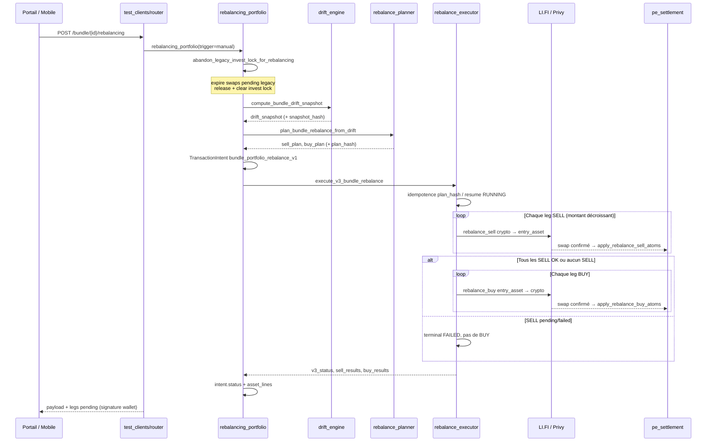
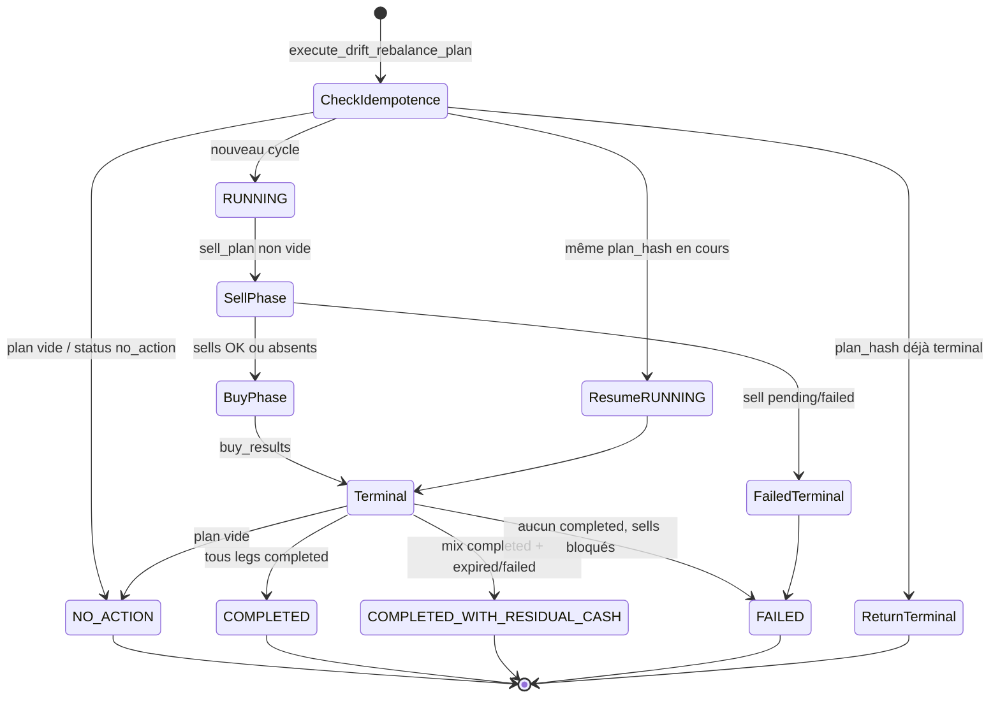

# Architecture — Rééquilibrage portefeuille Bundle (V3)

| Champ | Valeur |
| --- | --- |
| **Statut** | Document d’architecture backend (implémentation prod) |
| **Date** | 2026-06-09 |
| **Audience** | Backend, SRE, produit technique |
| **Références** | [`BUNDLE_REBALANCING_ENGINE_V3_PRD.md`](BUNDLE_REBALANCING_ENGINE_V3_PRD.md) · [`GO_BUNDLE_RECOVERY_V2_ARCHITECTURE_AUDIT.md`](GO_BUNDLE_RECOVERY_V2_ARCHITECTURE_AUDIT.md) |

---

## 1. Résumé exécutif

Le rééquilibrage Bundle V3 répond à une seule question métier :

> **Quel est l’écart entre l’allocation réelle du portefeuille et la cible produit, et quels swaps faut-il exécuter pour le réduire ?**

Le **portefeuille PE** (`pe_position_atoms` spot + cash leg + `pe_target_allocations`) est la **seule source de vérité**. Les batches, swaps historiques et locks d’investissement legacy ne pilotent plus le calcul — ils ne sont que des artefacts d’exécution ou des obstacles à lever avant un cycle nominal.

Trois modules enchaînés, tous **déterministes** et **read-only** jusqu’à l’exécution :

| Étape | Module | Rôle |
| --- | --- | --- |
| 1 | `drift_engine.py` | Snapshot allocation réelle vs cible |
| 2 | `rebalance_planner.py` | Plan `sell_plan` puis `buy_plan` |
| 3 | `rebalance_executor.py` | Exécution LI.FI séquentielle + audit V3 |

Le point d’entrée **manuel / portail** est `rebalancing_portfolio.py` (intent `bundle_portfolio_rebalance_v1`). Le point d’entrée **post-dépôt** réutilise les mêmes modules via `deposit_service.process_v3_deposit_rebalance_outbox_event`.

---

## 2. Principes d’architecture

### 2.1 Séparation des responsabilités

```
┌─────────────────────────────────────────────────────────────────┐
│  COUCHE MÉTIER (read-only)                                      │
│  drift_engine  →  rebalance_planner                             │
│  Entrées : atoms PE, allocations cibles, prix ExchangeService   │
│  Sorties : drift_snapshot, rebalance_plan (+ hashes)            │
└────────────────────────────┬────────────────────────────────────┘
                             │
┌────────────────────────────▼────────────────────────────────────┐
│  COUCHE ORCHESTRATION                                           │
│  rebalancing_portfolio  ·  bundle_v3_deposit_flow/deposit_service│
│  Intent transactionnel · abandon lock legacy · trigger routing   │
└────────────────────────────┬────────────────────────────────────┘
                             │
┌────────────────────────────▼────────────────────────────────────┐
│  COUCHE EXÉCUTION                                               │
│  rebalance_executor  →  BundleExecutionAdapter  →  LI.FI        │
│  À confirmation : pe_settlement (atoms + bundle_ledger)         │
└─────────────────────────────────────────────────────────────────┘
```

### 2.2 Base de poids : actifs investis uniquement

Décision structurante (`weight_basis = invested_assets`) :

- **`invested_value_usdc`** = somme des valeurs spot (actifs cibles + hors-cible).
- **`cash_value_usdc`** = quantité du cash leg convertie en devise d’entrée (USDC ou EURC).
- **`portfolio_value_usdc`** = invested + cash (NAV totale, informatif).
- Les **poids cibles** et le **drift** sont calculés sur **`invested_value_usdc` uniquement**.
- Le **cash leg** n’est **pas** une ligne d’allocation cible : c’est une **réserve de financement** pour les achats (`cash_funding_source = separate`).

Conséquence produit : 29,87 USDC de cash résiduel sur Crypto Majors **ne fausse pas** les poids BTC/ETH — ils alimentent directement le `buy_plan`.

### 2.3 Ordre d’exécution strict : SELL puis BUY

Jamais d’entrelacement. Le planner produit toujours un `sell_plan` complet avant le `buy_plan`. L’executor refuse la phase BUY si un SELL est encore `pending` ou `failed`.

### 2.4 Exécution LI.FI : chaîne de trades (pas one-shot quote)

> **Référence complète** : [`BUNDLE_V3_TRADE_CHAIN_EXECUTION_ARCHITECTURE.md`](BUNDLE_V3_TRADE_CHAIN_EXECUTION_ARCHITECTURE.md) (commit `4ca4dabb`).

Sur `trigger ∈ {manual, deposit}` :

- Chaque leg est un **trade atomique** : `confirm` (re-quote) → signature client → `CONFIRMED` → settlement PE.
- L’executor quote **un leg à la fois**, retourne `v3_status=RUNNING`, puis `POST …/rebalancing/resume` enchaîne le leg suivant.
- Les quotes `QUOTE_RECEIVED` **ne sont pas expirées côté serveur** tant que le client n’a pas signé.

Sur `trigger ∈ {cron, recovery}` (sans client) : expiration quote + retry `MAX_SWAP_ATTEMPTS` (automation).

Pas de resume cross-batch sur un batch **terminal** ; une exécution `RUNNING` reprend via `/rebalancing/resume` sur le **même** `rebalance_execution_id`.

### 2.5 Drift sur NAV totale (`portfolio_value`)

Le drift engine calcule poids et deltas sur **`portfolio_value_usdc`** (spot + cash leg). Le cash leg n’a pas de poids cible mais entre dans le dénominateur. Planner : `planning_mode = portfolio_drift`. Voir [`BUNDLE_V3_PORTFOLIO_VALUE_DRIFT_AND_ACTIVE_OPERATION_ARCHITECTURE.md`](BUNDLE_V3_PORTFOLIO_VALUE_DRIFT_AND_ACTIVE_OPERATION_ARCHITECTURE.md).

### 2.6 Reprise worker UI (page bundle wallet)

`GET /bundle/{id}/active-operation` + panneau portail `PortalLazyBundleActiveOperation` — stepper invest, polling, reprise legs LI.FI au chargement / refresh.

---

## 3. Workflow logique end-to-end

### 3.1 Déclencheurs

| Trigger | Entrée code | `V3Trigger` |
| --- | --- | --- |
| Bouton portail « Rééquilibrage » | `POST /bundle/{id}/rebalancing` | `manual` |
| Preview UI (sans exécution) | `POST /bundle/{id}/rebalancing/preview` | — |
| Dépôt V3 (outbox / kick immédiat) | `process_v3_deposit_rebalance_outbox_event` | `deposit` |
| Recovery / cron (futur) | même executor | `recovery` / `cron` |

### 3.2 Flux manuel (`rebalancing_portfolio`)



### 3.3 Flux post-dépôt V3

```
Dépôt confirmé
  → crédit cash leg (funding Mon Trading → PE)
  → intent bundle_deposit_v3 + outbox bundle.v3_rebalance_requested
  → [option] kick immédiat (bundle_v3_deposit_immediate_kick_enabled)
  → worker: drift → plan → execute_v3_bundle_rebalance(trigger=deposit)
  → release guard portfolio si terminal
```

Le calcul et l’exécution sont **identiques** au flux manuel ; seuls l’intent parent, le `batch_id` de dépôt et le mécanisme de scheduling diffèrent.

### 3.4 Abandon lock legacy (spécifique `rebalancing_portfolio`)

Avant tout drift, le flux manuel tente de libérer un invest legacy bloqué :

1. Lire `get_active_invest_lock_for_portfolio`.
2. Si le batch est un **batch V3 dépôt** (`is_v3_deposit_batch`) → **ne pas** abandonner.
3. Sinon : expirer les `PersonWalletSwap` en `AWAITING_SIGNATURE` / `QUOTE_RECEIVED` / `PENDING` liés au batch.
4. `release_invest_lock(terminal_status=expired)` + `clear_invest_lock`.
5. Audit `bundle.rebalancing_abandon_legacy_invest_lock`.

Cela remplace l’ancien bouton « Reprendre l’investissement » pour les portefeuilles legacy (ex. Crypto Majors avec CBETH en attente).

---

## 4. Calculs — Drift Engine (`compute_bundle_drift_snapshot`)

### 4.1 Entrées

| Source DB | Usage |
| --- | --- |
| `pe_position_atoms` (`status=open`) | Quantités spot et cash leg |
| `pe_target_allocations` | Poids cibles par instrument |
| `ExchangeService._resolve_price(asset, side=sell)` | Prix EUR par actif |
| Config produit (`entry_asset_default`) | USDC ou EURC |

**Aucune** lecture de batch, swap ou leg historique.

### 4.2 Conversion devise d’entrée

Prix et valeurs sont normalisés en **devise d’entrée** (nom historique `*_usdc`, même pour EURC) :

```
price_usdc(asset) = price_eur(asset) / price_eur(entry_asset)   [ROUND_DOWN 6 décimales]
value_usdc        = value_eur / price_eur(entry_asset)

Cas USDC : si entry_asset == USDC, cash_value_usdc = cash_leg_qty (1:1)
Cas asset == entry_asset : price_usdc = 1
```

### 4.3 Agrégats portefeuille

```
invested_value_usdc = Σ (qty_spot[instrument] × price_usdc[instrument])
cash_value_usdc     = qty_cash_leg × price_usdc(entry_asset)  [ou qty si USDC]
portfolio_value_usdc = invested_value_usdc + cash_value_usdc
```

### 4.4 Par actif cible (ligne `target_assets`)

Pour chaque allocation cible :

```
target_weight_bps = floor(target_weight × 10_000)
target_value_usdc = floor(invested_value_usdc × target_weight_bps / 10_000, 6 déc.)
current_value_usdc = qty_spot × price_usdc
current_weight_bps = floor(current_value_usdc × 10_000 / invested_value_usdc)  [0 si invested=0]
delta_value_usdc   = target_value_usdc - current_value_usdc
drift_bps          = current_weight_bps - target_weight_bps
action_hint        = buy | sell | hold (selon signe du delta)
```

**Interprétation du delta :**

| `delta_value_usdc` | Signification |
| --- | --- |
| `> 0` | Sous-pondération → candidat **buy** |
| `< 0` | Surpondération → candidat **sell** |
| `= 0` | Aligné (à la granularité 6 décimales) |

### 4.5 Actifs hors cible (`non_target_assets`)

Tout spot détenu dont l’`instrument_id` n’est pas dans les allocations cibles (ex. CBETH résiduel) :

```
current_value_usdc = qty × price_usdc
action_hint = sell_candidate (toujours)
```

Ces lignes alimentent le `sell_plan` intégralement (liquidation vers entry asset).

### 4.6 Snapshot hash (idempotence lecture)

```
snapshot_hash = sha256(canonical_json({
  portfolio_id, client_id, entry_asset, weight_basis,
  invested_value_usdc, cash_value_usdc,
  target_assets[{asset, instrument_id, target_weight_bps, current_quantity, current_value_usdc}],
  non_target_assets[...],
  price_snapshot{entry_asset_price_eur, asset_prices_eur}
}))
```

Format : `sha256:<hex>`. Permet de prouver que deux previews identiques partent du même état PE + prix.

---

## 5. Calculs — Rebalance Planner (`plan_bundle_rebalance_from_drift`)

### 5.1 Seuils configurables

| Variable d’environnement | Défaut | Rôle |
| --- | --- | --- |
| `MIN_REBALANCE_DELTA_USDC` | `1` | Montant minimal par leg (anti-poussière) |
| `MIN_DRIFT_BPS` | `200` (2 %) | Écart de poids minimal pour agir sur un actif cible |

Un actif cible n’entre dans le plan que si **les deux** conditions sont vraies :

```
|delta_value_usdc| >= MIN_REBALANCE_DELTA_USDC
|drift_bps|        >= MIN_DRIFT_BPS
```

Les actifs **non cibles** ignorent `MIN_DRIFT_BPS` ; seul `MIN_REBALANCE_DELTA_USDC` s’applique sur leur valeur totale.

### 5.2 Construction des candidats

**Cas A — Portefeuille vide côté spot, cash disponible** (`invested <= 0` et `cash > 0`) :

- Tous les actifs cibles deviennent des `buy_candidates` avec `deploy_from_cash = true`.
- Répartition proportionnelle aux `target_weight_bps` (dernier actif absorbe le reliquat).

**Cas B — Portefeuille investi** :

- `delta < 0` → `sell_candidate`, `ideal_amount_usdc = |delta|`
- `delta > 0` → `buy_candidate`, `ideal_amount_usdc = delta`
- `non_target` → `sell_candidate`, `ideal_amount_usdc = current_value_usdc`

Tri avant exécution :

- SELL : par `ideal_amount_usdc` décroissant (vendre les plus gros écarts d’abord).
- BUY : par `target_weight_bps` puis `ideal_amount_usdc` décroissant.

### 5.3 Algorithme de financement (sell puis buy)

```
available_cash = cash_value_usdc du snapshot
total_buy_need = Σ ideal_amount_usdc(buy_candidates)
```

**Branche 1 — Cash suffisant** (`total_buy_need <= available_cash`) :

```
Pour chaque buy_candidate (sauf dernier) :
  amount = min(ideal, floor(available_cash × ideal / total_buy_need))
Dernier buy : amount = remaining_cash
funded_by = "cash_leg"
```

**Branche 2 — Cash insuffisant** (`total_buy_need > available_cash`) :

```
funding_gap = total_buy_need - available_cash

Phase SELL (financer les achats) :
  Pour chaque sell_candidate (tri décroissant) :
    sell_amount = min(ideal_amount_usdc, funding_gap_restant)
    si sell_amount >= MIN_REBALANCE_DELTA → ajouter au sell_plan
    funding_gap -= sell_amount

Phase BUY (après ventes planifiées) :
  total_funding = available_cash + Σ sell_plan.amount_usdc
  scale = min(1, total_funding / total_buy_need)
  Pour chaque buy_candidate :
    amount = floor(ideal_amount_usdc × scale)
    funded_by = "cash_leg_and_sell_proceeds" si sell_plan non vide
```

**Branche 3 — Aucun spot investi, cash seul** : voir Cas A (déploiement cash vers cibles).

### 5.4 Plan hash

```
plan_hash = sha256(canonical_json({
  snapshot_hash,
  sell_plan[{asset, instrument_id, amount_usdc, action, ...}],
  buy_plan[...]
}))
```

L’executor utilise `plan_hash` pour :

- Retourner un résultat terminal existant sans re-swapper (idempotence).
- Reprendre une exécution `RUNNING` avec le même plan (crash / double requête).

### 5.5 Statuts plan

| `status` | Condition |
| --- | --- |
| `no_action` | `sell_plan` et `buy_plan` vides |
| `ok` | Au moins un leg planifié |

---

## 6. Exécution — Rebalance Executor

### 6.1 Machine à états V3



### 6.2 Paramètres runtime

| Variable | Défaut | Effet |
| --- | --- | --- |
| `MAX_SWAP_ATTEMPTS` | `2` | Retries par leg LI.FI |
| `QUOTE_TTL_SECONDS` | `120` | TTL quote ; pending non signé → `expired` |
| `MAX_EXECUTION_AGE_MINUTES` | `30` | Exécution RUNNING stale → terminal forcé |

### 6.3 Mapping leg → swap LI.FI

Pour chaque item du plan (tri par `amount_usdc` décroissant) :

**SELL (`rebalance_sell`)** :

```
amount_from = usdc_to_crypto_quantity(amount_usdc, asset, entry_asset)
  où usdc_to_crypto_quantity :
    value_eur = amount_usdc × price_eur(entry_asset)
    qty = floor(value_eur / price_eur(asset), 8 déc.)

from_asset = normalize_bundle_asset(asset)   # ex. CBETH → wstETH routing
to_asset   = entry_asset                      # USDC ou EURC
```

**BUY (`rebalance_buy`)** :

```
amount_from = amount_usdc (entry asset)
from_asset  = entry_asset
to_asset    = normalize_bundle_asset(asset)
```

Chaque tentative crée un `ExecutionLeg` avec `bundle_action=rebalance_v3`, `chain=base`, metadata `rebalance_execution_id`, `planner_amount_usdc`, `attempt`.

### 6.4 Résolution statut leg

| Statut swap LI.FI | Statut leg V3 |
| --- | --- |
| Confirmé on-chain (`swap_confirmed`) | `completed` |
| `EXPIRED` / `FAILED` | `expired` / `failed` |
| `AWAITING_SIGNATURE` / `QUOTE_RECEIVED` après TTL | `expired` (`quote_ttl_expired`) |
| `SUBMITTED` | `pending` (`awaiting_confirmation`) |
| `requires_client_signature` sans confirmation | `expired` |

À la fin du cycle, tout leg encore `pending` est forcé en `expired` — **`resume_required: false`** dans la réponse.

### 6.5 Audit trail

Événements `AuditEvent` :

| `entity_type` | `action` | Contenu |
| --- | --- | --- |
| `bundle_rebalance_v3` | `v3_execution_running` | plan complet, execution_id |
| `bundle_rebalance_v3` | `v3_execution_progress` | sell_results / buy_results intermédiaires |
| `bundle_rebalance_v3` | `v3_execution_terminal` | statut final, completed_at |

`batch_id` V3 = `rebalance_execution_id` (UUID frais par cycle).

---

## 7. Comptabilité PE et ledger

Les atoms PE ne bougent **qu’après confirmation swap** (via `pe_settlement.py`).

### 7.1 SELL confirmé — `apply_rebalance_sell_atoms`

```
Débit  spot atom     (instrument crypto, sell_qty)
Crédit cash leg      (entry_instrument, entry_received)
Ledger record_rebalance(side=sell, ...)
```

### 7.2 BUY confirmé — `apply_rebalance_buy_atoms`

```
Crédit spot atom     (instrument crypto, crypto_received)
Débit  cash leg      (entry_instrument, entry_spent)
Ledger record_rebalance(side=buy, ...)
```

### 7.3 Invariants

- Le cash leg est la **passerelle** entre entry asset et spots : un BUY consomme le cash ; un SELL le reconstitue.
- Les proceeds des SELL ne sont pas re-lus dynamiquement mid-cycle : le planner prévoit les montants **en entry asset** ; l’executor séquence SELL puis BUY dans la même requête worker/API.
- Privy / LI.FI settlement reste dans `BundleExecutionAdapter.execute_leg` ; PE settlement est déclenché à la confirmation (même rail que invest legacy, metadata `bundle_action=rebalance_v3`).

---

## 8. Intent transactionnel (`bundle_portfolio_rebalance_v1`)

Créé par `rebalancing_portfolio` avant exécution :

| Champ | Valeur |
| --- | --- |
| `product_type` | `bundle_portfolio_rebalance_v1` |
| `operation_type` | `rebalance` |
| `idempotency_key` | `portfolio-rebalance-{execution_id}` |
| `metadata_json.flow_version` | `bundle_portfolio_rebalance_v1` |
| `metadata_json.plan_hash` | hash planner |
| `metadata_json.snapshot_hash` | hash drift |
| `metadata_json.asset_lines` | une ligne par actif (planned → statuts finaux) |

Statut intent final : `v3_status` normalisé (`completed`, `failed`, etc.).

---

## 9. API et intégration front

### 9.1 Endpoints backend

| Méthode | Route | Fonction |
| --- | --- | --- |
| `POST` | `/bundle/{portfolio_id}/rebalancing/preview` | `preview_rebalancing_portfolio` — read-only |
| `POST` | `/bundle/{portfolio_id}/rebalancing` | `rebalancing_portfolio(trigger=manual)` + commit |

Erreurs métier : `RebalancingPortfolioError.code` → HTTP 400 (`rebalancing_execution_failed`, `client_has_no_person_id`, …).

### 9.2 BFF portail Next.js

```
app/api/portal/bundles/rebalancing/[portfolioId]/route.ts
  → proxy vers API mobile bootstrap
```

### 9.3 Hook client `useBundlePortfolioRebalancing`

1. `executePortfolioRebalancing(portfolioId)` — appelle l’API execute.
2. Extrait les legs `pending` avec `swap_id` depuis `sell_results` / `buy_results`.
3. Pour chaque leg : `bundleLegConfirmAndPrepare` → signature Privy → `submitBundleLegTx`.
4. `pollUntilTerminal` jusqu’à confirmation on-chain.
5. Expose `asset_lines` pour l’UI (une ligne par actif : planned / pending / completed / failed).

L’UI remplace « Reprendre l’investissement » par un bouton unique **Rééquilibrage**.

---

## 10. Différences legacy vs V3 portefeuille

| Aspect | Legacy (`resume_lifi_invest_batch`) | V3 portefeuille |
| --- | --- | --- |
| Source de vérité | Batch + legs + invest lock | Drift PE |
| Devise plan | EUR, `MIN_TRADE_EUR = 5` | Entry asset (USDC/EURC), min 1 |
| Reprise | Resume batch mort, signature pending | Abandon lock + nouveau drift |
| Orchestrateur | `orchestrator.py` / `rebalance.py` v1 | `rebalancing_portfolio` + executor V3 |
| Idempotence | batch_id + leg state | `plan_hash` + audit V3 |
| Fin de cycle | Souvent `resume_required` | Toujours terminal explicite |

`rebalance.py` (`BundleRebalanceOrchestrator`) existe encore pour d’anciennes routes ; le portail bundle allocation utilise désormais **`rebalancing_portfolio`**.

---

## 11. Exemple chiffré — Crypto Majors (audit prod)

**Cible produit** : BTC 50 % · ETH 30 % · LINK/AAVE/UNI ~6,67 % chacun.  
**Entry asset** : USDC.

**État PE (simplifié)** :

| Composant | Valeur |
| --- | --- |
| Spots investis | ~70 USDC équivalent |
| Cash leg | 29,87 USDC |
| `invested_value_usdc` | ~70 |
| Hors cible | CBETH (sell_candidate si ≥ 1 USDC) |

**Drift (sur invested uniquement)** :

| Asset | Drift indicatif | Action planner |
| --- | --- | --- |
| BTC | ~+3,5 % (surpondéré) | sell si ≥ 2 % et ≥ 1 USDC |
| ETH | ~−11 % (sous-pondéré) | buy ~17 USDC depuis cash |
| LINK/AAVE | ~±1 % | hold (sous MIN_DRIFT_BPS) |
| UNI | ~−3 % | buy ~3 USDC |
| USDC cash | N/A (funding) | finance les buys |

**Plan typique** :

```
sell_plan: [] ou petit BTC sell si seuils dépassés
buy_plan: ETH, UNI, … proportionnel au cash 29,87 USDC
```

Ancien flux « Reprendre » tentait de reprendre un leg CBETH `AWAITING_SIGNATURE` — orthogonal au besoin réel (déployer le cash vers BTC/ETH cible).

---

## 12. Cartographie fichiers

| Fichier | Responsabilité |
| --- | --- |
| `bundles/drift_engine.py` | Snapshot drift read-only |
| `bundles/rebalance_planner.py` | sell_plan / buy_plan + plan_hash |
| `bundles/rebalance_executor.py` | Exécution LI.FI, audit, idempotence |
| `bundles/rebalancing_portfolio.py` | Entrée manuelle, intent, abandon lock |
| `bundles/bundle_v3_deposit_flow/deposit_service.py` | Outbox rebalance post-dépôt |
| `bundle_execution/pe_settlement.py` | Atoms PE post-confirmation |
| `bundle_execution/adapter.py` | `BundleExecutionAdapter.execute_leg` |
| `bundles/rebalance.py` | Legacy orchestrateur (EUR) — non utilisé portail V3 |
| `test_clients/router.py` | Routes REST preview / execute |
| `web/.../useBundlePortfolioRebalancing.ts` | Signature wallet côté client |
| `api/tests/test_rebalancing_portfolio.py` | Tests intégration couche portfolio |
| `api/tests/test_bundle_drift_engine.py` | Tests golden drift |
| `api/tests/test_bundle_rebalance_planner.py` | Tests plan déterministe |
| `api/tests/test_bundle_rebalance_executor_v3.py` | Tests executor / idempotence |

---

## 13. Observabilité et runbook

### 13.1 Logs / audit à tracer

- `bundle.rebalancing_abandon_legacy_invest_lock` — lock legacy levé
- `bundle_rebalance_v3` / `v3_execution_*` — cycle complet
- `PersonWalletSwap.status` — transitions LI.FI par leg

### 13.2 Diagnostics rapides

| Symptôme | Vérification |
| --- | --- |
| `no_action` au preview | Drifts < 2 % ou deltas < 1 USDC ; vérifier `invested_value_usdc` |
| `FAILED` après execute | `sell_results` en failed/expired ; prix indisponible ? |
| `COMPLETED_WITH_RESIDUAL_CASH` | Legs partiels ; cash restant > 0 — **normal**, relancer plus tard |
| `portfolio_has_running_rebalance` | Autre `plan_hash` en RUNNING < 30 min — attendre ou terminalize stale |
| Lock non abandonné | Batch V3 dépôt actif — attendre fin dépôt |

### 13.3 Commandes preview (prod read-only)

Appeler `POST .../rebalancing/preview` sur le `portfolio_id` client — comparer `snapshot_hash` et `plan_hash` entre deux appels pour détecter un changement d’état PE ou de prix.

---

## 14. Limites connues et évolutions

1. **Prix** : snapshot instantané ExchangeService ; pas de TWAP — deux previews à quelques minutes d’intervalle peuvent diverger légèrement.
2. **Proceeds SELL** : le BUY phase utilise le plan **pré-calculé**, pas le cash réel post-swap ; un slippage important peut laisser du résiduel (`COMPLETED_WITH_RESIDUAL_CASH`).
3. **Un seul RUNNING par portefeuille** : concurrency guard via audit V3.
4. **Cron rebalance** : infrastructure EventBridge existe pour dépôt ; policy produit daily/weekly à brancher sur le même executor.
5. **Event-driven B4** (`bundle_leg_settlement_handler`) : parallèle expérimental, flag OFF — le chemin prod bundle allocation reste executor V3 direct.

---

## 15. Références croisées

- PRD vision et critères PR-1→PR-6 : [`BUNDLE_REBALANCING_ENGINE_V3_PRD.md`](BUNDLE_REBALANCING_ENGINE_V3_PRD.md)
- Pilote Kings / dépôt V3 : [`GO_BUNDLE_V3_PILOT_KINGS_RUNBOOK.md`](GO_BUNDLE_V3_PILOT_KINGS_RUNBOOK.md)
- Audit forensic dépôts : [`BUNDLE_FORENSIC_AUDIT_LAST_TWO_DEPOSITS.md`](BUNDLE_FORENSIC_AUDIT_LAST_TWO_DEPOSITS.md)
