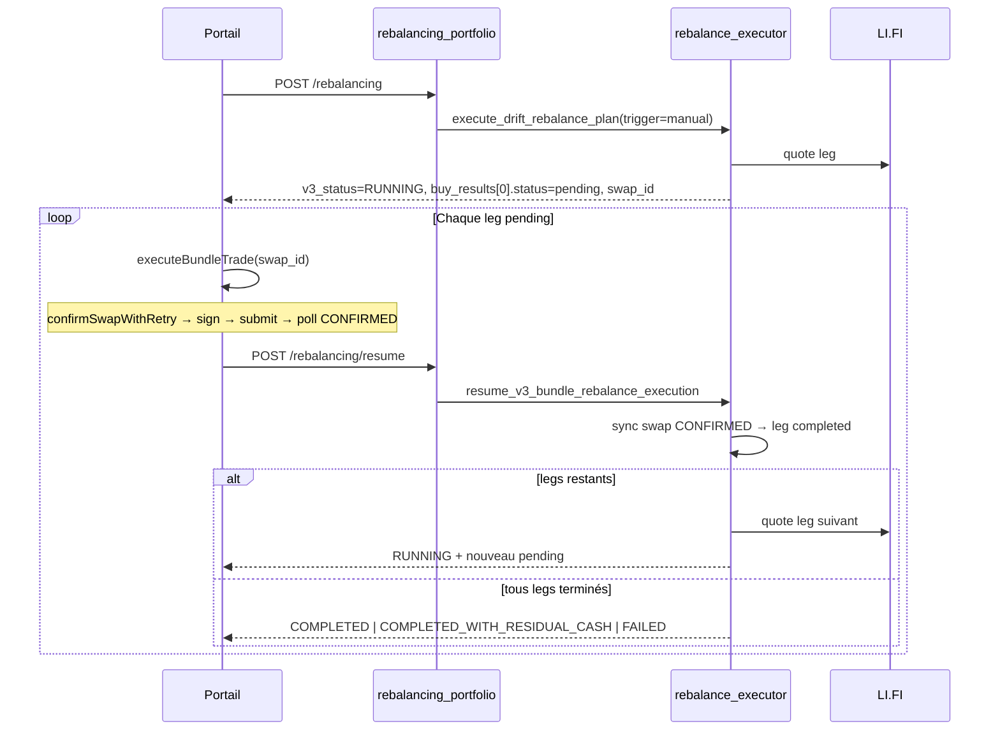

# Architecture — Exécution LI.FI en chaîne de trades (Bundle V3)

| Champ | Valeur |
| --- | --- |
| **Statut** | Document d’architecture backend (prod · commit `4ca4dabb`) |
| **Date** | 2026-06-10 |
| **Audience** | Backend, SRE, produit technique, mobile/web |
| **Prérequis** | [`BUNDLE_PORTFOLIO_REBALANCING_ARCHITECTURE.md`](BUNDLE_PORTFOLIO_REBALANCING_ARCHITECTURE.md) · [`BUNDLE_REBALANCING_ENGINE_V3_PRD.md`](BUNDLE_REBALANCING_ENGINE_V3_PRD.md) |
| **Incident résolu** | Kings prod — `quote_ttl_expired` en ~2 s · plan drift ~1,5 USDC avec cash leg ~125 USDC |

---

## 1. Problème et décision d’architecture

### 1.1 Anti-pattern corrigé : « bundle one-shot quote »

L’executor V3 traitait un rééquilibrage comme une **transaction monolithique** :

1. Côté serveur : quote LI.FI pour chaque leg du plan.
2. Immédiatement : `_resolve_pending_leg` marquait `QUOTE_RECEIVED` → **`expired` / `quote_ttl_expired`**.
3. Terminal : `COMPLETED_WITH_RESIDUAL_CASH` **sans signature client**.

Or le rail nominal LI.FI (swap portail, invest bundle legacy) est **un trade à la fois** :

```
quote initiale (optionnelle) → confirm (re-quote fraîche) → sign Privy → submit tx → poll CONFIRMED → settlement PE
```

**Décision** : un bundle côté UX reste un **produit** ; côté runtime c’est une **succession de trades atomiques**, chacun passant par la primitive `executeBundleTrade` (web) et le cycle serveur `quote → RUNNING → resume`.

### 1.2 Deuxième bug : plan drift vs cash leg (corrigé PR-2.1)

Le drift utilisait `invested_assets` comme dénominateur alors que la NAV affichée inclut le cash leg. Plans partiels (ex. Kings ~3,6 USDC ETH avec ~6,4 USDC cash).

**Décision actuelle** : `weight_basis = portfolio_value` dans `drift_engine.py` — une seule base NAV pour tous les cas. Le planner expose `planning_mode = portfolio_drift`. Voir [`BUNDLE_V3_PORTFOLIO_VALUE_DRIFT_AND_ACTIVE_OPERATION_ARCHITECTURE.md`](BUNDLE_V3_PORTFOLIO_VALUE_DRIFT_AND_ACTIVE_OPERATION_ARCHITECTURE.md).

*(Historique : commit `4ca4dabb` introduisait `portfolio_value_cash_deploy` si `cash > invested` — remplacé par drift NAV unifié.)*

---

## 2. Modèle mental

```
┌──────────────────────────────────────────────────────────────────────────┐
│ PRODUIT (UX)          │  « Rééquilibrage Two Crypto Kings »             │
│                       │  1 bouton · N legs affichés                     │
├───────────────────────┼──────────────────────────────────────────────────┤
│ RUNTIME               │  N × execute_trade (identique au swap unitaire)  │
│                       │  + orchestration resume entre chaque leg        │
├───────────────────────┼──────────────────────────────────────────────────┤
│ PERSISTENCE           │  1 execution_id V3 · audit RUNNING/PROGRESS/    │
│                       │  TERMINAL · 1 swap PersonWalletSwap par leg     │
└──────────────────────────────────────────────────────────────────────────┘
```

Un **batch V3** n’est pas un workflow à reprise cross-swap : c’est un **rapport d’exécution** (`rebalance_execution_id`) qui agrège des résultats de legs.

---

## 3. Planner (`rebalance_planner.py`) — `portfolio_drift`

| Élément | Comportement |
| --- | --- |
| Drift (`drift_engine`) | `weight_basis = portfolio_value` — cibles = `portfolio_value × weight` |
| `planning_mode` | **`portfolio_drift`** (unique) |
| Cash-only | `invested = 0` et `cash > 0` → répartition cash par `target_weight_bps` |
| Financement | Cash leg = source séparée ; sells si besoin de cash pour buys |

Champs enrichis sur chaque leg du plan (preview UI) :

- `target_value_usdc`, `current_value_usdc`, `price_usdc`, `amount_crypto`

Variable d’environnement : `CASH_DOMINANT_INVESTED_RATIO` (défaut `1`).

---

## 4. Triggers d’exécution (`rebalance_executor.py`)

| Trigger | Signature client | Comportement executor |
| --- | --- | --- |
| `manual` | **Oui** | 1 leg quoté par appel · statut `pending` conservé · `RUNNING` jusqu’à resume |
| `deposit` | **Oui** | Idem — worker ne peut pas signer ; outbox `PROCESSED` si `RUNNING` |
| `cron` / `recovery` | Non | Expiration quote serveur + retry `MAX_SWAP_ATTEMPTS` (automation) |

Constante : `CLIENT_SIGNATURE_TRIGGERS = {"manual", "deposit"}`.

### 4.1 Cycle manual / deposit (nominal)



### 4.2 Invariants manual

| # | Invariant |
| --- | --- |
| I1 | Jamais `_expire_pending_legs` tant que `trigger ∈ CLIENT_SIGNATURE_TRIGGERS` et un leg est `pending` |
| I2 | `_resolve_pending_leg` retourne `pending / awaiting_client_signature` sur `QUOTE_RECEIVED`, pas `expired` |
| I3 | Une seule quote nouvelle par appel `execute` ou `resume` (pas de rafale de N quotes) |
| I4 | `portfolio_financial_operations` guard **ACTIVE** pendant tout `RUNNING` ; libéré au terminal |
| I5 | `plan_hash` figé sur l’exécution RUNNING — `resume` refuse si drift a changé le hash |

---

## 5. API surface

| Méthode | Route | Module | Rôle |
| --- | --- | --- | --- |
| `POST` | `/bundle/{id}/rebalancing/preview` | `preview_rebalancing_portfolio` | Drift + plan read-only |
| `POST` | `/bundle/{id}/rebalancing/preflight` | `preflight_rebalancing_portfolio` | Blockers + `can_execute` |
| `POST` | `/bundle/{id}/rebalancing` | `rebalancing_portfolio` | Démarre exécution · quote 1er leg |
| `POST` | `/bundle/{id}/rebalancing/resume` | `resume_rebalancing_portfolio` | Post-signature · leg suivant ou terminal |

BFF Next (portail) : miroir sous `/api/portal/bundles/rebalancing/[portfolioId]/…`.

### 5.1 Réponses `RUNNING`

```json
{
  "v3_status": "RUNNING",
  "resume_required": true,
  "client_signature_required": true,
  "rebalance_execution_id": "uuid",
  "buy_results": [
    {
      "asset": "BTC",
      "status": "pending",
      "swap_id": "uuid",
      "amount_usdc": "86.406234",
      "target_value_usdc": "112.591107",
      "current_value_usdc": "26.184873",
      "amount_crypto": "0.00140312"
    }
  ]
}
```

### 5.2 Statuts terminaux

| `v3_status` | Signification |
| --- | --- |
| `COMPLETED` | Tous les legs `completed` |
| `COMPLETED_WITH_RESIDUAL_CASH` | Mix completed + expired/failed · cash résiduel |
| `FAILED` | Aucun leg completed · sells bloquants |
| `NO_ACTION` | Plan vide |

`resume_required` est **toujours `false`** en terminal (V3 ne reprend pas un batch mort).

---

## 6. Primitive client `executeBundleTrade`

Fichier : `services/arquantix/web/src/lib/portal/executeBundleTrade.ts`

Encapsule le rail swap éprouvé :

1. `bundleLegConfirmAndPrepare` → `confirmSwapWithRetry` (re-quote + slippage guard)
2. `signAndSubmit` (Privy / external wallet)
3. `submitBundleLegTx` (BFF → API)
4. `pollUntilTerminal` jusqu’à `CONFIRMED`

Réutilisée par :

- `useBundlePortfolioRebalancing` (rééquilibrage V3 portail)
- `useBundleLifiInvest` (allocation post-dépôt legacy)
- `useBundleLifiRebalance` (rééquilibrage legacy)

**Règle** : ne jamais signer une quote serveur « nue » sans repasser par `confirm`.

---

## 7. Settlement PE

Inchangé : `bundle_lifi_leg_service` / `bundle_leg_settlement_handler` crédite spot et débite cash leg **après** `swap_confirmed`.

Le resume serveur **ne settlement pas** : il **synchronise** le statut leg depuis `PersonWalletSwap` via `_sync_leg_results_from_swaps`.

---

## 8. Dépôt V3 et worker

`process_v3_deposit_rebalance_outbox_event` appelle `execute_v3_bundle_rebalance(trigger=deposit)`.

| `v3_status` retour worker | Outbox | Guard `BUNDLE_INVEST` |
| --- | --- | --- |
| Terminal | `PROCESSED` | `RELEASED` |
| `RUNNING` | `PROCESSED` (pas de re-kick) | **ACTIVE** jusqu’à resume client |
| Exception | `DEAD_LETTER` | `RELEASED` failed |

Le client termine via **Rééquilibrage** portail (`resume`) ou en rouvrant le flux allocation.

---

## 9. Cas pilote Kings (gaelitier@gmail.com)

| Métrique | Avant fix | Après fix (attendu) |
| --- | --- | --- |
| Cash leg | ~125,69 USDC | idem |
| Plan preview | 1 achat ETH ~1,57 USDC | BTC ~86 + ETH ~39 USDC |
| Exécution | Terminal 2 s · `quote_ttl_expired` | RUNNING → 2 signatures → `COMPLETED` |
| `planning_mode` | `invested_drift` | `portfolio_value_cash_deploy` |

Validation post-deploy :

1. `POST …/rebalancing/preview` — vérifier `planning_mode` et 2 legs buy.
2. `Estimer le plan` UI — montants USDC + crypto + cibles.
3. `Rééquilibrage` — 2 prompts signature (BTC puis ETH).
4. Audit ECS : `v3_status=COMPLETED`, cash leg réduit, atoms PE mis à jour.

Scripts : `./scripts/arquantix-ecs-bundle-drift-engine-audit.sh`, `./scripts/arquantix-ecs-bundle-v3-deposit-prod-audit.sh`.

---

## 10. Tests de non-régression

| Test | Fichier | Assertion |
| --- | --- | --- |
| Manual pending | `test_manual_trigger_returns_running_with_pending_swap` | `RUNNING` + 1 swap · pas d’expire |
| Cron expire | `test_timeout_pending_becomes_terminal_no_resume` | `trigger=cron` → expire + retry |
| Kings plan | `test_kings_cash_dominant_deploys_portfolio_value_targets` | 2 buys · total ~125 USDC |
| Majors drift | `test_cash_residual_sell_plan_empty_buy_eth_uni` | inchangé · `invested_drift` |

---

## 11. Configuration

| Variable | Défaut | Rôle |
| --- | --- | --- |
| `CASH_DOMINANT_INVESTED_RATIO` | `1` | Seuil bascule planner NAV |
| `MAX_SWAP_ATTEMPTS` | `2` | Retries serveur (`cron` uniquement) |
| `QUOTE_TTL_SECONDS` | `120` | Info audit · TTL swap session |
| `MIN_REBALANCE_DELTA_USDC` | `1` | Seuil leg minimum |
| `MIN_DRIFT_BPS` | `200` | Seuil drift (mode invested) |

---

## 12. Évolutions interdites (garde-fous)

1. **Ne pas** revenir à un bundle « quote all legs then expire » sur `manual` / `deposit`.
2. **Ne pas** terminaliser `COMPLETED_WITH_RESIDUAL_CASH` sur un seul leg `QUOTE_RECEIVED` non signé si `MAX_SWAP_ATTEMPTS` n’est pas épuisé **et** le client est en session (`manual`).
3. **Ne pas** mélanger `plan_hash` entre deux exécutions RUNNING concurrentes — le guard `portfolio_financial_operations` + `find_running_v3_rebalance_execution` reste obligatoire.
4. **Ne pas** settlement PE avant `CONFIRMED` on-chain.

---

## 13. Références code

| Composant | Chemin |
| --- | --- |
| Planner | `services/arquantix/api/services/portfolio_engine/bundles/rebalance_planner.py` |
| Executor | `services/arquantix/api/services/portfolio_engine/bundles/rebalance_executor.py` |
| Orchestration portail | `services/arquantix/api/services/portfolio_engine/bundles/rebalancing_portfolio.py` |
| Router mobile | `services/arquantix/api/services/test_clients/router.py` |
| Trade primitive web | `services/arquantix/web/src/lib/portal/executeBundleTrade.ts` |
| Chaîne rééquilibrage UI | `services/arquantix/web/src/components/portal/bundles/useBundlePortfolioRebalancing.ts` |
| Dépôt worker | `services/arquantix/api/services/portfolio_engine/bundles/bundle_v3_deposit_flow/deposit_service.py` |

---

*Document rédigé post-déploiement `4ca4dabb` — chaîne de trades LI.FI + planner cash dominant.*
