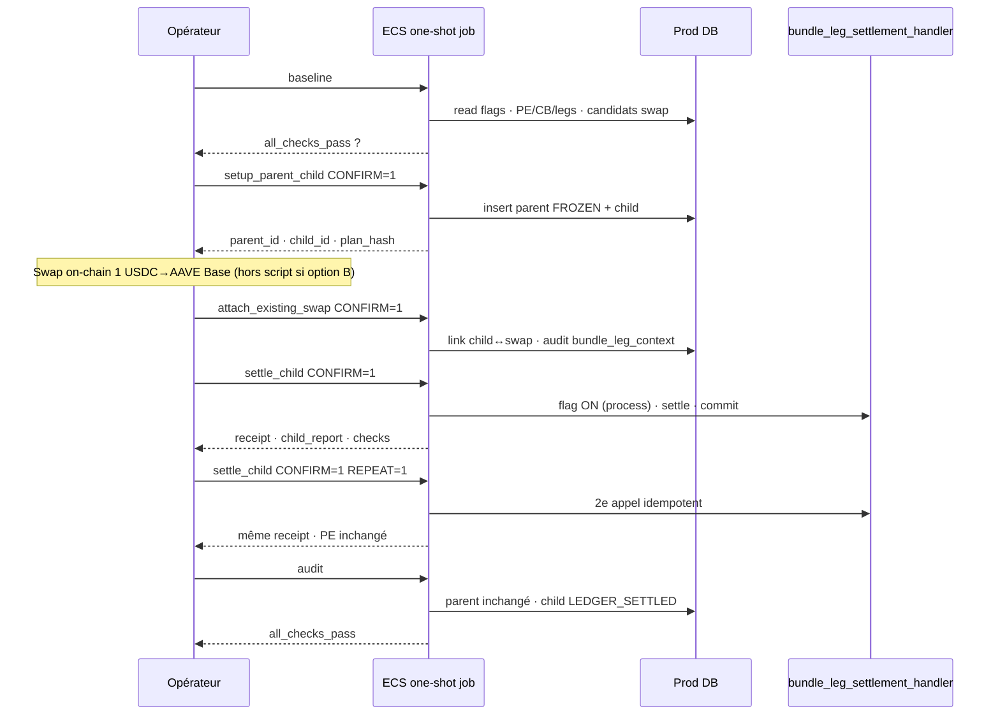

# Plan d'exécution — Test contrôlé Bundle B3c (prod)

| Champ | Valeur |
| --- | --- |
| **Statut** | **NON EXÉCUTÉ — en attente relecture + Go explicite** |
| **Objectif** | Prouver le rail minimal child settlement : **1 parent · 1 child · 1 buy leg · USDC→AAVE · Base** |
| **Prérequis code** | PR [#57](https://github.com/geniusga-vancelian/vancelian-app/pull/57) mergée · TD **≥ :154** · image **`660b1964`** |
| **Prérequis gate** | [GO_BUNDLE_B3A_POST_DEPLOY_REPORT.md](GO_BUNDLE_B3A_POST_DEPLOY_REPORT.md) ✅ · [GO_BUNDLE_B3C_POST_DEPLOY_REPORT.md](GO_BUNDLE_B3C_POST_DEPLOY_REPORT.md) ✅ |
| **Feu vert requis** | **Go « B3c Controlled Test » explicite** après relecture de ce plan |
| **Rapport d'exécution** | `GO_BUNDLE_B3C_CONTROLLED_TEST_REPORT.md` *(à produire après run)* |

---

## Position

### Ce que ce test prouve

```text
Parent FUNDED / FROZEN (metadata test)
  → Child #0 (bundle_leg)
  → Swap USDC→AAVE Base (CONFIRMED · bundle_execution=true)
  → settle_bundle_leg_idempotently(child_intent_id)  [flag ON dans le job seulement]
  → Child LEDGER_SETTLED
```

| Critère B3c | Preuve attendue |
| --- | --- |
| Handler child-only | **0** query parent dans `bundle_leg_settlement_handler` |
| Receipt + child report | `settlement_receipt_hash` · `child_report_hash` présents |
| Privy + PE buy atoms | 1 débit USDC · PE spot AAVE crédité **une fois** |
| Parent inchangé | metadata parent **identique** avant/après settle |
| Idempotence | 2ᵉ appel `settle_child` → no-op · même receipt |
| CB hors scope v1 | `cost_basis_executions` **67** inchangé |

### Ce plan ne fait pas

- activation permanente des flags handler en TD ECS ;
- branchement worker / outbox ;
- Controller parent (B5) ;
- finalize parent · `COMPLETED` · `RECONCILED` parent ;
- N legs · parallèle · sell · UNI · ETH ;
- investissement via UI Bundle legacy ;
- exécution avant Go explicite.

Référence doctrine : [BUNDLE_EVENT_DRIVEN_DESIGN.md](BUNDLE_EVENT_DRIVEN_DESIGN.md) §4.0.5–§4.0.7 · critère succès B3c.

---

## État prod connu (post-gate B3c · TD `:154`)

| Élément | Valeur |
| --- | --- |
| Task definition | **`arquantix-api:154`** |
| Image | **`660b1964f46682fe79fa8fce26eca33a9dc996da`** |
| `BUNDLE_FUNDING_HANDLER_ENABLED` | **absent** |
| `BUNDLE_LEG_SETTLEMENT_HANDLER_ENABLED` | **absent** |
| `BUNDLE_S4_PARENT_LOCK_DUAL_RUN_ENABLED` | **absent** |
| Compte pilote | `gaelitier@gmail.com` → `person_id` **`8b0e0044-f1ef-47a5-99d4-370598a77492`** |
| Client PE | **`080358a8-4519-4acf-b5da-25485446c967`** |
| Wallet Privy EVM | **`a5bc9936-11f2-411b-be33-f0b63196f65d`** · `0x7ae683c429ec2bc66bf1eb93713b5644dd265a44` |
| Baseline économique | PE **19** · CB **67** · legs **131** |
| Active locks | **0** |
| `dead_letter` | **0** |
| `bundle_leg` child test actif | **0** |
| Post-deploy neutre B3c | ✅ `all_checks_pass=true` |

**Gate pré-test** : relancer `baseline` (§ 1). **STOP** si un écart.

---

## Design du test — 1×1×1 strict

### Contrainte d'isolation

```
person_id   = 8b0e0044-f1ef-47a5-99d4-370598a77492
wallet_id   = a5bc9936-11f2-411b-be33-f0b63196f65d
from_asset  = USDC
to_asset    = AAVE
chains      = base / base
leg_index   = 0
direction   = buy
montant     = 1 USDC (recommandé — ajustable via AMOUNT_USDC)
```

**Interdit** : UNI · ETH · sell · 2ᵉ leg · Controller · finalize parent · UI Bundle legacy · flags ON en TD.

### Option swap (préférence B)

| Option | Description | Risque |
| --- | --- | --- |
| **B (préférée)** | Attacher un swap **déjà CONFIRMED** USDC→AAVE Base taggé `bundle_execution=true` | Évite d'ouvrir le runtime legacy bundle |
| A | Flow legacy bundle pour créer un swap taggé | Writers post-confirmation legacy · hors scope gate |

Le mode `attach_existing_swap` peut enrichir l'`audit_log` avec `bundle_leg_context` **uniquement** si absent — sans appeler l'orchestrateur legacy.

---

## Outils

| Fichier | Rôle |
| --- | --- |
| `scripts/arquantix-ecs-bundle-b3c-controlled-test.sh` | Lanceur ECS one-shot par mode |
| `scripts/_bundle-b3c-controlled-test-inline.py` | Logique baseline / setup / attach / settle / audit / cleanup |

### Modes

| Mode | RW | `CONFIRM=1` | Description |
| --- | --- | --- | --- |
| `baseline` | read | non | Préconditions prod + candidats swap attach |
| `setup_parent_child` | write | **oui** | Crée parent test + child #0 (sans swap) |
| `attach_existing_swap` | write | **oui** | Lie `SWAP_ID` au child · valide paire/chains |
| `settle_child` | write | **oui** | Flag handler ON **dans le job** · `settle_bundle_leg_idempotently` · commit |
| `audit` | read | non | Vérifie parent inchangé · child LEDGER_SETTLED · économie |
| `rollback_or_cleanup` | write | **oui** | Marque failed si **pas encore settled** · refuse si ledger validé |

### Activation handler (temporaire · job only)

Le mode `settle_child` exécute :

```python
os.environ["BUNDLE_LEG_SETTLEMENT_HANDLER_ENABLED"] = "true"
settle_bundle_leg_idempotently(db, child_intent_id=...)
db.commit()
```

La TD ECS **reste** sans le flag. Aucun worker/outbox n'est branché.

---

## Pipeline d'exécution



---

## Étapes détaillées

### 1. Baseline (read-only)

```bash
./scripts/arquantix-ecs-bundle-b3c-controlled-test.sh baseline
```

Vérifier dans le JSON :

| Check | Attendu |
| --- | --- |
| `flags.funding_off` · `leg_off` · `dual_off` | **true** |
| `economic.pe` / `cb` / `lifi_swap_legs` | **19 / 67 / 131** |
| `economic.active_locks` | **0** |
| `economic.dead_letter` | **0** |
| `economic.bundle_test_children` | **0** |
| `usdc_available` | **> 0** |
| `instruments` USDC + AAVE | présents |
| `attach_ready_swaps` | ≥ 1 *(option B)* ou planifier swap dédié |
| **`all_checks_pass`** | **true** |

Noter `selected_portfolio_id` (Crypto Majors recommandé — contient AAVE).

**STOP** si baseline KO.

---

### 2. Setup parent + child test

```bash
BUNDLE_B3C_TEST_CONFIRM=1 \
  PORTFOLIO_ID=<uuid> \
  AMOUNT_USDC=1 \
  ./scripts/arquantix-ecs-bundle-b3c-controlled-test.sh setup_parent_child
```

Crée :

| Entité | Attributs clés |
| --- | --- |
| **Parent** | `bundle_invest` · `intent_role=parent` · idempotency `bundle_b3c_controlled_test:parent:{run_id}` |
| **Metadata parent** | `phase=REBALANCE_PLAN_FROZEN` · `planner_version=v1` · `plan_hash` · `rebalance_plan_after_funding` (1 leg buy) |
| **Child** | `bundle_leg` · `intent_role=child` · `parent_intent_id` · `leg_index=0` · même `plan_hash` |
| **Child metadata** | `leg_direction=buy` · USDC→AAVE · Base · `entry_instrument_id` · `target_instrument_id` · `planned_amount_in` |

Conserver : `test_run_id` · `parent_intent_id` · `child_intent_id` · `plan_hash`.

**Ne pas** appeler `settle_bundle_funding_idempotently` — parent FUNDED/FROZEN est **simulé** en metadata pour ce rail minimal B3c.

---

### 3. Swap (hors script — opérateur)

**Option B (préférée)** : identifier dans `attach_ready_swaps` un swap :

- `CONFIRMED` · `tx_hash` présent ;
- USDC→AAVE · Base/Base ;
- `bundle_execution=true` dans `bundle_leg_context` ;
- **non** lié à un autre intent ;
- `amount_in` cohérent avec `AMOUNT_USDC` (tolérance opérationnelle documentée dans le rapport).

Si aucun candidat : exécuter **un seul** swap pilote 1 USDC→AAVE Base avec tagging bundle (procédure opérationnelle à documenter dans le rapport — **sans** UI Bundle legacy).

---

### 4. Attach swap → child

```bash
BUNDLE_B3C_TEST_CONFIRM=1 \
  CHILD_INTENT_ID=<child_uuid> \
  SWAP_ID=<swap_uuid> \
  ./scripts/arquantix-ecs-bundle-b3c-controlled-test.sh attach_existing_swap
```

Vérifier : `bundle_internal=true` · `child.linked_id` = swap.

---

### 5. Settle child (1er passage)

```bash
BUNDLE_B3C_TEST_CONFIRM=1 \
  CHILD_INTENT_ID=<child_uuid> \
  ./scripts/arquantix-ecs-bundle-b3c-controlled-test.sh settle_child
```

Audit attendu dans le JSON :

| Check | Attendu |
| --- | --- |
| `result_first.settled` | **true** |
| `child_after.bundle_leg_settlement.phase` | **LEDGER_SETTLED** |
| `settlement_receipt_hash` | `sha256:…` |
| `child_report_hash` | `sha256:…` |
| `parent_unchanged` | **true** |
| `cb_unchanged` | **true** (67) |
| `dead_letter_zero` | **true** |
| **`all_checks_pass`** | **true** |

---

### 6. Idempotence (2ᵉ passage)

```bash
BUNDLE_B3C_TEST_CONFIRM=1 \
  BUNDLE_B3C_TEST_REPEAT=1 \
  CHILD_INTENT_ID=<child_uuid> \
  ./scripts/arquantix-ecs-bundle-b3c-controlled-test.sh settle_child
```

| Check | Attendu |
| --- | --- |
| `result_second.idempotent` | **true** |
| `receipt_stable` | **true** |
| PE / Privy / deposits | inchangés vs fin étape 5 |

---

### 7. Audit final

```bash
PARENT_INTENT_ID=<parent_uuid> \
  CHILD_INTENT_ID=<child_uuid> \
  ./scripts/arquantix-ecs-bundle-b3c-controlled-test.sh audit
```

| Critère | Attendu |
| --- | --- |
| Child `LEDGER_SETTLED` | ✅ |
| Parent **non** `RECONCILED` / `COMPLETED` | ✅ |
| `plan_hash` parent = child | ✅ |
| PE ≥ 19 ( +1 spot AAVE attendu ) | ✅ |
| CB = 67 | ✅ |
| `dead_letter` = 0 | ✅ |
| Pas de double crédit Privy | ✅ |
| **`all_checks_pass`** | **true** |

---

### 8. Rollback / cleanup (si échec avant settle)

```bash
BUNDLE_B3C_TEST_CONFIRM=1 \
  PARENT_INTENT_ID=<parent_uuid> \
  CHILD_INTENT_ID=<child_uuid> \
  ./scripts/arquantix-ecs-bundle-b3c-controlled-test.sh rollback_or_cleanup
```

| Situation | Action |
| --- | --- |
| Setup OK · swap non attaché | cleanup → intents `failed` |
| Attach OK · settle échoué | cleanup → unlink swap · intents `failed` |
| **Child déjà LEDGER_SETTLED** | **refus cleanup** — rapport incident · pas de suppression ledger |

---

## STOP immédiat si

| Signal | Action |
| --- | --- |
| Parent metadata / phase mutée après settle | Stop · audit · incident |
| `plan_hash` mismatch parent/child | Stop · cleanup si pas settled |
| PE/CB/legs changent hors attendu | Stop · incident |
| Double debit/credit Privy | Stop · incident |
| Double PE atom (même swap) | Stop · incident |
| `dead_letter` > 0 | Stop · pas de settle supplémentaire |
| `COMPLETED` apparaît | Stop · incident |
| Controller / worker appelé | Stop · incident |
| Flag handler activé en TD ECS | Rollback TD · stop |

---

## Checklist Go / No-Go

### Go (tous requis)

- [ ] Plan relu et validé CTO
- [ ] `baseline` → `all_checks_pass=true`
- [ ] TD ≥ :154 · image `660b1964`
- [ ] Flags handler OFF en TD
- [ ] `PORTFOLIO_ID` confirmé (Crypto Majors)
- [ ] Swap candidat identifié ou procédure swap documentée
- [ ] Fenêtre ops sans autre test Bundle / S4 en parallèle

### No-Go

- [ ] Baseline économique diverge (PE/CB/legs)
- [ ] Active locks > 0
- [ ] Child bundle_leg test résiduel non nettoyé
- [ ] Pas de swap attachable et pas de procédure swap validée

---

## Livrables post-exécution

1. `GO_BUNDLE_B3C_CONTROLLED_TEST_REPORT.md` — JSON ECS par étape · IDs · tx_hash · receipt hashes
2. Mise à jour [BUNDLE_EVENT_DRIVEN_DESIGN.md](BUNDLE_EVENT_DRIVEN_DESIGN.md) § statut B3c si succès
3. Décision explicite : **ne pas** activer handler en prod TD après succès test

---

## Références

- [GO_BUNDLE_B3C_POST_DEPLOY_REPORT.md](GO_BUNDLE_B3C_POST_DEPLOY_REPORT.md)
- [GO_BUNDLE_B3A_POST_DEPLOY_REPORT.md](GO_BUNDLE_B3A_POST_DEPLOY_REPORT.md)
- `services/portfolio_engine/bundles/event_driven/bundle_leg_settlement_handler.py`
- `services/arquantix/api/tests/test_bundle_b3c_bundle_leg_settlement_handler.py`
