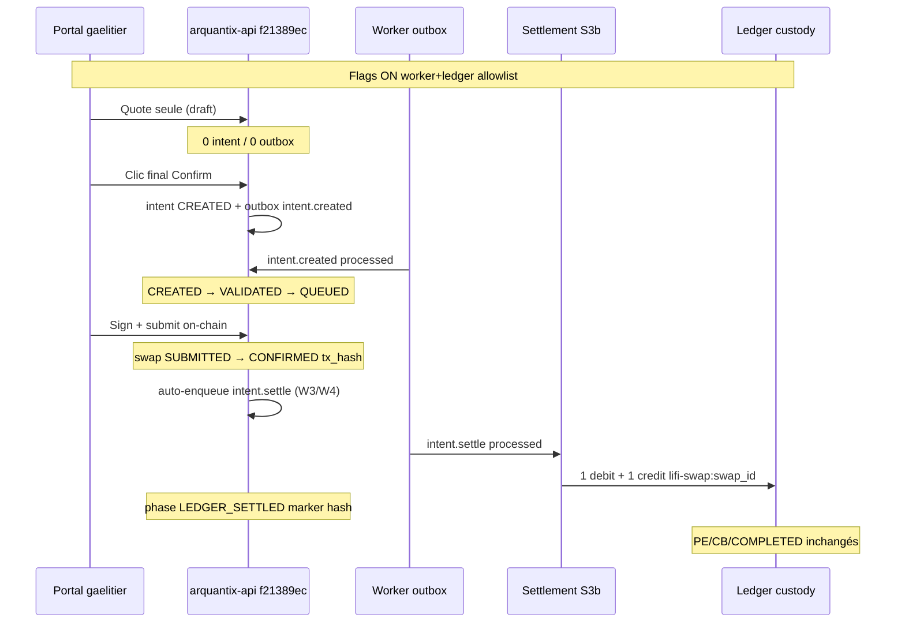

# Plan d’exécution — Go Pilot Prod Étape 3 (S3b ledger, sans exécution)

| Champ | Valeur |
| --- | --- |
| **Statut** | **Plan prêt — NON EXÉCUTÉ** |
| **Runbook parent** | [CONTROLLED_PROD_PILOT_LIFI_ORCHESTRATOR.md](CONTROLLED_PROD_PILOT_LIFI_ORCHESTRATOR.md) § Étape 3 |
| **Contrat settlement** | [SETTLEMENT_LAYER_CONTRACT_v1.md](SETTLEMENT_LAYER_CONTRACT_v1.md) |
| **Prérequis validés** | Étape 0 ✅ · Étape 1 post-#37 ✅ · Étape 2 post-#37 ✅ |
| **Prérequis code Étape 3** | **W3/W4** — ✅ mergé + déployé (#38 · TD `:120` · `a13de0be`) |
| **Code prod actuel** | **`a13de0be`** (TD `:120`) — W3/W4 live · worker/ledger OFF |
| **Feu vert requis** | **Go Étape 3 explicite** — ce document ne l’active rien |

---

## Position

**Objectif Étape 3** : premier swap **réel signé on-chain** sur le compte pilote, puis vérifier que le settlement S3b écrit **exactement** 1 débit + 1 crédit ledger, sans PE, sans cost basis, sans `COMPLETED`.

**Ce plan ne fait pas** :

- activation des flags worker / ledger ;
- swap signé ;
- modification ECS prod ;
- enqueue outbox ;
- tick DeFi.

---

## État prod connu (post-Étape 2 post-#37)

| Élément | Valeur |
| --- | --- |
| Task definition active | `arquantix-api:119` |
| Image | `f21389ec` |
| `LIFI_ORCHESTRATOR_ALLOWED_PERSON_EMAILS` | `gaelitier@gmail.com` |
| `LIFI_INTENT_ORCHESTRATOR_ENABLED` | `true` |
| `LIFI_OUTBOX_WORKER_ENABLED` | **`false`** |
| `LIFI_SETTLEMENT_LAYER_LEDGER_ENABLED` | **`false`** |
| Compte pilote | `gaelitier@gmail.com` → `person_id` **`8b0e0044-f1ef-47a5-99d4-370598a77492`** |
| Wallet Privy EVM | `0x7ae683c429ec2bc66bf1eb93713b5644dd265a44` |
| Intents orchestrateur | **8** (7 artefacts pré-#37 + 1 S2a.2 `QUEUED` / EXPIRED) — **à ignorer** |
| Baseline économique | PE **19** · CB **66** · legs `lifi-swap:%` **116** |
| Outbox pending | **0** |
| S3 Controller | **verrouillé** |
| Product Locks (S4) | **non démarrés** |

---

## Prérequis bloquant — PR W3/W4 (décision CTO)

**Go Étape 3 refusé sur `f21389ec` sans enqueue auto** — l’enqueue manuel en prod n’est **pas** un chemin acceptable pour valider le pipeline event-driven complet.

### Ce que la PR W3/W4 apporte

Quand un swap LI.FI **standalone orchestrateur** devient **`CONFIRMED`** avec **`tx_hash`**, le système enqueue automatiquement :

```
transaction_outbox.event_type = intent.settle
payload_json.source = auto_confirm_enqueue
```

Module : `services/transaction_outbox/orchestrator_settle_enqueue.py`  
Branché dans : `lifi_execute_service.refresh_lifi_status` · mock submit · `lifi_swap_reconciliation`  
Tests : `tests/test_orchestrator_intent_settle_enqueue_w3w4.py`

### Garde-fous W3/W4

| Règle | Détail |
| --- | --- |
| Périmètre | allowlist + `phase2_orchestrator` + standalone (pas bundle interne) |
| Phase intent | `QUEUED` ou `ONCHAIN_CONFIRMED` uniquement |
| Idempotence | si `intent.settle` existe déjà → no-op |
| Pas d’écriture directe | **0** ledger / PE / cost basis à l’enqueue |
| Legacy | `apply_swap_settlement` **skip** si intent orchestrateur lié |

### Séquence avant Go Étape 3

1. Merger PR W3/W4
2. Deploy prod (image ≥ commit W3/W4)
3. Vérifier flags runtime inchangés (worker/ledger **OFF** jusqu’au Go)
4. **Puis** feu vert « Go Pilot Prod Étape 3 »

**Interdit** : enqueue manuel `intent.settle` en prod comme substitut au câblage auto.

---

## Pipeline cible Étape 3 (1 swap neuf)



---

## 1. Baseline SQL avant swap (lecture seule)

Exécuter **avant** toute activation de flags. Conserver les résultats dans le futur rapport d’exécution.

Remplacer `:person_id` = `8b0e0044-f1ef-47a5-99d4-370598a77492`.

### 1.1 Outbox par statut

```sql
SELECT event_type, status, COUNT(*) AS n
FROM transaction_outbox
GROUP BY event_type, status
ORDER BY event_type, status;
```

**Attendu pré-Go** : `intent.created` / `processed` = **8** · `pending` = **0** · `intent.settle` = **0**.

### 1.2 Dernier intent orchestrateur S2a.2 (référence — ne pas réutiliser)

```sql
SELECT
  i.id AS intent_id,
  i.current_phase,
  i.created_at,
  i.metadata_json->>'s2a2_confirm_attach' AS s2a2,
  s.id AS swap_id,
  s.status AS swap_status,
  s.tx_hash
FROM transaction_intents i
LEFT JOIN person_wallet_swaps s
  ON i.linked_table = 'person_wallet_swaps' AND i.linked_id = s.id
WHERE i.person_id = :person_id
  AND i.metadata_json->>'phase2_orchestrator' = 'true'
ORDER BY i.created_at DESC
LIMIT 5;
```

**Ne pas réutiliser** les swaps `EXPIRED` / artefacts pré-#37.

### 1.3 Compteurs économiques globaux

```sql
SELECT COUNT(*) AS pe_position_atoms FROM pe_position_atoms;
SELECT COUNT(*) AS cost_basis_executions FROM cost_basis_executions;
SELECT COUNT(*) AS lifi_swap_legs
FROM person_wallet_deposits
WHERE idempotency_key LIKE 'lifi-swap:%';
```

**Baseline attendue** : **19** · **66** · **116**.

### 1.4 Balances compte pilote (USDC + destination)

```sql
SELECT asset, balance, available_balance, pending_balance, updated_at
FROM person_wallet_balances
WHERE person_id = :person_id
  AND asset IN ('USDC', 'AAVE', 'ETH', 'WETH')
ORDER BY asset;
```

**Pré-vol métier** :

- `available_balance` USDC ≥ **1.0** (sinon dépôt / simulate deposit avant Go) ;
- ETH/Base suffisant pour gas Privy (vérifier wallet on-chain si balance API = 0).

### 1.5 Autres users orchestrateur

```sql
SELECT COUNT(*) AS other_orchestrator_users
FROM transaction_intents
WHERE metadata_json->>'phase2_orchestrator' = 'true'
  AND person_id <> :person_id;
```

**Attendu** : **0**.

### 1.6 Flags runtime (ECS one-shot lecture)

```bash
./scripts/arquantix-ecs-run-job.sh arquantix-api arquantix-api \
  'cd /app && python3 -c "import os,json; print(json.dumps({k:os.getenv(k) for k in [\"LIFI_ORCHESTRATOR_ALLOWED_PERSON_EMAILS\",\"LIFI_INTENT_ORCHESTRATOR_ENABLED\",\"LIFI_OUTBOX_WORKER_ENABLED\",\"LIFI_SETTLEMENT_LAYER_LEDGER_ENABLED\"]}))"'
```

**Attendu pré-Go** : worker **`false`** · ledger **`false`** · allowlist **`gaelitier@gmail.com`**.

---

## 2. Activation flags (NE PAS EXÉCUTER sans Go Étape 3)

### 2.1 Valeurs cibles TD `:120` (ou révision suivante)

| Variable | Valeur Étape 3 |
| --- | --- |
| `LIFI_ORCHESTRATOR_ALLOWED_PERSON_EMAILS` | `gaelitier@gmail.com` |
| `LIFI_INTENT_ORCHESTRATOR_ENABLED` | `true` |
| `LIFI_OUTBOX_WORKER_ENABLED` | **`true`** |
| `LIFI_SETTLEMENT_LAYER_LEDGER_ENABLED` | **`true`** |

Image : **conserver `f21389ec`** (pas de redeploy code requis).

### 2.2 Procédure ECS (modèle — exécution différée)

```bash
# 1. describe-task-definition arquantix-api:119
# 2. register-task-definition — worker=true, ledger=true (reste inchangé)
# 3. aws ecs update-service --force-new-deployment
# 4. aws ecs wait services-stable
# 5. Vérifier flags runtime (§ 1.6) → worker=true, ledger=true
```

**Interdit** : activer S3 Controller · élargir allowlist · toucher autres services.

---

## 3. Runbook opérateur — parcours portal (après flags ON)

### 3.1 Préconditions opérateur

| # | Check |
| --- | --- |
| P1 | Go Étape 3 **écrit** reçu |
| P2 | Baseline SQL § 1 capturée |
| P3 | Flags § 2 validés en runtime |
| P4 | Compte **`gaelitier@gmail.com`** uniquement |
| P5 | **Portal web** (pas app mobile legacy `/execute`) |
| P6 | **Nouveau swap** — ne pas reprendre un swap EXPIRED / artefact |

### 3.2 Parcours UI (discipline S2a.2)

| Étape | Action | Contrôle immédiat |
| --- | --- | --- |
| 1 | Portal → Swap LI.FI standalone | — |
| 2 | **Base → Base** · **1 USDC** · USDC → AAVE (ou USDC → ETH) | Montant **strictement 1** |
| 3 | Quote / setup — **rester sur l’écran** | **0** nouvel intent / outbox (draft) |
| 4 | Aller au **summary** · clic **« Confirmer l'échange »** | +1 intent `CREATED` · +1 outbox `intent.created` `pending` |
| 5 | Processing → signature Privy | Ne pas abandonner |
| 6 | **Signer + submit on-chain** | `tx_hash` renseigné · swap `SUBMITTED` puis `CONFIRMED` |
| 7 | Attendre confirmation LI.FI (poll / tick maintenance) | `swap.status = CONFIRMED` · **outbox `intent.settle` `pending` auto** (W3/W4) |
| 8 | Tick worker (§ 4) | `intent.created` → `QUEUED` (si pas déjà fait) · **`intent.settle` → settlement** |
| 9 | SQL post-swap § 5 | Tous critères verts |
| 10 | Rollback flags § 6 | worker OFF · ledger OFF |

### 3.3 Variables à noter pendant l’exécution

Noter dans un carnet ops (pour le rapport) :

- `swap_id` (nouveau UUID)
- `intent_id` (nouveau, `s2a2_confirm_attach=true`)
- `outbox_id` (`intent.created`)
- `tx_hash`
- `outbox_id` (`intent.settle`)
- horodatages UTC de chaque étape

---

## 4. Ticks worker (après activation flags)

### 4.1 Tick DeFi standard

```bash
./scripts/arquantix-ecs-run-job.sh arquantix-api arquantix-api \
  'cd /app && python3 -m scripts.defi_observability_tick --no-dry-run --max-duration-seconds 480'
```

**Steps à surveiller** dans les logs CloudWatch :

| Step | Attendu |
| --- | --- |
| `transaction_outbox` | `intent.created` traité → `processed` |
| `transaction_outbox_intent_settle` | `intent.settle` traité → `processed` (après enqueue § 4.7) |
| `swap_maintenance` | possible `EXPIRED` sur quotes abandonnées — **sans impact** si swap signé déjà CONFIRMED |

Exit code **2** (degraded) acceptable si steps outbox **succès** (identique Étape 2).

### 4.2 Ordre recommandé

1. **Après confirm final** (intent créé) → tick → `intent.created` processed → phase `QUEUED`
2. **Après submit + CONFIRMED** → **auto-enqueue** `intent.settle` (W3/W4, même TX que refresh status)
3. **Tick** → settlement S3b → `LEDGER_SETTLED` + jambes ledger
4. **(Optionnel)** 2ᵉ tick sur `intent.settle` → **`NOOP_ALREADY_SETTLED`**

### 4.3 Préconditions settlement (code S3b)

Le settlement **refuse** si :

| Condition | Exigence |
| --- | --- |
| `intent.current_phase` | ∈ `QUEUED`, `PROCESSING`, `ONCHAIN_CONFIRMED` |
| `swap.status` | **`CONFIRMED`** |
| `swap.tx_hash` | non null |
| Solde USDC | `available_balance` ≥ 1 USDC |
| Produit | standalone (pas bundle interne) |

Phases settlement-ready : `services/settlement/constants.py` → `SETTLEMENT_READY_PHASES`.

### 4.4 Double-writer guard

Avec intent orchestrateur lié, `apply_swap_settlement()` **ne s’exécute pas** (skip W3/W4) — seul le chemin `intent.settle` → `settle_transaction_intent_idempotently()` écrit quand ledger ON.

**STOP** si jambes legacy `sync_source=lifi_swap` **et** `settlement_layer=s3b` sur le **même** `swap_id`.

### 4.5 Idempotency keys attendues

```
lifi-swap:{swap_id}:debit
lifi-swap:{swap_id}:credit
```

### 4.6 Phase post-settlement

| Champ | Valeur attendue |
| --- | --- |
| `intent.current_phase` | **`LEDGER_SETTLED`** |
| `metadata_json.settlement_receipt_hash` | présent (non null) |
| `intent.status` | **≠** `completed` |
| Outbox `intent.settle` | **`processed`** |

### 4.7 Vérification auto-enqueue post-CONFIRMED (W3/W4)

Après swap **CONFIRMED** + `tx_hash`, **sans action manuelle** :

```sql
SELECT id, event_type, status, payload_json->>'source' AS source
FROM transaction_outbox
WHERE intent_id = :intent_id
  AND event_type = 'intent.settle';
```

**Attendu** : **1 ligne** · `status = pending` (avant tick) · `source = auto_confirm_enqueue`

---

## 5. Vérifications SQL après swap

Remplacer `:swap_id`, `:intent_id`, `:person_id` par les UUID du **nouveau** swap.

### 5.1 Nouvel intent S2a.2

```sql
SELECT id, current_phase, status, tx_hash,
       metadata_json->>'s2a2_confirm_attach' AS s2a2,
       metadata_json->>'settlement_receipt_hash' AS receipt_hash,
       linked_id AS swap_id
FROM transaction_intents
WHERE id = :intent_id;
```

**Attendu** : `s2a2=true` · `current_phase=LEDGER_SETTLED` · `receipt_hash` non null · `status ≠ completed`.

### 5.2 Timeline outbox

```sql
SELECT id, event_type, status, attempt_count, last_error, processed_at, created_at
FROM transaction_outbox
WHERE intent_id = :intent_id
ORDER BY created_at;
```

**Attendu** :

| event_type | status |
| --- | --- |
| `intent.created` | `processed` |
| `intent.settle` | `processed` |

### 5.3 Transitions

```sql
SELECT phase, actor, created_at
FROM transaction_intent_transitions
WHERE intent_id = :intent_id
ORDER BY created_at;
```

**Attendu** (minimum) :

- `CREATED` / `confirm_attach`
- `VALIDATED` + `QUEUED` / `outbox_worker_intent_created`
- `LEDGER_SETTLED` / `outbox_worker_intent_settle`

### 5.4 Swap on-chain

```sql
SELECT id, status, tx_hash, from_asset, to_asset, amount_in, from_chain, to_chain, confirmed_at
FROM person_wallet_swaps
WHERE id = :swap_id;
```

**Attendu** : `status=CONFIRMED` · `tx_hash` non null · `amount_in=1`.

### 5.5 Jambes ledger (exactement 1 + 1)

```sql
SELECT direction, asset, amount, idempotency_key, status,
       metadata_json->>'source' AS source,
       metadata_json->>'settlement_layer' AS settlement_layer
FROM person_wallet_deposits
WHERE idempotency_key IN (
  'lifi-swap:' || :swap_id::text || ':debit',
  'lifi-swap:' || :swap_id::text || ':credit'
)
ORDER BY direction;
```

**Attendu** : **2 lignes** · 1 `debit` USDC · 1 `credit` AAVE/ETH · `settlement_layer=s3b`.

### 5.6 Détection doublon (doit retourner 0 ligne)

```sql
SELECT idempotency_key, COUNT(*) AS n
FROM person_wallet_deposits
WHERE idempotency_key LIKE 'lifi-swap:' || :swap_id::text || ':%'
GROUP BY idempotency_key
HAVING COUNT(*) > 1;
```

### 5.7 Compteurs économiques Δ

```sql
SELECT COUNT(*) FROM pe_position_atoms;                    -- = 19
SELECT COUNT(*) FROM cost_basis_executions;                -- = 66
SELECT COUNT(*) FROM person_wallet_deposits
WHERE idempotency_key LIKE 'lifi-swap:%';                  -- = 118 (+2)
SELECT COUNT(*) FROM transaction_intents
WHERE metadata_json->>'phase2_orchestrator' = 'true'
  AND current_phase = 'COMPLETED';                         -- = 0
SELECT COUNT(*) FROM transaction_intents
WHERE metadata_json->>'phase2_orchestrator' = 'true'
  AND person_id <> :person_id;                             -- = 0
SELECT COUNT(*) FROM transaction_outbox WHERE status = 'dead_letter';  -- = 0
```

### 5.8 Balances cohérentes

```sql
SELECT asset, balance, available_balance
FROM person_wallet_balances
WHERE person_id = :person_id
  AND asset IN ('USDC', 'AAVE', 'ETH', 'WETH')
ORDER BY asset;
```

**Attendu** : USDC ↓ ~1 · actif destination ↑ (montant réel LI.FI).

### 5.9 Exclusion bundle / Lombard

```sql
SELECT audit_log FROM person_wallet_swaps WHERE id = :swap_id;
-- Pas de bundle_execution / lombard dans audit_log
```

### 5.10 Test idempotence (optionnel post-validation)

Re-enqueue ou re-tick `intent.settle` → outbox `processed` · **0** nouvelle jambe · marker déjà présent.

---

## 6. Critères STOP (rollback immédiat)

| # | Signal | Action |
| --- | --- | --- |
| S1 | **Double débit** ou **double crédit** (même `idempotency_key`) | STOP · rollback § 7 · incident |
| S2 | **Jambe orpheline** (débit sans crédit ou inverse) | STOP · rollback · incident |
| S3 | **`pe_position_atoms` Δ** vs baseline 19 | STOP · rollback |
| S4 | **`cost_basis_executions` Δ** vs baseline 66 | STOP · rollback |
| S5 | **`COMPLETED`** orchestrateur apparaît | STOP · rollback |
| S6 | Outbox **`dead_letter`** inattendu | STOP · rollback |
| S7 | **Autre user** orchestrateur (`phase2_orchestrator`) | STOP · rollback · incident |
| S8 | **Bundle interne** / vault / Lombard touché par settlement | STOP · rollback |
| S9 | **Double writer** : jambes legacy `lifi_swap` **et** S3b sur même swap | STOP · rollback |
| S10 | Ledger écrit **sans** Go Étape 3 (activation accidentelle) | STOP · rollback |

---

## 7. Rollback (après Étape 3 ou STOP)

### 7.1 Flags cibles TD `:121` (ou révision suivante)

| Variable | Valeur rollback |
| --- | --- |
| `LIFI_OUTBOX_WORKER_ENABLED` | **`false`** |
| `LIFI_SETTLEMENT_LAYER_LEDGER_ENABLED` | **`false`** |
| `LIFI_INTENT_ORCHESTRATOR_ENABLED` | **`true`** (conserver si demandé) |
| `LIFI_ORCHESTRATOR_ALLOWED_PERSON_EMAILS` | **`gaelitier@gmail.com`** (conserver si demandé) |

### 7.2 Procédure

1. `register-task-definition` depuis TD courante — worker OFF · ledger OFF
2. `update-service` + `wait services-stable`
3. Vérifier flags runtime (§ 1.6) → worker/ledger **`false`**
4. Confirmer **0** outbox `pending` en cours de traitement (ou documenter si pending sans effet)
5. **Ne pas** supprimer les artefacts / jambes du swap test — trace pilot

### 7.3 Rollback ne annule pas

- Les jambes ledger `lifi-swap:{swap_id}:debit|credit` déjà écrites (réalité économique persistée) ;
- Le swap on-chain CONFIRMED.

En cas de STOP **pendant** settlement (jambe orpheline), escalade incident — pas de « fix silencieux ».

---

## 8. Grille décision Étape 3 (à remplir post-exécution)

| Critère | Attendu | Résultat |
| --- | --- | --- |
| Nouveau swap 1 USDC Base/Base signé | ✅ | |
| Quote seule = 0 intent | ✅ | |
| Confirm = 1 intent + 1 outbox | ✅ | |
| Worker `intent.created` → `QUEUED` | ✅ | |
| Swap `CONFIRMED` + `tx_hash` | ✅ | |
| `intent.settle` processed | ✅ | |
| Phase `LEDGER_SETTLED` | ✅ | |
| 1 débit + 1 crédit | ✅ | |
| 0 doublon idempotency | ✅ | |
| PE = 19 | ✅ | |
| CB = 66 | ✅ | |
| COMPLETED = 0 | ✅ | |
| 0 autre user | ✅ | |
| Rollback worker/ledger OFF | ✅ | |

**Verdict** : Étape 3 OK / KO / OK avec réserves

---

## 9. Checklist Go Étape 3 (humain — avant exécution)

- [x] **PR W3/W4 mergée et déployée en prod** — TD `:120` · migration 174 · [GO_PILOT_PROD_W3W4_POST_DEPLOY_REPORT.md](GO_PILOT_PROD_W3W4_POST_DEPLOY_REPORT.md)
- [ ] Ce plan relu et accepté
- [ ] Baseline SQL § 1 capturée et archivée
- [ ] Solde USDC pilote ≥ 1 + gas Base OK
- [ ] **Aucun** swap en cours sur comptes non pilote
- [ ] Fenêtre ops disponible (~30–45 min)
- [ ] Rollback § 7 comprise
- [ ] **Feu vert explicite** : « Go Pilot Prod Étape 3 »

---

## 10. Livrables post-exécution (quand Go donné)

| Livrable | Fichier |
| --- | --- |
| Rapport d’exécution | `GO_PILOT_PROD_STEP3_EXECUTION_REPORT.md` (à créer) |
| SQL baseline + post | copiés dans le rapport |
| Task definitions | `:120` (ON) · `:121` (rollback) |
| UUID swap / intent / tx_hash | tableau swaps pilot § CONTROLLED doc |

---

## 11. Références

| Document | Rôle |
| --- | --- |
| [GO_PILOT_PROD_STEP1_POST_S2A2_EXECUTION_REPORT.md](GO_PILOT_PROD_STEP1_POST_S2A2_EXECUTION_REPORT.md) | S2a.2 validé |
| [GO_PILOT_PROD_STEP2_POST_S2A2_EXECUTION_REPORT.md](GO_PILOT_PROD_STEP2_POST_S2A2_EXECUTION_REPORT.md) | Worker sans ledger |
| [STAGING_ACTIVATION_CHECKLIST_LIFI_ORCHESTRATOR.md](STAGING_ACTIVATION_CHECKLIST_LIFI_ORCHESTRATOR.md) | SQL § Requêtes · critères STOP |
| [PHASE2_POC_LIFI_STANDALONE_SWAP.md](PHASE2_POC_LIFI_STANDALONE_SWAP.md) | S3b scope · pipeline futur W3/W4 |

---

## Synthèse

Étape 3 est **planifiée** — prérequis W3/W4 **satisfaits** (deploy #38 OK). **Go explicite requis** ; pas de manipulation manuelle en prod.

Après W3/W4 en prod : feu vert « Go Étape 3 » → swap neuf 1 USDC portal → pipeline complet **CONFIRMED → auto-enqueue → worker → settlement S3b** → rollback worker/ledger OFF.
