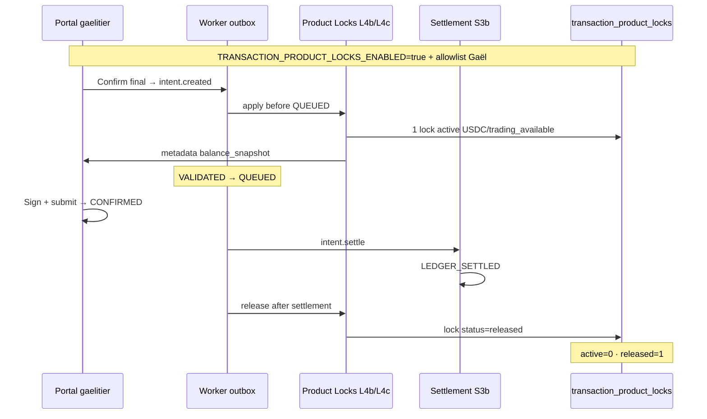

# Plan d’exécution — Go Controlled Activation Product Locks (S4)

| Champ | Valeur |
| --- | --- |
| **Statut** | **Plan prêt — NON EXÉCUTÉ** |
| **Objectif** | Premier swap pilote **1 USDC** avec Product Locks **ON** · lock + snapshot + release vérifiés |
| **Prérequis code** | S4 L1–L4c ✅ prod · L5a allowlist ⏸ merge requis · TD **`arquantix-api:133`** |
| **Runbook parent** | [CONTROLLED_PROD_PILOT_LIFI_ORCHESTRATOR.md](CONTROLLED_PROD_PILOT_LIFI_ORCHESTRATOR.md) · [GO_PILOT_PROD_STEP3_EXECUTION_PLAN.md](GO_PILOT_PROD_STEP3_EXECUTION_PLAN.md) |
| **Feu vert requis** | **Go S4 Controlled Activation explicite** — ce document n’active rien |

---

## Position

**Objectif** : valider en production le cycle complet Product Locks sur le compte pilote :

```
VALIDATED → snapshot + lock → QUEUED → settlement → LEDGER_SETTLED → lock released
```

**Ce plan ne fait pas** :

- activation ECS prod ;
- swap signé ;
- modification allowlist LI.FI ;
- activation sans feu vert écrit.

---

## Question préalable — allowlist Product Locks

### Réponse code (post-L5a · PR #TBD)

| Mécanisme | Existe ? | Détail |
| --- | --- | --- |
| `TRANSACTION_PRODUCT_LOCKS_ENABLED` | ✅ | Flag **global** ON/OFF |
| `TRANSACTION_PRODUCT_LOCKS_ALLOWED_PERSON_EMAILS` | ✅ **L5a** | Allowlist dédiée · comma-separated · fail-closed |
| Gate runtime L4b/L4c | ✅ | `product_locks_enabled_for_person()` dans `orchestrator_product_locks.py` |

### Option A — statut

| Étape | Statut |
| --- | --- |
| PR L5a allowlist | 🟡 **En cours** — [feat/s4-l5a-product-locks-allowlist] |
| Merge + deploy neutre L5a | ⏸ Requis avant Go |
| Go Controlled Activation | ⏸ **Interdit** sans L5a prod |

**Go S4 Controlled Activation refusé** tant que L5a n’est pas mergée et vérifiée en prod (flag OFF · allowlist absente · 0 lock).

**Option B (non recommandée)** : activation globale sans allowlist Product Locks — **rejetée**.

---

## État prod connu (post-L4c · TD `:133`)

| Élément | Valeur |
| --- | --- |
| Task definition | **`arquantix-api:133`** |
| Image | **`6c7b5f6a78e3f0ad10328373f72e2da93504119d`** |
| `TRANSACTION_PRODUCT_LOCKS_ENABLED` | **absent** (→ false) |
| `LIFI_ORCHESTRATOR_ALLOWED_PERSON_EMAILS` | `gaelitier@gmail.com` |
| `LIFI_INTENT_ORCHESTRATOR_ENABLED` | `true` |
| `LIFI_OUTBOX_WORKER_ENABLED` | **`false`** |
| `LIFI_SETTLEMENT_LAYER_LEDGER_ENABLED` | **`false`** |
| Compte pilote | `gaelitier@gmail.com` → `person_id` **`8b0e0044-f1ef-47a5-99d4-370598a77492`** |
| Wallet Privy EVM | `0x7ae683c429ec2bc66bf1eb93713b5644dd265a44` |
| Pilot intent | **`LEDGER_SETTLED`** (swap historique — ne pas réutiliser) |
| Baseline économique | PE **19** · CB **67** · legs `lifi-swap:%` **117** |
| `transaction_product_locks` | **0 rows** (active + released) |
| Intents `metadata_json.balance_snapshot` | **0** |
| S4 L1–L4c | ✅ prod · hooks no-op strict |

Références : [GO_S4_L4C_POST_DEPLOY_REPORT.md](GO_S4_L4C_POST_DEPLOY_REPORT.md)

---

## Pipeline cible (1 swap neuf · flags ON)



---

## 1. Baseline SQL (lecture seule — avant activation)

Remplacer `:person_id` = `8b0e0044-f1ef-47a5-99d4-370598a77492`.

### 1.1 Product locks

```sql
SELECT status, COUNT(*) AS n
FROM transaction_product_locks
GROUP BY status
ORDER BY status;

SELECT COUNT(*) AS total FROM transaction_product_locks;
SELECT COUNT(*) AS active
FROM transaction_product_locks
WHERE status = 'active' AND released_at IS NULL;
SELECT COUNT(*) AS released
FROM transaction_product_locks
WHERE status = 'released';
```

**Attendu pré-Go** : **0 row** (tous compteurs = 0).

### 1.2 Snapshots intent

```sql
SELECT COUNT(*) AS intents_with_balance_snapshot
FROM transaction_intents
WHERE metadata_json ? 'balance_snapshot';

SELECT id, current_phase, metadata_json->'balance_snapshot' AS snap
FROM transaction_intents
WHERE person_id = :person_id
  AND metadata_json ? 'balance_snapshot'
ORDER BY created_at DESC
LIMIT 5;
```

**Attendu** : **0**.

### 1.3 Compteurs économiques

```sql
SELECT COUNT(*) AS pe_position_atoms FROM pe_position_atoms;
SELECT COUNT(*) AS cost_basis_executions FROM cost_basis_executions;
SELECT COUNT(*) AS lifi_swap_legs
FROM person_wallet_deposits
WHERE idempotency_key LIKE 'lifi-swap:%';
```

**Baseline attendue** : **19** · **67** · **117**.

### 1.4 Outbox / dead_letter

```sql
SELECT event_type, status, COUNT(*) AS n
FROM transaction_outbox
GROUP BY event_type, status
ORDER BY event_type, status;

SELECT COUNT(*) AS dead_letter
FROM transaction_outbox
WHERE status = 'dead_letter';
```

**Attendu** : `dead_letter = 0` · pas de `pending` bloquant sur intents pilote actifs.

### 1.5 Autres users orchestrateur

```sql
SELECT COUNT(*) AS other_orchestrator_users
FROM transaction_intents
WHERE metadata_json->>'phase2_orchestrator' = 'true'
  AND person_id <> :person_id;
```

**Attendu** : **0**.

### 1.6 Balances pilote (pré-vol swap)

```sql
SELECT asset, balance, available_balance, pending_balance, updated_at
FROM person_wallet_balances
WHERE person_id = :person_id
  AND asset IN ('USDC', 'AAVE', 'ETH', 'WETH')
ORDER BY asset;
```

**Pré-vol** : `available_balance` USDC ≥ **1.0** · gas Base OK.

### 1.7 Flags runtime (ECS one-shot)

```bash
./scripts/arquantix-ecs-run-job.sh arquantix-api arquantix-api \
  'cd /app && python3 -c "import os,json; print(json.dumps({k:os.getenv(k) for k in [\"TRANSACTION_PRODUCT_LOCKS_ENABLED\",\"TRANSACTION_PRODUCT_LOCKS_ALLOWED_PERSON_EMAILS\",\"LIFI_ORCHESTRATOR_ALLOWED_PERSON_EMAILS\",\"LIFI_INTENT_ORCHESTRATOR_ENABLED\",\"LIFI_OUTBOX_WORKER_ENABLED\",\"LIFI_SETTLEMENT_LAYER_LEDGER_ENABLED\"]}))"'
```

**Attendu pré-Go** :

| Flag | Valeur |
| --- | --- |
| `TRANSACTION_PRODUCT_LOCKS_ENABLED` | absent / `false` |
| `TRANSACTION_PRODUCT_LOCKS_ALLOWED_PERSON_EMAILS` | absent *(post Option A : `gaelitier@gmail.com`)* |
| `LIFI_*` worker/ledger | **`false`** |
| `LIFI_ORCHESTRATOR_ALLOWED_PERSON_EMAILS` | `gaelitier@gmail.com` |

Script baseline consolidé (post Option A) : prévoir `scripts/arquantix-ecs-s4-controlled-activation-baseline.sh` (à créer au Go).

---

## 2. Activation flags (NE PAS EXÉCUTER sans Go explicite)

### 2.1 Valeurs cibles (TD `:134` ou révision suivante)

| Variable | Valeur activation |
| --- | --- |
| `TRANSACTION_PRODUCT_LOCKS_ENABLED` | **`true`** |
| `TRANSACTION_PRODUCT_LOCKS_ALLOWED_PERSON_EMAILS` | **`gaelitier@gmail.com`** *(Option A — requis)* |
| `LIFI_ORCHESTRATOR_ALLOWED_PERSON_EMAILS` | `gaelitier@gmail.com` *(inchangé)* |
| `LIFI_INTENT_ORCHESTRATOR_ENABLED` | `true` |
| `LIFI_OUTBOX_WORKER_ENABLED` | **`true`** |
| `LIFI_SETTLEMENT_LAYER_LEDGER_ENABLED` | **`true`** |

Image : **conserver `6c7b5f6a`** (ou image ≥ Option A si PR merge entre-temps).

### 2.2 Procédure ECS (modèle — exécution différée)

```bash
# 1. aws ecs describe-task-definition arquantix-api:133
# 2. register-task-definition — flags § 2.1
# 3. aws ecs update-service arquantix-api --force-new-deployment
# 4. aws ecs wait services-stable
# 5. Re-run § 1.7 → tous flags conformes
# 6. curl https://arquantix.com/health → 200
```

**Interdit** : élargir allowlist LI.FI · activer S3 Controller · toucher autres services ECS.

### 2.3 Vérification post-activation (sans swap)

Confirmer que **person non allowlistée** ne créerait pas de lock (test ECS read-only ou requête code — pas de swap autre user).

---

## 3. Swap test (portal web uniquement)

### 3.1 Préconditions opérateur

| # | Check |
| --- | --- |
| P1 | Go **« S4 Controlled Activation »** écrit reçu |
| P2 | **Option A** mergée + déployée (allowlist Product Locks) |
| P3 | Baseline SQL § 1 archivée |
| P4 | Flags § 2 validés runtime |
| P5 | Compte **`gaelitier@gmail.com`** · portal web |
| P6 | **Nouveau swap** — ne pas réutiliser intent `LEDGER_SETTLED` historique |
| P7 | **Un seul swap** — pas de second swap même en cas d’échec partiel (STOP d’abord) |

### 3.2 Parcours UI

| Étape | Action | Contrôle |
| --- | --- | --- |
| 1 | Portal → Swap LI.FI standalone | — |
| 2 | **Base → Base** · **1 USDC** · USDC → **AAVE** (ou USDC → ETH) | Montant strictement **1** |
| 3 | Quote / setup — draft | **0** nouvel intent |
| 4 | Summary → **« Confirmer l'échange »** | +1 intent `CREATED` · +1 outbox `intent.created` |
| 5 | Tick worker (§ 4) | phase `QUEUED` · **lock active** · **balance_snapshot** |
| 6 | Sign + submit on-chain | `CONFIRMED` · `tx_hash` |
| 7 | Auto-enqueue `intent.settle` (W3/W4) | 1 outbox `intent.settle` pending |
| 8 | Tick worker | `LEDGER_SETTLED` · **lock released** |
| 9 | SQL post-swap § 5 | tous critères verts |
| 10 | Rollback § 6 | product locks OFF · worker/ledger OFF |

### 3.3 Variables ops à noter

- `swap_id` · `intent_id` · `lock_id` · `tx_hash`
- `outbox_id` (`intent.created` · `intent.settle`)
- `balance_snapshot.hash` · horodatages UTC

---

## 4. Ticks worker (après activation flags)

```bash
./scripts/arquantix-ecs-run-job.sh arquantix-api arquantix-api \
  'cd /app && python3 -m scripts.defi_observability_tick --no-dry-run --max-duration-seconds 480'
```

| Step | Attendu |
| --- | --- |
| `transaction_outbox` | `intent.created` → `processed` · phase `QUEUED` |
| Product lock | **1 row active** entre QUEUED et settlement |
| `transaction_outbox_intent_settle` | `intent.settle` → `processed` |
| Post-settle | **lock released** · active = 0 |

**Ordre** : tick après confirm → tick après CONFIRMED + auto-enqueue settle.

---

## 5. Vérifications SQL après swap

Remplacer `:swap_id`, `:intent_id`, `:person_id`.

### 5.1 Intent + snapshot

```sql
SELECT
  id,
  current_phase,
  status,
  metadata_json->'balance_snapshot' AS balance_snapshot,
  metadata_json->>'settlement_receipt_hash' AS receipt_hash,
  linked_id AS swap_id
FROM transaction_intents
WHERE id = :intent_id;
```

**Attendu** :

- `current_phase = LEDGER_SETTLED`
- `balance_snapshot` **non null** · `asset = USDC` · `hash` présent
- `receipt_hash` non null
- `status ≠ completed`

### 5.2 Product lock lifecycle

```sql
SELECT
  id,
  intent_id,
  asset,
  scope,
  status,
  lock_key,
  created_at,
  released_at,
  expires_at
FROM transaction_product_locks
WHERE intent_id = :intent_id
ORDER BY created_at;

SELECT COUNT(*) AS active_for_intent
FROM transaction_product_locks
WHERE intent_id = :intent_id
  AND status = 'active'
  AND released_at IS NULL;

SELECT COUNT(*) AS released_for_intent
FROM transaction_product_locks
WHERE intent_id = :intent_id
  AND status = 'released';
```

**Attendu** :

| Métrique | Valeur |
| --- | --- |
| Locks pour cet intent | **1 row** |
| `asset` | **USDC** |
| `scope` | **trading_available** |
| `active_for_intent` | **0** |
| `released_for_intent` | **1** |
| `released_at` | **non null** |

### 5.3 Global locks post-swap

```sql
SELECT status, COUNT(*) AS n
FROM transaction_product_locks
GROUP BY status;
```

**Attendu** : **`released = 1`** · **`active = 0`** · total = 1 (pas d’accumulation historique si table était vide).

### 5.4 Outbox + dead_letter

```sql
SELECT id, event_type, status, attempt_count, last_error
FROM transaction_outbox
WHERE intent_id = :intent_id
ORDER BY created_at;

SELECT COUNT(*) FROM transaction_outbox WHERE status = 'dead_letter';
```

**Attendu** : `intent.created` + `intent.settle` = **`processed`** · `dead_letter = 0`.

### 5.5 Jambes ledger

```sql
SELECT direction, asset, amount, idempotency_key,
       metadata_json->>'settlement_layer' AS settlement_layer
FROM person_wallet_deposits
WHERE idempotency_key LIKE 'lifi-swap:' || :swap_id::text || ':%'
ORDER BY direction;
```

**Attendu** : 1 débit USDC + 1 crédit destination · `settlement_layer=s3b` · **0 doublon**.

### 5.6 Compteurs économiques Δ

```sql
SELECT COUNT(*) FROM pe_position_atoms;                    -- = 19
SELECT COUNT(*) FROM cost_basis_executions;                -- = 67
SELECT COUNT(*) FROM person_wallet_deposits
WHERE idempotency_key LIKE 'lifi-swap:%';                  -- = 119 (+2) ou 118 (+1 si credit webhook reuse)
SELECT COUNT(*) FROM transaction_intents
WHERE current_phase = 'COMPLETED';                         -- = 0
```

### 5.7 Transitions intent

```sql
SELECT phase, actor, created_at
FROM transaction_intent_transitions
WHERE intent_id = :intent_id
ORDER BY created_at;
```

**Attendu minimum** : `VALIDATED` · `QUEUED` (`outbox_worker_intent_created`) · `LEDGER_SETTLED` (`outbox_worker_intent_settle`).

---

## 6. Tests négatifs (sans second swap)

Exécuter **après** validation swap § 5 · **avant** rollback flags.

### 6.1 Re-tick worker / settle idempotent

- Re-tick `defi_observability_tick` sur intent déjà `LEDGER_SETTLED`
- **Attendu** : **0** nouveau lock active · **0** nouvelle jambe ledger · outbox settle `NOOP_ALREADY_SETTLED`

### 6.2 Release idempotent (ECS one-shot read-only)

Si script post-swap disponible : appeler `release_orchestrator_product_locks_for_intent` sur intent terminé → `idempotent=True` · **0** mutation DB.

### 6.3 Lock orphelin scan

```sql
SELECT COUNT(*) AS orphan_active
FROM transaction_product_locks
WHERE status = 'active'
  AND released_at IS NULL;
```

**Attendu** : **0**.

### 6.4 Autre user inchangé

```sql
SELECT COUNT(*) FROM transaction_product_locks tpl
JOIN transaction_intents ti ON ti.id = tpl.intent_id
WHERE ti.person_id <> :person_id;
```

**Attendu** : **0**.

---

## 7. Rollback (après validation ou STOP)

### 7.1 Flags cibles (TD `:135` ou révision suivante)

| Variable | Valeur rollback |
| --- | --- |
| `TRANSACTION_PRODUCT_LOCKS_ENABLED` | **`false`** ou absent |
| `TRANSACTION_PRODUCT_LOCKS_ALLOWED_PERSON_EMAILS` | absent ou vide |
| `LIFI_OUTBOX_WORKER_ENABLED` | **`false`** |
| `LIFI_SETTLEMENT_LAYER_LEDGER_ENABLED` | **`false`** |
| `LIFI_INTENT_ORCHESTRATOR_ENABLED` | `true` *(conserver)* |
| `LIFI_ORCHESTRATOR_ALLOWED_PERSON_EMAILS` | `gaelitier@gmail.com` *(conserver)* |

### 7.2 Procédure

1. `register-task-definition` depuis TD courante — flags § 7.1
2. `update-service` + `wait services-stable`
3. Vérifier flags runtime § 1.7
4. Confirmer **0 lock active** :

```sql
SELECT COUNT(*) FROM transaction_product_locks
WHERE status = 'active' AND released_at IS NULL;
```

**Attendu rollback** : **0** active · released rows du swap test **conservées** (trace audit).

### 7.3 Rollback ne annule pas

- Swap on-chain CONFIRMED ;
- Jambes ledger `lifi-swap:{swap_id}:*` ;
- Row `transaction_product_locks` `released` (historique S4).

---

## 8. Critères STOP (rollback immédiat)

| # | Signal | Action |
| --- | --- | --- |
| S1 | **Lock actif restant** après `LEDGER_SETTLED` | STOP · rollback § 7 · incident |
| S2 | **Double lock** même slot (2 active même person/wallet/asset/scope) | STOP |
| S3 | **`balance_snapshot` absent** alors que flag ON + intent QUEUED | STOP |
| S4 | **Double débit / crédit** (même idempotency_key) | STOP |
| S5 | **PE Δ** vs baseline 19 | STOP |
| S6 | **CB Δ** vs baseline 67 | STOP |
| S7 | Outbox **`dead_letter`** | STOP |
| S8 | **`COMPLETED`** orchestrateur | STOP |
| S9 | **Autre user** impacté (lock / snapshot / orchestrator intent) | STOP |
| S10 | **409 ProductLockConflict** bloque intent sans release propre | STOP |
| S11 | Lock **non released** après terminal failure / dead_letter | STOP |
| S12 | Activation sans **Option A** allowlist Product Locks | STOP préventif |

---

## 9. Grille décision (à remplir post-exécution)

| Critère | Attendu | Résultat |
| --- | --- | --- |
| Option A allowlist déployée | ✅ | |
| Baseline § 1 capturée | ✅ | |
| Flags § 2 ON validés | ✅ | |
| Nouveau swap 1 USDC Base/Base | ✅ | |
| Worker → QUEUED | ✅ | |
| `metadata_json.balance_snapshot` présent | ✅ | |
| 1 lock active (transitoire) | ✅ | |
| Settlement → `LEDGER_SETTLED` | ✅ | |
| Lock released · active = 0 · released = 1 | ✅ | |
| PE = 19 | ✅ | |
| CB = 67 | ✅ | |
| Legs +2 ou +1 (webhook reuse) | ✅ | |
| COMPLETED = 0 | ✅ | |
| dead_letter = 0 | ✅ | |
| Tests négatifs § 6 OK | ✅ | |
| Rollback flags OFF § 7 | ✅ | |

**Verdict** : S4 Controlled Activation OK / KO / OK avec réserves

---

## 10. Checklist Go (humain — avant exécution)

- [ ] Ce plan relu et accepté
- [ ] S4 L4c post-deploy [GO_S4_L4C_POST_DEPLOY_REPORT.md](GO_S4_L4C_POST_DEPLOY_REPORT.md) ✅
- [ ] **PR L5a** mergée + deploy neutre vérifié ([S4_IMPLEMENTATION_ROADMAP.md](S4_IMPLEMENTATION_ROADMAP.md) § L5a)
- [ ] Baseline SQL § 1 capturée et archivée
- [ ] Solde USDC pilote ≥ 1 + gas Base OK
- [ ] Fenêtre ops ~45–60 min (swap + ticks + SQL + rollback)
- [ ] Rollback § 7 compris
- [ ] **Feu vert explicite** : « Go S4 Controlled Activation Product Locks »

---

## 11. Livrables post-exécution (quand Go donné)

| Livrable | Fichier |
| --- | --- |
| Rapport d’exécution | `GO_S4_CONTROLLED_ACTIVATION_REPORT.md` *(à créer)* |
| Script baseline / post-verify | `scripts/arquantix-ecs-s4-controlled-activation-*.sh` *(à créer)* |
| SQL baseline + post | copiés dans le rapport |
| Task definitions | `:134` (ON) · `:135` (rollback) |
| UUID swap / intent / lock / tx_hash | tableau dans le rapport |

---

## 12. Références

| Document | Rôle |
| --- | --- |
| [GO_S4_L4C_POST_DEPLOY_REPORT.md](GO_S4_L4C_POST_DEPLOY_REPORT.md) | État prod S4 dormant |
| [GO_PILOT_PROD_STEP3_EXECUTION_PLAN.md](GO_PILOT_PROD_STEP3_EXECUTION_PLAN.md) | Modèle activation contrôlée LI.FI |
| [S4_IMPLEMENTATION_ROADMAP.md](S4_IMPLEMENTATION_ROADMAP.md) | L1–L4c merged |
| [S4_PRODUCT_LOCKS_MATRIX.md](S4_PRODUCT_LOCKS_MATRIX.md) | Gouvernance locks |
| `services/product_locks/config.py` | Flag global seul aujourd’hui |
| `services/transaction_outbox/orchestrator_product_locks.py` | Gate LI.FI allowlist implicite |

---

## Synthèse

S4 runtime L1→L4c est **complet et dormant** en prod (TD `:133`). **Ne pas activer** Product Locks sans :

1. **L5a** mergée + deploy neutre (allowlist gate en prod, flag OFF) ;
2. Baseline SQL § 1 ;
3. Go explicite « S4 Controlled Activation » ;
4. Un seul swap 1 USDC portal · vérification lock/snapshot/release · rollback immédiat.

Ce document est un **plan uniquement** — aucune exécution prod incluse.
