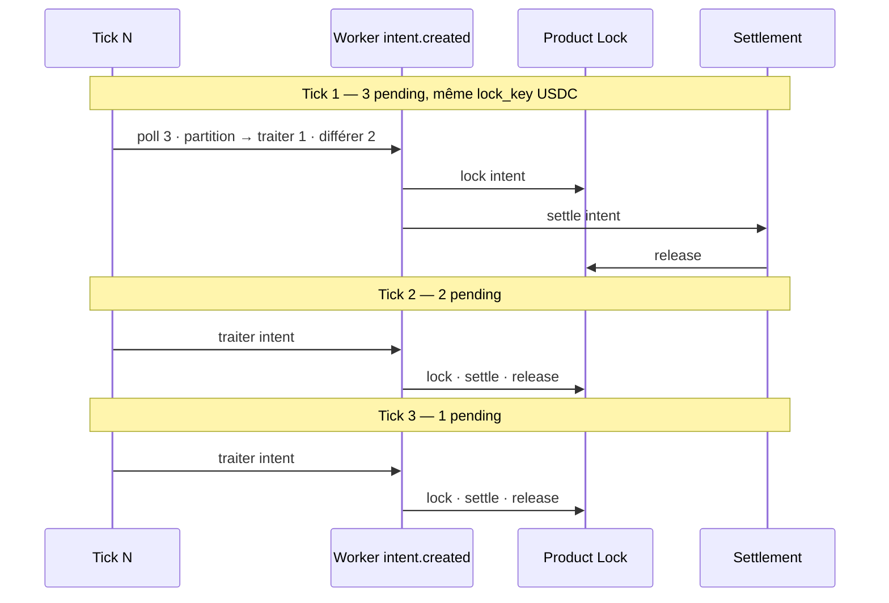

# S4d — Worker Queue Hardening

| Champ | Valeur |
| --- | --- |
| **Statut** | 🟡 **Implémenté** — PR dédiée · **pas de deploy prod sans Go** |
| **Prérequis** | S4 L1–L5a ✅ · Controlled Activation validé · Recovery ✅ |
| **Objectif** | File d’attente **one-by-one** par scope Product Lock · retry propre · pas de bruit ops |

---

## Problème observé (prod juin 2026)

Le test S4 Controlled Activation a **validé Product Locks**, mais a exposé une faiblesse **opérationnelle** :

```
3 swaps confirmés on-chain
+ 0 tick immédiat
+ 1 tick batch
= 1 cycle S4 complet
+ 2 lock conflicts (409)
+ 2 intents bloqués en VALIDATED / outbox pending
```

| Composant | Comportement |
| --- | --- |
| **Product Lock** | ✅ Correct — un seul lock USDC/`trading_available` actif |
| **Worker batch** | ❌ Traitait plusieurs intents même scope dans un poll |
| **Handler** | ❌ Passait en `VALIDATED` avant acquire → phase bloquée au retry |
| **Tick ECS** | Pas de worker continu — backlog jusqu’au cron / ops manuel |

Ce n’était **pas** un bug économique. C’était une queue insuffisamment disciplinée.

Références : [GO_S4_CONTROLLED_ACTIVATION_REPORT.md](GO_S4_CONTROLLED_ACTIVATION_REPORT.md) · [GO_S4_CONTROLLED_ACTIVATION_RECOVERY_REPORT.md](GO_S4_CONTROLLED_ACTIVATION_RECOVERY_REPORT.md)

---

## Décision S4d

Transformer :

```
batch tick → N intents concurrents → lock conflict → UX / ops bruit
```

En :

```
queue disciplinée → 1 intent par lock_key → tick suivant → retry propre
```

### Règle stratégique post-S4d

```
S4d merge
→ (recovery prod déjà fait juin 2026)
→ Bundle / Vault / Lombard / Controller
```

**Interdit avant S4d** : élargissement allowlist · activation prod longue durée · nouveau swap pilote massif.

---

## Clé de queue (lock_key)

Alignée sur Product Locks L2 :

```
person:{person_id}:wallet:{wallet_id}:asset:{ASSET}:scope:{scope}
```

Pour LI.FI orchestrateur standalone (L4b) :

- `scope` = **`trading_available`**
- `asset` = asset source du swap (`assets_json.from.asset`)

Module : `services/transaction_outbox/worker_queue_hardening.py`

---

## Stratégie de partition (S4d)

Après `poll_pending_events` sur `intent.created` :

1. Résoudre `lock_key` par intent (si Product Locks actifs pour la personne).
2. **Différer** un event si :
   - un autre event du **même batch** cible déjà ce `lock_key` ; ou
   - un **lock actif** existe en base pour ce `lock_key`.
3. `release_processing_lock` sur les différés → restent **`pending`** sans `attempt_count++`.
4. Traiter **au plus un** event par `lock_key` par tick.

Métriques worker enrichies :

| Champ | Signification |
| --- | --- |
| `deferred_same_scope` | Events remis en pending (scope occupé) |
| `requeued_lock_conflict` | 409 attrapé · retry court (5s) |

---

## Retry & reprise de phase

### ProductLockConflict409

- Retry **`next_retry_at`** court (**5 s**) — pas compté comme `failed` durci.
- Pas de `dead_letter` accéléré sur conflit seul.

### Reprise `VALIDATED`

Si un handler a transitionné en `VALIDATED` puis échoué sur acquire (avant S4d) :

- Handler reprend depuis **`VALIDATED`** → acquire + `QUEUED` + enqueue settle.
- Évite `intent_created_unexpected_phase:VALIDATED`.

---

## Flux nominal post-S4d (3 swaps même USDC)



---

## Hors scope S4d

- Bundle / Vault / Lombard / Controller
- Worker continu 24/7 (documenté comme follow-up ops)
- Élargissement allowlist
- Activation prod longue durée
- Refonte UI portail

---

## Livrables

| Artefact | Statut |
| --- | --- |
| `worker_queue_hardening.py` | ✅ |
| `worker.py` (partition + reprise VALIDATED + retry 409) | ✅ |
| `tests/test_product_locks_s4d_worker_queue_hardening.py` | ✅ |
| Ce document | ✅ |
| PR dédiée | 🟡 |
| Deploy prod | ⏸ Go explicite |

---

## Tests S4d

| Test | Vérifie |
| --- | --- |
| `test_s4d_batch_defers_duplicate_usdc_scope` | 3 intents · 1 processed · 2 deferred |
| `test_s4d_sequential_ticks_drain_three_usdc_intents` | 3 ticks · 3 `LEDGER_SETTLED` · 3 locks released · PE/CB inchangés |
| `test_s4d_different_assets_processed_in_parallel` | USDC + ETH · 2 processed · 1 deferred |
| `test_s4d_lock_key_scopes_are_distinct` | Scopes parallélisables (clés distinctes) |

---

## Follow-up ops (post-merge S4d)

| Option | Description |
| --- | --- |
| **A — Cron tick** | `defi_observability_tick --no-dry-run` toutes les N minutes en prod pilote |
| **B — Worker continu** | Process dédié poll outbox (hors scope S4d code) |
| **C — Discipline manuelle** | 1 swap → tick → audit (acceptable pilote Gaël) |

Recommandation CTO : **A + C** en pilote · **B** avant scale multi-users.

---

## Recovery prod (juin 2026)

Les 2 intents bloqués ont été récupérés via script ciblé **avant** merge S4d.

Post-S4d merge : les nouveaux backlogs du même type devraient se résorber **sans script recovery** via ticks séquentiels.

Script legacy : `scripts/_s4-controlled-activation-recovery-inline.py`

---

## Références

| Document | Rôle |
| --- | --- |
| [S4_IMPLEMENTATION_ROADMAP.md](S4_IMPLEMENTATION_ROADMAP.md) | Roadmap L1–S4d |
| [GO_S4_CONTROLLED_ACTIVATION_PLAN.md](GO_S4_CONTROLLED_ACTIVATION_PLAN.md) | Plan activation |
| ADR 001 §5bis | Product Locks · lock_key |
