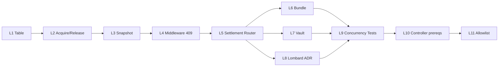

# S4 — Implementation Roadmap (technique)

| Champ | Valeur |
| --- | --- |
| **Type** | Plan d'exécution · PRs découplées |
| **Date** | 2026-06-07 |
| **Statut** | L1 ✅ · L2 ✅ prod · L3 ✅ prod · L4a ✅ prod · L4b ✅ prod · **L4c en cours** (PR) |
| **Gouvernance** | [S4_PRODUCT_LOCKS_MATRIX.md](S4_PRODUCT_LOCKS_MATRIX.md) (validé CTO v1.1) |
| **Jalon** | Tag `phase2-closed-s4-inventory-v1.1` |
| **Références** | [ADR 001 §5bis](adr/001-intent-as-orchestrator.md) · [PHASE2 POC § S4](PHASE2_POC_LIFI_STANDALONE_SWAP.md) |

---

## Objectif

Découper S4 en **petites PRs** :

- chacune **déployable indépendamment** ;
- **aucun impact** sur le rail LI.FI gelé (prod TD `:127` · worker/ledger OFF · allowlist inchangée) ;
- **aucun développement Bundle / Lombard / Vault** avant la première PR Product Locks (L1).

> **S4 Product Locks ≠ Controller**
>
> S4 ne marque jamais `RECONCILED` ou `COMPLETED`.
> S4 empêche les conflits concurrentiels produit / asset / scope.
> Le Controller (L10) vient après locks + router + encapsulation.

---

## Principes de découpage

| Principe | Application |
| --- | --- |
| **Table d'abord** | L1 crée la structure ; L2+ consomme |
| **Router avant encapsulation** | L5 fige l'architecture avant L6–L7 |
| **Lombard = ADR avant code** | L8 documente le multi-step ; pas de handler avant validation |
| **Tests concurrence bloquants** | L9 avant allowlist (L11) |
| **Feature flags** | Chaque PR derrière flag si elle touche un chemin runtime existant |
| **LI.FI gelé** | Aucune PR L1–L4 ne modifie S3b, outbox worker, ou flags pilot sans Go explicite |

---

## Vue d'ensemble L1–L11



---

## L1 — Product Lock Table

**Statut** : ✅ **Merged** (PR #41 · prod TD `:128` · migration 175)

**Scope** : migration + modèle SQLAlchemy + enums · **pas de wiring runtime**.

### Table `transaction_product_locks`

| Colonne | Type | Notes |
| --- | --- | --- |
| `id` | UUID PK | |
| `person_id` | UUID FK `persons` | |
| `wallet_id` | UUID FK `person_crypto_wallets` | Granularité ADR 001 |
| `asset` | String(32) | ex. `USDC` |
| `scope` | String(32) | voir scopes ci-dessous |
| `product_type` | String(40) | ex. `lifi_swap` |
| `intent_id` | UUID FK `transaction_intents` | Intent porteur du lock |
| `status` | String(32) | `active` · `released` · `expired` |
| `lock_key` | String(255) | Dénormalisé · `person:…:wallet:…:asset:…:scope:…` |
| `created_at` | timestamptz | |
| `expires_at` | timestamptz | TTL · release automatique futur |
| `released_at` | timestamptz nullable | |

### Scopes

| Scope | Usage |
| --- | --- |
| `trading_available` | Swap LI.FI · Mon Trading |
| `bundle` | Bundle invest / withdraw |
| `vault` | Morpho / Ledgity |
| `lombard_collateral` | Collateral lock (cbBTC, etc.) |
| `lombard_borrow` | USDC emprunté / marge |

### Contrainte d'exclusivité

Index unique partiel : **un seul lock actif** par `(person_id, wallet_id, asset, scope)` où `status = 'active'` et `released_at IS NULL`.

### Scénario cible (L2+)

```text
100 USDC disponibles
Swap LI.FI pending  → lock trading_available:USDC
Bundle Invest       → refusé (409 / lock conflict)
Vault Deposit       → refusé (409 / lock conflict)
```

### Livrables L1

- [x] Migration `175_transaction_product_locks_l1.py`
- [x] `services/product_locks/` (enums, model, `build_lock_key`)
- [x] Test schéma migration
- [x] PR review · merge · prod verify

### Risques L1

| Risque | Mitigation |
| --- | --- |
| Migration prod | Table vide · aucun consumer · rollback trivial |
| Confusion avec `pe_portfolios.metadata.bundle_invest_lock` | Documenté · coexistence temporaire jusqu'à L6 |

---

## L2 — Lock Acquisition Service

**Statut** : ✅ **Merged + prod** (PR #42 · merge `d574b295` · TD `:129` · flag OFF)

> **Non branché runtime** : aucun appel depuis LI.FI / outbox / worker / Bundle / Vault / Lombard.
> Flag `TRANSACTION_PRODUCT_LOCKS_ENABLED=false` par défaut → no-op en prod jusqu'à Go explicite.
> Post-deploy vérifié : table vide · acquire/release/expire no-op · PE/CB/legs inchangés.

**Scope** : `acquire_product_lock(...)` · `release_product_lock(...)` · `expire_product_locks(...)`.

| Fonction | Comportement |
| --- | --- |
| `acquire_product_lock` | Insert si slot libre · sinon `ProductLockConflict` |
| `release_product_lock` | `status=released` · `released_at=now()` |
| `expire_product_locks` | Cron / worker · `expires_at < now()` → `expired` |

### Livrables L2

- [x] `services/product_locks/config.py` — flag + TTL
- [x] `services/product_locks/service.py` — acquire / release / expire
- [x] `tests/test_product_locks_l2_engine.py`
- [x] PR review · merge · prod verify ([GO_S4_L2_POST_DEPLOY_REPORT.md](GO_S4_L2_POST_DEPLOY_REPORT.md))

**Moment d'appel cible** (futur L4) : transition `VALIDATED → PROCESSING` (ADR 001).

**Flag** : `TRANSACTION_PRODUCT_LOCKS_ENABLED` (default `false`).

---

## L3 — Snapshot Balance

**Statut** : ✅ **Merged + prod neutre** (PR #43 · merge `13f93df8` · TD `:130` · flag OFF)

> **Non branché runtime** : aucune capture dans `transaction_intents.metadata_json`.
> Post-deploy vérifié : `build_balance_snapshot` no-op · 0 intent avec clé `balance_snapshot`.

**Scope** : metadata snapshot à capturer (futur L4b) à `CREATED → VALIDATED` :

```json
{
  "balance_snapshot": {
    "asset": "USDC",
    "available": "100.00",
    "version": 15,
    "hash": "sha256:…"
  }
}
```

**Source** : projection PE par scope (même buckets que Portfolio Breakdown · via `resolve_available_from_pe_snapshot`).

**Flag** : `TRANSACTION_PRODUCT_LOCKS_ENABLED` (default `false` · partagé avec L2).

### Livrables L3

- [x] `services/product_locks/balance_snapshot.py` — `build_balance_snapshot` · `compute_balance_snapshot_hash`
- [x] `tests/test_product_locks_l3_balance_snapshot.py`
- [x] PR review · merge · prod verify ([GO_S4_L3_POST_DEPLOY_REPORT.md](GO_S4_L3_POST_DEPLOY_REPORT.md))

---

## L4 — Middleware 409

**Statut** : ✅ **L4a prod neutre** (PR #44 · TD `:131`) · ✅ **L4b prod neutre** (PR #45 · TD `:132`) · 🟡 **L4c en cours** (PR #TBD)

> Product Locks restent **OFF en prod** jusqu'à Go explicite post-L4c.

> **L4a** : validation / exceptions 409 · non branché runtime.
> **L4b** : hook worker ``intent.created`` · **branché mais flag OFF en prod** · release lock → L4c.

### L4a — Validation skeleton (merged)

**Scope** : `validate_product_lock_or_raise` · `validate_balance_snapshot_or_raise` · error codes 409.

| Condition | Code | Exception |
| --- | --- | --- |
| Lock actif autre intent | `PRODUCT_LOCK_CONFLICT` | `ProductLockConflict409` |
| Hash snapshot drift | `BALANCE_CHANGED` | `BalanceChanged409` |
| Version drift | `BALANCE_VERSION_MISMATCH` | `BalanceVersionMismatch409` |
| Feature disabled (strict mode futur) | `PRODUCT_LOCK_DISABLED` | `ProductLockDisabled409` |

### Livrables L4a

- [x] `services/product_locks/error_codes.py`
- [x] `services/product_locks/middleware.py`
- [x] `tests/test_product_locks_l4a_middleware.py`
- [x] PR review · merge · prod verify ([GO_S4_L4A_POST_DEPLOY_REPORT.md](GO_S4_L4A_POST_DEPLOY_REPORT.md))

### L4b — Runtime wiring (cette PR)

**Scope** : hook `handle_intent_created_event` · orchestrateur LI.FI allowlisté · flag OFF prod.

| Étape (flag ON · tests) | Action |
| --- | --- |
| VALIDATED | `build_balance_snapshot` → `metadata_json.balance_snapshot` |
| VALIDATED | `validate_product_lock_or_raise` + `acquire_product_lock` |
| Conflit | `ProductLockConflict409` · outbox failure · pas de ledger |
| Snapshot drift | `BalanceChanged409` · blocage avant QUEUED |

**Release lock** : hors scope L4b → **L4c**.

### Livrables L4b

- [x] `services/transaction_outbox/orchestrator_product_locks.py`
- [x] hook `worker.py` (derrière flag)
- [x] `tests/test_product_locks_l4b_runtime_wiring.py`
- [x] PR review · merge · prod verify ([GO_S4_L4B_POST_DEPLOY_REPORT.md](GO_S4_L4B_POST_DEPLOY_REPORT.md))

### L4c — Release lock (cette PR)

**Scope** : libération lock aux transitions terminales orchestrateur LI.FI · flag OFF prod.

| Transition | Release reason |
| --- | --- |
| Settlement success (`SETTLED_NOOP` / `LEDGER_SETTLED`) | `settlement_success` |
| Settlement terminal failure | `settlement_terminal_failure` |
| Outbox `dead_letter` (worker / settle) | `outbox_dead_letter` |
| Intent `FAILED` au worker `intent.created` | `intent_failed` |

### Livrables L4c

- [ ] `release_product_locks_for_intent()` — idempotent · all active locks for intent
- [ ] `release_orchestrator_product_locks_for_intent()` — gate orchestrateur + flag
- [ ] hooks `worker.py` · `settlement_worker.py`
- [ ] `tests/test_product_locks_l4c_release_lifecycle.py`
- [ ] PR review · merge (flag OFF prod)

---

## L5 — Settlement Router

**Statut** : ⏸ Après L4

**Scope** : point d'entrée unique ADR 004.

```python
settle_transaction_intent_idempotently(db, intent_id)
    → match intent.product_type:
        lifi_swap           → S3b (existant)
        bundle_invest       → NotImplementedError (stub)
        bundle_withdraw     → NotImplementedError (stub)
        morpho_earn         → NotImplementedError (stub)
        ledgity_vault       → NotImplementedError (stub)
        lombard_borrow      → NotImplementedError (stub)
        observed_external_deposit → NotImplementedError (stub)
```

**But** : figer l'architecture · LI.FI continue via branche existante · stubs documentés.

**Interdit** : changer le comportement S3b prod sans Go pilot.

---

## L6 — Bundle Encapsulation

**Statut** : ⏸ Après L5 · **interdit avant L1 merge**

**Scope** : `bundle_funding.py` · `pe_settlement.py` → handlers Settlement Layer.

**Remplacement progressif** : `pe_portfolios.metadata.bundle_invest_lock` → `transaction_product_locks`.

---

## L7 — Vault Encapsulation

**Statut** : ⏸ Après L5

**Scope** : `vault_funding.py` → Settlement Layer.

Même pattern que L6 · scopes `vault`.

---

## L8 — Lombard Model (ADR avant code)

**Statut** : ⏸ Après L5 · **document d'abord**

**Naming** (cf. matrice §1.1bis) :

- Métier : `loan_open` / `loan_close`
- Code : `lombard_borrow` + `operation_type` `borrow` / `repay`

**Modèle multi-étape** (1 intent parent · N étapes économiques) :

```text
loan_open (lombard_borrow / borrow)
 ├─ collateral_lock
 ├─ collateral_confirmed
 ├─ borrow_submit
 ├─ borrow_confirmed
 ├─ ledger_settled
 └─ reconciled          ← Controller (L10), pas S4
```

**Livrable L8** : ADR ou doc architecture Lombard orchestrator · **zéro handler runtime** tant que non validé.

**Scopes** : `lombard_collateral` + `lombard_borrow`.

---

## L9 — Concurrency Tests

**Statut** : ⏸ Après L4 minimum · renforcé après L6–L8

**Tests bloquants** :

| Scénario | Assertion |
| --- | --- |
| Swap + Bundle même USDC | 1 succès · 1 conflit |
| Swap + Vault même USDC | 1 succès · 1 conflit |
| Bundle + Vault même USDC | 1 succès · 1 conflit |
| Vault + Lombard même USDC | 1 succès · 1 conflit |
| Double acquire même scope | 2e refusé |
| Release → re-acquire | OK |

**Régressions** : #39 webhook reuse · #40 skip legacy CB · S3b standalone.

---

## L10 — Controller Prerequisites

**Statut** : ⏸ Après L9 + encapsulation

**Prérequis** :

- [ ] Product Locks actifs (L1–L4)
- [ ] Settlement Router (L5)
- [ ] Bundle encapsulé (L6)
- [ ] Lombard modélisé (L8 ADR)

**Scope** : `intent.reconcile` · transitions `RECONCILED` · `COMPLETED` · ADR 003.

**Hors scope S4** : S4 ne remplace pas le Controller.

---

## L11 — Allowlist Expansion

**Statut** : ⏸ Dernière étape

| Phase | Allowlist |
| --- | --- |
| Aujourd'hui | `gaelitier@gmail.com` |
| Pilote élargi | 10 users |
| Staging | 100 users |
| Full prod | Tous (flags globaux ON) |

**Interdit** avant L9 tests verts + gel LI.FI maintenu.

---

## Ordre de merge recommandé

```text
L1  → merge (table seule)
L2  → merge (service + flag OFF)
L3  → merge (snapshot metadata, flag OFF)
L4  → merge (middleware, flag OFF)
     → activer flag staging uniquement
L5  → merge (router stubs)
L6–L7 → merge encapsulation (staging)
L8  → merge ADR Lombard (doc only PR possible)
L9  → merge tests
L10 → chantier Controller séparé
L11 → allowlist (Go CTO)
```

---

## Flags et prod (invariants)

| Paramètre | Valeur actuelle | Règle L1–L4 |
| --- | --- | --- |
| TD prod | `:131` | Pas de deploy L1–L4 sans review |
| Worker / ledger | OFF | Inchangé |
| Orchestrator LI.FI | ON (allowlist 1 user) | Inchangé |
| `TRANSACTION_PRODUCT_LOCKS_ENABLED` | **absent / false** | Default `false` · L2 prod no-op |

---

## Références croisées

| Document | Rôle |
| --- | --- |
| [S4_PRODUCT_LOCKS_MATRIX.md](S4_PRODUCT_LOCKS_MATRIX.md) | Interdictions · writers · liste négative |
| [GO_PILOT_PROD_STEP3_FINAL_EXECUTION_REPORT.md](GO_PILOT_PROD_STEP3_FINAL_EXECUTION_REPORT.md) | Clôture Phase 2 |
| [CONTROLLED_PROD_PILOT_LIFI_ORCHESTRATOR.md](CONTROLLED_PROD_PILOT_LIFI_ORCHESTRATOR.md) | Runbook pilot gelé |

---

## Changelog

| Date | Version | Changement |
| --- | --- | --- |
| 2026-06-07 | v1.5 | L4b prod neutre · L4c release lock PR |
| 2026-06-07 | v1.4 | L4a prod neutre · L4b runtime wiring PR |
| 2026-06-07 | v1.3 | L4a middleware skeleton · L3 prod neutre |
| 2026-06-07 | v1.2 | L2 merged prod · L3 snapshot PR ouverte |
| 2026-06-07 | v1.1 | L1 merged prod · L2 engine PR ouverte |
