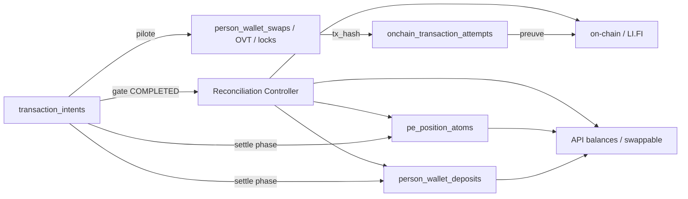

# ADR 001 — Intent as Orchestrator

| Champ | Valeur |
| --- | --- |
| **Statut** | Accepté |
| **Date** | 2026-06-07 |
| **Décideurs** | Équipe Arquantix / Vancelian |
| **Contexte** | Chantier architecture transactionnelle — évolution vers modèle fintech |
| **Remplace** | Doctrine Phase 7 « intent = observabilité uniquement » (`docs/arquantix/TRANSACTION_INTENTS_DEFI.md`) |
| **Lié à** | ADR 002 (Outbox), ADR 003 (Reconciliation Controller), ADR 004 (Ledger Authority) |

---

## 1. Problème actuel

Aujourd’hui, `transaction_intents` (Phase 7) est un **miroir d’observabilité** synchronisé en best-effort depuis les tables produit (`person_wallet_swaps`, `onchain_vault_transactions`, locks bundle, etc.).

```61:61:services/arquantix/api/services/transaction_intents/lifi_intent_sync.py
    """Upsert intent LI.FI — n'appelle jamais settlement ni balances."""
```

Cette séparation crée des dérives structurelles :

| Symptôme | Cause racine |
| --- | --- |
| Tx confirmée on-chain, ledger incomplet | Settlement synchrone dans le poll HTTP (`refresh_lifi_status`), pas de reprise garantie |
| Intent `reconciliation_required`, UI encore actionnable | Intent n’est pas gate ; statut produit et intent divergent sans blocage |
| Swaps / vaults / bundles / Lombard désynchronisés | Chaque produit écrit directement ledger + PE scopes via des chemins différents |
| Réconciliation après coup | Multiples reconcileurs (maintenance, tick DeFi, audit person) sans contrôleur final unifié |
| État intermédiaire incorrect en UI | `person_wallet_swaps.status=CONFIRMED` peut précéder ledger settled + PE cohérent |

**Écritures directes dangereuses identifiées :**

- LI.FI : `apply_swap_settlement()` dans le flux HTTP de poll
- Bundle : `fund_bundle_cash_leg_from_self_trading` + atoms PE avant confirm on-chain complet
- Vault / Lombard : `dual_write_vault_step` → PE scope en best-effort post-confirm Portal
- Cost basis : `ingest_lifi_swap_settlement` en try/except non bloquant

L’intent actuel **ne pilote rien** : il documente ce qui s’est passé (ou pas, si le sync échoue).

---

## 2. Décision

**Promouvoir `transaction_intents` en orchestrateur transactionnel progressif**, tout en conservant les tables produit existantes (`person_wallet_swaps`, OVT, locks bundle) comme **records d’exécution** liés à l’intent.

### Principes

1. **Toute action utilisateur crée d’abord un intent** (ou upsert idempotent si record produit préexistant).
2. **L’intent porte le cycle de vie canonique** — statuts, transitions, correlation_id, expires_at.
3. **Aucune écriture ledger / PE scope** ne se fait sans intent_id traçable.
4. **COMPLETED est interdit** sans passage par le Reconciliation Controller (ADR 003).
5. **Migration progressive** : dual-run sous feature flag par produit ; LI.FI standalone en premier (Phase 2 POC).

### Ce qui ne change pas immédiatement

- Tables ledger existantes (`person_wallet_deposits`, `pe_position_atoms`, `bundle_ledger_entries`)
- Idempotency keys ledger existantes (`lifi-swap:{swap_id}:debit`, etc.)
- Tables produit (`person_wallet_swaps`, etc.) — elles deviennent `linked_table` de l’intent, pas remplacées

---

## 3. Intent comme source de pilotage

### Rôle de chaque couche

| Couche | Rôle après ADR 001 | Source de vérité pour |
| --- | --- | --- |
| **transaction_intents** | Orchestrateur — cycle de vie, locks, gate COMPLETED | Statut métier final, blocage actions |
| **Tables produit** | Exécution provider (quote, tx_hash, audit_log) | Détails techniques swap/vault/bundle |
| **person_wallet_deposits / balances** | Ledger Privy | Mouvements comptables on-chain wallet |
| **pe_position_atoms** | Scopes PE internes | Allocation économique (trading, vault, bundle, collateral) |
| **onchain_transaction_attempts** | Canonicalisation tx_hash | Preuve exécution cross-produit |
| **transaction_trace_events** | Observabilité append-only | Timeline ops / debug |
| **UI / API balances** | Projection | Lecture dérivée — jamais autoritaire |

### Règle de cohérence finale

> **Une transaction n’est jamais `COMPLETED` tant que le Reconciliation Controller (ADR 003) n’a pas validé :**
>
> `on-chain / provider = ledger = PE scopes = UI balance`

Tant que cette égalité n’est pas prouvée, l’intent reste dans un état non-terminal (`PROCESSING`, `LEDGER_SETTLED`, `RECONCILIATION_REQUIRED`, etc.).

---

## 4. Statuts cibles

### Machine à états canonique

```
CREATED
  → VALIDATED
  → QUEUED
  → PROCESSING
  → PROVIDER_SUBMITTED
  → ONCHAIN_PENDING
  → ONCHAIN_CONFIRMED
  → LEDGER_SETTLED
  → RECONCILED
  → COMPLETED

Terminaux alternatifs :
  FAILED | EXPIRED | CANCELLED | RECONCILIATION_REQUIRED
```

### Mapping depuis l’existant (LI.FI — transition)

| Statut actuel (`IntentStatus` Phase 7) | Statut cible (orchestrateur) |
| --- | --- |
| `created` | `CREATED` |
| `awaiting_signature` | `VALIDATED` ou `PROCESSING` (selon phase) |
| `submitted` / `confirming` | `PROVIDER_SUBMITTED` / `ONCHAIN_PENDING` |
| `confirmed` | `ONCHAIN_CONFIRMED` → `LEDGER_SETTLED` → `RECONCILED` → `COMPLETED` |
| `partial` | `ONCHAIN_CONFIRMED` (settlement partiel en cours) |
| `reconciliation_required` | `RECONCILIATION_REQUIRED` |
| `failed` | `FAILED` |

Les statuts Phase 7 restent lisibles en metadata (`legacy_intent_status`) pendant la migration.

### Champs intent enrichis (cible)

| Champ | Obligatoire POC | Description |
| --- | --- | --- |
| `person_id` | Oui | Utilisateur |
| `wallet_id` / `wallet_address` | Oui | Wallet d’exécution |
| `product_type` | Oui | `lifi_swap`, `morpho_earn`, etc. |
| `requested_action` | Oui | `swap`, `vault_deposit`, `bundle_invest`, … |
| `assets_json` | Oui | `[{asset, amount, direction}]` |
| `idempotency_key` | Oui | Unique par `(person_id, product_type, operation_type, key)` |
| `correlation_id` | Oui | Trace cross-services (UUID) |
| `status` / `current_phase` | Oui | Phase machine à états |
| `created_at` / `expires_at` | Oui | TTL intent |
| `metadata_json` | Oui | Détails produit, lock_key, feature_flag_path |
| `linked_table` / `linked_id` | Oui | Lien record produit (`person_wallet_swaps`, etc.) |
| `tx_hash` | Optionnel | Rempli à PROVIDER_SUBMITTED |
| `reconciliation_report_json` | Phase 3 | Dernier rapport controller |
| `blocked_assets_json` | Phase 3 | Assets bloqués si RECONCILIATION_REQUIRED |

---

## 5. Transitions obligatoires

Chaque transition est **persistée** dans `transaction_intent_transitions` (append-only) :

```
intent_id, from_status, to_status, phase, actor, metadata_json, created_at
```

### Transitions et acteurs

| Transition | Acteur | Préconditions |
| --- | --- | --- |
| CREATED → VALIDATED | API ou Worker | Balance suffisante, pas de lock conflict, produit actif |
| VALIDATED → QUEUED | Worker | Outbox event `intent.created` traité (ADR 002) |
| QUEUED → PROCESSING | Worker | Lock acquis sur lock_key |
| PROCESSING → PROVIDER_SUBMITTED | API (submit) ou Worker | tx_hash persisté |
| PROVIDER_SUBMITTED → ONCHAIN_PENDING | Worker | Poll provider démarré |
| ONCHAIN_PENDING → ONCHAIN_CONFIRMED | Worker | Provider/RPC status final = success |
| ONCHAIN_CONFIRMED → LEDGER_SETTLED | Worker | `settle_transaction_intent_idempotently` OK |
| LEDGER_SETTLED → RECONCILED | Worker | `run_final_reconciliation` OK |
| RECONCILED → COMPLETED | Worker | Rapport checksum validé |
| * → RECONCILIATION_REQUIRED | Controller | Écart détecté (ADR 003) |
| * → FAILED | Worker / API | Erreur irrécupérable provider |
| * → EXPIRED | Worker TTL | `expires_at` dépassé, pas de tx_hash |
| * → CANCELLED | API / User | Abandon explicite avant PROVIDER_SUBMITTED |

### Interdictions

- **Saut de phase** : pas de CREATED → LEDGER_SETTLED sans ONCHAIN_CONFIRMED
- **COMPLETED sans RECONCILED** : interdit
- **Écriture ledger hors LEDGER_SETTLED** : interdit en mode orchestrateur (feature flag ON)
- **Transition silencieuse** : toute transition sans INSERT `transaction_intent_transitions` = bug

---

## 5bis. Moteur transactionnel — locks + balance snapshot (S4)

> **Risque #1 à l’échelle** (5k users, 50k intents/jour, multi-produits sur même USDC) : concurrence sur le même solde — swap + vault + bundle quasi simultanés. Ce couple protège plus que la migration webhook (S6).

### Locks pessimistes (exclusifs)

Séquencement par `lock_key` (table `transaction_product_locks`) :

| Niveau | Clé | Exemple |
| --- | --- | --- |
| Person + wallet + asset | `person:{id}:wallet:{id}:asset:{symbol}` | Swap USDC pending |
| Scope produit | `…:scope:{trading_available\|vault\|bundle}` | Bundle invest |

Acquisition à `VALIDATED → PROCESSING` ; release à statut terminal ou TTL.

### Optimistic `available_balance_version` + `balance_snapshot_hash` (S4)

En complément des locks pessimistes — pas en remplacement — chaque intent capture à **`VALIDATED`** un snapshot immuable dans `metadata_json` :

```json
{
  "balance_snapshot": {
    "asset": "USDC",
    "available": "100.00",
    "version": 42,
    "hash": "sha256:person_id|wallet_id|asset|available|version|scopes_digest"
  }
}
```

| Champ | Rôle |
| --- | --- |
| `available_balance_version` | Entier monotone par `(person, wallet, asset)` |
| `available` | Montant lu au même instant (même source que Portfolio Breakdown) |
| `balance_snapshot_hash` | Hash du snapshot — détecte toute dérive entre VALIDATED et PROCESSING |

**Re-vérification obligatoire** juste avant transition `VALIDATED → PROCESSING` :

1. Relire version + available depuis la même projection
2. Recalculer hash
3. Si `version` ou `hash` différent → **`BALANCE_CHANGED`**
   - Retour `VALIDATED` (retry) ou `FAILED` selon politique produit
   - Réponse API : `BALANCE_VERSION_MISMATCH` / `BALANCE_CHANGED` (409)
   - **Aucune** écriture ledger

**Cas d’usage** : USDC = 100, version = 42 — swap, vault et bundle demandent 100 quasi simultanément ; lock pessimiste + snapshot optimiste : le premier passe en PROCESSING, les autres reçoivent `BALANCE_CHANGED` même si une course rare contourne le lock.

Modèle proche des plateformes de courtage / banques : **lock pessimiste + version optimiste**.

---

## 6. Lien intent ↔ ledger ↔ PE ↔ on-chain ↔ UI



### Settlement unifié (interface cible)

```
settle_transaction_intent_idempotently(db, intent_id) -> SettlementResult
```

- Appelé **uniquement** en phase `ONCHAIN_CONFIRMED → LEDGER_SETTLED`
- Route vers implémentation produit (`settle_lifi_swap_idempotently` pour `lifi_swap`)
- Écrit : ledger Privy + cost basis + trace events
- Idempotent : safe à relancer
- **N’écrit pas PE scopes** pour LI.FI standalone (direct available = ledger Privy) ; bundle/vault/Lombard en phases ultérieures

### UI / API

- Statut affiché côté client = **intent.current_phase** (pas `person_wallet_swaps.status` seul)
- `pending_settlement > 0` tant que intent ∉ {COMPLETED, FAILED, EXPIRED, CANCELLED}
- `swappable_balance` recalculé depuis ledger + locks intent actifs

---

## 7. Migration depuis Phase 7

### Stratégie dual-run

| Mode | Comportement |
| --- | --- |
| `LIFI_INTENT_ORCHESTRATOR_ENABLED=false` (défaut prod initial) | Flux actuel inchangé ; intent reste miroir via `lifi_intent_sync` |
| `LIFI_INTENT_ORCHESTRATOR_ENABLED=true` | Intent orchestre ; outbox + worker ; settlement via worker ; gate COMPLETED |

### Intents techniques (sans action utilisateur préalable)

Certains événements externes créent un intent **automatiquement** — pas une exception au pipeline, mais un `product_type` dédié :

| product_type | Source | Note |
| --- | --- | --- |
| `observed_external_deposit` | Webhook Privy inbound | Intent technique ; voir ADR 004 §6 |
| `privy_deposit` | Parcours webapp (futur) | Initié utilisateur — distinct du webhook |

### Ordre de généralisation (roadmap plateforme validée)

| # | Milestone | Contenu |
| --- | --- | --- |
| 1 | S1 | Outbox — migrations + atomicité |
| 2 | S2 | LI.FI intent orchestrator + worker |
| 3 | S3 | Reconciliation Controller |
| 4 | **S4** | **Product Locks** — concurrence swap + vault + bundle (même asset) |
| 5 | S5 | Staging dual-run |
| 6 | S6 | Webhook Privy `observed_external_deposit` (ADR 004 §6) |
| 7 | Post-POC | Bundle intents |
| 8 | Post-POC | Vault intents |
| 9 | Post-POC | Lombard intents |

**Priorité S4** : à l’échelle, le risque principal n’est pas le dépôt webhook mais l’usage concurrent du même solde (ex. USDC swap + vault deposit + bundle invest quasi simultanés).

### Rétrocompatibilité

- `lifi_intent_sync` reste actif en mode legacy ; désactivé progressivement quand orchestrateur prend le relais
- Admin `/admin/onchain-reconciliation/intents` lit les deux modes via `current_phase`
- Tests existants `test_lifi_swap_reconciliation.py` restent valides (settlement idempotent réutilisé)

---

## 8. Conséquences

### Positives

- Source de vérité unique pour le statut métier
- Reprise après crash garantie (intent + outbox + transitions)
- Blocage actions cohérent avec l’état réel
- Audit trail complet par intent

### Négatives / coûts

- Complexité dual-run temporaire (deux chemins LI.FI)
- Enrichissement schéma `transaction_intents` + nouvelle table transitions
- Refactoring progressif de tous les produits (plusieurs mois)

### Risques mitigés

| Risque | Mitigation |
| --- | --- |
| Régression prod | Feature flag + dual-run ; rollback = flag OFF |
| Intent et swap désynchronisés | `linked_id` obligatoire ; reconciliation controller vérifie le lien |
| Équipe perdue dans les statuts | Mapping legacy documenté ; timeline admin |

---

## 9. Critères d’acceptation ADR 001

- [ ] Doctrine Phase 7 mise à jour avec renvoi vers cet ADR
- [ ] Schéma `transaction_intent_transitions` spécifié (migration Alembic Phase 2)
- [ ] Feature flag `LIFI_INTENT_ORCHESTRATOR_ENABLED` documenté
- [ ] POC LI.FI standalone validé en staging avec orchestrateur ON
- [ ] Aucun intent COMPLETED sans rapport reconciliation (ADR 003)
