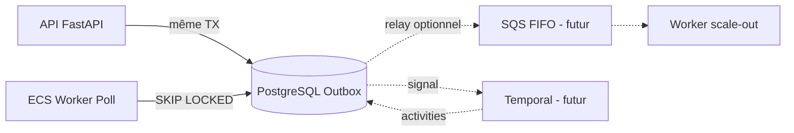

# ADR 002 — PostgreSQL Outbox as Canonical Queue

| Champ | Valeur |
| --- | --- |
| **Statut** | Accepté |
| **Date** | 2026-06-07 |
| **Décideurs** | Équipe Arquantix / Vancelian |
| **Contexte** | Chantier architecture transactionnelle — file d’attente officielle |
| **Lié à** | ADR 001 (Intent Orchestrator), ADR 003 (Reconciliation Controller) |

---

## 1. Problème actuel

Vancelian n’a **pas de file d’attente transactionnelle** :

| Existe | Manque |
| --- | --- |
| Tick DeFi cron/ECS (`defi_observability_tick.py`) | Pattern outbox (`transaction_outbox`) |
| `pg_try_advisory_lock` (verrou global tick) | Workers dédiés par intent |
| `defi_observability_job_runs` (audit jobs) | Retry structuré avec backoff |
| Scripts ECS one-shot | Dead-letter queue |
| Redis (auth, cache, rate-limit) | Garantie ACID intent + event |

Les traitements async actuels sont **best-effort** :

- Settlement LI.FI synchrone dans le poll HTTP
- Sync intent : échec = warning, flux inchangé
- `swap_session_maintenance` : réparation après coup (~10 min pour SUBMITTED bloqué)
- Pas de reprise garantie après crash worker entre `tx_hash` persisté et settlement

---

## 2. Décision

**Adopter le pattern Transactional Outbox sur PostgreSQL** comme première file d’attente officielle de Vancelian.

L’intent et l’événement outbox sont créés dans **la même transaction DB**. Un worker poll `transaction_outbox` avec `FOR UPDATE SKIP LOCKED`, traite l’événement, et ne marque `processed` qu’après succès.

---

## 3. Alternatives évaluées

### Redis Streams

| Avantage | Inconvénient |
| --- | --- |
| Débit élevé, latence faible | Pas de garantie ACID avec l’intent (dual-write séparé) |
| Déjà présent (auth/cache) | PEL / consumer groups = complexité ops supplémentaire |
| | Redis n’est pas aujourd’hui la source de vérité métier |

**Verdict** : rejeter comme queue primaire. Redis pourra servir en Phase 4+ comme **cache de locks actifs** (lecture rapide middleware), Postgres restant autoritaire.

### AWS SQS FIFO

| Avantage | Inconvénient |
| --- | --- |
| FIFO natif par MessageGroupId | Nécessite dual-write intent (Postgres) + message (SQS) sans atomicité |
| Scalabilité AWS | Nouvelle dépendance infra, monitoring, coût par message |
| | MessageGroupId ≠ lock métier Vancelian sans couche supplémentaire |

**Verdict** : rejeter pour Phase 2. **Compatibilité future** : un relay worker peut publier vers SQS depuis l’outbox Postgres (outbox = source of truth, SQS = transport).

### Temporal.io

| Avantage | Inconvénient |
| --- | --- |
| Workflows longs, sagas, compensation | Cluster dédié, courbe d’apprentissage |
| Idéal pour Lombard multi-step / bundle batch | Surdimensionné pour LI.FI swap (minutes, pas jours) |
| | Coût ops significatif |

**Verdict** : rejeter pour Phase 2-4. **Compatibilité future** : Temporal peut orchestrer des workflows multi-jours (Lombard, bundle) en lisant/écrivant toujours l’outbox Postgres comme journal d’événements.

### Celery / RQ

| Avantage | Inconvénient |
| --- | --- |
| Écosystème Python mature | Broker supplémentaire (Redis/RabbitMQ) |
| | Pas de garantie ACID intent + task enqueue |

**Verdict** : rejeter. L’outbox Postgres remplace le besoin d’un broker dédié pour le volume actuel Vancelian.

### PostgreSQL Outbox (choix)

| Avantage | Inconvénient |
| --- | --- |
| **ACID natif** : intent + event dans la même TX | Polling (latence ~1-5s selon intervalle worker) |
| Infra existante (FastAPI + Postgres + ECS) | Charge DB si volume très élevé (mitigable par index + batch) |
| SQL direct pour debug / admin / audit | Pas de ordering global strict sans lock_key (géré par ADR 001 locks) |
| `FOR UPDATE SKIP LOCKED` = concurrence safe | |
| Cohérent avec `pg_try_advisory_lock` déjà utilisé | |

**Verdict** : **accepté** comme queue canonique Phase 2+.

---

## 4. Schéma `transaction_outbox`

### Table

| Colonne | Type | Notes |
| --- | --- | --- |
| `id` | UUID PK | |
| `intent_id` | UUID FK → `transaction_intents.id` | |
| `event_type` | VARCHAR(64) | Voir catalogue ci-dessous |
| `payload_json` | JSONB | Données worker (swap_id, tx_hash, phase, etc.) |
| `status` | VARCHAR(32) | `pending` \| `processing` \| `processed` \| `dead_letter` |
| `attempt_count` | INTEGER DEFAULT 0 | |
| `max_attempts` | INTEGER DEFAULT 10 | |
| `next_retry_at` | TIMESTAMPTZ | Backoff exponentiel |
| `locked_by` | VARCHAR(128) | Instance worker (hostname + pid) |
| `locked_at` | TIMESTAMPTZ | |
| `last_error` | TEXT | Dernière erreur |
| `processed_at` | TIMESTAMPTZ | |
| `created_at` | TIMESTAMPTZ | |
| `correlation_id` | UUID | Copie depuis intent pour trace |

### Index

```sql
CREATE INDEX ix_outbox_poll
  ON transaction_outbox (status, next_retry_at)
  WHERE status IN ('pending', 'processing');

CREATE INDEX ix_outbox_intent
  ON transaction_outbox (intent_id, created_at);
```

### Catalogue `event_type` (Phase 2 LI.FI)

| event_type | Déclencheur | Action worker |
| --- | --- | --- |
| `intent.created` | POST /swaps/quote (TX) | VALIDATED → QUEUED ; acquire lock |
| `intent.provider_submitted` | POST /swaps/{id}/submit (TX) | Poll LI.FI / RPC |
| `intent.settle` | Worker après ONCHAIN_CONFIRMED | `settle_transaction_intent_idempotently` |
| `intent.reconcile` | Worker après LEDGER_SETTLED | `run_final_reconciliation` (ADR 003) |

Phase ultérieure : `intent.expired`, `intent.cancelled`, `intent.retry`.

**Phase 2b (webhook Privy)** : `deposit.observed` — voir ADR 004 §6 et ticket Phase 2b.

---

## 5. Pattern d’écriture (même transaction)

```python
# Pseudo-code — pas d’implémentation Phase 2
with db.begin():
    intent = create_or_upsert_intent(...)
    swap = create_person_wallet_swap(..., intent_id=intent.id)
    outbox = TransactionOutbox(
        intent_id=intent.id,
        event_type="intent.created",
        payload_json={"swap_id": str(swap.id)},
        status="pending",
        next_retry_at=now(),
        correlation_id=intent.correlation_id,
    )
    db.add(outbox)
    # commit atomique
```

**Règle** : aucun hook best-effort post-commit pour les événements critiques. Si l’outbox n’est pas écrit, l’intent n’existe pas côté orchestrateur.

---

## 6. Worker — poll et traitement

### Mécanisme

```sql
SELECT id FROM transaction_outbox
 WHERE status = 'pending'
   AND next_retry_at <= NOW()
 ORDER BY created_at
 LIMIT :batch_size
 FOR UPDATE SKIP LOCKED;
```

1. Worker acquiert un batch (défaut : 20 événements)
2. Marque `status=processing`, `locked_by`, `locked_at`
3. Exécute le handler selon `event_type`
4. Succès → `status=processed`, `processed_at=NOW()`
5. Échec → `attempt_count++`, calcule `next_retry_at`, `status=pending`
6. `attempt_count >= max_attempts` → `status=dead_letter`

### Déploiement worker (ECS)

| Option | Phase | Description |
| --- | --- | --- |
| **A — Extension tick DeFi** | 2a (POC) | Ajouter step `process_transaction_outbox` dans `defi_observability_tick` |
| **B — Script ECS dédié** | 2b (prod) | `scripts/arquantix-ecs-transaction-intent-worker.sh` — poll continu ou cron 30s |
| **C — Process sidecar** | 4+ | Worker dédié à côté de l’API si latence insuffisante |

**Recommandation POC** : Option A (tick existant) pour minimiser l’infra ; migrer vers B dès validation staging.

### Concurrence

- Plusieurs workers possibles grâce à `SKIP LOCKED`
- **Séquencement par asset/user** : géré par `transaction_product_locks` (ADR 001, Phase 4) — l’outbox ne garantit pas l’ordre global, le lock garantit l’exclusivité métier
- Un intent ne doit pas avoir deux events `processing` simultanés : vérification `intent.current_phase` avant traitement

---

## 7. Retry et backoff

| Paramètre | Valeur |
| --- | --- |
| `max_attempts` | 10 |
| Backoff | 5s → 30s → 2m → 10m → 30m → 1h (cap) |
| Erreurs retryables | Timeout LI.FI, RPC indisponible, deadlock DB, settlement race |
| Erreurs non-retryables | Intent introuvable, swap FAILED définitif, validation métier KO → transition FAILED immédiate |

### Idempotence worker

- Re-traiter un event `intent.settle` sur intent déjà `LEDGER_SETTLED` = noop (transition déjà faite)
- `settle_transaction_intent_idempotently` est safe à relancer (clés ledger existantes)

---

## 8. Dead-letter

| Condition | Action |
| --- | --- |
| `attempt_count >= max_attempts` | `status=dead_letter` |
| Intent bloqué | Intent → `RECONCILIATION_REQUIRED` ou reste en phase actuelle |
| Alerte ops | Log structuré + métrique + notification (Slack/PagerDuty — config existante) |
| Reprise manuelle | Admin endpoint `POST /admin/transaction-outbox/{id}/requeue` (Phase 3) |

**Règle** : un event dead-letter ne signifie pas COMPLETED. L’intent reste non-terminal jusqu’à intervention ou re-drive.

---

## 9. Observabilité outbox

- Métriques : `outbox_pending_count`, `outbox_dead_letter_count`, `outbox_processing_latency_p99`
- `defi_observability_job_runs` : enrichir avec stats outbox par tick
- Admin : liste events par `intent_id` (intégré dans timeline ADR 001)
- Correlation : `correlation_id` propagé intent → outbox → trace events

---

## 10. Compatibilité future SQS / Temporal



**Principe** : Postgres outbox reste le **journal autoritaire**. SQS et Temporal sont des **transports/orchestrateurs optionnels** qui ne remplacent jamais la source de vérité.

---

## 11. Conséquences

### Positives

- Fin des best-effort silencieux pour le pipeline intent
- Reprise crash garantie (events `pending` re-pollés)
- Audit trail SQL natif
- Zéro nouvelle infra Phase 2

### Négatives

- Latence traitement = intervalle poll (30s tick actuel)
- Charge DB supplémentaire (négligeable au volume actuel)

### Ce qu’on ne fait pas en Phase 2

- Pas de Redis Streams comme source of truth
- Pas de SQS
- Pas de Temporal
- Pas de Celery

---

## 12. Critères d’acceptation ADR 002

- [ ] Migration Alembic `transaction_outbox` déployée (additive)
- [ ] Création intent LI.FI + outbox `intent.created` en même TX
- [ ] Worker poll fonctionnel (tick ou ECS dédié)
- [ ] Retry + dead-letter testés en CI
- [ ] Rollback = feature flag OFF, outbox ignorée, flux legacy intact
