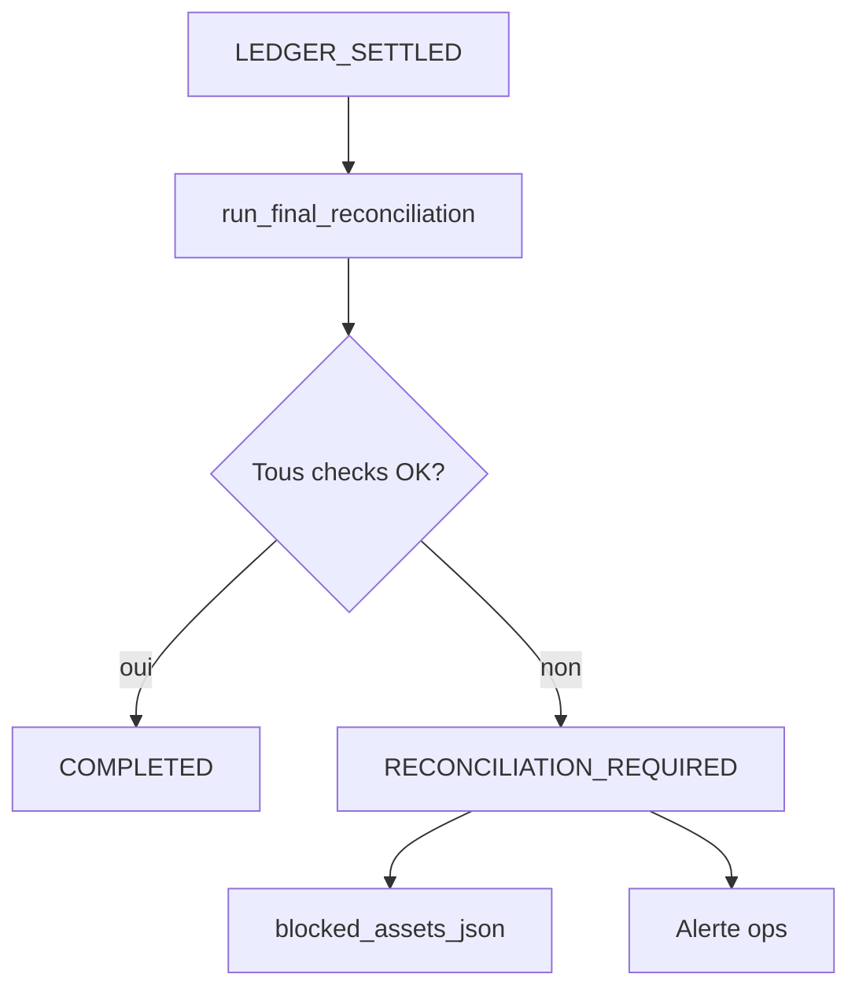

# ADR 003 — Final Reconciliation Controller

| Champ | Valeur |
| --- | --- |
| **Statut** | Accepté |
| **Date** | 2026-06-07 |
| **Décideurs** | Équipe Arquantix / Vancelian |
| **Contexte** | Chantier architecture transactionnelle — gate obligatoire avant COMPLETED |
| **Lié à** | ADR 001 (Intent Orchestrator), ADR 002 (Outbox) |

---

## 1. Problème actuel

La réconciliation Vancelian est **fragmentée et non bloquante** :

| Couche existante | Fichier | Limite |
| --- | --- | --- |
| LI.FI swap repair | `lifi_swap_reconciliation.py` | Pas d’endpoint HTTP ; appelé par maintenance cron |
| Swap maintenance | `swap_session_maintenance.py` | Réparation ~10 min après incident |
| Intent gaps | `transaction_intent_reconciliation.py` | Read-only, pas de blocage utilisateur |
| Person crypto audit | `person_crypto_reconciliation.py` | Recommande actions, pas gate |
| Privy wallet | `privy_wallet/reconciliation_service.py` | Couche admin séparée |
| PE hardening | `portfolio_engine/hardening/reconciliation/` | Institutionnel, pas par intent |
| Bundle read model | `bundle_reconciliation_read_model.py` | Batch partiel uniquement |
| Portal (vault/Lombard) | `morphoVaultReconciliation.ts`, `lombardReconciliation.ts` | Côté Next.js, pas unifié |

**Conséquence** : un swap peut être `CONFIRMED` (table produit) ou `confirmed` (intent miroir) alors que :

- le ledger n’a qu’une jambe (crédit webhook sans débit swap),
- les PE scopes sont incohérents (bundle/vault/Lombard),
- l’UI affiche un `swappable_balance` faux.

Aujourd’hui, `reconciliation_required` sur l’intent **n’empêche pas** une nouvelle action utilisateur sur le même asset.

---

## 2. Décision

**Instaurer un Final Reconciliation Controller obligatoire** invoqué par le worker (outbox event `intent.reconcile`) avant toute transition vers `COMPLETED`.

### Règle fondamentale

> **Une transaction n’est jamais `COMPLETED` tant que le controller n’a pas validé la cohérence quadri-couche :**
>
> `provider/on-chain = ledger = PE scopes = UI projection`

Si une incohérence est détectée :

- Intent → `RECONCILIATION_REQUIRED`
- Rapport persisté dans `reconciliation_report_json`
- Assets concernés ajoutés à `blocked_assets_json`
- **Actions sensibles bloquées** sur ces assets jusqu’à résolution

---

## 3. Interface cible

```python
# Pseudo-code — Phase 3 (POC Phase 2 : version LI.FI simplifiée)
def run_final_reconciliation(
    db: Session,
    intent_id: UUID,
    *,
    dry_run: bool = False,
) -> ReconciliationReport:
    ...
```

### `ReconciliationReport`

| Champ | Type | Description |
| --- | --- | --- |
| `intent_id` | UUID | |
| `passed` | bool | True seulement si tous les checks OK |
| `checks` | list[CheckResult] | Détail par domaine |
| `checksum` | string | Hash des balances vérifiées (audit) |
| `blocked_assets` | list[str] | Assets à bloquer si `passed=false` |
| `recommended_action` | string | ex. `settle_lifi_swap_idempotently`, `manual_review` |
| `created_at` | datetime | |

Chaque `CheckResult` : `{domain, check_name, passed, expected, actual, severity}`.

---

## 4. Contrôles par domaine

### A. Provider / On-chain

**Source** : `onchain_transaction_attempts`, `person_wallet_swaps.audit_log`, LI.FI `get_status`, RPC receipt (Base).

| Check | LI.FI standalone | Vault / Lombard (Phase 3+) |
| --- | --- | --- |
| `provider_status_final` | LI.FI status = DONE, substatus complet | OVT status = success |
| `tx_confirmed` | Receipt success, block confirmé | idem |
| `tx_hash_matches` | attempt.tx_hash = swap.tx_hash = intent.tx_hash | idem |
| `amounts_correct` | `resolve_lifi_actual_receive_amount` ± tolérance | Montant OVT vs on-chain |
| `asset_correct` | from_asset / to_asset cohérents quote → settlement | Token vault / collateral |
| `wallet_correct` | signing wallet = intent.wallet_address | idem |
| `deposit_onchain_proof` | Receipt + montant (Phase 2b) | `observed_external_deposit` |
| `deposit_wallet_ownership` | Wallet ∈ person_id (Phase 2b) | idem |
| `no_swap_double_credit` | Pas crédit webhook + jambe swap (Phase 2b) | swap + webhook même tx_hash |

**Réutilisation existante** :

- `lifi_swap_reconciliation.detect_swap_ledger_legs`
- `person_crypto_reconciliation` (submitted_confirmed_onchain, confirmed_incomplete_settlement)
- `lombardReconciliation.ts` / `morphoVaultReconciliation.ts` (à porter côté Python en Phase 3)

### B. Ledger

**Source** : `person_wallet_deposits`, `person_wallet_balances`, idempotency keys.

| Check | Assertion |
| --- | --- |
| `ledger_debit_present` | Jambe débit `lifi-swap:{id}:debit` existe |
| `ledger_credit_present` | Jambe crédit `lifi-swap:{id}:credit` existe |
| `ledger_no_duplicate` | Une seule jambe par clé idempotence |
| `ledger_amounts_match` | Débit = montant source ; crédit = montant réel reçu |
| `ledger_balances_consistent` | `increment_balance` cohérent avec somme deposits |
| `cost_basis_present` | `cost_basis_executions` pour le swap (warning si absent, blocking en Phase 3+) |

**Réutilisation** : `settle_lifi_swap_idempotently` (dry_run) pour détecter les jambes manquantes avant apply.

### C. PE scopes

**Source** : `pe_position_atoms`, `internal_scope_movements/compare.py`.

| Check | Produit | Assertion |
| --- | --- | --- |
| `pe_direct_available` | LI.FI standalone | `trading_available` reflète ledger Privy post-swap |
| `pe_vault_position` | Vault | `vault_position` = OVT success attendu |
| `pe_bundle_scope` | Bundle | `bundle_cash` + `bundle_position` cohérents avec legs |
| `pe_collateral_locked` | Lombard | `trading_locked_collateral` = collateral on-chain |
| `pe_debt` | Lombard | `liability` / metadata `lombard_liability_usdc` cohérent |
| `pe_no_double_count` | Tous | Pas de legacy scope sans PE (`vault_legacy_without_pe_scope`) |

**POC Phase 2 LI.FI** : checks PE limités à `pe_direct_available` (pas de scope move sur swap direct standalone). Checks bundle/vault/Lombard activés en Phase 3.

### D. UI / API projection

**Source** : endpoints balances, `portfolio_breakdown.py`, `swappable_balance` logic.

| Check | Assertion |
| --- | --- |
| `ui_available_correct` | `available` API = ledger − locks − pending |
| `ui_swappable_correct` | `swappable_balance` tient compte des intents non-terminaux sur l’asset |
| `ui_pending_settlement_zero` | Si intent → COMPLETED, aucun pending settlement sur les assets de l’intent |
| `ui_no_phantom_balance` | Pas de crédit UI sans jambe ledger correspondante |

**POC Phase 2** : vérification via recalcul serveur (pas de dépendance client).

### E. Dépôt externe observé (`observed_external_deposit` — Phase 2b)

Voir ADR 004 §6. Checks additionnels :

| Check | Assertion |
| --- | --- |
| `ledger_credit_unique` | Une jambe crédit pour clé idempotence webhook |
| `ui_balance_updated` | Balance API = ledger post-COMPLETED |
| `out_of_scope_no_ledger` | Si `OUT_OF_SCOPE` : aucune écriture Tier 1 |
| `linked_swap_consistency` | Si rattaché swap LI.FI : jambe crédit via settlement swap, pas standalone |

---

## 5. Transitions après controller



| Résultat | Transition intent | Outbox | Actions |
| --- | --- | --- | --- |
| `passed=true` | `RECONCILED → COMPLETED` | Event traité `processed` | Release lock (Phase 4) |
| `passed=false`, réparable auto | Reste `LEDGER_SETTLED` ou `ONCHAIN_CONFIRMED` | Re-enqueue `intent.settle` ou `intent.reconcile` | Retry avec backoff |
| `passed=false`, non réparable | `RECONCILIATION_REQUIRED` | Event `processed` (pas de retry infini) | Blocage assets + alerte |
| `passed=false`, critical | `RECONCILIATION_REQUIRED` | dead-letter si settle impossible | Intervention manuelle |

### Auto-repair (limité)

Avant de passer en `RECONCILIATION_REQUIRED`, le controller peut tenter **une** réparation idempotente :

1. Appeler `settle_lifi_swap_idempotently(dry_run=False)` si jambes ledger incomplètes
2. Re-run checks
3. Si toujours KO → `RECONCILIATION_REQUIRED`

Cela remplace le rôle de `swap_session_maintenance.reconcile_partial_settlements` pour le chemin orchestrateur.

---

## 6. Blocage des actions sensibles

### Middleware API (Phase 3 — spécifié dès ADR, implémenté après POC settle)

Avant d’accepter une action sensible, vérifier :

```sql
SELECT 1 FROM transaction_intents
 WHERE person_id = :person_id
   AND status = 'reconciliation_required'
   AND blocked_assets_json ? :asset
 LIMIT 1;
```

### Actions bloquées (par asset affecté)

| Action | Endpoint / flow |
| --- | --- |
| Nouveau swap LI.FI | `POST /api/swaps/quote` (from ou to asset bloqué) |
| Vault deposit / withdraw | Portal morpho/ledgity prepare |
| Bundle invest / withdraw | `POST /api/app/bundle/invest`, withdraw |
| Lombard borrow / repay | Portal lombard prepare |

### Actions NON bloquées

- Lecture balances (avec indicateur `reconciliation_hold`)
- Consultation timeline admin
- Abandon intent non-terminal (si pas de tx_hash)
- Appels admin requeue / manual reconcile

### POC Phase 2

- Blocage **log-only** (warning structuré) sous flag `LIFI_RECONCILIATION_BLOCK_ENABLED=false`
- Blocage **effectif** activé en staging puis prod

---

## 7. Rapport et checksum

### `reconciliation_report_json` (persisté sur intent)

```json
{
  "passed": false,
  "checksum": "sha256:…",
  "checks": [
    {"domain": "ledger", "check_name": "ledger_debit_present", "passed": false, "expected": "debit leg", "actual": null}
  ],
  "blocked_assets": ["ETH"],
  "recommended_action": "settle_lifi_swap_idempotently",
  "controller_version": "1.0.0-lifi",
  "created_at": "2026-06-07T12:00:00Z"
}
```

### Checksum

Hash SHA-256 de :

```
intent_id | tx_hash | ledger_debit_amount | ledger_credit_amount | available_balance | swappable_balance
```

Permet de détecter toute dérive post-COMPLETED (audit périodique).

---

## 8. Endpoint admin timeline

```
GET /admin/transaction-intents/{id}/timeline
```

Agrège (lecture seule) :

| Source | Contenu |
| --- | --- |
| `transaction_intent_transitions` | Machine à états |
| `transaction_outbox` | Events, attempts, errors |
| `transaction_trace_events` | Trace append-only |
| `onchain_transaction_attempts` | tx_hash, status |
| `reconciliation_report_json` | Dernier rapport controller |
| `person_wallet_swaps.audit_log` | Événements produit LI.FI |

**Phase** : endpoint livré en Phase 3 ; POC Phase 2 peut exposer une version minimale interne (JSON debug).

---

## 9. Relation avec réconciliation existante

| Existant | Devenir |
| --- | --- |
| `swap_session_maintenance` | Reste actif en mode legacy (flag OFF) ; déprécié pour chemin orchestrateur |
| `transaction_intent_reconciliation.scan_intent_gaps` | Complément audit batch (pas gate) |
| `person_crypto_reconciliation` | Source de checks réutilisée dans controller |
| `lifi_swap_reconciliation` | Moteur auto-repair du controller |
| Admin on-chain reconciliation | Vue ops sur discrepancies ; ne remplace pas le controller per-intent |

**Principe** : le controller per-intent est le **gate** ; les reconcileurs batch restent le **filet ops** pour intents legacy et anomalies historiques.

---

## 10. Tests obligatoires (CI)

| # | Scénario | Résultat attendu |
| --- | --- | --- |
| 1 | Tous checks OK | `COMPLETED`, `passed=true` |
| 2 | Crédit sans débit | Auto-repair settle → `COMPLETED` ou `RECONCILIATION_REQUIRED` |
| 3 | Tx confirmée, ledger vide, settle échoue | `RECONCILIATION_REQUIRED`, asset bloqué |
| 4 | Double run controller sur intent COMPLETED | Noop, pas de régression |
| 5 | Intent legacy (miroir) flag OFF | Controller non invoqué ; comportement actuel |
| 6 | `pending_settlement > 0` après COMPLETED | Test échoue (régression) |
| 7 | Checksum stable sur re-run sans changement | Même hash |

---

## 11. Conséquences

### Positives

- Fin de l’état « confirmé mais pas settled » visible en UI
- Blocage cohérent des actions sur assets incohérents
- Rapport structuré par intent (debug, support, compliance)
- Réutilisation du code reconciliation existant

### Négatives

- Latence supplémentaire avant COMPLETED (checks synchrones)
- Faux positifs possibles (tolérances RPC, arrondis) → nécessite tuning
- Migration progressive : deux comportements selon feature flag

### Risques mitigés

| Risque | Mitigation |
| --- | --- |
| Controller trop strict (bloque à tort) | Tolérances BPS ; log-only mode avant blocage effectif |
| Performance | Checks LI.FI = 1 swap, 1 person ; batch async pour audit historique |
| Divergence Portal/Python (vault) | Controller LI.FI only en POC ; vault en Phase 3 avec pont OVT |

---

## 12. Critères d’acceptation ADR 003

- [ ] `run_final_reconciliation` spécifié avec checks LI.FI (domaines A + B + D)
- [ ] Aucun intent `COMPLETED` sans `reconciliation_report_json.passed=true`
- [ ] `RECONCILIATION_REQUIRED` + `blocked_assets_json` testés
- [ ] Auto-repair via `settle_lifi_swap_idempotently` intégré
- [ ] Timeline admin spécifiée (livraison Phase 3)
- [ ] Middleware blocage activable par flag
