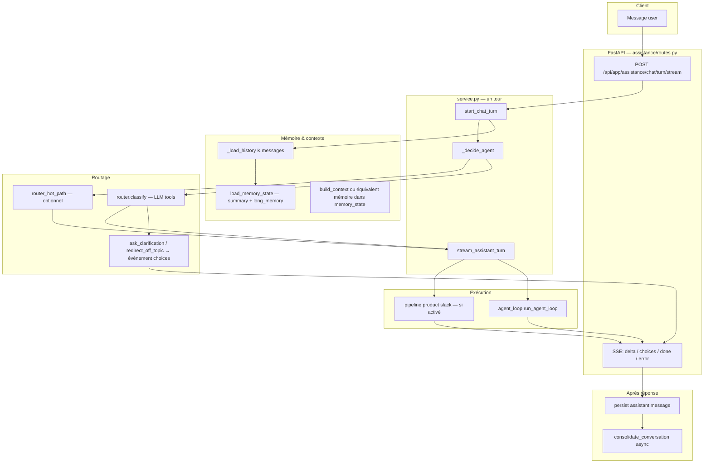

# Référence technique — Bot d’assistance Vancelian (bout en bout)

> **Objectif de ce document** : décrire **de façon opérationnelle et précise** le fonctionnement **complet** du bot d’assistance (API FastAPI `services/assistance`), du message utilisateur jusqu’à la réponse streamée, la persistance et la consolidation mémoire.  
> **Ce n’est pas** un remplacement des specs détaillées : elle sert de **carte unique** et renvoie vers les docs de profondeur.

**Dernière mise à jour :** 2026-05-07  
**Code racine :** `services/arquantix/api/services/assistance/`

---

## 0. Documents détaillés (lecture complémentaire)

| Sujet | Fichier |
|------|---------|
| Décisions d’architecture multi-agents, agents, UX | [`MULTI_AGENTS.md`](MULTI_AGENTS.md) |
| Runtime agentique (loop, tools, autonomie) | [`MULTI_AGENTS_RUNTIME.md`](MULTI_AGENTS_RUNTIME.md) |
| Router (niveaux, catalogue QCM, patterns) | [`ORCHESTRATOR.md`](ORCHESTRATOR.md) |
| État cognitif + objectif + framework de réponse | [`COGNITIVE_BOT.md`](COGNITIVE_BOT.md) |
| Rolling summary + faits + mémoire client | [`MEMORY.md`](MEMORY.md) |
| Agent product / wiki / pipeline | [`PRODUCT_AGENT.md`](PRODUCT_AGENT.md) |
| Discovery client (projets) | [`CLIENT_DISCOVERY.md`](CLIENT_DISCOVERY.md) |

---

## 1. Vue d’ensemble — les couches

À chaque message utilisateur, le système empile :

1. **Transport** : HTTP POST + **SSE** (Server-Sent Events) pour streamer les tokens et le `done`.  
2. **Orchestration de tour** : persistance du user → construction de l’`AgentInput` → **router** (ou raccourcis : hint QCM, hot-path, reprise de sujet).  
3. **État « meta »** (injecté en prompt) : **cognitive_state**, **objective**, **orchestration** (dimensions métier du router), **client_discovery**, **current_topic**, mémoire longue + résumé.  
4. **Agent expert** : boucle run-time (tools) ou **pipeline dédié** (ex. product « slack » avec garde-fous / judge).  
5. **Mémoire hors prompt** : fenêtre brute **K** messages + **résumé** + **faits** cross-conversation (après consolidation async).  
6. **Audit** : décisions router dans `assistance_agent_decisions`, messages dans `assistance_messages`.

---

## 2. Chaîne temporelle d’un tour (ordre réel)

Ordre **approximatif** tel qu’implémenté dans `service.py` (les étapes exactes sont dans `start_chat_turn` puis `stream_assistant_turn`) :

| # | Étape | Rôle |
|---|--------|------|
| 1 | Authentification / quota / résolution `client_id` | `routes.py` + deps habituelles. |
| 2 | `_persist_user_turn` | Insère le message **user**, commit ; obtient `turn_index`. |
| 3 | `load_memory_state` | Charge `conversation_summary`, `client_long_memory`, `summarized_until_turn`, etc. |
| 4 | `_load_history(conv_id, limit=K)` | **K** derniers messages DB (`ASSISTANCE_RECENT_TURNS_KEPT`, défaut **8 messages** = ~4 échanges si strictement alternés). |
| 5 | Construction `memory_state` | Inclut résumé, mémoire longue, **topic** courant, **client_discovery** (si person_id / projets), **compound** user (si message laconique — voir §9). |
| 6 | `compute_cognitive_state` (préliminaire) | Avant le router : émotion/stage approximatifs pour enrichir le **prompt router**. |
| 7 | `_decide_agent` | Kill-switch multi-agent → hints spéciaux (`resume_topic`, choix clarification) → **hot-path** (optionnel) → sinon **`router.classify`**. |
| 8 | Finalisation cognitive | Après décision : `compute_cognitive_state` **final** + `compute_objective` ; attache **orchestration** (si `route_to` l’a produite). |
| 9 | `_persist_router_decision` | Audit JSON dans `assistance_agent_decisions` (`tool_name=router_classify`). |
| 10 | `stream_assistant_turn` (session dédiée) | Choix du pipeline : QCM `choices` si router indécis/off-topic ; sinon **runtime** ou **product slack pipeline** ; stream deltas ; `done`. |
| 11 | Persistance message assistant | `_persist_assistant_message` avec `agent_used`, `message_type`, `message_payload`. |
| 12 | `_schedule_consolidation` | Tâche async : `memory.consolidate_conversation` si seuils atteints (tokens ou nombre de tours). |

---

## 3. Point d’entrée HTTP

- **Préfixe router** : `APIRouter(prefix="/api/app/assistance")` (`routes.py`).  
- **Streaming** : `POST /api/app/assistance/chat/turn/stream` — corps typé `ChatTurnRequest` (`user_message`, `conversation_id` optionnel, `agent_hint` pour QCM / deep-links).  
- Le client mobile consomme le flux SSE (souvent via un BFF Next.js selon déploiement — voir `MEMORY.md` pour le schéma habituel).

---

## 4. Décision d’agent (`_decide_agent`)

Fichier : `services/assistance/service.py`.

Priorité courte :

1. **`ASSISTANCE_MULTI_AGENT_ENABLED=false`** → agent `default` (rollback).  
2. **`agent_hint` réservés** : `resume_topic` (reprise sujet depuis dernier agent non-router en DB), options de **clarification** agent (`clarification_choice_continuity`).  
3. **`agent_hint` = id d’agent valide** (clic QCM) → routage direct vers cet agent.  
4. **Hot-path** (`router_hot_path.py`) : si activé, message user court, pas de hint, expert précédent dans le périmètre → **court-circuite le LLM router** avec une `RouterDecision` à confiance fixe (`hot_path_short_followup`). Garde-fous : longueur du message, sujet changé, **longueur du dernier assistant** (seuil env), demande de conseil personnalisé détectée, etc.  
5. Sinon **`router.classify(agent_input)`** — appel OpenAI avec **tools** (`route_to`, `ask_clarification`, `redirect_off_topic`).

### 4.1 Sortie `RouterDecision` (`agents/base.py`)

Champs notables : `agent_id`, `confidence`, `reasoning`, `fallback_choices`, `redirect_bridge`, `intent_classification` (tags keyword), **`cognitive_state`**, **`objective`**, **`orchestration`** (dimensions métier normalisées — voir `orchestration_context.py`).

### 4.2 Router LLM (`agents/router.py`)

- Messages : system `router_system.md` + blocs mémoire + **topic** + **intent tags** (keyword) + **cognitive préliminaire** + **client discovery** + **queue courte** d’historique (queue fixe **4** messages max pour le router, pas K entier).  
- **Tool `route_to`** : inclut désormais des paramètres **optionnels** d’**orchestration** (business_intent, urgence, data_need, style, intentions secondaires, drapeaux — normalisés côté serveur).  
- Seuil **`ASSISTANCE_ROUTER_CONFIDENCE_MIN`** : en dessous, le service émet un **QCM** (`choices`) plutôt que d’instancier l’agent direct (sauf chemins spéciaux off-topic / clarification).

---

## 5. Exécution côté agent (`stream_assistant_turn`)

Fichier : `service.py` — dispatche vers :

- **Événement `choices`** : prompt + options (+ freeform) si router indécis ou `redirect_off_topic`. Pas de loop LLM agent dans ce mode « pur ».  
- **`should_use_slack_pipeline` (product)** : `iter_product_slack_pipeline_events` — guardrail entrée, pass wiki, loop agent avec **juge sortie** optionnel.  
- **Sinon** : `get_agent(...).stream` ou **`_run_via_runtime`** → **`agent_loop.run_agent_loop`** (tools, itérations, audits).

### 5.1 Assemblage des messages LLM (`agent_loop._build_initial_messages`)

Ordre logique du **system** agrégé :

1. System prompt métier de l’agent (`load_agent_system_prompt`).  
2. Résumé conversation + dump JSON mémoire longue si présents dans `memory_state`.  
3. Blocs **cognitif + objectif + orchestration** (`_format_cognitive_blocks` + rendu orchestrateur).  
4. **Client discovery** (projets / paramètres flottants).  
5. Puis **historique** : tours récents ; le **dernier message user** peut être remplacé par le **compound turn** (phrase sémantique incluant le contexte de la bulle assistant précédente).

---

## 6. Mémoire : trois plans distincts

| Plan | Où | Contenu |
|------|-----|---------|
| **A. Fenêtre brute** | `_load_history` → `recent_turns` dans `AgentInput` | **K** lignes `assistance_messages` (défaut K=8 **messages**, pas « tours »). |
| **B. Résumé + faits de conversation** | `AssistanceConversation` (`conversation_summary`, facts…) | Alimenté par **consolidation** async. |
| **C. Mémoire longue client** | `pe_clients.assistance_long_memory` | Faits **cross-conversations** fusionnés. |

Paramètres importants (`memory.py`, env) :

- **`ASSISTANCE_RECENT_TURNS_KEPT`** — K messages bruts.  
- **`ASSISTANCE_SUMMARY_THRESHOLD_TOKENS`** — seuil consolidation (défaut 2500).  
- **`ASSISTANCE_SUMMARY_MIN_TURNS`** — déclencheur nb de tours (défaut 10 tours ⇒ ~20 messages).  

Voir le détail algorithmique dans [`MEMORY.md`](MEMORY.md).

### 6.1 Messages courts & « compound turn »

Module : `conversation_continuity.py`.

- Si le message est **laconique** (≤ **12** mots par défaut, `LACONIC_WORD_THRESHOLD`) et la feature est active, le système peut préfixer virtuellement le tour avec un extrait du **dernier assistant** (`build_previous_bot_context_block`).  
- **`enrich_recent_turns_for_llm_semantic_user`** substitue le dernier contenu **user** dans la copie vue par le LLM par cette formulation **composée** — pour que « oui », « le flexible », etc. restent interprétables.

---

## 7. Persistance & audit

| Donnée | Table / colonne |
|--------|------------------|
| Messages | `assistance_messages` (`role`, `content`, `agent_used`, `message_type`, `message_payload`) |
| Décision router + snapshot cognitive/objective/orchestration | `assistance_agent_decisions` (`arguments_json`, colonnes cognitives projetées — Lot 6) |
| Topic conversationnel | Slot DB lu via `conversation_topic` / `memory_state["current_topic"]` |
| Projets discovery | Tables dédiées (voir doc discovery) |

---

## 8. Événements SSE (contrat applicatif)

Émis par `stream_assistant_turn` vers le client (voir code pour la forme exacte) :

- **`delta`** : fragment texte assistant.  
- **`choices`** : QCM (clarification / off-topic).  
- **`thinking`** : phase intermédiaire (runtime).  
- **`error`** + message code.  
- **`done`** : clôture avec `message_id`, `agent_used`, métadonnées (embeds, judge product, métriques wiki, auto-QCM, etc.).

---

## 9. Variables d’environnement — panorama (non exhaustif)

Les valeurs par défaut sont dans le code / `config.py` / `memory.py` / `agents/config.py`.

| Variable | Domaine |
|----------|---------|
| `ASSISTANCE_MULTI_AGENT_ENABLED` | Active multi-agents + router. |
| `ASSISTANCE_AGENT_*_MODEL` | Modèle par agent. |
| `ASSISTANCE_RECENT_TURNS_KEPT` | Taille fenêtre brute (messages). |
| `ASSISTANCE_SUMMARY_THRESHOLD_TOKENS` / `ASSISTANCE_SUMMARY_MIN_TURNS` | Consolidation. |
| `ASSISTANCE_ROUTER_*` | Modèle routeur, température, seuil confiance, hot-path. |
| `ASSISTANCE_PRODUCT_SLACK_PIPELINE_ENABLED` | Pipeline product enrichi. |
| `ASSISTANCE_WIKI_*` | Retrieval wiki (dont LLM retriever). |
| **`ASSISTANCE_RUNTIME_LOOP_ENABLED`** | Boucle agentique **+ function calling** (catalogue `tools/registry.py`). **Défaut : activé (`true`).** Rollback legacy : **`false`**. Voir note ci-dessous. |
| **`ASSISTANCE_RUNTIME_LOOP_AGENTS`** | Liste CSV des agents qui passent par `run_agent_loop` ; défaut : `compliance`, `product`, `advisor`, `market`, `trust`. |

**Note (PR tool-runtime-default, 2026-05) — runtime / outillage dynamique**

- La boucle agentique OpenAI (**tools read compte / transactions / KYC / stats** côté `compliance.*`) est **on par défaut** ; ce n’est pas `conversation_state` ni l’observabilité qui exposent ou masquent les tools — c’est **ce flag** (et le chemin Phase 1 quand il est à `false`).
- **`ASSISTANCE_RUNTIME_LOOP_ENABLED=false`** : retour au **mode legacy Phase 1** (`get_agent(...).stream` sans tools registry ; compliance s’appuie sur les **stubs** `compliance_tools` dans le prompt).

La politique **`data_need_read_policy`** (`services/assistance/data_need_read_policy.py`) reste un **audit soft** (warning si `data_need` non satisfait par des lecture-tools) ; **pas** un blocage d’outils.

**Ne pas modifier** ces variables en production sans valider avec l’équipe — ce document est **descriptif**.

---

## 10. Cartographie des fichiers clés

| Fichier | Responsabilité |
|---------|----------------|
| `routes.py` | Endpoints, SSE, lancement `start_chat_turn` + `stream_assistant_turn`. |
| `service.py` | Cœur : persistance tour, router, cognitive/orchestration, streaming. |
| `memory.py` | `build_context`, consolidation, seuils tokens. |
| `agents/router.py` | Prompt routeur + tools + `classify`. |
| `agents/router_hot_path.py` | Shortcuts déterministes du router. |
| `agents/orchestration_context.py` | Normalisation dimensions orchestrateur. |
| `agents/cognitive_state.py` | État émotionnel / stage / trust. |
| `agents/conversation_objective.py` | Objectif déterministe du tour. |
| `agents/conversation_continuity.py` | Compound turn, listings, auto-QCM. |
| `agents/runtime/agent_loop.py` | Boucle LLM + tools + injection prompts. |
| `agents/runtime/product_slack_pipeline.py` | Pipeline product avancé. |
| `agents/tools/registry.py` | Catalogue tools par agent. |
| `prompts/*.md` | System prompts (router, agents, frameworks). |

---

## 11. Vision « orchestrateur d’expérience » (au-delà du « LLM + outils »)

Cette section **cadre la cible produit** par rapport aux §1–10 : même pipeline HTTP, mais **intention UX** différente — le système doit **arbitrer** mode de réponse, charge d’informations et widgets comme un **conseiller augmenté**, pas une FAQ générique.

### 11.1 Pipeline cible — correspondance avec l’existant

| Étape (vision produit) | Réalité code aujourd’hui | Principale lacune |
|------------------------|---------------------------|-------------------|
| Orchestrateur d’intention | `router.classify`, tags keyword, champ `orchestration` (`business_intent`, `data_need`, `response_style`…) | Pas d’agrégat unique `answer_mode` (`explain \| investigate \| advise \| reassure \| guide`) — informations équivalentes dispersées entre orchestration et `conversation_objective`. |
| Diagnostic conversationnel | `cognitive_state`, `compound_user_turn`, `current_topic`, `client_discovery` | Pas de **State Manager persistant** au sens `expected_answer_type` + `last_bot_question` + entité active par tour (hors extrapolation implicite). |
| Choix du mode de réponse | `ConversationObjective` (`next_best_action`, `stop_pushing`) + prompts | Bon filet comportement ; manque une **liste métier fermée** côté produit (« show_registration_step », etc.) reliée mécaniquement au client. |
| Données client / produit | Tools + wiki + DB | Déjà prévu ; l’écueil est **d’appliquer** « données d’abord » par **policy** quand `orchestration.data_need` impose un read-outillage, pas seulement par prompt. |
| Widgets intelligents | `embeds` sur le `done` SSE, souvent depuis tools | Widgets encore **agents-first** ; **pas de gate UX** orchestrateur après coup (Limiter les cards si colère forte). |
| QCM pertinent | Clarification router, `ask_user_question`, auto-QCM sur listings | Déjà plusieurs mécaniques ; pas un **unique moteur** documenté comme tel. |

### 11.2 Les 9 briques « cibles » vs modules déjà présents

| Brique conseillée | Équivalent / chemin plausible dans le repo |
|-------------------|---------------------------------------------|
| Intent Classifier | `router.py` + `router_intent_tags.py` |
| User Context Retriever | Tools compliance / advisor + mémoire client |
| Product Context Retriever | Wiki / `product_knowledge` / tools product |
| **Conversation State Manager** | **À structurer** (complète `current_topic` + cognition + attente QCM persistée). |
| Tool / Widget Selector | Aujourd’hui surtout **dans l’agent** ; cible : **pré-/post-validation** niveau orchestrateur. |
| QCM Engine | Router + continuity / auto-QCM |
| Specialist Agent | `agent_loop`, pipelines métier |
| **Response Composer** | Partiel **(judges / sanitizers / framework)** — pas encore un passe **décorrélé** après l’agent. |
| Memory Updater | Consolidation summarizer (+ faits cross-conversation) |

### 11.3 Règle produit « widgets »

Référence : *si l’information est mieux comprise visuellement, si l’action continue dans l’app, ou si comparaisons → widget* ; **sinon pas de surcharge** (client énervé → priorité texte humanisé).

**Implémentation cible suggérée :** fonction `gate_embeds(orchestration, cognitive_state, candidats_embedding)` avant l’envoi SSE `done` (filtrage / cap nombre / ordre).

### 11.4 `next_best_action` existe déjà côté cognitif

`conversation_objective.next_best_action` couvre déjà une **orientation** déterministe du tour (`give_proof`, `micro_step`, `ask_question`, …).

Les libellés **très métier** que tu proposes (`show_product_card`, `check_transaction`, …) peuvent soit **mapper** sur ces primitives, soit **étendre** le vocabulaire par ADR (+ compat admin / analytics).

### 11.5 Chantiers incrémentaux recommandés

1. **Persister une attente de réponse** (scope QCM/liste fermée du dernier tour assistant) — débloque les « plutôt B » sans magie prompt-only.  
2. **Gate des embeds** piloté par `stop_pushing` / émotion forte.  
3. **Formaliser `answer_mode` ou mapping** officiel depuis `business_intent` + `primary_goal` pour éviter la dilution cognitive.

---

## 12. Ce que ce document ne couvre pas

- **Contenu métier** des fiches wiki (`services/assistance/data/wiki/`).  
- **UI Flutter** (badges, widgets embeds) — voir code client et `MULTI_AGENTS.md` § UX.  
- **Règles compliance AML** détaillées par tool — voir `COMPLIANCE_TOPICS.md` et prompts compliance.  

Pour toute évolution majeure : **mettre à jour ce fichier en dernier étape** après implémentation, afin de garder une seule source « narrative » à jour.
