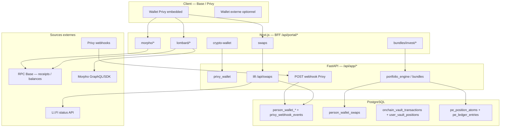

# Audit d'intégrité transactionnelle DeFi — Vancelian.finance

**Date :** 2026-05-28  
**Mode :** READ-ONLY (aucune modification applicative)  
**Périmètre code :** monorepo `vancelian-app`, stack opérationnelle dans `services/arquantix/` (API FastAPI + web Next.js + Prisma + Alembic).  
**Note :** `services/vancelian/` ne contient pas encore de logique DeFi ; le produit Vancelian.finance s’exécute via Arquantix.

---

## 1. Executive summary

L’application maintient **plusieurs miroirs parallèles** de l’état financier crypto :

1. **Ledger wallet Privy** (`person_wallet_deposits`, `person_wallet_balances`) — Python/Alembic, hors Prisma.
2. **Sessions swaps LI.FI** (`person_wallet_swaps`) + règlement ledger post-confirmation.
3. **Ledger vaults DeFi** (`onchain_vault_transactions`, `user_vault_positions`) — Morpho Earn, Ledgity, Lombard (emprunt).
4. **Portfolio Engine** (`pe_position_atoms`, `pe_ledger_entries`, `crypto_positions` legacy).

Les flux **les mieux ancrés** sont les dépôts Privy (webhook idempotent) et la confirmation Morpho/Ledgity via **receipt RPC** (`status = 1`). Les zones **les plus fragiles** sont : crédit LI.FI sur `estimated_receive` (pas montant on-chain parsé), **triple comptabilité** wallet / PE / legacy sans garde-fou bloquant, mocks Lombard/LI.FI qui **écrivent en base**, et Lombard v1 **sans repay/withdraw**.

**Verdict global : PARTIALLY SAFE**


| Domaine                    | Verdict                                                    |
| -------------------------- | ---------------------------------------------------------- |
| Privy dépôts / webhooks    | **SAFE** (avec réserves provider)                          |
| LI.FI swaps standalone     | **PARTIALLY SAFE**                                         |
| Morpho Earn                | **PARTIALLY SAFE**                                         |
| Ledgity vaults             | **PARTIALLY SAFE** (même pattern Morpho)                   |
| Lombard borrow (open loan) | **PARTIALLY SAFE** → **UNSAFE** si mock/admin actifs       |
| Bundles LI.FI              | **PARTIALLY SAFE**                                         |
| Affichage balances front   | **PARTIALLY SAFE**                                         |
| Réconciliation globale     | **PARTIALLY SAFE** (silos, pas d’indexer unifié)           |
| Mocks prod                 | **SAFE** si guard respecté ; **UNSAFE** si mauvaise config |


---

## 2. Verdict global

**PARTIALLY SAFE** — La DB est un miroir **opérationnel utile** mais **pas un ledger immuable reconstruisible depuis la chaîne**. Des écritures optimistes (`pending`), des montants estimés (LI.FI), et des crédits mock/admin peuvent créer un déphasage front / backend / on-chain. Aucun indexer Base dédié ni table `raw_onchain_events` n’existe aujourd’hui.

---

## 3. Architecture transactionnelle actuelle




**Pipeline type (DeFi on-chain signé côté client) :**

1. **Intention** — UI génère `idempotencyKey` / `batch_id` ; BFF `prepare` crée lignes `pending`.
2. **Préparation** — SDK Morpho / LI.FI quote / `buildLombardOpenLoanTransactions`.
3. **Signature** — Privy embedded ou wallet externe (`usePortalTxSigner`, `resolvePortalSwapSigningWallet`).
4. **Soumission** — `tx_hash` remonté au BFF ou API.
5. **Confirmation** — Receipt RPC (`verifyMorphoTransactionReceipt`) ou statut LI.FI `DONE` ou webhook Privy.
6. **Ledger** — Mise à jour table métier + éventuellement `person_wallet_*` ou `pe_position_atoms`.
7. **Affichage** — Agrégation BFF (`crypto-wallet`, `savings-wallet`, positions Morpho GraphQL).

**Absence notable :** pas de couche unique `transaction_intents` + `raw_onchain_events` ; pas d’indexer continu Base.

---

## 4. Cartographie des flux


| Domaine                     | Fichier                                                                                                              | Rôle                                     | Type écriture DB                                 | Source de vérité                | Risque                                   |
| --------------------------- | -------------------------------------------------------------------------------------------------------------------- | ---------------------------------------- | ------------------------------------------------ | ------------------------------- | ---------------------------------------- |
| **Privy — webhook**         | `services/arquantix/api/services/privy_wallet/webhook_service.py` (`PrivyWebhookProcessor`)                          | Ingestion `wallet.funds_deposited`       | Insert deposit `confirmed` + `increment_balance` | Payload Privy (provider)        | P1 — confiance Privy, pas re-parse chain |
| **Privy — lecture**         | `services/arquantix/api/services/privy_wallet/service.py` (`PrivyWalletLedgerService.get_balances`)                  | API soldes + backfill swaps              | Read + backfill settlement                       | Ledger + RPC enrichissement     | P2 — `available_balance` = `balance`     |
| **Privy — réconciliation**  | `services/arquantix/api/services/privy_wallet/reconciliation_service.py`                                             | Ledger vs on-chain, replay webhooks      | Runs/items + heal deposits                       | RPC ERC20 + ledger              | P1 — heal peut masquer bugs              |
| **Privy — admin sim**       | `services/arquantix/api/services/privy_wallet/admin_service.py`                                                      | Crédit test                              | Insert `admin_sim_*`                             | Hypothèse applicative           | **P0** — crédits fantômes                |
| **LI.FI — quote**           | `services/arquantix/api/services/lifi/lifi_quote_service.py`                                                         | Session swap                             | Insert `QUOTE_RECEIVED`                          | LI.FI quote API                 | P2 — session avant tx                    |
| **LI.FI — execute**         | `services/arquantix/api/services/lifi/lifi_execute_service.py` (`LifiExecuteService`)                                | Lifecycle                                | Update status                                    | LI.FI status / mock             | P1 — `PARTIAL` traité comme DONE         |
| **LI.FI — settlement**      | `services/arquantix/api/services/lifi/lifi_swap_settlement.py` (`apply_swap_settlement`)                             | Débit/crédit ledger Privy                | 2× `person_wallet_deposits`                      | `estimated_receive` + tx_hash   | **P0** — montant ≠ on-chain              |
| **Morpho Earn — prepare**   | `services/arquantix/web/src/lib/portal/morphoVaultLedger.ts` (`createMorphoLedgerEntries`)                           | Lignes pending                           | Insert `onchain_vault_transactions` pending      | Hypothèse pré-tx                | P2 — pending orphelin                    |
| **Morpho Earn — confirm**   | `morphoVaultLedger.ts` (`updateLedgerAfterReceipt`)                                                                  | Terminal success/reverted                | Update + `syncUserVaultPositionFromLedger`       | Receipt RPC `status=1`          | P1 — pas parsing logs Morpho             |
| **Morpho — réconciliation** | `services/arquantix/web/src/lib/portal/morphoVaultReconciliation.ts`                                                 | Cron ECS                                 | Runs/items Prisma                                | GraphQL assets/shares vs ledger | P2                                       |
| **Ledgity**                 | `services/arquantix/web/src/lib/portal/ledgity/*`                                                                    | Même pattern vault                       | Prisma vault tables                              | Receipt + réconciliation        | P2 — même classe risque                  |
| **Lombard — prepare**       | `services/arquantix/web/src/lib/portal/lombard/lombardLedger.ts`                                                     | Multi-tx pending                         | `integration_mode=lombard`                       | Prepare SDK                     | P1 — étapes partielles                   |
| **Lombard — tx build**      | `services/arquantix/web/src/lib/portal/lombard/lombardTx.ts` (`buildLombardOpenLoanTransactions`)                    | approve + authorize + open_loan          | Aucune (prep off-chain)                          | Morpho SDK                      | P1 — séquence multi-tx                   |
| **Lombard — confirm**       | `services/arquantix/web/src/app/api/portal/lombard/confirm/route.ts`                                                 | Boucle `updateLedgerAfterReceipt`        | Update par `ledgerEntryId`                       | Receipt RPC / mock              | P1 — pas atomique multi-tx               |
| **Lombard — mock credit**   | `services/arquantix/web/src/lib/portal/lombard/lombardMockPrivyLedgerCredit.ts`                                      | USDC emprunté → Privy ledger             | Insert deposits                                  | Mock                            | **P0** en prod si flag actif             |
| **Bundle — orchestrator**   | `services/arquantix/api/services/portfolio_engine/bundles/orchestrator.py` (`BundleOrchestrator.invest_into_bundle`) | Legs LI.FI + lock                        | PE atoms après confirm ; lock metadata           | PE + swaps                      | P1 — `partial_pending`                   |
| **Bundle — leg**            | `services/arquantix/api/services/portfolio_engine/bundle_execution/bundle_lifi_leg_service.py`                       | Quote/sign/submit                        | `person_wallet_swaps` + PE atoms                 | LI.FI + settlement              | P1 — même que swap                       |
| **Bundle — invariant**      | `services/arquantix/api/services/portfolio_engine/invariants/invariant_g.py` (`check_invariant_g`)                   | Dry-run only                             | Aucune (log)                                     | PE vs Privy ledger              | P1 — ne bloque pas                       |
| **Front hub wallet**        | `services/arquantix/web/src/app/api/portal/crypto-wallet/route.ts`                                                   | Agrège Privy + Lombard overlay + bundles | Read proxy                                       | Backend Privy + overlay         | P2 — `partial` flag                      |
| **Front swap**              | `services/arquantix/web/src/components/portal/swap/useLifiSwapExecution.ts`                                          | UX lifecycle                             | Via API                                          | Poll status                     | P2                                       |
| **Cron Morpho**             | `services/arquantix/web/scripts/run-morpho-vault-reconciliation.ts`                                                  | Batch reconcile                          | Prisma reconciliation tables                     | On-chain vs ledger              | P2                                       |
| **Cron Privy**              | `services/arquantix/api/scripts/run_privy_wallet_reconciliation.py`                                                  | Batch                                    | `person_wallet_reconciliation_*`                 | RPC + replay                    | P2                                       |
| **Phantom repair**          | `services/arquantix/api/services/privy_wallet/ledger_phantom_repair.py`                                              | Void admin_sim                           | Update void                                      | Ops                             | P1 — correction manuelle                 |


---

## 5. Cartographie DB

### 5.1 Couche wallet Privy (Alembic Python — **absent de `schema.prisma`**)


| Table                                | Migration                            | Rôle                              | Immuabilité                                          |
| ------------------------------------ | ------------------------------------ | --------------------------------- | ---------------------------------------------------- |
| `privy_webhook_events`               | `158_privy_wallet_deposit_ledger.py` | Audit webhooks                    | Append + statut traitement                           |
| `person_wallet_deposits`             | 158                                  | Ledger mouvements (dépôts, swaps) | Append ; idempotent `(chain_id, tx_hash, log_index)` |
| `person_wallet_balances`             | 158                                  | Agrégat par wallet/asset          | **Mutable** (`increment_balance`)                    |
| `person_wallet_swaps`                | `159_`*                              | Sessions LI.FI                    | Mutable (statuts)                                    |
| `person_wallet_reconciliation_runs`  | `160_`*                              | Runs réconciliation               | Audit ops                                            |
| `person_wallet_reconciliation_items` | 160                                  | Écarts par asset                  | Audit ops                                            |


**Modèles Python :** `services/arquantix/api/services/privy_wallet/models.py`  
**Repos :** `services/arquantix/api/services/privy_wallet/repository.py`

### 5.2 Couche vaults DeFi (Prisma)


| Modèle                                         | Fichier schema               | Contrainte idempotence                                                   |
| ---------------------------------------------- | ---------------------------- | ------------------------------------------------------------------------ |
| `OnchainVaultTransaction`                      | `prisma/schema.prisma` L3217 | `@@unique([personId, vaultAddress, operation, idempotencyKey, txIndex])` |
| `UserVaultPosition`                            | schema                       | Dérivé ledger success                                                    |
| `MorphoVaultReconciliationRun/Item`            | schema                       | Audit                                                                    |
| `DefiVaultRegistry`, `PortalMorphoVaultConfig` | schema                       | Config                                                                   |


### 5.3 Portfolio Engine (Prisma + Alembic PE)


| Table                                                        | Usage DeFi                                            |
| ------------------------------------------------------------ | ----------------------------------------------------- |
| `pe_position_atoms`                                          | Positions bundle spot/cash                            |
| `pe_ledger_entries`                                          | Comptabilité PE (custody, pas wallet on-chain direct) |
| `pe_idempotency_keys`                                        | Idempotence instructions PE                           |
| `pe_job_runs`, `pe_scheduled_jobs`                           | Jobs                                                  |
| `crypto_positions`                                           | **Legacy** — encore fusionné dans patrimoine          |
| `bundles`, `bundle_allocations`, `portfolio_product_configs` | Config bundles                                        |


### 5.4 Tables **absentes** (gap critique)

- `raw_onchain_events`
- `transaction_intents` (unifié cross-produit)
- `ledger_entries` immuables wallet (seulement deposits + balance mutable)
- `balance_snapshots` wallet (planifié dans `PRIVY_RECONCILIATION_ENTERPRISE_PLAN.md`, non implémenté)
- `reconciliation_discrepancies` globales

### 5.5 Wallets liés

- `PersonCryptoWallet` — Prisma L2971 + sync `privy_wallet/wallet_sync.py`
- Auth Privy — `services/arquantix/api/services/auth/privy_exchange_routes.py`

---

## 6. Analyse par domaine

### 6.1 Privy wallets

**Classification : SAFE** (réserve : source = Privy webhook, pas indexer indépendant)


| Étape                   | Implémentation                                                                    | Source vérité                              |
| ----------------------- | --------------------------------------------------------------------------------- | ------------------------------------------ |
| Création wallet EVM     | Login Privy → `privy_exchange_routes.py` ; sync `wallet_sync.py`                  | Privy API                                  |
| Création Solana serveur | `services/arquantix/api/services/privy/privy_wallet_service.py`                   | Privy API                                  |
| Dépôt                   | `PrivyWebhookProcessor.process_event` → deposit `confirmed` immédiat              | Event Privy `wallet.funds_deposited`       |
| Balance                 | `PersonWalletBalanceRepository.increment_balance` + agrégation `chain_balance.py` | Somme deposits confirmés (+ reconcile RPC) |


**Idempotence :** `uq_person_wallet_deposits_chain_tx_log`, `uq_privy_webhook_events_svix_id`, `idempotency_key` webhook.

**Risques :**

- **P0** — `admin_service.simulate_deposit` : clés `admin_sim_`* créditent sans on-chain (`ledger_phantom_repair.py` les détecte).
- **P1** — Pas de parsing ERC20 Transfer indépendant ; reorg non géré explicitement.
- **P2** — `available_balance` identique à `balance` dans `PrivyWalletLedgerService` (pas de réservation swap avant settlement).

**Crash recovery :** Webhook reçu → statut `PROCESSING` ; retry Svix rejoue via dedupe. Failed webhooks rejouables par `replay_failed_webhooks_for_person`.

---

### 6.2 LI.FI swaps

**Classification : PARTIALLY SAFE**


| Étape        | Fichier                                | Statuts              |
| ------------ | -------------------------------------- | -------------------- |
| Quote        | `lifi_quote_service.py`                | `QUOTE_RECEIVED`     |
| Prepare sign | `lifi_execute_service.prepare_execute` | `AWAITING_SIGNATURE` |
| Submit       | `submit_signed_tx`                     | `SUBMITTED` → poll   |
| Confirm      | `refresh_lifi_status` si `DONE`        | `CONFIRMED`          |
| Settlement   | `apply_swap_settlement`                | 2 ledger entries     |


**Source vérité confirmation :** API LI.FI `get_status` (prod) ; mock si `LIFI_SWAPS_MOCK` ou `tx_hash` `0xmock`*.

**Problèmes :**

- **P0** — Crédit `to_asset` avec `swap.estimated_receive`, pas balance delta on-chain.
- **P1** — `substatus PARTIAL` → `CONFIRMED` + settlement complet (L186-195 `lifi_execute_service.py`).
- **P1** — Bridge : `log_index` 0/1 pour séparer chains ; un seul `tx_hash` peut être ambigu.
- **P2** — Pas de worker cron dédié ; poll à la demande (`get_status`, submit).

**Si tx success on-chain mais DB pas à jour :** `backfill_unsettled_confirmed_swaps` au `get_balances` Privy.

**Si DB mise à jour mais tx fail :** Mock path peut confirmer sans tx ; prod rare si LI.FI status correct.

---

### 6.3 Morpho Earn

**Classification : PARTIALLY SAFE**


| Étape       | Fonction                                                               | DB                                |
| ----------- | ---------------------------------------------------------------------- | --------------------------------- |
| Prepare     | `createMorphoLedgerEntries`                                            | `status=pending`                  |
| Sign/submit | Front `PortalEarnVaultModal` + BFF                                     | —                                 |
| Confirm     | `updateLedgerAfterReceipt`                                             | `success` / `reverted` / `failed` |
| Position    | `syncUserVaultPositionFromLedger`, `computePrincipalNetFromLedgerRows` | `user_vault_positions`            |


**Source vérité :** `verifyMorphoTransactionReceipt` — receipt `status=1`, pas decode events Morpho (deposit/withdraw shares).

**Withdraw guard :** `assertWithdrawAmountWithinPosition` utilise `assetsInVaultRaw` GraphQL, pas uniquement ledger.

**Sandbox :** `morphoLocalSandbox.ts` → `sandboxUpdateLedgerSuccess` sans RPC.

**Crash entre prepare et confirm :** Lignes `pending` restent ; `assertNoConcurrentPendingGroup` bloque reprise même clé.

---

### 6.4 Morpho Borrow (Lombard v1)

**Classification : PARTIALLY SAFE** (prod réel) / **UNSAFE** (mock + crédit Privy)


| Opération                           | Statut code                          |
| ----------------------------------- | ------------------------------------ |
| approve / authorize / open_loan     | ✅ `buildLombardOpenLoanTransactions` |
| repay / withdraw collateral / close | ❌ Non implémenté portal              |


**Multi-étapes :** Plusieurs `OnchainVaultTransaction` (`txIndex` 0..n) ; confirm boucle indépendante par `ledgerEntryId` (`lombard/confirm/route.ts`). **Pas de transaction DB atomique** sur le groupe.

**Scénario collateral OK / borrow fail :** Entrées partielles `success` + `reverted` ; `allSuccess` false → pas de réconciliation complète ; overlay wallet peut être incohérent.

**Mock :** `lombardMockPrivyLedgerCredit.ts` crédite USDC emprunté dans ledger Privy — **double vérité** (position Morpho SDK vs ledger wallet).

**Positions affichées :** `lombardPositionService.ts` — on-chain GraphQL ; ledger = traçabilité ops.

---

### 6.5 Bundles crypto Vancelian

**Classification : PARTIALLY SAFE**

**Flow `execution_provider=lifi_base` :**

1. `BundleOrchestrator.invest_into_bundle` — `batch_id`, lock `bundle_invest_lock.py`
2. Par allocation : `BundleLifiLegService.execute_leg` → pending, **pas d’atoms PE**
3. Client : prepare-sign / submit-tx
4. `submit_leg_tx` → settlement Privy + `apply_allocation_leg_atoms_lifi_spot_only` (`pe_settlement.py`)
5. `batch/finalize` — cash leg si tous legs OK

**Statuts batch :** `completed`, `pending_signature`, `partial_pending`, `partial`, `failed` (`orchestrator.py` L378-396).

**Échec partiel :** PE peut avoir atoms sur legs confirmés ; cash leg partiel ; lock `partial` — **état métier ambigu**.

**Invariant G :** `check_invariant_g(..., dry_run=True)` — **jamais bloquant** (doc L11 invariant_g.py).

**Double comptabilité :** Bundle dans `pe_position_atoms` + actifs encore dans wallet Privy jusqu’à swaps ; pas de réservation stricte (voir `RESERVED_BALANCES_POLICY.md` Phase 4 non livrée).

---

### 6.6 Balances frontend

**Classification : PARTIALLY SAFE**


| Surface      | Source données                                                     | Distinction pending/confirmed                                       |
| ------------ | ------------------------------------------------------------------ | ------------------------------------------------------------------- |
| Hub crypto   | `GET /api/portal/crypto-wallet` → Privy balances + Lombard overlay | `balance` / `available_balance` — **pas de pending** côté Privy API |
| Détail actif | `crypto-wallet/[asset]/route.ts`                                   | Historique merges swaps (`transaction_merge.py`)                    |
| Épargne      | `savings-wallet/route.ts`                                          | Morpho + Ledgity positions                                          |
| Bundles      | `bundle/my-bundles`                                                | Quantités PE                                                        |
| Swap UI      | `useLifiSwapExecution`                                             | Statuts session LI.FI                                               |
| Lombard      | `lombardWalletBalanceOverlay.ts`                                   | USDC emprunté / locked overlay                                      |


**Front types :** `cryptoWalletTypes.ts` — `privyBalance`, `platformBalance` optionnels ; pas de `confirmed_balance` vs `estimated_balance` explicite partout.

**Risque P2 :** Utilisateur peut voir valeur marché (EUR) sur ledger confirmé uniquement, sans distinguer swap `SUBMITTED`.

---

### 6.6 Reconciliation

**Classification : PARTIALLY SAFE**


| Système      | Mécanisme                                                     | Rebuild ?                                            |
| ------------ | ------------------------------------------------------------- | ---------------------------------------------------- |
| Privy        | `reconciliation_service.py`, scripts, admin route             | Replay webhooks + RPC backfill `deposit_backfill.py` |
| Morpho vault | `morphoVaultReconciliation.ts`, cron                          | Compare ledger vs on-chain assets                    |
| Ledgity      | `ledgityVaultReconciliation.ts`, cron                         | Idem                                                 |
| Lombard      | `lombardReconciliation.ts`                                    | Post-confirm group                                   |
| PE hardening | `test_portfolio_engine_hardening_reconciliation.py`           | `ledger_entries_vs_balances` — PE interne            |
| Wallet ops   | `audit-wallet-ledger-sync.ts`, `repair-wallet-ledger-sync.ts` | Lombard mock deposits vs on-chain                    |


**Manques :**

- Pas de réconciliation **cross-couche** (Privy + PE + vaults + swaps) automatisée.
- Pas de `reconcile:user` unifié.
- Pas d’indexer block range rebuild.

---

### 6.7 Mocks


| Flag / service                       | Fichier config                | Écrit DB ?                   | Guard prod                    |
| ------------------------------------ | ----------------------------- | ---------------------------- | ----------------------------- |
| `LIFI_SWAPS_MOCK`                    | `api/services/lifi/config.py` | Oui — CONFIRMED + settlement | `productionSandboxGuard.ts`   |
| `LIFI_LOCAL_SANDBOX_ENABLED`         | `lifiLocalSandboxConfig.ts`   | Front sandbox                | Guard                         |
| `BUNDLE_LIFI_SYNC_MOCK`              | `bundle_lifi_leg_service.py`  | Auto-complete mock           | Env only — **pas dans guard** |
| `MORPHO_LOCAL_SANDBOX_ENABLED`       | `morphoLocalSandboxConfig.ts` | Ledger success sans RPC      | Guard                         |
| `LOMBARD_V1_MOCK_ENABLED`            | `lombardMockConfig.ts`        | Ledger + Privy USDC credit   | Guard                         |
| `LEDGITY_LOCAL_SANDBOX_ENABLED`      | ledgity mocks                 | Ledger                       | Guard                         |
| `EXTERNAL_WALLET_LOCAL_MOCK_ENABLED` | `externalWalletMockConfig.ts` | UX                           | Guard                         |
| Privy OTP dev                        | `privyOtpDevMock.ts`          | Auth flow                    | Dev only                      |
| Admin simulate deposit               | `admin_service.py`            | Ledger                       | Admin API                     |
| `pilot_bundle_lifi_invest_mock.py`   | script                        | Test                         | Script                        |


**Risque P0 :** `BUNDLE_LIFI_SYNC_MOCK` absent du guard `productionSandboxGuard.ts` — risque d’activation prod par erreur si variable set.

**Backend LI.FI mock :** pas de guard Python au boot équivalent au guard Next.js.

---

## 7. Liste des risques critiques


| ID  | Priorité | Risque                                              | Solution concrète                                                                   |
| --- | -------- | --------------------------------------------------- | ----------------------------------------------------------------------------------- |
| R1  | **P0**   | Settlement LI.FI crédite `estimated_receive`        | Parser Transfer events destination ; stocker `amount_actual` ; réconciliation delta |
| R2  | **P0**   | Triple comptabilité Privy / PE / `crypto_positions` | Activer invariant G en mode **enforce** ; déprécier `crypto_positions` pour DeFi    |
| R3  | **P0**   | Mock Lombard crédite ledger Privy                   | Interdire écriture Privy en mock ; overlay UI only ; séparer table `mock_credits`   |
| R4  | **P0**   | `admin_sim`_* crédits sans on-chain                 | Désactiver en prod ; audit trail ; alerte si insert                                 |
| R5  | **P1**   | Tables `person_wallet_`* hors Prisma                | Ajouter modèles Prisma read-only ou doc codegen ; CI check drift                    |
| R6  | **P1**   | Lombard multi-tx non atomique                       | Saga `operation_group` ; confirm group-level ; compensating pending                 |
| R7  | **P1**   | LI.FI `PARTIAL` → settlement complet                | Statut `partial_confirmed` ; settlement proportionnel ; pas de crédit full          |
| R8  | **P1**   | Pending Morpho/Lombard orphelins                    | TTL + job `expire_pending` ; UI reprise                                             |
| R9  | **P1**   | Pas de repay Lombard                                | Implémenter flux ou bloquer UI ; position read-only claire                          |
| R10 | **P1**   | `BUNDLE_LIFI_SYNC_MOCK` hors guard prod             | Ajouter au guard ; validation deploy checklist                                      |
| R11 | **P2**   | Pas de réservation balance pré-swap                 | Implémenter `reserved_pending` (policy doc existante)                               |
| R12 | **P2**   | Reorg / confirmations faibles                       | Attendre N confirmations ; indexer avec reorg handler                               |
| R13 | **P2**   | Poll LI.FI on-demand seulement                      | Worker cron `refresh_submitted_swaps`                                               |


---

## 8. Liste des écritures optimistes dangereuses


| Écriture                                         | Quand                          | Danger si confirm échoue                                    |
| ------------------------------------------------ | ------------------------------ | ----------------------------------------------------------- |
| `onchain_vault_transactions.status=pending`      | Morpho/Ledgity/Lombard prepare | Bloque re-op ; affichage ops pending                        |
| `person_wallet_swaps` QUOTE_RECEIVED → SUBMITTED | Avant LI.FI DONE               | Session fantôme ; pas de ledger tant que pas CONFIRMED (OK) |
| Lombard mock ledger success                      | Sans receipt                   | Position DB ≠ on-chain                                      |
| Morpho sandbox success                           | Sans receipt                   | Idem                                                        |
| `user_vault_positions` après success ledger      | Confirm                        | Principal net diverge si logs ≠ amountRaw                   |
| Bundle lock `partial_pending`                    | Invest multi-leg               | PE partiel + wallet non débité cohérent                     |


**Non optimiste (bon) :** Privy deposits (confirmés à l’insert) ; LI.FI settlement post-CONFIRMED ; increment balance Privy au webhook.

---

## 9. Tx fail peut encore incrémenter wallet/position


| Scénario                                             | Mécanisme                                                       | Priorité |
| ---------------------------------------------------- | --------------------------------------------------------------- | -------- |
| Mock LI.FI / Lombard / Morpho sandbox                | Success sans tx réelle                                          | P0       |
| `admin_simulate_deposit`                             | Crédit direct                                                   | P0       |
| LI.FI status `DONE` + `PARTIAL` substatus            | Settlement montant quote full                                   | P1       |
| Webhook Privy duplicate mal géré                     | Théoriquement bloqué par uq ; à surveiller retry                | P2       |
| Réconciliation heal trop agressive                   | `ingest_transfer_as_deposit` sur faux positif RPC               | P1       |
| Lombard confirm : une tx `success`, autre `reverted` | Groupe partiel ; overlay peut montrer USDC si mock credit passé | P1       |


---

## 10. Tx success on-chain peut ne pas être reflétée en DB


| Scénario                                    | Mitigation existante                         | Gap                       |
| ------------------------------------------- | -------------------------------------------- | ------------------------- |
| Webhook Privy perdu                         | Replay failed + reconciliation RPC           | Pas indexer continu       |
| Swap CONFIRMED sans settlement              | `backfill_unsettled_confirmed_swaps` on read | Pas cron garanti          |
| Bundle leg confirmé, PE atoms pas appliqués | Manuel / re-run leg ?                        | Pas replay standardisé    |
| Morpho confirm jamais appelé                | Pending forever                              | Besoin job expire + alert |
| Lombard tx 3/3 on-chain, confirm 2/3        | Entrées partielles success                   | Pas auto-heal group       |
| Dépôt on-chain sans event Privy             | `discover_missing_transfers_for_wallet`      | Base only pilot chains    |


---

## 11. Analyse idempotence

### Clés existantes


| Domaine         | Clé                                                            | Fichier                   |
| --------------- | -------------------------------------------------------------- | ------------------------- |
| Webhook Privy   | `svix_id`, `idempotency_key`                                   | `privy_webhook_events`    |
| Deposit         | `(chain_id, tx_hash, log_index)`                               | migration 158             |
| Swap settlement | `lifi-swap:{swap_id}:debit/credit`                             | `lifi_swap_settlement.py` |
| Vault tx        | `(personId, vaultAddress, operation, idempotencyKey, txIndex)` | Prisma unique             |
| PE              | `pe_idempotency_keys`                                          | schema                    |
| Bundle          | `batch_id` UUID                                                | orchestrator              |


### Risques replay


| Risque                   | Détail                                                              |
| ------------------------ | ------------------------------------------------------------------- |
| Double increment balance | `increment_balance` — protégé si deposit idempotent skip            |
| Webhook 2×               | Marqué DUPLICATE si même payload_hash                               |
| Worker retry settlement  | `swap_settlement_already_applied` + `find_by_chain_tx` early return |
| Retry confirm Morpho     | `if entry.status === 'success' return entry`                        |
| Crash mid-settlement     | Audit `swap_settled` event ; backfill                               |


**Manque :** idempotency_key HTTP header standard sur tous les BFF ; pas de `operation_id` global cross-tables.

---

## 12. Analyse crash recovery


| Point de crash                   | État résiduel                    | Recovery actuel                             |
| -------------------------------- | -------------------------------- | ------------------------------------------- |
| Après prepare, avant sign        | `pending` vault / swap QUOTE     | User retry ; concurrent guard               |
| Après submit, avant confirm      | SUBMITTED / pending vault        | Poll LI.FI ; user confirm Morpho            |
| Après on-chain success, avant DB | —                                | Privy replay ; swap backfill ; RPC backfill |
| Mid `apply_swap_settlement`      | Possible 1 leg debit sans credit | `find_by_chain_tx` partial ; manual repair  |
| Mid bundle multi-leg             | `partial_pending` + lock         | `update_invest_lock_status`                 |
| Worker reconciliation crash      | Run status incomplet             | Re-run script                               |


**Pas de saga orchestrator centralisé** — recovery ad hoc par domaine.

---

## 13. Analyse replay/rebuild

### Existant

- `run_privy_wallet_reconciliation.py` — scope person/global
- `run-morpho-vault-reconciliation.ts` — cron
- `ledger_phantom_repair.py --void-phantoms`
- `audit-wallet-ledger-sync.ts` / `repair-wallet-ledger-sync.ts`
- `revert-failed-lombard-open-loans.ts`
- Docs : `PRIVY_RECONCILIATION_ENTERPRISE_PLAN.md` (cible enterprise, partiellement livré)

### Manquant

- Table `raw_onchain_events`
- Indexer Base continu (ERC20 + Morpho + LI.FI router si besoin)
- `reconcile:wallet`, `replay:onchain`, `rebuild:balances` CLI unifiés
- Dry-run / apply avec audit trail obligatoire
- Rebuild PE depuis atoms + on-chain
- Admin panel écarts cross-système

---

## 14. Recommandations prioritaires

1. **P0** — Ne plus créditer le ledger Privy avec des montants estimés LI.FI ; parser on-chain ou au minimum comparer LI.FI `toAmount` final.
2. **P0** — Étendre `productionSandboxGuard` + guard FastAPI boot pour **tous** les mocks (`BUNDLE_LIFI_SYNC_MOCK`, `LIFI_SWAPS_MOCK`).
3. **P0** — Bloquer `admin_simulate_deposit` en production (feature flag + audit).
4. **P1** — Introduire `raw_onchain_events` + indexer Base (voir plan §16).
5. **P1** — Saga/group confirm pour Lombard multi-tx.
6. **P1** — Invariant G : mode `enforce` en staging puis prod.
7. **P2** — Worker cron swaps SUBMITTED + pending vault TTL.
8. **P2** — Aligner Prisma sur tables `person_wallet`_* (au moins read models).

---

## 15. Plan de renforcement technique

### Phase A — Observabilité (2–3 semaines)

- Table `raw_onchain_events` (chain_id, block_number, tx_hash, log_index, topic, payload, parsed_json, ingested_at).
- Indexer Base : ERC20 Transfer vers wallets clients ; events Morpho Blue (SupplyCollateral, Borrow, Repay, Withdraw) ; optionnel LI.FI Diamond events.
- Table `transaction_intents` unifiée (product, person_id, wallet, status, idempotency_key, linked tables).
- Dashboard admin : écarts `reconciliation_discrepancies`.

### Phase B — Intégrité écritures (3–4 semaines)

- Settlement LI.FI v2 : `amount_actual` from chain.
- Ledger wallet **append-only** : `wallet_ledger_entries` immuables ; `person_wallet_balances` = vue matérialisée rebuildable.
- Morpho confirm : decode logs pour `amountRaw` réel.
- Lombard : `operation_groups` + état machine group-level.

### Phase C — Enforcement (2 semaines)

- Invariant G enforce.
- Reserved balances avant swap/bundle invest.
- Suppression progressive `crypto_positions` pour clients DeFi-only.

---

## 16. Plan de réparation de base de données si désynchronisation

### Principes

- **Dry-run obligatoire** par défaut.
- **Apply** uniquement après validation admin + ticket.
- **Audit trail** : table `reconciliation_corrections` (who, when, before, after, command, dry_run).
- **Aucune suppression destructive** sans backup snapshot (pg_dump ou `person_wallet_balance_snapshots`).

### Artefacts à créer

```sql
-- Schéma cible (indicatif)
raw_onchain_events (
  id UUID PK,
  chain_id INT,
  block_number BIGINT,
  tx_hash TEXT,
  log_index INT,
  event_type TEXT,
  contract_address TEXT,
  wallet_address TEXT,
  asset TEXT,
  amount_raw NUMERIC,
  payload_json JSONB,
  parsed_at TIMESTAMPTZ,
  UNIQUE (chain_id, tx_hash, log_index)
);

transaction_intents (
  id UUID PK,
  person_id UUID,
  product TEXT, -- privy_deposit | lifi_swap | morpho_earn | lombard | bundle
  idempotency_key TEXT UNIQUE,
  status TEXT,
  metadata_json JSONB
);

ledger_entries_immutable (
  id UUID PK,
  intent_id UUID,
  account TEXT,
  direction TEXT,
  asset TEXT,
  amount NUMERIC,
  chain_id INT,
  tx_hash TEXT,
  log_index INT,
  created_at TIMESTAMPTZ
);

balance_snapshots (
  id UUID PK,
  person_id UUID,
  wallet_address TEXT,
  asset TEXT,
  ledger_balance NUMERIC,
  on_chain_balance NUMERIC,
  as_of TIMESTAMPTZ,
  source TEXT -- rebuild | reconcile
);

reconciliation_discrepancies (
  id UUID PK,
  person_id UUID,
  layer TEXT, -- privy | pe | vault | swap
  asset TEXT,
  ledger_amount NUMERIC,
  on_chain_amount NUMERIC,
  delta NUMERIC,
  status TEXT,
  resolved_at TIMESTAMPTZ
);
```

### Commandes cibles


| Commande                                     | Rôle                                       |
| -------------------------------------------- | ------------------------------------------ |
| `reconcile:user --person-id --dry-run`       | Scan toutes couches                        |
| `reconcile:wallet --address --chain base`    | Privy + on-chain                           |
| `replay:onchain --from-block --to-block`     | Re-ingest raw events                       |
| `rebuild:balances --person-id --apply`       | Recalcul depuis `ledger_entries_immutable` |
| `verify:morpho-position --person-id --vault` | Ledger vs GraphQL                          |
| `verify:bundle-holdings --portfolio-id`      | PE atoms vs wallet                         |


### Procédure Lombard / mock

1. Exécuter `audit-wallet-ledger-sync.ts` (dry-run).
2. `ledger_phantom_repair.py --void-phantoms` pour `admin_sim_*`.
3. `repair-wallet-ledger-sync.ts` pour crédits mock Lombard sans on-chain.
4. `revert-failed-lombard-open-loans.ts` pour groupes partiels.

### Indexer Base (minimal)

- Subscription logs `Transfer(address,address,uint256)` filtres wallets `person_crypto_wallets`.
- Parsing Morpho : positions utilisateur vs `onchain_vault_transactions` success.
- LI.FI : conserver status API comme hint ; vérité = transfers destination.

---

## 17. Plan de tests automatisés


| Test                                 | Objectif                                                           |
| ------------------------------------ | ------------------------------------------------------------------ |
| `tx_success_backend_crash_before_db` | Simuler crash après `submit_signed_tx` ; vérifier backfill au read |
| `tx_fail_backend_increment`          | Mock receipt reverted ; assert balance inchangé                    |
| `retry_worker_twice`                 | Double `apply_swap_settlement` ; un seul debit/credit              |
| `webhook_duplicate`                  | Même svix_id 2× → DUPLICATE, balance +1 seule fois                 |
| `morpho_collateral_ok_borrow_fail`   | Confirm partiel Lombard ; état group cohérent                      |
| `lifi_submitted_destination_fail`    | LI.FI FAILED ; pas de settlement                                   |
| `bundle_partial_exec`                | 2/3 legs OK ; PE + lock `partial_pending`                          |
| `reorg_insufficient_confirmations`   | (Futur) indexer reorg rollback                                     |
| `mock_active_by_error`               | Prod env avec `LIFI_SWAPS_MOCK=true` → guard fail boot             |
| `rebuild_from_block_range`           | (Futur) replay:onchain → balances match RPC                        |


**Emplacement suggéré :** étendre `services/arquantix/api/tests/test_lifi_swap_settlement.py`, `web/src/lib/portal/lombard/*.test.ts`, e2e portal sandbox.

---

## 18. Fichiers à modifier dans une phase suivante (après validation)

### P0

- `services/arquantix/api/services/lifi/lifi_swap_settlement.py`
- `services/arquantix/api/services/lifi/lifi_execute_service.py`
- `services/arquantix/web/src/lib/productionSandboxGuard.ts`
- `services/arquantix/api/services/lifi/config.py` (guard boot)
- `services/arquantix/api/services/privy_wallet/admin_service.py`
- `services/arquantix/web/src/lib/portal/lombard/lombardMockPrivyLedgerCredit.ts`

### P1

- `services/arquantix/web/src/lib/portal/morphoVaultLedger.ts`
- `services/arquantix/web/src/app/api/portal/lombard/confirm/route.ts`
- `services/arquantix/api/services/portfolio_engine/invariants/invariant_g.py`
- `services/arquantix/api/services/portfolio_engine/bundles/orchestrator.py`
- Nouveau : `services/arquantix/api/services/onchain_indexer/`*
- Nouveau : migrations `raw_onchain_events`, `transaction_intents`
- `services/arquantix/web/prisma/schema.prisma` (read models wallet)

### P2

- `services/arquantix/api/services/privy_wallet/service.py` (reserved balances)
- `services/arquantix/web/src/app/api/portal/crypto-wallet/route.ts`
- Cron : nouveau `scripts/run-lifi-swap-reconciliation.ts`

---

## Annexe A — Classification SAFE / PARTIALLY SAFE / UNSAFE par flux


| Flux                            | Classification     | Justification                            |
| ------------------------------- | ------------------ | ---------------------------------------- |
| Privy deposit webhook           | **SAFE**           | Idempotent ; crédit après event provider |
| Privy balance read + RPC enrich | **SAFE**           | Lecture ; reconcile optionnel            |
| LI.FI swap prod                 | **PARTIALLY SAFE** | Confirm LI.FI ; settle estimated         |
| LI.FI mock                      | **UNSAFE** si prod | Écrit sans chain                         |
| Morpho Earn prod confirm        | **PARTIALLY SAFE** | Receipt OK ; amountRaw prepare-time      |
| Morpho sandbox                  | **UNSAFE** si prod | Sans RPC                                 |
| Ledgity prod                    | **PARTIALLY SAFE** | = Morpho pattern                         |
| Lombard open prod               | **PARTIALLY SAFE** | Multi-tx ; pas repay                     |
| Lombard mock                    | **UNSAFE**         | Ledger Privy credit                      |
| Bundle invest LI.FI             | **PARTIALLY SAFE** | Partial states ; invariant dry-run       |
| Bundle mock sync                | **UNSAFE** si prod | Auto-complete                            |
| Admin sim deposit               | **UNSAFE**         | Phantom credits                          |
| Front crypto-wallet             | **PARTIALLY SAFE** | Agrégation multi-source                  |


---

## Annexe B — Endpoints principaux

### FastAPI `/api/app/`*

- `GET /api/app/privy-wallet/balances` — `privy_wallet/routes.py`
- `GET /api/app/privy-wallet/deposits`
- `POST /api/swaps/quote`, `/execute`, `/submit`, `/status` — `lifi/routes.py`
- `POST /api/app/bundle/invest`, `/leg/{swap_id}/prepare-sign`, `/submit-tx`, `/batch/finalize` — `test_clients/router.py`
- Webhook `POST` Privy — `privy_wallet/webhook_router.py`

### BFF `/api/portal/`*

- `/api/portal/crypto-wallet`, `/crypto-wallet/[asset]`
- `/api/portal/privy-wallet/balances`
- `/api/portal/swaps/*`
- `/api/portal/morpho/{prepare,confirm,position,vaults,history}`
- `/api/portal/ledgity/{prepare,confirm,position,vaults,history}`
- `/api/portal/lombard/{prepare,confirm,quote,capacity,position,markets}`
- `/api/portal/bundles/invest/*`
- `/api/portal/savings-wallet`
- Admin : `/api/admin/privy-wallet/reconciliation/run`

---

## Recommended next Cursor prompt

```text
Contexte : l’audit READ-ONLY est validé — voir docs/arquantix/AUDIT_DEFI_TRANSACTIONAL_INTEGRITY.md.
Objectif : implémenter les renforcements P0/P1 sans toucher l’infra Docker/DB/env sans mon accord explicite.

Phase 1 — Guards & mocks (P0)
1. Ajouter BUNDLE_LIFI_SYNC_MOCK et validation FastAPI au démarrage (équivalent productionSandboxGuard).
2. Durcir admin_simulate_deposit : refus si ENV=production.
3. Lombard mock : supprimer l’écriture dans person_wallet_deposits ; overlay UI uniquement.

Phase 2 — LI.FI settlement (P0)
1. Dans lifi_swap_settlement.py, après CONFIRMED, récupérer le montant réel reçu (LI.FI status toAmount ou parse ERC20 Transfer Base via RPC).
2. Stocker amount_actual dans person_wallet_swaps.metadata / deposit metadata.
3. Tests : double settlement idempotent ; PARTIAL substatus ne crédite pas le montant quote complet.

Phase 3 — Schéma & indexer (P1) — migrations validées par moi avant apply
1. Créer migration raw_onchain_events + transaction_intents (squelette).
2. Service indexer Base minimal : ERC20 Transfer vers adresses person_crypto_wallets.
3. CLI reconcile:wallet --dry-run (Python).

Contraintes :
- Pas de changement COMPOSE_PROJECT_NAME, DATABASE_URL, volumes.
- Chaque PR petite, tests obligatoires.
- Commits atomiques par phase.

Commence par Phase 1 uniquement ; montre le diff et les tests avant Phase 2.
```

---

*Rapport généré en audit READ-ONLY. Aucun fichier applicatif n’a été modifié.*