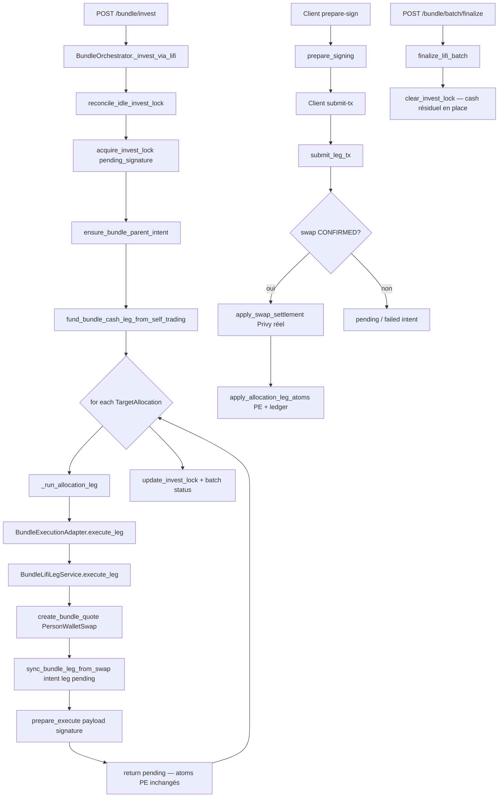

# Bundle Allocation Execution Engine — Audit & Design (Production)

**Date :** 2026-05-29  
**Périmètre :** READ-ONLY — `services/arquantix/api` (orchestration bundle, LI.FI, PE atoms, ledger shadow)  
**Aucune modification fonctionnelle effectuée.**

**Documents liés :** [BUNDLE_DEPOSIT_WITHDRAW_AUDIT.md](./BUNDLE_DEPOSIT_WITHDRAW_AUDIT.md), [BUNDLE_LEDGER_GO_LIVE_RUNBOOK.md](./BUNDLE_LEDGER_GO_LIVE_RUNBOOK.md), [BUNDLE_RECOVERY_RUNBOOK.md](./BUNDLE_RECOVERY_RUNBOOK.md)

---

## Executive Summary

Le moteur d’allocation bundle Vancelian repose sur un **orchestrateur séquentiel fund-first** :

1. **Fund** — transfert comptable self-trading → cash leg (`fund_bundle_cash_leg_from_self_trading`), Privy inchangé.
2. **Plan** — montants théoriques par `TargetAllocation × target_weight`, arrondis `ROUND_DOWN` à 6 décimales.
3. **Quote** — une quote LI.FI par leg, créée **l’une après l’autre** dans la même requête HTTP invest.
4. **Signature / exécution** — côté client, leg par leg (`prepare-sign` → `submit-tx`).
5. **Settlement** — à CONFIRMED : Privy ledger (montant **réel** on-chain) puis atoms PE (montant **quoté**).
6. **Finalisation** — `finalize_lifi_batch` libère le lock ; le cash résiduel reste en cash leg.

**Verdict principal :** l’implémentation actuelle est **fonctionnellement correcte** pour le modèle Vancelian (cash résiduel acceptable, bundle recoverable). Elle n’est **pas** une exécution parallèle : quotes séquentielles, pas de buffer d’exécution invest, pas de réservation cash par leg pending. Pour Top 2–5 actifs liquides, une **refonte ciblée** (buffer + parallélisation quotes + settlement réel PE) apporterait vitesse et robustesse sans refonte globale.


| Dimension                   | État actuel                                 | Alignement cible Vancelian |
| --------------------------- | ------------------------------------------- | -------------------------- |
| Fund cash leg               | ✅ Implémenté                                | ✅                          |
| Allocation planner (poids)  | ✅ `TargetAllocation`                        | ✅                          |
| Exécution parallèle         | ❌ Séquentiel                                | ⚠️ Gap                     |
| Buffer anti-arrondis invest | ❌ Absent (dust ROUND_DOWN seulement)        | ⚠️ Gap                     |
| Cash résiduel accepté       | ✅ Comportement naturel                      | ✅                          |
| Settlement Privy (réel)     | ✅ `apply_swap_settlement`                   | ✅                          |
| Settlement PE (réel)        | ⚠️ Quote (`amount_in`, `estimated_receive`) | ⚠️ Gap mineur              |
| Recovery partial / failed   | ✅ Lock + resume + cash leg intacte          | ✅                          |
| Ledger shadow               | ✅ Phase 4A miroir                           | ✅                          |


**Recommandation :** **Option B adaptée** — parallélisation des quotes + signatures client en parallèle (2–5 legs), avec **execution buffer** configurable (0.5–2 USDC ou bps), sans retry automatique des centimes. Pas de refonte du fund-first ni du modèle PE.

---

## Current Execution Flow

### Cartographie des modules


| Fichier                                         | Rôle                                                     |
| ----------------------------------------------- | -------------------------------------------------------- |
| `bundles/orchestrator.py`                       | `BundleOrchestrator` — invest, preview, finalize, resume |
| `bundle_execution/bundle_funding.py`            | Fund / release cash leg (PE only)                        |
| `bundle_execution/bundle_execution_adapter.py`  | Route vers provider (`lifi_base` / `exchange`)           |
| `bundle_execution/lifi_provider.py`             | Provider LI.FI                                           |
| `bundle_execution/bundle_lifi_leg_service.py`   | Cycle leg : quote → sign → submit → settlement           |
| `bundle_execution/bundle_lifi_quote_service.py` | Création `PersonWalletSwap` + quote LI.FI (TTL 120 s)    |
| `bundle_execution/pe_settlement.py`             | Atoms PE post-CONFIRMED                                  |
| `bundles/bundle_invest_lock.py`                 | Verrou metadata portfolio                                |
| `transaction_intents/bundle_intent_sync.py`     | Parent intent + legs observabilité                       |
| `bundle_ledger/service.py`                      | Écritures shadow (deposit, allocation buy, recovery)     |
| `bundles/rebalance.py`                          | Rebalance sell-then-buy (même moteur, plan distinct)     |
| `allocations/models.py`                         | `TargetAllocation` (poids cibles)                        |


### Diagramme — invest LI.FI (chemin production)




### Séquence détaillée (fonctions)

#### Phase 0 — Preview (read-only)


| Étape           | Fonction                                      | Effet                                                        |
| --------------- | --------------------------------------------- | ------------------------------------------------------------ |
| Plan théorique  | `BundleOrchestrator.preview_invest`           | `alloc_input = estimated_entry × target_weight` (ROUND_DOWN) |
| Quote read-only | `BundleLifiQuoteService.preview_bundle_quote` | Pas de row swap persistée                                    |


#### Phase 1 — Fund cash leg


| Étape       | Fonction                                 | Effet PE                                | Effet Privy      |
| ----------- | ---------------------------------------- | --------------------------------------- | ---------------- |
| Vérif solde | `resolve_self_trading_available`         | Sync direct atom vs custody − cash legs | Lecture balances |
| Transfert   | `fund_bundle_cash_leg_from_self_trading` | direct −amount, cash leg +amount        | **Inchangé**     |
| Ledger      | `record_bundle_deposit`                  | Shadow entry                            | —                |


#### Phase 2 — Création des legs (planning + quote)


| Étape              | Fonction                                                  | Effet                                      |
| ------------------ | --------------------------------------------------------- | ------------------------------------------ |
| Boucle allocations | `_invest_via_lifi` L412–462                               | `for alloc in allocations:` **séquentiel** |
| Montant leg        | `(entry_qty × target_weight).quantize(ROUND_DOWN)`        | Skip si ≤ 0 ou > `cash_available` mémoire  |
| Exécution leg      | `_run_allocation_leg` → `ExecutionLeg(action=allocation)` |                                            |
| Quote LI.FI        | `BundleLifiLegService.execute_leg`                        | `PersonWalletSwap`, status pending quote   |
| Intent leg         | `sync_bundle_leg_from_swap`                               | leg `pending` dans parent intent           |
| Commit             | `db.commit()` dans `execute_leg`                          | Une quote persistée avant la suivante      |


**Important :** à ce stade, **aucun débit cash leg allocation** — seul le fund initial a crédité la cash leg.

#### Phase 3 — Signature & confirmation (client-driven)


| Endpoint                                  | Service              | Lock status                          |
| ----------------------------------------- | -------------------- | ------------------------------------ |
| `POST /bundle/leg/{swap_id}/prepare-sign` | `prepare_signing`    | `signature_requested`                |
| `POST /bundle/leg/{swap_id}/submit-tx`    | `submit_leg_tx`      | `submitted` → `pending_confirmation` |
| Polling                                   | `refresh_and_settle` | Même chemin settlement               |


Post-CONFIRMED (`_apply_post_confirmation`) :

1. `apply_swap_settlement` — Privy, montant **réel** (`resolve_lifi_actual_receive_amount`)
2. `_apply_pe_atoms_for_leg` — `apply_allocation_leg_atoms` :
  - crédit spot : `swap.estimated_receive`
  - débit cash leg : `swap.amount_in`
3. `record_allocation_buy` — ledger shadow
4. `mark_bundle_leg_confirmed` — intent

#### Phase 4 — Finalisation batch


| Étape        | Fonction                                                 | Effet                                                       |
| ------------ | -------------------------------------------------------- | ----------------------------------------------------------- |
| Finalize     | `finalize_lifi_batch`                                    | `clear_invest_lock`, recompute parent intent                |
| Cash restant | Calcul informatif `planned_entry_total − entry_consumed` | **Pas de recrédit** — reliquat déjà en cash leg depuis fund |


#### Reprise


| Endpoint                     | Fonction                                                                     |
| ---------------------------- | ---------------------------------------------------------------------------- |
| `POST /bundle/invest/resume` | `resume_lifi_invest_batch` — reconstruit payload depuis swaps pending + lock |


### Chemin legacy Exchange

Si `BUNDLE_EXECUTION_PROVIDER=exchange` : même boucle séquentielle, swap **synchrone** — atoms PE mis à jour immédiatement dans `_run_allocation_leg` (`_sync_pe_position` + `_debit_cash_leg`). Non pertinent production LI.FI Base.

### Rebalance (hors invest initial, même moteur)

`BundleRebalanceOrchestrator.execute_rebalance` :

1. Phase **SELL** séquentielle (overweight → entry asset)
2. Phase **BUY** séquentielle (entry asset → underweight)
3. Constante `RESIDUAL_BUFFER_EUR = 0.50` définie mais **non utilisée** dans le code invest ; le reliquat rebalance vient du plan (`estimated_residual_cash_eur`)

---

## Cash Management Audit

### Modèle fund-first (confirmé)

```
direct_portfolio(entry)  -= amount     ← sync_direct_atom
bundle cash leg          += amount     ← BundleOrchestrator._credit_cash_leg
Privy ledger             = inchangé
```

Invariant documenté dans `bundle_funding.py` et `orchestrator.py` module docstring.

### Questions audit — réponses


| Question                                      | Réponse actuelle                                | Preuve                                                                                                                                                  |
| --------------------------------------------- | ----------------------------------------------- | ------------------------------------------------------------------------------------------------------------------------------------------------------- |
| Cash réservé avant exécution ?                | **Non** — pas de réservation PE par leg pending | Pas d’écriture `BUNDLE_CASH_RESERVED` ; enum existe mais non utilisée                                                                                   |
| Cash consommé uniquement après confirmation ? | **Oui (LI.FI)**                                 | `apply_allocation_leg_atoms` appelé dans `_apply_post_confirmation` seulement si CONFIRMED                                                              |
| Risque surconsommation cash leg ?             | **Faible PE, modéré on-chain**                  | PE : cash leg pleine jusqu’à débit confirmé. On-chain : plusieurs swaps pending peuvent viser ~100 % du fund ; exécution wallet sérialise naturellement |
| Risque double consommation ?                  | **Faible**                                      | Idempotence `_pe_atoms_already_applied` ; audit `bundle_pe_atoms_applied`                                                                               |
| Compteur orchestrateur `cash_available`       | **Optimiste pour pending**                      | Décrémenté seulement si leg `completed` synchrone ; legs `pending` ne le réduisent pas (L445–448)                                                       |


### Mécanisme de reliquat (cash résiduel)

Sources de reliquat — **comportement attendu et acceptable** :

1. **ROUND_DOWN** par leg : `quantize(0.000001, ROUND_DOWN)` sur chaque `alloc_entry_amount`
2. **Somme des poids** < 1 ou arrondis cumulés
3. **Leg skipped** : montant ≤ 0 ou > `cash_available` mémoire
4. **Leg failed** : cash leg non débitée (LI.FI)
5. **Écart quote vs exécution** : débit PE = `amount_in` quoté ; consommation réelle on-chain peut différer → reliquat Privy/PE possible

`finalize_lifi_batch` documente explicitement :

> *Les USDC non alloués restent en cash leg — état récupérable, non bloquant.*

### Gap : réservation formelle (Invariant G)

`invariants/invariant_g.py` — `reserved_pending(asset)` documenté Phase 4, **non appliqué** au runtime allocation. Le invest lock est un **verrou d’opération**, pas une réservation comptable par montant.

---

## Parallel vs Sequential Analysis

### Constat code

**Exécution 100 % séquentielle côté serveur** — aucun `asyncio.gather`, thread pool, ou constante `MAX_PARALLEL_LEGS`.

Boucle invest (`orchestrator.py`) :

```python
for alloc in allocations:
    alloc_entry_amount = (entry_qty_received * alloc.target_weight).quantize(
        Decimal("0.000001"), rounding=ROUND_DOWN,
    )
    exec_result = self._run_allocation_leg(...)
```

Rebalance : deux boucles `for` séquentielles (SELL puis BUY).

### Nuances importantes


| Couche                        | Parallèle ?             | Détail                                                         |
| ----------------------------- | ----------------------- | -------------------------------------------------------------- |
| Création quotes (HTTP invest) | **Non**                 | Quotes LI.FI créées une par une, `commit` inter-leg            |
| Signatures client             | **Potentiellement oui** | Rien n’empêche le client de signer plusieurs legs en parallèle |
| Confirmation on-chain         | **Wallet-dépendant**    | Même adresse Privy — nonce séquentiel Ethereum                 |
| Settlement PE                 | **Séquentiel par swap** | Chaque CONFIRMED déclenche settlement isolé                    |


### Nombre maximum de legs simultanées


| Limite                     | Valeur                                               |
| -------------------------- | ---------------------------------------------------- |
| Configurée dans le code    | **Aucune**                                           |
| Pratique bundle Vancelian  | 2–5 (`TargetAllocation` par portfolio)               |
| Quotes pending simultanées | Jusqu’à N allocations (toutes quotées dans 1 invest) |
| TTL quote                  | 120 s (`QUOTE_TTL_SECONDS`)                          |
| Grace signature            | 600 s (`EXECUTE_GRACE_SECONDS`)                      |


### Impact performance

Pour Top 5 avec LI.FI API ~200–500 ms/quote :

- **Séquentiel quotes** : 1–2.5 s additionnels dans la requête invest (avant réponse client)
- **Signatures** : goulot UX si client signe séquentiellement (5 × temps signature)
- **On-chain** : 5 txs Base ≈ 5 × temps bloc même en parallèle nonce

### Garde-fous existants

- `assert_no_active_invest_lock` — un invest actif par portfolio
- Whitelist actifs `lifi_base_config` — pas de memecoins
- Validation montants `validate_bundle_lifi_leg`
- Invest lock TTL 120 min (`BUNDLE_INVEST_LOCK_TTL_MINUTES`)

---

## Error Recovery Analysis

### Matrice d’erreurs


| Scénario                         | Comportement                                    | Cash leg                         | Recoverable ? | Retry                                    |
| -------------------------------- | ----------------------------------------------- | -------------------------------- | ------------- | ---------------------------------------- |
| Quote LI.FI échoue à la création | Leg `failed`, boucle continue                   | Intacte                          | ✅             | Nouvel invest / resume partiel           |
| Quote expire (120 s)             | Swap `EXPIRED`, intent leg failed via reconcile | Intacte                          | ✅             | Re-quote manuel (resume / nouvel invest) |
| Signature jamais envoyée         | Lock `pending_signature`, swaps QUOTE_RECEIVED  | Intacte                          | ✅             | TTL lock → `expired` si safe             |
| Tx rejetée on-chain              | Swap `FAILED`, `mark_bundle_leg_failed`         | Intacte (pas de débit PE)        | ✅             | Leg isolée failed                        |
| Swap LI.FI failed / refunded     | `refresh_and_settle` → leg failed               | Intacte                          | ✅             | Autres legs OK                           |
| Tous legs failed                 | Lock `failed`, fund reste en cash leg           | **Pleine**                       | ✅             | Rebalance ou nouvel invest               |
| Partial (2/3 OK)                 | Lock cleared si pending=0 (`partial`)           | Partiellement allouée + reliquat | ✅             | Finalize + ops                           |
| Fund OK, pending legs            | Lock `pending_signature` / `partial_pending`    | Pleine jusqu’aux confirms        | ✅             | Resume + sign                            |


### Invest lock — machine d’états

**Actifs :** `pending_signature`, `signature_requested`, `submitted`, `pending_confirmation`, `finalizing`, `partial_pending`

**Terminaux :** `completed`, `failed`, `expired`

**Recovery helpers :**

- `expire_stale_invest_lock_if_safe` — TTL, cash leg préservée
- `reconcile_idle_invest_lock` — clear si plus de travail LI.FI bloquant
- `resume_lifi_invest_batch` — payload pending

### Pas de retry automatique

- Pas de re-quote auto sur EXPIRED mid-batch
- Pas de « investir les centimes restants »
- Finalize explicite client (`finalize_lifi_batch`)

**Alignement métier Vancelian :** ✅ le cash résiduel et l’absence de micro-retry sont cohérents avec la spec produit.

---

## Production Risks

### Risques identifiés (priorisés)


| #   | Risque                                                             | Sévérité       | Contexte prod                                                           |
| --- | ------------------------------------------------------------------ | -------------- | ----------------------------------------------------------------------- |
| R1  | **PE crédite `estimated_receive`, Privy crédite montant réel**     | Moyenne        | Slippage / partial fill → écart PE vs custody                           |
| R2  | **Quotes séquentielles** — latence invest Top 5                    | Faible–Moyenne | UX « investissement lent à démarrer »                                   |
| R3  | **Plusieurs quotes pending sans réservation** — somme ≈ 100 % fund | Faible         | Si client signe tout avant settlement ; wallet nonce sérialise          |
| R4  | **Pas de buffer invest explicite**                                 | Faible         | Dust ROUND_DOWN ; dernier leg peut fail si liquidité quote insuffisante |
| R5  | **Quote TTL 120 s vs N legs séquentielles**                        | Moyenne        | Leg 4–5 peut recevoir quote proche expiration si invest lent            |
| R6  | **Lock zombie** si intent/swap incohérent                          | Faible         | Mitigé par reconcile + TTL (post Phase 3.5)                             |
| R7  | `**cash_available` mémoire ≠ cash leg PE** pendant pending         | Info           | Compteur orchestrateur informatif seulement                             |


### Cash résiduel en production — exemple spec

Plan 1000 USDC (BTC 50 %, ETH 30 %, SOL 20 %) :


| Leg          | Planifié    | Consommé réel (ex.)           | Reliquat leg |
| ------------ | ----------- | ----------------------------- | ------------ |
| BTC          | 500.000000  | 500.08                        | —            |
| ETH          | 300.000000  | 299.94                        | —            |
| SOL          | 200.000000  | 199.92                        | —            |
| **Cash leg** | 0 théorique | **~0.06 + arrondis + buffer** | ✅ Normal     |


Le système actuel **accepte naturellement** ce reliquat sans tenter de le réallouer.

---

## Recommended Architecture

### Architecture cible Vancelian (validée audit)

```
Allocation Plan
    ↓
Execution Buffer (0.5–2 USDC ou bps configurable)
    ↓
Parallel Quote Phase (2–5 legs)
    ↓
Parallel Client Sign (optionnel, wallet nonce aware)
    ↓
Sequential / parallel on-chain (contrainte wallet)
    ↓
Post-confirm Settlement (Privy réel + PE réel)
    ↓
Residual cash stays in cash leg — no micro-retry
```

### Execution Buffer (nouveau — recommandé)

**Objectif :** éviter qu’un dernier leg échoue pour quelques centimes ; absorber arrondis + slippage.


| Paramètre                              | Valeur recommandée                                                      |
| -------------------------------------- | ----------------------------------------------------------------------- |
| `BUNDLE_ALLOC_EXECUTION_BUFFER_USDC`   | `1.0` (défaut), plage 0.5–2                                             |
| Ou `BUNDLE_ALLOC_EXECUTION_BUFFER_BPS` | `10` bps (0.1 %) du montant investi                                     |
| Application                            | `allocatable = fund_amount − buffer` ; legs planifiés sur `allocatable` |
| Reliquat                               | `buffer + dust` reste cash leg — **jamais alloué automatiquement**      |


**Note :** `RESIDUAL_BUFFER_EUR` existe dans `rebalance.py` L54 mais n’est pas branché — pattern réutilisable.

### Settlement réel PE (amélioration recommandée)

Après CONFIRMED, utiliser pour les atoms PE :

- **Débit cash leg :** `actual_amount_in` si disponible (sinon `amount_in`)
- **Crédit spot :** `resolve_lifi_actual_receive_amount` (aligné Privy)

Ledger shadow : enregistrer planned vs actual en metadata (réconciliation Phase 4A).

---

## Parallel vs Sequential — Options A / B / C

### Option A — Séquentiel (état actuel)


| Critère     | Évaluation                    |
| ----------- | ----------------------------- |
| Vitesse     | ⭐⭐ — N × latence quote + sign |
| Complexité  | ⭐⭐⭐⭐⭐ — simple, débuggable    |
| Risques     | ⭐⭐⭐⭐ — pas de course quotes   |
| Maintenance | ⭐⭐⭐⭐⭐                         |
| UX Top 2    | Acceptable                    |
| UX Top 5    | Lent au démarrage             |


**Verdict :** suffisant MVP, sous-optimal prod Top 5.

### Option B — Parallèle total (quotes + sign client)


| Critère     | Évaluation                                           |
| ----------- | ---------------------------------------------------- |
| Vitesse     | ⭐⭐⭐⭐ — quotes parallèles ~1 × latence LI.FI          |
| Complexité  | ⭐⭐⭐ — gestion erreurs partielles quote               |
| Risques     | ⭐⭐⭐ — TTL quotes, rate limit LI.FI (100 RPM default) |
| Maintenance | ⭐⭐⭐⭐                                                 |
| UX          | Meilleure pour Top 5                                 |


**Verdict :** **recommandé Vancelian** — N ≤ 5, actifs liquides, RPM suffisant.

### Option C — Par vagues (ex. 2 legs / vague)


| Critère    | Évaluation               |
| ---------- | ------------------------ |
| Vitesse    | ⭐⭐⭐ — compromis          |
| Complexité | ⭐⭐ — état machine vagues |
| Risques    | ⭐⭐⭐⭐                     |
| UX         | Intermédiaire            |


**Verdict :** utile seulement si rate limits LI.FI ou contraintes wallet strictes — **non nécessaire** pour 2–5 legs aujourd’hui.

### Comparaison synthétique


|                    | A Séquentiel | B Parallèle  | C Vagues |
| ------------------ | ------------ | ------------ | -------- |
| Time-to-first-sign | Lent         | Rapide       | Moyen    |
| Impl effort        | 0            | Faible–Moyen | Moyen    |
| Prod Top 5         | ⚠️           | ✅            | ✅        |
| Cash buffer needed | Oui          | Oui          | Oui      |


---

## Required Backend Changes

**Audit only — liste pour phase implémentation future.**

### P0 — Quick wins (sans refonte)


| #   | Change                                                       | Fichiers                                          | Effort |
| --- | ------------------------------------------------------------ | ------------------------------------------------- | ------ |
| 1   | **Execution buffer invest**                                  | `orchestrator._invest_via_lifi`, config           | S      |
| 2   | **PE settlement montants réels**                             | `bundle_lifi_leg_service._apply_pe_atoms_for_leg` | S      |
| 3   | **Paralléliser quotes** (async ou ThreadPoolExecutor, max 5) | `orchestrator._invest_via_lifi`                   | M      |
| 4   | **Tests allocation parallèle + buffer**                      | `tests/`                                          | S      |


### P1 — Robustesse


| #   | Change                                                                     | Fichiers                                  | Effort |
| --- | -------------------------------------------------------------------------- | ----------------------------------------- | ------ |
| 5   | Écrire `BUNDLE_CASH_RESERVED` à quote, `BUNDLE_CASH_RELEASED` à confirm    | `bundle_ledger/service.py`, leg service   | M      |
| 6   | Re-quote leg EXPIRED via resume (sans nouvel invest)                       | `resume_lifi_invest_batch`, quote service | M      |
| 7   | Métriques : `bundle_alloc.quote_latency`, `legs_parallel`, `residual_cash` | observability                             | S      |


### P2 — Optionnel


| #   | Change                                            | Notes                           |
| --- | ------------------------------------------------- | ------------------------------- |
| 8   | Brancher `RESIDUAL_BUFFER_EUR` invest + rebalance | Unifier constantes buffer       |
| 9   | Invariant G `reserved_pending`                    | Si réservation formelle requise |
| 10  | Client SDK : sign parallèle avec queue nonce      | Côté mobile/web                 |


### Non requis (explicitement hors scope)

- ❌ Retry auto des centimes restants
- ❌ Suppression legacy Exchange provider
- ❌ Sous-wallets Privy par bundle
- ❌ Refonte fund-first

---

## Required Tests

Proposition de couverture avant modification moteur :


| Test                                              | Objectif                                        | Type              |
| ------------------------------------------------- | ----------------------------------------------- | ----------------- |
| `test_allocation_parallel_quotes_created`         | N legs quotées en parallèle, N swaps distincts  | Unit + mock LI.FI |
| `test_allocation_execution_buffer_reduces_plan`   | Buffer 1 USDC → somme legs ≤ fund − buffer      | Unit              |
| `test_allocation_real_consume_diff_from_plan`     | Confirm avec `amount_in` ≠ plan → PE débit réel | Integration       |
| `test_allocation_residual_cash_stays_in_cash_leg` | 3/3 confirms avec dust → cash leg > 0           | Integration       |
| `test_allocation_leg_failed_others_succeed`       | 1 leg FAILED, 2 CONFIRMED → partial recoverable | Integration       |
| `test_allocation_partial_no_micro_retry`          | Finalize ne tente pas de réallouer reliquat     | Unit              |
| `test_allocation_manual_retry_expired_leg`        | Resume re-quote leg EXPIRED                     | Integration       |
| `test_bundle_recoverable_after_all_legs_failed`   | Fund intact, lock cleared/expired               | Integration       |
| `test_ledger_reconciliation_planned_vs_actual`    | Shadow entries vs PE après slippage simulé      | Ledger Phase 4    |


Tests existants à étendre :

- `test_bundle_lifi_funding.py`, `test_bundle_lifi_phase2.py`
- `test_bundle_ledger_reconciliation.py` (partial allocation déjà couvert)

---

## Migration Plan

### Phase 0 — Baseline (actuel)

- Documenter comportement prod (ce audit)
- Panel rollout ledger 1 → 3 → 10 portfolios (parallèle track)

### Phase 1 — Buffer + settlement réel (low risk)

1. Feature flag `BUNDLE_ALLOC_EXECUTION_BUFFER_ENABLED`
2. Déployer buffer seul — mesurer reliquat moyen
3. PE settlement réel — backfill ledger si DIFF

### Phase 2 — Parallel quotes

1. Flag `BUNDLE_ALLOC_PARALLEL_QUOTES=true`
2. Canary 1 portfolio Top 5
3. Monitor : quote latency p95, EXPIRED rate, residual cash

### Phase 3 — Client sign parallèle

1. SDK mobile : queue signatures
2. Pas de changement backend obligatoire

### Rollback

- Flags off → retour séquentiel + buffer 0
- Aucune migration DB requise pour P0–P2

---

## Final Recommendation

### L’implémentation actuelle est-elle « suffisamment proche » ?

**Partiellement.**


| Aspect                               | Proximité cible               |
| ------------------------------------ | ----------------------------- |
| Modèle fund-first + cash résiduel OK | ✅ Très proche                 |
| Recovery / partial                   | ✅ Suffisant                   |
| Vitesse Top 5                        | ❌ Gap — quotes séquentielles  |
| Buffer anti-arrondis                 | ❌ Gap — dust seulement        |
| Comptabilité réelle PE               | ⚠️ Gap mineur — quote vs réel |


### Recommandation finale

Adopter **Option B (parallèle quotes + buffer)** avec **refonte ciblée**, pas une réécriture du moteur :

1. **Execution buffer** configurable (1 USDC default) — immédiat, aligné produit (« ne pas chasser les centimes »).
2. **Paralléliser la phase quote** dans `_invest_via_lifi` (max 5 workers) — gain UX principal.
3. **Aligner PE sur montants réels** post-confirm — réduit risque R1 prod.
4. **Conserver** : fund-first, pas de retry micro, cash résiduel en cash leg, invest lock, resume/finalize.
5. **Reporter** : réservation formelle `BUNDLE_CASH_RESERVED`, vagues (Option C), invariant G.

**Effort estimé :** 3–5 jours backend + tests pour P0 ; pas de changement infra.

**Critère go prod allocation optimisée :** Top 5 invest — time-to-all-pending-signs < 1 s (quotes) + smoke PASS + residual cash stable < buffer + 0.1 % fund.

---

## Annexes

### A. Endpoints API allocation


| Route                                     | Handler                                   |
| ----------------------------------------- | ----------------------------------------- |
| `POST /bundle/invest/preview`             | `preview_invest`                          |
| `POST /bundle/invest`                     | `invest_into_bundle` → `_invest_via_lifi` |
| `POST /bundle/invest/resume`              | `resume_lifi_invest_batch`                |
| `POST /bundle/leg/{swap_id}/prepare-sign` | `prepare_signing`                         |
| `POST /bundle/leg/{swap_id}/submit-tx`    | `submit_leg_tx`                           |
| `POST /bundle/batch/finalize`             | `finalize_lifi_batch`                     |
| `POST /bundle/rebalance`                  | `execute_rebalance`                       |


### B. Config environnement pertinente


| Variable                         | Default     | Effet                       |
| -------------------------------- | ----------- | --------------------------- |
| `BUNDLE_EXECUTION_PROVIDER`      | `lifi_base` | Provider exécution          |
| `BUNDLE_INVEST_LOCK_TTL_MINUTES` | 120         | Expiration lock             |
| `QUOTE_TTL_SECONDS`              | 120         | Expiration quote LI.FI      |
| `EXECUTE_GRACE_SECONDS`          | 600         | Grace post-expiration quote |
| `LIFI_RPM_LIMIT`                 | 100         | Rate limit API              |


### C. Statuts batch orchestrateur

`completed` | `partial` | `failed` | `pending_signature` | `partial_pending`

---

*Audit READ-ONLY — Bundle Allocation Execution Engine. Aucun fichier métier modifié.*