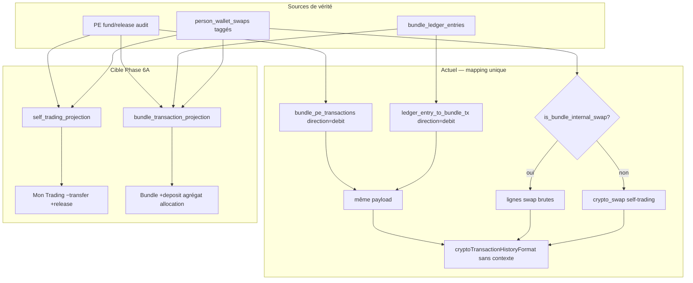

# Audit UX — projection historique transactionnel Bundle

**Date :** 2026-05-29  
**Mode :** READ-ONLY — aucune modification code / infra / ledger  
**Contexte :** investissement de 80 USDC dans le bundle « Crypto Majors »

---

# Executive summary

La **comptabilité PE / ledger** semble cohérente après les phases 4–5. Le problème observé est une **projection UX incorrecte** : la même opération métier est affichée avec un **signe**, un **libellé** et une **visibilité** inadaptés selon la vue (Mon Trading USDC vs détail bundle vs historique bundle).

Trois causes structurelles :


| #   | Symptôme                                                     | Cause racine                                                                                                                                                                                                                                                                                                     |
| --- | ------------------------------------------------------------ | ---------------------------------------------------------------------------------------------------------------------------------------------------------------------------------------------------------------------------------------------------------------------------------------------------------------- |
| 1   | Bundle affiche « Transfert vers Crypto Majors **−80 USDC** » | Le dépôt bundle est mappé côté backend avec `direction: "debit"` et un titre/subtitle pensés pour la **sortie self-trading**, réutilisés tels quels dans l’historique bundle (legacy PE **et** ledger Phase 4B). Le frontend applique le même formatter sans contexte de projection.                             |
| 2   | Mon Trading USDC affiche « Échange USDC → LINK »             | Fuite probable d’un swap Li.FI **sans** `bundle_execution: true` dans `audit_log` → `is_bundle_internal_swap()` retourne `false` → le swap passe le filtre self-trading et est mappé en `crypto_swap`. Effet miroir : ce même swap **n’apparaît pas** dans l’historique bundle (legacy filtre aussi sur le tag). |
| 3   | Pas d’agrégat « Allocation Crypto Majors » côté bundle       | Aucune couche `bundle_allocation_aggregate` : allocations = N lignes `bundle_internal_swap` (1 par leg), pas de regroupement par `batch_id`, pas de statut métier `completed / partial / failed`.                                                                                                                |


**Recommandation Phase 6A :** introduire deux projections explicites (`self_trading_transaction_projection`, `bundle_transaction_projection`) entre la source de vérité (PE, ledger, swaps taggés) et l’API/UI — sans toucher au moteur d’allocation ni au ledger en écriture.

---

# Observed UI issue

Scénario utilisateur après invest 80 USDC → bundle « Crypto Majors » :


| Vue                    | Observé                                     | Attendu                                                    |
| ---------------------- | ------------------------------------------- | ---------------------------------------------------------- |
| **Mon Trading / USDC** | « Transfert vers Crypto Majors −80 USDC » ✅ | Idem ✅                                                     |
| **Mon Trading / USDC** | « Échange USDC → LINK » ❌                   | Absent ❌                                                   |
| **Détail bundle**      | « Transfert vers Crypto Majors −80 USDC » ❌ | « Dépôt entrant +80 USDC » ✅                               |
| **Détail bundle**      | Pas d’agrégat allocation visible ❌          | « Allocation completed / in progress » avec total + legs ✅ |
| **Historique bundle**  | Swaps bruts ou absents                      | Agrégat par `batch_id`, détail expandable                  |


---

# Expected transaction projection model

## A. Self-trading (`Mon Trading / USDC`)

**Inclure :**

- `TRANSFER_TO_BUNDLE` → **−** montant entry asset (ex. −80 USDC)
- `TRANSFER_FROM_BUNDLE` → **+** montant entry asset

**Exclure strictement :**

- Tous les swaps internes bundle (`USDC → BTC/ETH/LINK/…`)
- Ordres exchange taggés `portfolio_scope=bundle`
- Dépôts Privy liés à un swap bundle interne

## B. Bundle detail + historique bundle

**Inclure :**

1. `BUNDLE_DEPOSIT` → **+** montant (ex. +80 USDC), libellé « Dépôt · Crypto Majors »
2. `BUNDLE_WITHDRAWAL` → **−** montant
3. **Allocation agrégée** par `batch_id` :
  - titre : « Allocation · {portfolio_name} »
  - statut : `completed | partial | failed | in_progress`
  - montant investi total
  - nombre de legs
  - actifs reçus (expandable)

**Exclure du flux principal :**

- Lignes brutes Li.FI par leg (sauf mode admin / détail expandable)

## C. Symétrie transfert


| Opération              | Self-trading | Bundle          |
| ---------------------- | ------------ | --------------- |
| Invest (fund cash leg) | −80 USDC     | +80 USDC        |
| Withdraw (release)     | +80 USDC     | −80 USDC        |
| Allocation interne     | invisible    | agrégat visible |


---

# Current backend data sources

## 1. Mon Trading — `GET /api/app/crypto-positions/{asset}/transactions`

**Service :** `TestClientService.get_crypto_transactions()`  
**Fichier :** `services/arquantix/api/services/test_clients/service.py`

Pipeline de merge :

```
exchange_orders (filtrés portfolio_scope≠bundle)
  + privy_deposits (filter_self_trading_privy_deposits)
  + orphan_webhook_crypto_txs (non filtrés bundle)
  + lifi_swaps → build_self_trading_lifi_swap_txs (exclude_bundle_internal_swaps)
  + bundle_pe_transfers → list_bundle_pe_asset_transactions
  → merge_crypto_transactions()
```

**Router :** `services/arquantix/api/services/test_clients/router.py` L673–679

**Proxy web :** `web/src/app/api/portal/crypto-wallet/[asset]/route.ts`  
Fusionne en plus `/api/app/privy-wallet/deposits` via `mergeCryptoWalletTransactions()` — cet endpoint applique aussi `filter_self_trading_privy_deposits` côté backend.

## 2. Bundle — `GET /api/app/bundle/{portfolio_id}/transactions`

**Service :** `list_bundle_portfolio_transactions()`  
**Fichier :** `services/arquantix/api/services/portfolio_engine/bundle_execution/bundle_portfolio_transactions.py`

```
if BUNDLE_LEDGER_HISTORY_ENABLED && reconciliation MATCH:
  → list_bundle_transactions_from_ledger()   # bundle_ledger/history.py
else:
  → _list_bundle_portfolio_transactions_legacy()
      swaps confirmés WHERE is_bundle_internal_swap
      + list_bundle_pe_asset_transactions(portfolio_id=…)
```

**Flag :** `BUNDLE_LEDGER_HISTORY_ENABLED` — default `**false`** (`bundle_ledger/config.py`)

**Proxy web :** `web/src/app/api/portal/crypto-wallet/bundle/[portfolioId]/route.ts`  
→ `consolidateSwapTransactions()` sur la réponse upstream.

## 3. Wallet history global (graphiques)

**Service :** `build_wallet_history()` — `services/arquantix/api/services/wallet_history/service.py`  
Reconstruction **performance / courbe**, pas liste transactionnelle. Filtre déjà `filter_self_trading_exchange_orders` pour le scope direct.  
**Ne réinjecte pas** les swaps bundle dans la liste USDC.

## 4. Sources PE / ledger / scope


| Fichier                             | Rôle                                                                   |
| ----------------------------------- | ---------------------------------------------------------------------- |
| `bundle_pe_transactions.py`         | Transferts fund/release → `bundle_pe_transfer`, direction debit/credit |
| `bundle_ledger/history.py`          | Lecture ledger → mapping UI (deposit, withdrawal, allocation legs)     |
| `bundle_transaction_scope.py`       | `is_bundle_internal_swap()` — requiert `bundle_execution=true`         |
| `self_trading_transactions.py`      | Filtres + mapping swaps self-trading                                   |
| `privy_wallet/transaction_merge.py` | `person_wallet_swap_to_crypto_tx` → `crypto_swap` / `lifi_swap`        |


---

# Current frontend formatters

## Formatter unique partagé

**Fichier :** `web/src/lib/portal/cryptoTransactionHistoryFormat.ts`

- `isIncomingLeg(tx)` → signe ± basé sur `direction` (`debit` = sortant)
- `isCryptoSwapTransaction(tx)` → matche `crypto_swap`, `side=swap`, paires crypto/crypto — **ne filtre pas** `bundle_internal_swap` ni `bundle_pe_transfer`
- `consolidateSwapTransactions()` → fusionne jambes swap Privy/Li.FI en une ligne « Échange · FROM → TO »
- `mapCryptoTransactionToHistoryItem()` → utilisé **identiquement** sur :
  - `PortalCryptoWalletDetailScreen` (Mon Trading USDC)
  - `PortalCryptoWalletBundleDetailScreen` (détail bundle)
  - `PortalCryptoWalletTransactionsScreen` (liste complète)

## Test frontend existant (révélateur)

`cryptoTransactionHistoryFormat.test.ts` — cas « bundle PE fund transfer » :

- Assert **volontaire** : `flowDirection: 'out'`, montant avec `−`
- Conçu pour self-trading, **pas** pour contexte bundle

## Pas de couche bundle côté web

- `bundleClient.ts` — types invest/withdraw, **pas** de projection transactions
- `PortalCryptoWalletBundleDetailScreen.tsx` L110–115 : `mapCryptoTransactionToHistoryItem(tx, currency)` sans paramètre `projectionContext`

---

# Root cause analysis

## Bundle page sign issue

### Pourquoi −80 USDC sur la page bundle ?

**Chaîne complète :**

1. **Source API :** `GET /api/app/bundle/{id}/transactions` → `list_bundle_portfolio_transactions`
2. **Legacy path (flag OFF ou fallback) :** réutilise `list_bundle_pe_asset_transactions` pour le fund :
  - `bundle_pe_transactions._tx_from_audit()` L72–75 :
    - `direction = "debit"`
    - `title = "Transfert vers {portfolio_name}"`
    - `subtitle = "-{amount} USDC · Mon Trading → Bundle"`
    - `transaction_kind = "bundle_pe_transfer"`
3. **Ledger path (flag ON + MATCH) :** `ledger_entry_to_bundle_tx()` pour `BUNDLE_DEPOSIT` L103–131 :
  - **Même mapping négatif** : `direction: "debit"`, subtitle `−amount`, titre « Transfert vers … »
  - Pas de libellé « Dépôt entrant », pas d’inversion de signe pour le contexte bundle
4. **Frontend :** `isIncomingLeg(tx)` L27–32 → `debit` → `flowDirection: 'out'` → affichage `−80 USDC`

**Conclusion :** le signe négatif n’est pas un bug d’amount ; c’est un **modèle directionnel unique centré self-trading** appliqué aux deux projections. Le champ `portfolio_scope: "bundle"` est présent sur certaines lignes ledger mais **ignoré** par le formatter.

---

## USDC page swap leak issue

### Pourquoi « Échange USDC → LINK » apparaît en Mon Trading ?

**Endpoint :** `/api/app/crypto-positions/USDC/transactions` → `get_crypto_transactions`

**Chemin normal (swap correctement taggé) :**

1. `PersonWalletSwapRepository.list_confirmed_for_person_asset(USDC)`
2. `build_self_trading_lifi_swap_txs` → `exclude_bundle_internal_swaps`
3. `is_bundle_internal_swap()` → `bundle_context_for_swap()` → exige `bundle_execution: true` dans audit `bundle_leg_context`
4. Swap exclu ✅ — couvert par `test_bundle_internal_swap_excluded_from_get_crypto_transactions`

**Chemin de fuite (prod probable) :**


| Condition                                          | Effet                                                                         |
| -------------------------------------------------- | ----------------------------------------------------------------------------- |
| `audit_log` sans entrée `bundle_leg_context`       | `is_bundle_internal_swap` → false                                             |
| `bundle_leg_context` sans `bundle_execution: true` | idem — **batch_id seul ne suffit pas** (`bundle_transaction_scope.py` L37–39) |
| Swap mappé via `person_wallet_swap_to_crypto_tx`   | `transaction_kind: "crypto_swap"`, `title: "Échange USDC → LINK"`             |
| Merge frontend `consolidateSwapTransactions`       | Renforce l’affichage swap même si backend a filtré partiellement              |


**Tagging attendu à l’exécution :** `bundle_lifi_leg_service._attach_bundle_context()` écrit `bundle_execution: True` dans l’audit — **si cette étape a échoué ou si le swap est antérieur au tagging**, la fuite est garantie.

**Effet miroir côté bundle :** `_list_bundle_portfolio_transactions_legacy` L127–128 filtre aussi sur `is_bundle_internal_swap` → swap non taggé **absent du bundle** et **visible en self-trading**. Cohérent avec l’observation « transfer OK + swap parasite USDC + pas d’allocation bundle ».

**Autres chemins secondaires :**

- `list_orphan_webhook_crypto_txs` — **non filtré** bundle (dépôts simples, rarement swap)
- Double merge platform + privy deposits — filtré si `metadata_json.swap_id` pointe vers swap taggé

**Frontend :** même si le backend excluait le swap, `isCryptoSwapTransaction()` ne possède **aucun garde-fou** `transaction_kind === 'bundle_internal_swap'` → défense en profondeur absente.

---

## Missing allocation aggregate issue

### Pourquoi l’allocation n’apparaît pas (ou mal) côté bundle ?

**Checklist diagnostic :**


| Question                                                   | Réponse code                                                                                |
| ---------------------------------------------------------- | ------------------------------------------------------------------------------------------- |
| `bundle_ledger_entries` contient `BUNDLE_ALLOCATION_BUY` ? | Oui si écriture Phase 4A active — à vérifier en prod par portfolio/batch                    |
| `GET /bundle/{id}/transactions` lit legacy ou ledger ?     | Ledger si `BUNDLE_LEDGER_HISTORY_ENABLED=true` **et** reconciliation `MATCH` ; sinon legacy |
| Flag OFF par défaut ?                                      | **Oui** — `default: false`                                                                  |
| Allocations filtrées ?                                     | Legacy : oui si swap **non taggé** ; ledger : non si entrées présentes                      |
| UI ignore `event_type` allocation ?                        | Non — mais affiche chaque leg comme `bundle_internal_swap` / swap consolidé                 |
| Agrégation `batch_id` ?                                    | **Absente** — `list_bundle_transactions_from_ledger` retourne 1 tx par entry                |


**Comportement actuel ledger ON :**

- `BUNDLE_ALLOCATION_BUY` → ligne individuelle :
  - `title: "Allocation · USDC → LINK"`
  - `transaction_kind: "bundle_internal_swap"`
  - `bundle_batch_id` présent mais **non utilisé** pour agréger

**Comportement legacy :**

- Swaps taggés → N lignes « Allocation · USDC → {asset} »
- Pas de statut batch, pas de total investi agrégé

**Frontend bundle :** `consolidateSwapTransactions()` sur la route bundle transforme les legs en « Échange · USDC → LINK » — **masque la sémantique allocation** même quand les données backend sont correctes.

---

# Recommended backend fixes

## Phase 6A — couche projection (sans changer le moteur)

### `self_trading_transaction_projection`

Nouveau module (ex. `bundle_execution/self_trading_projection.py`) :

```python
def project_self_trading_transactions(raw_txs: list[dict]) -> list[dict]:
    # Inclure: bundle_pe_transfer (debit fund, credit release)
    # Exclure: bundle_internal_swap, swaps lifi sans tag self-trading
    # Garde-fou: exclure explicitement transaction_kind in (bundle_internal_swap,)
    # Defense: re-check is_bundle_internal_swap on any lifi source
```

Brancher **uniquement** depuis `get_crypto_transactions` — pas de changement PE/ledger.

### `bundle_transaction_projection`

Nouveau module (ex. `bundle_execution/bundle_projection.py`) :

```python
def project_bundle_transactions(
    pe_transfers, ledger_entries, internal_swaps, *, portfolio_id
) -> list[dict]:
    # 1. BUNDLE_DEPOSIT → direction=credit, title="Dépôt · {name}", +amount
    # 2. BUNDLE_WITHDRAWAL → direction=debit, -amount
    # 3. Grouper BUNDLE_ALLOCATION_* + bundle_internal_swap par bundle_batch_id
    #    → transaction_kind=bundle_allocation_aggregate
    #    → metadata: legs[], status, total_invested, assets_allocated
```

Remplacer le mapping direct dans :

- `bundle_pe_transactions` (contexte bundle uniquement — garder mapping actuel pour self-trading)
- `bundle_ledger/history.py` → `ledger_entry_to_bundle_tx` deposit branch
- `bundle_portfolio_transactions.py` → post-process agrégation

### Hardening tagging (prod data)

- Script diagnostic : swaps avec `batch_id` metadata mais sans `bundle_execution` dans audit
- Alerte si `person_wallet_swaps` confirmés liés à un batch invest sans tag

### Orphan webhook

- Appliquer `filter_self_trading_privy_deposits` / check bundle sur `list_orphan_webhook_crypto_txs`

---

# Recommended frontend fixes

## 1. Formatter context-aware

```typescript
type TransactionProjectionContext = 'self_trading' | 'bundle'

mapCryptoTransactionToHistoryItem(tx, currency, {
  projectionContext: 'bundle',
})
```

Règles bundle :

- `bundle_pe_transfer` + fund → force `incoming`, titre « Dépôt · {portfolio} », `+amount`
- `bundle_allocation_aggregate` → variant dédié `allocation`, pas `swap`
- Ne pas appeler `consolidateSwapTransactions` sur les agrégats allocation

## 2. Route bundle

`crypto-wallet/bundle/[portfolioId]/route.ts` :

- Remplacer consolidation swap brute par respect des agrégats backend
- `consolidateSwapTransactions` uniquement pour legs expandable / admin

## 3. Garde-fou self-trading

Dans `isCryptoSwapTransaction()` ou filtre amont :

```typescript
if (tx.transactionKind === 'bundle_internal_swap') return false
if (tx.portfolioScope === 'bundle') return false // si présent
```

## 4. Tests frontend à ajouter

- Bundle deposit → `+80 USDC`, titre « Dépôt »
- Self-trading transfer → `−80 USDC`
- Raw `USDC → LINK` `bundle_internal_swap` → absent self-trading
- Agrégat allocation → visible bundle, expandable legs

---

# Required tests

## Backend


| Test                                                          | Objectif                                                                |
| ------------------------------------------------------------- | ----------------------------------------------------------------------- |
| `test_usdc_history_excludes_bundle_allocation_swap`           | Swap taggé absent de `get_crypto_transactions(USDC)`                    |
| `test_usdc_history_shows_transfer_to_bundle_negative`         | `bundle_pe_transfer` debit −80 présent                                  |
| `test_bundle_history_shows_deposit_positive`                  | Projection bundle : deposit +80, direction credit                       |
| `test_bundle_history_aggregates_allocation_by_batch`          | 5 legs → 1 agrégat, metadata legs                                       |
| `test_bundle_history_does_not_show_raw_lifi_legs_by_default`  | API default sans legs bruts                                             |
| `test_bundle_history_with_ledger_flag_off_still_correct_sign` | Legacy + projection deposit +                                           |
| `test_bundle_history_with_ledger_flag_on_shows_allocation`    | Ledger MATCH → agrégat allocation                                       |
| `test_bundle_internal_swap_missing_context_is_detected`       | Swap sans `bundle_execution` → signal diagnostic / exclusion double vue |


## Frontend


| Test                                                          | Fichier cible                            |
| ------------------------------------------------------------- | ---------------------------------------- |
| Bundle deposit displayed positive in bundle context           | `cryptoTransactionHistoryFormat.test.ts` |
| Transfer to bundle displayed negative in self-trading context | idem (existant, conserver)               |
| Allocation aggregate displayed in bundle activity             | nouveau describe `bundle projection`     |
| Raw USDC→LINK swap not displayed in USDC activity             | filtre + merge test                      |


---

# Implementation plan Phase 6A

**Principe :** projection pure — **aucun changement** moteur allocation, écriture ledger, fund/release PE.

## Étape 1 — Backend projection (P0)

1. Créer `bundle_projection.py` + `self_trading_projection.py`
2. Inverser signe/libellé deposit **uniquement** dans projection bundle
3. Agrégation allocation par `batch_id` / `bundle_batch_id`
4. Brancher dans `list_bundle_portfolio_transactions` et `get_crypto_transactions`
5. Tests backend (8 tests ci-dessus)

## Étape 2 — Frontend (P0)

1. `projectionContext` dans formatter
2. Route bundle : stop consolidation aveugle
3. Garde-fou `bundle_internal_swap` self-trading
4. Tests frontend

## Étape 3 — Observabilité prod (P1)

1. Script swaps sans `bundle_execution` par batch invest
2. Métrique `bundle_history_projection_source` (legacy vs ledger)
3. Dashboard admin : legs bruts expandable

## Étape 4 — Rollout (P1)

1. Déployer projection backend seule → vérifier API
2. Déployer frontend
3. Activer `BUNDLE_LEDGER_HISTORY_ENABLED` **après** projection compatible ledger (signes deposit)

**Hors scope Phase 6A :** modification Mon Trading balances, retrait bundle, écriture ledger, refonte allocation.

---

# Annexe — diagramme flux actuel vs cible




---

# Fichiers inspectés (priorité audit)


| Fichier                                    | Constat                                     |
| ------------------------------------------ | ------------------------------------------- |
| `test_clients/service.py`                  | Merge self-trading correct **si** tags OK   |
| `wallet_history/service.py`                | Courbes only — pas cause liste tx           |
| `bundle_portfolio_transactions.py`         | Pas d’agrégation ; fallback legacy fréquent |
| `bundle_pe_transactions.py`                | Fund = debit partout                        |
| `bundle_ledger/history.py`                 | BUNDLE_DEPOSIT = debit — bug projection     |
| `bundle_transaction_scope.py`              | Filtre strict `bundle_execution`            |
| `self_trading_transactions.py`             | Filtres OK, pas de garde-fou kind           |
| `transaction_merge.py`                     | Swap → crypto_swap générique                |
| `cryptoTransactionHistoryFormat.ts`        | Formatter unique, signe via direction       |
| `bundle/[portfolioId]/route.ts`            | consolidateSwapTransactions sur bundle      |
| `PortalCryptoWalletBundleDetailScreen.tsx` | Même mapper que self-trading                |


---

**Statut :** audit terminé — prêt pour validation Phase 6A implementation.