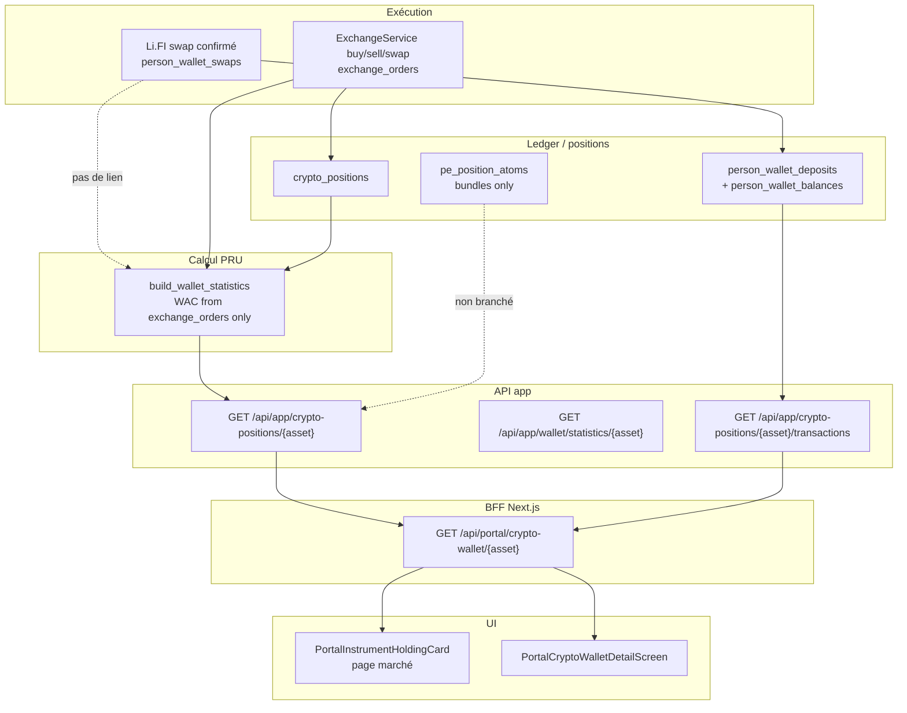

# Audit — Prix de revient / Average buy price (prix d’exécution)

**Date :** 2026-05-29  
**Mode :** lecture seule (aucune modification de code applicatif)  
**Périmètre :** backend Arquantix API, BFF Next.js portail, composants UI marché / wallet crypto  

---

## 1. Executive summary

Le prix de revient affiché dans le portail **n’est pas alimenté par le prix d’exécution réel des swaps Li.FI / ledger Privy** (ex. `3.33335 USDC / 0.04140135 AAVE ≈ 80.51 USDC/AAVE`). Il est calculé **uniquement** à partir des ordres `exchange_orders` complétés, via un **coût moyen pondéré (WAC)** en **EUR par unité de crypto**, avec conversion USD au **taux EURUSDT spot courant**.

Pour une acquisition **USDC → AAVE via Li.FI** (activité « Échange · USDC → AAVE » visible dans l’historique), **aucun `ExchangeOrder` BUY AAVE n’est créé** : le règlement passe par `person_wallet_swaps` + `person_wallet_deposits`. Résultat : `avg_buy_price_*` = `null`, P&L non réalisé alimenté à **0** côté API privy-only, et l’UI diverge entre pages.

**Verdict global : incorrect** pour le cas observé (swap on-chain / Li.FI self-trading). **Partiellement correct** pour les achats/ventes et swaps passant par `ExchangeService` (moteur plateforme), où des ordres EUR sont persistés — mais le PRU y est dérivé des **quotes marché EUR** (bid/ask), pas du ratio `amount_in / amount_out` on-chain.

---

## 2. Symptôme observé

| Surface | Valeur affichée | Attendu (ordre de grandeur) |
|--------|-----------------|------------------------------|
| Page marché AAVE — « Prix de revient » | `$0.000000` | ~80.51 USDC/AAVE (ou équivalent EUR) |
| Page crypto AAVE — « Avg. buy price » | `—` | idem |
| P&L (les deux pages) | ~0 | unrealized ≈ `(82.10 − 80.51) × 0.04140135` USD hors FX/frais |
| Activité | +0.04140135 AAVE / −3.33335 USDC | cohérent avec exécution réelle |

Position affichée : **0.041401 AAVE**, valeur ~**2.92 €** (cours ~70 € en EUR ou ~82 $ en USD selon la vue).

---

## 3. Sources de vérité trouvées

### 3.1 Tables / modèles backend

| Entité | Table / modèle | Rôle pour le PRU |
|--------|----------------|------------------|
| Ordres plateforme | `public.exchange_orders` (`ExchangeOrder`) | **Seule source** du WAC dans `wallet_statistics` |
| Position plateforme | `public.crypto_positions` (`CryptoPosition`) | Quantité pour valorisation / `position_size` (scope global) |
| Swaps Li.FI | `person_wallet_swaps` (`PersonWalletSwap`) | Exécution réelle (`amount_in`, `estimated_receive`, `vancelian_fee`, `tx_hash`) — **historique + ledger, pas PRU** |
| Ledger Privy | `person_wallet_deposits` | Crédits/débits swap (`transaction_kind=crypto_swap`, metadata `swap_amount_from` / `swap_amount_to`) |
| Soldes Privy | `person_wallet_balances` | Quantité on-chain / ledger pour patrimoine fusionné |
| Portfolio Engine | `pe_position_atoms` (`cost_basis`, `average_entry_price`) | Bundles / direct overlay — **non utilisé** par `get_crypto_wallet_detail` |
| Cotations | `market_data_latest_quotes` + FX `EURUSDT` | Prix courant et conversion EUR↔USD |

### 3.2 Services de calcul

| Service | Fichier | Usage |
|---------|---------|--------|
| WAC + P&L spot | `api/services/wallet_statistics/service.py` → `build_wallet_statistics()` | PRU, cost basis, unrealized/realized |
| Détail wallet API | `api/services/test_clients/service.py` → `get_crypto_wallet_detail()` | Agrège stats EUR/USD pour l’UI |
| Swap plateforme | `api/services/exchange/service.py` → `swap()` | Crée 2 `exchange_orders` (SELL + BUY) avec prix **EUR quote** |
| Règlement Li.FI | `api/services/lifi/lifi_swap_settlement.py` | Ledger Privy uniquement — **pas d’`exchange_orders`** |
| Fusion patrimoine | `api/services/privy_wallet/patrimony_merge.py` | Soldes / valorisation — **pas de PRU** |
| Historique tx UI | `api/services/privy_wallet/transaction_merge.py` | Affichage activité (swaps mappés avec `price: "0"`) |

### 3.3 Documentation interne (état cible vs réalité)

- `services/arquantix/PNL_ACCOUNTING_AUDIT_AND_PRD.md` : WAC sur `exchange_orders` ; swap crypto↔crypto **non couvert** pour Li.FI au moment de l’audit PRD initial.
- `services/arquantix/PRICING_HARDENING_REPORT.md` (référencé dans le code) : champs `avg_buy_price_eur/usd` sur le détail wallet — tests sur **BUY EUR** uniquement.
- Swap **plateforme** : désormais implémenté dans `ExchangeService.swap()` (deux jambes + `swap_group_id`), mais **distinct** du swap Li.FI client.

---

## 4. Data flow complet



**Cas observé (USDC → AAVE Li.FI) :** branche gauche uniquement jusqu’à l’historique ; la branche `exchange_orders` → `wallet_statistics` est **vide** pour AAVE.

---

## 5. Champs utilisés actuellement

### 5.1 API → UI (`CryptoWalletDetailPayload`)

| Champ API | Champ UI (TS) | Sémantique |
|-----------|---------------|------------|
| `avg_buy_price_eur` | `detail.avgBuyPriceEur` | PRU unitaire **EUR** (null si aucun BUY dans `exchange_orders`) |
| `avg_buy_price_usd` | `detail.avgBuyPriceUsd` | PRU unitaire **USD** (= EUR × EURUSDT **courant**, pas historique) |
| `average_purchase_price` | `detail.averagePurchasePrice` | Alias legacy (= avg EUR) |
| `cost_basis` | `detail.costBasis` | **Coût total** position = `balance × avg_price` (EUR), pas prix unitaire |
| `unrealized_gain_eur/usd` | `detail.unrealizedGainEur/Usd` | Depuis `wallet_statistics.unrealized_pnl` |
| `realized_gain_*` | idem | Depuis stats |
| `current_price_eur/usd` | idem | Quote USDT → EUR via FX |
| `volume` | `detail.volume` | Solde affiché (PE et/ou fusion Privy via BFF) |

### 5.2 `exchange_orders` (agrégation WAC)

Pour chaque ordre `status = completed` et `side = buy` :

- `amount_crypto` → quantité achetée (net frais crypto sur BUY EUR)
- `price` → **prix unitaire en EUR** (commentaire code : « execution price in EUR » ; en pratique **ask/bid résolu** par `ExchangeService._resolve_price`, pas ratio swap on-chain)

Pour `side = sell` : realized utilise `amount_to` si présent, sinon `amount_fiat - fee`.

### 5.3 Activité swap Li.FI (UI seulement)

`person_wallet_swap_to_crypto_tx` renseigne `price: "0"`, `amount_fiat: "0"` — **pas de propagation** vers les stats.

Metadata ledger (`person_wallet_deposits.metadata_json`) contient `swap_amount_from`, `swap_amount_to`, `amount_actual` : **exploitable pour un PRU d’exécution, mais non lu aujourd’hui**.

---

## 6. Formule actuelle du prix de revient

### 6.1 `build_wallet_statistics` (référence unique pour le détail wallet)

```
total_buy_cost = Σ (amount_crypto × price)   pour tous les BUY complétés (après filtres scope)
total_bought   = Σ amount_crypto
avg_buy_price  = total_buy_cost / total_bought   si total_bought > 0, sinon 0

cost_basis     = position_size × avg_buy_price
current_value  = position_size × current_price   # current_price = quote USDT → EUR ou USD
unrealized_pnl = current_value - cost_basis
```

- **`position_size`** : `crypto_positions.balance` (scope global/direct), ou `pe_position_atoms.quantity` (scope bundle).
- **Filtre Mon Trading** : `filter_self_trading_exchange_orders` exclut `metadata_.portfolio_scope = bundle`.
- **Prix courant** : `market_data_latest_quotes.last_price` (USDT) converti en EUR si `reference_currency=EUR`.

### 6.2 Swap plateforme (`ExchangeService.swap`)

- Jambe SELL : `price = price_from` (EUR, bid).
- Jambe BUY : `price = price_to` (EUR, ask), `amount_fiat = net_reference` (EUR net après frais sur jambe vendue).
- PRU AAVE résultant = **prix ask EUR** au moment du swap, **pas** `USDC_out / AAVE_in`.

### 6.3 Cas privy-only (`_build_privy_only_wallet_detail`)

```
avg_buy_price_* = None
cost_basis = None
unrealized_gain_* = "0.00"   # chaînes signées, pas null
```

---

## 7. Écart avec la formule attendue (cas AAVE)

### Attendu métier (transaction observée)

```
execution_price_usdc_per_aave = amount_usdc_paid / amount_aave_received
                             ≈ 3.33335 / 0.04140135 ≈ 80.51 USDC/AAVE
```

Puis conversion affichage :

- En **USD** : ~80.51 $/AAVE (USDC ≈ 1 USD).
- En **EUR** : `80.51 / eurusdt_rate` (taux **à définir** : spot à l’exécution vs spot affichage — aujourd’hui le code utilise le spot **courant** pour USD, pas le taux au trade).

```
unrealized_usd ≈ (current_price_usd - 80.51) × 0.04140135
```

Avec `current_price_usd = 82.10` → **~0.066 USD** (hors frais Li.FI / bridge).

### Implémenté aujourd’hui

| Étape | Implémenté |
|-------|------------|
| Lire `amount_in` / `amount_out` du swap Li.FI | Non (historique UI uniquement) |
| Créer BUY `exchange_orders` pour jambe AAVE | Non |
| Calculer WAC | N/A (0 ordre BUY) → `avg_buy_price = 0` → API renvoie `null` |
| Page marché | `null ?? 0` → **$0.000000** via `formatCryptoPrice` |
| Page crypto | `null` → **—** |

### Écart swap plateforme (si l’utilisateur avait utilisé `/api/app/exchange/swap`)

Même avec ordres, le PRU serait **€/AAVE ask** figé par le moteur de quotes, pas le ratio USDC/AAVE exécuté on-chain (slippage, route Li.FI, frais bridge).

---

## 8. Bugs probables classés par sévérité

### Critique

1. **Li.FI / ledger Privy non branchés sur le WAC** — acquisitions réelles sans `exchange_orders` → PRU absent.
2. **Détail wallet privy-only** (`_build_privy_only_wallet_detail`) force P&L à **0.00** alors que la position a une valeur de marché > 0.

### Majeur

3. **`PortalInstrumentHoldingCard`** : `selectMoneyValue(avgBuyPrice…) ?? detail.costBasis ?? 0` — affiche **0** au lieu de `—` ; libellé « Prix de revient » mais variable = **prix unitaire moyen** ; formatage **toujours en USD** (`formatCryptoPrice(..., 'USD')`) même si la devise client est EUR.
4. **Désalignement quantité** : BFF peut afficher le solde **fusionné Privy** (`alignCryptoWalletDetailWithScopedPosition` / `buildCryptoWalletDetailFromScopedPosition`) alors que `build_wallet_statistics` lit **`crypto_positions`** — PRU et quantité peuvent ne pas correspondre au solde affiché.
5. **Swap plateforme** : PRU basé sur quotes EUR, pas sur exécution `amount_from/amount_to` réelle.

### Mineur

6. **USD historique** : `avg_buy_price_usd` = `avg_eur × eurusdt_rate` **actuel** (documenté dans PRICING_HARDENING) — erreur FX si le taux a bougé.
7. **Realized SELL** : audit PNL existant — `amount_fiat` gross vs `amount_to` net (partiellement corrigé pour sells dans wallet_statistics via `amount_to`).
8. **Activité** : `price: "0"` sur txs Li.FI — pas de prix d’exécution dans la liste (l’utilisateur le déduit des montants).

---

## 9. Fichiers concernés

### Backend (calcul & API)

- `services/arquantix/api/services/wallet_statistics/service.py`
- `services/arquantix/api/services/test_clients/service.py`
- `services/arquantix/api/services/test_clients/router.py` (`/crypto-positions/{asset}`, `/wallet/statistics/{asset}`)
- `services/arquantix/api/services/exchange/service.py`, `models.py`, `repository.py`
- `services/arquantix/api/services/lifi/lifi_swap_settlement.py`, `models.py`
- `services/arquantix/api/services/privy_wallet/transaction_merge.py`, `patrimony_merge.py`
- `services/arquantix/api/services/portfolio_engine/bundle_execution/self_trading_transactions.py`
- `services/arquantix/api/services/wallet_history/service.py`

### BFF Next.js

- `services/arquantix/web/src/app/api/portal/crypto-wallet/[asset]/route.ts`
- `services/arquantix/web/src/lib/portal/cryptoWalletFormat.ts`

### Frontend UI

- `services/arquantix/web/src/components/portal/markets/PortalInstrumentHoldingCard.tsx`
- `services/arquantix/web/src/components/portal/markets/PortalInstrumentDetailScreen.tsx`
- `services/arquantix/web/src/components/portal/wallet/PortalCryptoWalletDetailScreen.tsx`
- `services/arquantix/web/src/lib/portal/cryptoWalletTypes.ts`
- `services/arquantix/web/src/lib/portal/marketsFormat.ts` (`formatCryptoPrice`)

### Tests (couverture actuelle)

- `services/arquantix/api/tests/test_wallet_statistics.py` — BUY/SELL `exchange_orders` uniquement
- `services/arquantix/api/tests/test_pricing_hardening.py` — détail dual-currency après **BUY EUR**
- `services/arquantix/api/tests/test_lifi_swaps_mock.py` — historique titres swap, **pas** de PRU
- **Aucun test** : USDC→AAVE Li.FI → `avg_buy_price` ≈ 80.51

---

## 10. Tests existants — couverture

| Scénario | Couvert ? |
|----------|-----------|
| BUY EUR → BTC → avg_buy_price > 0 | Oui (`test_pricing_hardening`, `test_wallet_statistics_single_buy`) |
| WAC après SELL | Oui (`test_wallet_statistics_buy_sell`) |
| Exclusion ordres bundle du self-trading | Oui (`test_bundle_post_fix_filters`) |
| Swap Li.FI USDC→altcoin → PRU | **Non** |
| UI marché vs crypto cohérence null/0 | **Non** |
| PRU = ratio execution on-chain | **Non** |

---

## 11. Recommandations de correction (sans implémentation)

1. **Décision produit unique** : le PRU self-trading doit-il refléter (a) le ratio **stablecoin/crypto exécuté** (Li.FI), (b) la **valeur EUR de référence** au moment T (comme swap plateforme), ou les deux avec libellés distincts ?
2. **Alimenter le WAC depuis les swaps Li.FI** : à chaque `apply_swap_settlement`, créer des événements de coût (option A : `exchange_orders` synthétiques taggés `source=lifi` ; option B : table `cost_lots` / extension ledger avec prix d’exécution USDC→EUR snapshot).
3. **Unifier la quantité** : même source pour `volume` affiché et `position_size` dans les stats (Privy + PE fusionnés).
4. **Corriger l’UI** : ne jamais remplacer `null` par `0` pour le PRU ; harmoniser `—` ; libellé « Prix de revient unitaire » ; respecter `currency` client (EUR/USD).
5. **P&L privy-only** : si PRU inconnu, unrealized = `—` (ou « PRU inconnu »), pas `0.00`.
6. **Frais** : documenter si le coût d’acquisition inclut `vancelian_fee` + frais route Li.FI (recommandation : **coût total USDC débité / quantité AAVE créditée**).
7. **FX** : persister `eurusdt_rate` (ou prix EUR/USD) **au timestamp du swap** pour conversion PRU et P&L USD.

---

## 12. Plan de fix proposé en phases

### Phase 0 — Garde-fous UI (rapide, faible risque)

- `PortalInstrumentHoldingCard` : afficher `—` si PRU null ; utiliser `currency` du client ; ne pas confondre PRU unitaire et `cost_basis` total.
- Aligner P&L affiché sur champs API sans fallback `?? 0` arbitraire.

### Phase 1 — Ingestion coût Li.FI

- À la confirmation/settlement : calculer `execution_price = amount_in_usdc / amount_out_asset` (stablecoin → crypto).
- Persister snapshot FX + montants dans metadata ou ordre synthétique.
- Étendre `build_wallet_statistics` (ou service dédié) pour agréger **exchange_orders + événements Li.FI**.

### Phase 2 — Cohérence patrimoine

- Fusionner soldes Privy et PE pour `position_size` dans les stats.
- Tests d’intégration : mock swap USDC→AAVE → `avg_buy_price_usd ≈ 80.51`, unrealized > 0 si cours > PRU.

### Phase 3 — Harmonisation swap plateforme / on-chain

- Optionnel : pour `ExchangeService.swap`, stocker aussi `execution_ratio` réel si exécution externe.
- Portfolio Engine : lier ou non `pe_position_atoms.cost_basis` au même moteur (bundles).

### Phase 4 — Qualité & régression

- Tests E2E portail (marché + crypto) sur le même payload BFF.
- Métriques / alertes : `volume > 0 AND avg_buy_price IS NULL` → anomalie data.

---

## Réponses aux questions clés

| Question | Réponse |
|----------|---------|
| Le prix de revient est-il calculé à partir du prix d’exécution réel ? | **Non** pour Li.FI/Privy. **Partiellement** pour exchange (prix EUR quote, pas ratio on-chain). |
| Les swaps USDC → crypto alimentent-ils le cost basis ? | **Non** (ledger + historique seulement). **Oui** si swap via `ExchangeService.swap` (2 ordres EUR). |
| Pourquoi marché `$0.000000` et crypto `—` ? | Même API : `avg_buy_price` null ; marché fait `?? 0` + format USD ; crypto teste `!= null`. |
| Deux modèles concurrents ? | **Oui** : `exchange_orders` (WAC) vs `person_wallet_*` (soldes/activité) vs `pe_position_atoms` (bundles). |
| Devise du coût ? | **EUR** en base (`exchange_orders.price`, `currency` default EUR) ; USD = conversion spot EURUSDT. |
| Frais swap inclus ? | Li.FI : non dans PRU (pas de PRU). Plateforme : frais sur jambe SELL en EUR, BUY à `net_reference`. |
| P&L désactivé ou non alimenté ? | **Non alimenté** (pas de cost basis) ; API renvoie **0.00** en privy-only ; UI masque ou affiche 0. |
| Tests à ajouter ? | Swap Li.FI → PRU ; cohérence BFF volume/stats ; UI null vs 0 ; scénario EUR vs USD. |

---

## Endpoints inspectés

| Méthode | Endpoint | Rôle |
|---------|----------|------|
| GET | `/api/app/crypto-positions/{asset}` | Détail position + PRU/P&L |
| GET | `/api/app/crypto-positions/{asset}/transactions` | Historique (exchange + Privy + Li.FI) |
| GET | `/api/app/crypto-positions/direct` | Hub self-trading / scope Privy |
| GET | `/api/app/wallet/statistics/{asset}` | Stats brutes (même moteur WAC) |
| GET | `/api/app/bootstrap` | `reference_currency` |
| GET | `/api/market-data/market-summary` | Cours / change 24h (BFF) |
| GET | `/api/portal/crypto-wallet/{asset}` | Agrégation BFF portail |
| POST | `/api/swaps/*`, `/api/app/exchange/swap` | Exécution (chemins distincts) |

Pas de route `/api/app/markets/*` dédiée au PRU : la page marché consomme **`/api/portal/crypto-wallet/{ticker}`**.

---

## Fichiers inspectés (liste)

**Backend :**  
`wallet_statistics/service.py`, `test_clients/service.py`, `test_clients/router.py`, `exchange/service.py`, `exchange/models.py`, `lifi/lifi_swap_settlement.py`, `lifi/models.py`, `privy_wallet/transaction_merge.py`, `privy_wallet/patrimony_merge.py`, `portfolio_engine/bundle_execution/self_trading_transactions.py`, `PNL_ACCOUNTING_AUDIT_AND_PRD.md`

**BFF / Web :**  
`app/api/portal/crypto-wallet/[asset]/route.ts`, `lib/portal/cryptoWalletFormat.ts`, `components/portal/markets/PortalInstrumentHoldingCard.tsx`, `components/portal/wallet/PortalCryptoWalletDetailScreen.tsx`, `lib/portal/marketsFormat.ts`

**Tests :**  
`test_wallet_statistics.py`, `test_pricing_hardening.py`, `test_lifi_swaps_mock.py`, `test_bundle_post_fix_filters.py`

---

## Conclusion

| Verdict | Justification |
|---------|---------------|
| **Incorrect** | Pour une position acquise via **swap Li.FI USDC→AAVE**, le PRU attendu (~80.51 USDC/AAVE) n’est ni calculé ni exposé ; P&L affiché à zéro / absent. |

**Minimum de modifications (phase suivante, hors audit) :**

1. Brancher le coût d’acquisition des swaps Li.FI confirmés sur le même moteur que `build_wallet_statistics` (ou équivalent).  
2. Corriger les fallbacks UI (`0` → `—`, devise cohérente).  
3. Ajouter un test d’intégration USDC→AAVE avec assertion sur `avg_buy_price_usd` et `unrealized_gain_usd`.

---

*Audit réalisé par analyse statique du dépôt — pas de requête SQL ni d’appel prod sur compte utilisateur.*
