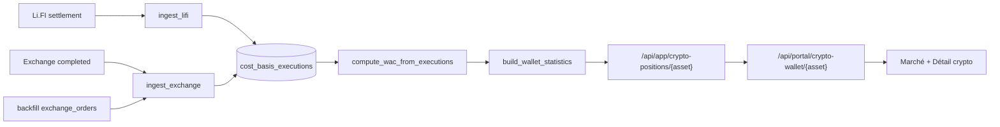

# Cost Basis V2 — Rapport d’implémentation

**Date :** 2026-05-29  
**Référence audit :** `[COST_BASIS_EXECUTION_PRICE_AUDIT.md](./COST_BASIS_EXECUTION_PRICE_AUDIT.md)`  
**Doctrine normative :** `[COST_BASIS_V2_DOCTRINE.md](./COST_BASIS_V2_DOCTRINE.md)`  
**Objectif :** couche canonique PRU / cost basis pour les **échanges économiques** uniquement, FX figé à l’exécution.

---

## 1. Architecture finale

### Principe

Chaque **fait d’exécution économique** (swap, trade, rebalancing, liquidation) est persisté une fois dans `cost_basis_executions` avec :

1. **Vérité native** (`native_quote_asset`, `native_execution_price`, `native_notional`)
2. **Valorisation USD** (`execution_price_usdc`, `execution_notional_usdc`) — figée
3. **Valorisation EUR** (`execution_price_eur`, `execution_notional_eur`) — figée
4. **Taux FX figé** (`eurusd_rate_at_execution` = quote EURUSDT au moment T)

Le **WAC / PRU** et le **P&L** (réalisé / non réalisé) sont calculés en relisant ces faits (`compute_wac_from_executions`), **sans** reconvertir l’historique au FX spot actuel.

**Hors table :** dépôts/retraits vault, borrow, yield — voir doctrine §2–5 (`position_movements`, `vault_positions`, `liabilities`, `yield_events` à créer). **PRU toujours par actif et par scope** (direct vs bundle X), jamais un PRU unique « bundle » multi-actifs.

### Flux




### Règles de valorisation (`valuation.py`)


| Cas                | Quote native | PRU exact                    | PRU dérivé                         |
| ------------------ | ------------ | ---------------------------- | ---------------------------------- |
| USDC/USDT → Crypto | USDC         | USD (USDC≈1)                 | EUR via `usdt_to_eur` au taux figé |
| EURC → Crypto      | EUR          | EUR                          | USD = EUR × `eurusd_rate`          |
| Crypto → Crypto    | actif source | USD via prix marché figé à T | EUR dérivé                         |


---

## 2. Schéma de données

**Table :** `public.cost_basis_executions` (migration `170`)


| Colonne                                            | Description                              |
| -------------------------------------------------- | ---------------------------------------- |
| `client_id`                                        | PE client                                |
| `person_id`                                        | Optionnel (Li.FI)                        |
| `position_asset`                                   | Actif de position (ex. AAVE)             |
| `event_kind`                                       | `acquisition`                            |
| `quantity`                                         | Quantité d’actif                         |
| `native_quote_asset`                               | USDC, EUR, ETH, …                        |
| `native_execution_price`                           | Prix unitaire natif                      |
| `native_notional`                                  | Notionnel natif (hors frais selon jambe) |
| `execution_price_usdc` / `execution_notional_usdc` | Figés                                    |
| `execution_price_eur` / `execution_notional_eur`   | Figés                                    |
| `eurusd_rate_at_execution`                         | Taux EURUSDT à T                         |
| `fees_usdc` / `fees_eur`                           | Frais figés                              |
| `provider_source`                                  | `lifi`, `exchange`, …                    |
| `provider_execution_id`                            | Clé idempotence                          |
| `tx_hash`                                          | Hash on-chain si applicable              |
| `counterparty_asset`                               | Actif contrepartie                       |
| `portfolio_scope` / `portfolio_id`                 | Scope direct / bundle                    |
| `executed_at`                                      | Horodatage exécution                     |


**Contrainte unique :** `(provider_source, provider_execution_id)`

---

## 3. Sources de vérité


| Source                              | Ingestion                                                                         | Idempotence                                                        |
| ----------------------------------- | --------------------------------------------------------------------------------- | ------------------------------------------------------------------ |
| Li.FI / Privy                       | `ingest_lifi_swap_settlement` après `apply_swap_settlement`                       | `lifi:{swap_id}:acquisition:{asset}` (+ disposal si crypto↔crypto) |
| Exchange interne                    | `ingest_exchange_order` à la finalisation BUY/SELL/swap                           | `exchange:{order_id}`                                              |
| Historique exchange                 | `backfill_exchange_orders_for_client_asset` (lazy dans `build_wallet_statistics`) | Même clés                                                          |
| Bundle Li.FI (rebalance)            | `ingest_bundle_lifi` — scope `bundle` (§14)                                       | `bundle-lifi:{swap_id}:…`                                          |
| Morpho / Ledgity (deposit/withdraw) | **Volontairement exclus** — pas d’échange économique (doctrine §2)                | Couches `vault_positions` / `position_movements` (futur)           |
| RWA / traditionnel                  | Extension **si** exécution d’achat/vente réelle                                   | `provider_source` dédié                                            |


Les tables sources (`exchange_orders`, `person_wallet_swaps`, ledger) restent pour **audit et historique UI** ; elles ne sont plus la source du calcul PRU.

---

## 4. Intégration sans casser l’historique

1. **Backfill lazy** : à chaque `build_wallet_statistics`, `backfill_exchange_orders_for_client_asset` ré-ingère les ordres `completed` (idempotent) → les positions historiques **BUY/SELL EUR** conservent un PRU cohérent.
2. **Pas de suppression** des `exchange_orders` existants.
3. **Li.FI futur** : chaque nouveau settlement alimente automatiquement la table.
4. **Tests existants** `test_wallet_statistics_`* et `test_pricing_hardening` : **passent** après backfill.

Positions déjà acquises **uniquement via Li.FI** avant ce déploiement : nécessitent un **script de backfill Li.FI** (swaps `CONFIRMED` sans ligne cost basis) — hors scope de ce commit, documenté en §9.

---

## 5. Fichiers modifiés

### Backend (nouveau package)

- `services/cost_basis/models.py`
- `services/cost_basis/valuation.py`
- `services/cost_basis/repository.py`
- `services/cost_basis/ingest.py`
- `services/cost_basis/ingest_lifi.py`
- `services/cost_basis/ingest_exchange.py`
- `services/cost_basis/wac.py`
- `services/cost_basis/__init__.py`
- `alembic/versions/170_cost_basis_executions.py`
- `tests/test_cost_basis_v2.py`

### Backend (intégration)

- `services/lifi/lifi_swap_settlement.py` — hook ingestion
- `services/exchange/service.py` — hook à la complétion des ordres
- `services/wallet_statistics/service.py` — WAC via cost basis V2
- `tests/conftest.py` — ORM + `CREATE TABLE` test

### Frontend

- `web/src/components/portal/markets/PortalInstrumentHoldingCard.tsx` — `—` si PRU null, devise client, P&L aligné API

### Documentation

- `docs/arquantix/COST_BASIS_V2_IMPLEMENTATION_REPORT.md` (ce fichier)

---

## 6. Migrations

- `**170_cost_basis_executions.py`** — créer la table + index + contrainte unique.

**À exécuter en local / prod :** `alembic upgrade head` (projet `services/arquantix/api`, selon runbook existant — **validation utilisateur requise** pour prod).

---

## 7. Endpoints impactés

Comportement enrichi (même contrat JSON) :


| Endpoint                                 | Effet                                                    |
| ---------------------------------------- | -------------------------------------------------------- |
| `GET /api/app/crypto-positions/{asset}`  | `avg_buy_price_eur/usd` alimentés après Li.FI + backfill |
| `GET /api/app/wallet/statistics/{asset}` | WAC / P&L depuis cost basis V2                           |
| `GET /api/portal/crypto-wallet/{asset}`  | Même payload via upstream                                |


---

## 8. Tests ajoutés

Fichier : `tests/test_cost_basis_v2.py`


| Test                                            | Exigence prompt                    |
| ----------------------------------------------- | ---------------------------------- |
| `test_usdc_to_aave_execution_price`             | PRU USD ≈ 80.51                    |
| `test_eurc_to_btc_eur_exact_usd_derived`        | EUR exact, USD dérivé              |
| `test_eth_to_aave_cross_frozen_usd_eur`         | Valorisations figées crypto↔crypto |
| `test_idempotent_duplicate_provider_execution`  | Une seule ligne                    |
| `test_wac_usdc_aave_avg_buy_price_usd`          | WAC + unrealized > 0               |
| `test_lifi_settlement_ingest_creates_execution` | Hook settlement                    |


Régression : `test_wallet_statistics_single_buy`, `test_wallet_statistics_buy_sell` — **OK**.

---

## 9. Cas restant à couvrir


| Domaine                                     | Statut                                                            |
| ------------------------------------------- | ----------------------------------------------------------------- |
| Bundles (legs Li.FI rebalance)              | **Implémenté** — §14 ; PRU par actif + scope bundle               |
| Morpho / Ledgity vaults                     | **Hors `cost_basis_executions`** — doctrine §5 (couches séparées) |
| Borrow / Lombard                            | Liability layer (futur), pas PRU acquisition                      |
| Yield / rewards vault                       | `yield_events` (futur), pas PRU                                   |
| RWA / actifs traditionnels                  | Extension **uniquement** sur exécutions achat/vente               |
| Backfill Li.FI historique (pré-déploiement) | **Implémenté** — `scripts/backfill_cost_basis_lifi.py` (§13)      |
| `wallet_history` performance charts         | **Implémenté** — `cost_basis_executions` si présentes (§14)       |
| Patrimoine privy-only sans `pe_client_id`   | Skip ingestion (log warning)                                      |
| FX historique intra-journalier              | Un taux EURUSDT à T (amélioration : table FX timeseries)          |


---

## 10. Risques identifiés

1. **Migration non appliquée** → erreur SQL ; tests locaux créent la table via `checkfirst=True`.
2. **Double comptage** si backfill exchange + ingestion live : mitigé par contrainte unique.
3. **Écart PE vs Privy** sur `position_size` : WAC utilise encore `crypto_positions` pour la taille ; BFF peut afficher solde Privy fusionné — risque résiduel d’écart P&L % (audit §8.4).
4. **Swaps bundle internes** : ingérés via `bundle_lifi` + `portfolio_scope=bundle` (§14) ; exclus du backfill Mon Trading.
5. **EURC/EUR** : traités comme quote EUR (peg 1:1).

---

## 11. Recommandations futures

Voir **[COST_BASIS_V2_DOCTRINE.md](./COST_BASIS_V2_DOCTRINE.md)** pour les règles normatives.

1. ~~**Ingestion bundle (rebalance)**~~ : fait (§14).
2. **Morpho / Ledgity** : `vault_positions` + `position_movements` — **ne pas** mapper deposit/withdraw vers `cost_basis_executions`.
3. **Borrow / Lombard** : table `liabilities` (dette), séparée du PRU collatéral.
4. **Yield vault** : `yield_events` pour revenus / performance épargne.
5. ~~**Charts wallet `performance_value**`~~ : fait (§14) pour trades ; charts vault = NAV/yield, pas PRU.
6. **Persister snapshot FX** horodaté (table dédiée) pour audit réglementaire.
7. **API** : exposer `execution_price_usdc` / `native_quote_asset` sur détail transaction pour transparence UI.

---

## 12. Déploiement minimal

1. Merger + `alembic upgrade head` (170).
2. Redémarrer API Arquantix.
3. Les **nouveaux** swaps Li.FI alimentent le PRU automatiquement.
4. Les positions **exchange historiques** se corrigent au prochain appel statistics (backfill lazy).
5. Lancer le **backfill Li.FI historique** (§13) pour les swaps confirmés antérieurs (ex. AAVE).

---

## 13. Backfill Li.FI historique

### Objectif

Ingérer rétroactivement les swaps `person_wallet_swaps` en statut **CONFIRMED** qui n’ont pas encore de ligne dans `cost_basis_executions` (ex. USDC → AAVE avant déploiement V2).

### Fichiers


| Fichier                                     | Rôle                                                                                  |
| ------------------------------------------- | ------------------------------------------------------------------------------------- |
| `services/cost_basis/lifi_swap_amounts.py`  | Résolution `amount_out` : audit → ledger → `estimated_receive` → on-chain (optionnel) |
| `services/cost_basis/lifi_execution_ids.py` | Détection « déjà ingéré » (idempotence)                                               |
| `services/cost_basis/backfill_lifi.py`      | Moteur scan + ingest via `ingest_lifi_swap_settlement`                                |
| `scripts/backfill_cost_basis_lifi.py`       | CLI dry-run / execute                                                                 |
| `tests/test_cost_basis_lifi_backfill.py`    | Tests automatisés                                                                     |


### Commandes (depuis `services/arquantix/api`)

```bash
# Dry-run (défaut) — liste swaps éligibles, aucune écriture
python3 -m scripts.backfill_cost_basis_lifi --asset AAVE

# Exécution — corrige le PRU pour les swaps manquants
python3 -m scripts.backfill_cost_basis_lifi --execute --asset AAVE

# Compte précis
python3 -m scripts.backfill_cost_basis_lifi --execute --person-id <UUID>
python3 -m scripts.backfill_cost_basis_lifi --execute --client-id <UUID>

# Verbose + limite
python3 -m scripts.backfill_cost_basis_lifi --dry-run --limit 50 -v
```

### Comportement

- **Scan** : tous les swaps `CONFIRMED` (filtres optionnels).
- **Ignore** : bundles internes, déjà ingérés, sans `pe_client_id`.
- **Montants** : pas de prix spot si audit/ledger/quote suffisent ; `--allow-onchain-resolve` en dernier recours.
- **Ingestion** : même code que le settlement live (`ingest_lifi_swap_settlement`).
- **Logs JSON** : `scanned`, `eligible`, `ingested`, `rows_created`, `ignored`, `errors`, détail par swap.

### Cas AAVE observé

Après `--execute --asset AAVE` (ou `--person-id` du client concerné) :

- Ligne `lifi:{swap_id}:acquisition:AAVE` créée.
- `execution_price_usdc` ≈ `3.33335 / 0.04140135` ≈ **80.51 USDC/AAVE**.
- Au prochain chargement wallet / marché : `avg_buy_price_usd` alimenté, UI `—` → PRU affiché.

### Tests

```bash
python3 -m pytest tests/test_cost_basis_lifi_backfill.py -q
```

---

## 14. Bundles + charts DeFi (crypto wallet)

### Ingestion bundle Li.FI


| Fichier                                            | Rôle                                      |
| -------------------------------------------------- | ----------------------------------------- |
| `services/cost_basis/ingest_lifi_core.py`          | Logique partagée direct / bundle          |
| `services/cost_basis/ingest_bundle_lifi.py`        | Ingestion scoped `portfolio_scope=bundle` |
| `services/cost_basis/bundle_lifi_execution_ids.py` | Idempotence `bundle-lifi:{swap_id}:…`     |
| `services/cost_basis/backfill_bundle_lifi.py`      | Backfill swaps `bundle_internal`          |
| `scripts/backfill_cost_basis_bundle_lifi.py`       | CLI dry-run / execute                     |
| `bundle_lifi_leg_service.py`                       | Hook post-confirmation PE atoms           |


Provider : `bundle_lifi` — distinct de `lifi` (Mon Trading).

### Charts (`wallet_history`)


| Fichier                                 | Rôle                                                           |
| --------------------------------------- | -------------------------------------------------------------- |
| `services/cost_basis/history_events.py` | `cost_basis_executions` → événements buy/sell                  |
| `services/wallet_history/service.py`    | `performance_value` (et NAV) basés sur exécutions si présentes |


Couvre :

- **Bundle** : `/api/app/bundle/{portfolio_id}/history?mode=performance_value`
- **Mon Trading / actifs DeFi** (AAVE, etc.) : `/api/app/wallet/history?mode=performance_value` dès qu’il existe des lignes `portfolio_scope=direct`

`wallet_statistics` déclenche un backfill bundle lazy (max 200 swaps) au premier appel stats bundle.

### Commandes backfill bundle

```bash
python3 -m scripts.backfill_cost_basis_bundle_lifi
python3 -m scripts.backfill_cost_basis_bundle_lifi --execute --portfolio-id <UUID>
```

### Tests

```bash
python3 -m pytest tests/test_cost_basis_bundle.py -q
```

### Hors périmètre `cost_basis_executions` (doctrine)

- **Morpho / Ledgity** : deposit/withdraw = transfert de poche → PRU de l’actif déposé **inchangé** ; historique via `onchain_vault_transaction` + couches futures `vault_positions` / `position_movements`.
- **Borrow** : dette, pas acquisition avec PRU.
- **Yield** : revenu, pas PRU classique.

---

## 15. Doctrine produit (résumé)


| Événement                       | Impact PRU                    | Table cible                              |
| ------------------------------- | ----------------------------- | ---------------------------------------- |
| Swap / trade / rebalance bundle | Oui (par actif, par scope)    | `cost_basis_executions`                  |
| Liquidation                     | Oui (`disposal`, P&L réalisé) | `cost_basis_executions`                  |
| Dépôt / retrait vault           | Non                           | `position_movements` / `vault_positions` |
| Borrow                          | Non (dette)                   | `liabilities`                            |
| Yield / rewards                 | Non (revenu)                  | `yield_events`                           |


Document complet : **[COST_BASIS_V2_DOCTRINE.md](./COST_BASIS_V2_DOCTRINE.md)**.

---

*Implémentation alignée sur la doctrine « exécutions économiques uniquement » — PRU par actif et par scope ; vaults et dettes sur couches séparées.*