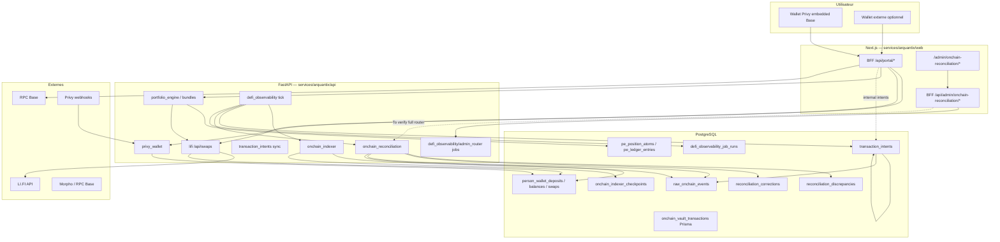

# Architecture transactionnelle DeFi — Vancelian.finance / Arquantix

**Audience :** backend senior, architecte système, DevOps/SRE, compliance/ops technique, auditeur externe.  
**Périmètre code :** `services/arquantix/api` (FastAPI, Alembic), `services/arquantix/web` (Next.js BFF + admin).  
**Mode :** documentation issue du code réel (mai 2026). Aucune modification applicative décrite ici.

**Documents liés :**


| Document                                | Rôle                                                                |
| --------------------------------------- | ------------------------------------------------------------------- |
| `TRANSACTION_INTENTS_DEFI.md`           | Intents par produit (phases 7–10)                                   |
| `DEFI_OBSERVABILITY_RUNBOOK.md`         | Tick observabilité                                                  |
| `DEFI_OBSERVABILITY_PROD_RUNBOOK.md`    | Prod readiness, lock, cron                                          |
| `DEFI_OBSERVABILITY_OPS_GO_LIVE.md`     | Mise en service cron, premier run, incidents                          |
| `ONCHAIN_INDEXER_BASE.md`               | Indexer Base                                                        |
| `BASE_RPC_RECONCILIATION_SETUP.md`      | RPC réconciliation                                                  |
| `AUDIT_DEFI_TRANSACTIONAL_INTEGRITY.md` | Audit intégrité (certaines sections pré-indexer sont **obsolètes**) |


---

## 1. Executive summary

Le système DeFi Vancelian maintient **plusieurs couches** qui ne doivent jamais être confondues :


| Couche                           | Rôle                                                             | Source de vérité                               |
| -------------------------------- | ---------------------------------------------------------------- | ---------------------------------------------- |
| **Blockchain (Base)**            | État final des transferts, swaps, vault txs                      | Chaîne + receipts RPC                          |
| **raw_onchain_events**           | Preuve indexée, immuable, consommable une fois                   | Indexer / replay                               |
| **transaction_intents**          | Cycle de vie **métier** produit (LI.FI, Morpho, Lombard, Bundle) | Application (upsert idempotent)                |
| **Ledger applicatif**            | `person_wallet_`*, `pe_*`, vault Prisma                          | Écritures contrôlées (settlement, webhook, PE) |
| **reconciliation_discrepancies** | Écarts détectés (pas de correction auto)                         | Scripts / tick / health                        |
| **reconciliation_corrections**   | Workflow humain preview → apply whitelisté                       | Admin                                          |


**Principe directeur :**

> **Blockchain = source de vérité finale**  
> **DB = miroir opérationnel réconciliable**  
> Les intents **observent** ; le settlement et l’apply **ne sont pas** déclenchés par le tick ni par la sync intent.

---

## 2. Architecture globale




**To verify (déploiement `main` commit `ec4344d2`) :** seul `defi_observability_admin_router` est monté dans `main.py` (endpoints `/jobs`). Le router complet `onchain_reconciliation_admin_router` et les routers internes Morpho/Lombard intents existent dans le code mais **peuvent ne pas être inclus** au boot API prod tant qu’ils ne sont pas commités + branchés dans `main.py`.

---

## 3. Golden rules transactionnelles


| Règle                                                        | Implémentation / référence                                                                                                                         |
| ------------------------------------------------------------ | -------------------------------------------------------------------------------------------------------------------------------------------------- |
| **Jamais de balance update « direct » hors chemins connus**  | Settlement LI.FI : `lifi_swap_settlement.apply_swap_settlement` ; dépôts Privy : webhook ; apply correction : whitelist uniquement                 |
| **Pas d’apply sans preuve raw vérifiée** (apply financier)   | `correction_policy.discrepancy_has_verified_raw_event`, `ALLOWED_RAW_EVENT_TYPES`, `consumed_by_correction_id`                                     |
| **Pas de correction automatique**                            | `reconcile_`*, `reconcile_stale_intents`, tick : `persist_discrepancies` seulement ; pas d’appel `apply_correction`                                |
| **Pas de mock en prod**                                      | `productionSandboxGuard.ts` (web boot) ; `production_mock_guard.py` (`LIFI_SWAPS_MOCK`, `BUNDLE_LIFI_SYNC_MOCK`) — **To verify** appel au boot API |
| **Idempotence obligatoire**                                  | UQ DB + clés métier (voir §15)                                                                                                                     |
| **Preuve on-chain : `tx_hash` + `log_index` (+ `chain_id`)** | `raw_onchain_events`, `person_wallet_deposits`                                                                                                     |
| **Admin apply = double validation**                          | `request_correction` → `approve_correction` (requester ≠ approver en prod) → `apply_correction`                                                    |
| **Raw event consommable une seule fois**                     | `raw_event_consumption.mark_raw_event_consumed`                                                                                                    |
| **Cron observe, n’applique jamais**                          | `defi_observability_tick` : écritures limitées (§13)                                                                                               |


---

## 4. Tables principales

### 4.1 `person_wallet_deposits`


| Attribut          | Détail                                                                                 |
| ----------------- | -------------------------------------------------------------------------------------- |
| **Rôle**          | Entrées ledger crédit/débit tracées (dépôts Privy, settlement LI.FI, correction apply) |
| **Source**        | Webhook Privy, `apply_swap_settlement`, `create_missing_deposit_from_raw_event`        |
| **Mutabilité**    | Insert ; pas de void/delete via apply (interdit)                                       |
| **Idempotence**   | `UNIQUE (chain_id, tx_hash, log_index)` ; `idempotency_key` unique optionnel           |
| **Consommateurs** | Balances, réconciliation, export admin                                                 |
| **Risques**       | `admin_simulate_deposit` ; dépôt sans preuve on-chain si webhook seul                  |


**Modèle :** `services/arquantix/api/services/privy_wallet/models.py` — `PersonWalletDeposit`  
**Migration :** antérieure à 161 (table préexistante) ; réconciliation runs : `160_person_wallet_reconciliation.py`

### 4.2 `person_wallet_balances`


| Attribut          | Détail                                                 |
| ----------------- | ------------------------------------------------------ |
| **Rôle**          | Agrégat soldes par wallet + asset                      |
| **Source**        | `PersonWalletBalanceRepository.increment_balance`      |
| **Mutabilité**    | Update incrémental                                     |
| **Idempotence**   | `UNIQUE (person_crypto_wallet_id, asset)`              |
| **Consommateurs** | API wallet, réconciliation `balance_ledger_vs_onchain` |
| **Risques**       | Désalignement vs on-chain si settlement partiel LI.FI  |


### 4.3 `person_wallet_swaps`


| Attribut          | Détail                                                                           |
| ----------------- | -------------------------------------------------------------------------------- |
| **Rôle**          | Session swap LI.FI (quote → confirm → settle)                                    |
| **Source**        | `LifiQuoteService`, `LifiExecuteService`                                         |
| **Mutabilité**    | Status, `tx_hash`, `audit_log`, montants                                         |
| **Idempotence**   | Intent : `lifi_swap:{swap_id}` ; settlement : `lifi-swap:{swap_id}:debit/credit` |
| **Consommateurs** | LI.FI API, intents, bundle legs                                                  |
| **Risques**       | `CONFIRMED` sans settlement ; partial LI.FI                                      |


**Modèle :** `services/arquantix/api/services/lifi/models.py`

### 4.4 `raw_onchain_events`


| Attribut          | Détail                                                         |
| ----------------- | -------------------------------------------------------------- |
| **Rôle**          | Preuve on-chain normalisée (ERC-20 Transfer, native optionnel) |
| **Source**        | `replay_onchain`, `run_base_indexer_once`                      |
| **Mutabilité**    | Insert ; `consumed_by_correction_id` set une fois              |
| **Idempotence**   | `UNIQUE (chain_id, tx_hash, log_index)`                        |
| **Consommateurs** | Réconciliation, link intent, apply correction                  |
| **Risques**       | Indexer incomplet ; wallet non surveillé                       |


**Migration :** `161_raw_onchain_events.py`  
**Modèle :** `services/onchain_indexer/models.py` — `RawOnChainEvent`

### 4.5 `transaction_intents`


| Attribut          | Détail                                                              |
| ----------------- | ------------------------------------------------------------------- |
| **Rôle**          | Intent métier par produit/opération                                 |
| **Source**        | `*_intent_sync.py`, `TransactionIntentRepository.upsert`            |
| **Mutabilité**    | Upsert status/metadata ; **pas** de mutation ledger                 |
| **Idempotence**   | `UNIQUE (person_id, product_type, operation_type, idempotency_key)` |
| **Consommateurs** | Health, réconciliation intent, admin                                |
| **Risques**       | Drift vs swap/vault ; stale sans TTL auto-fix                       |


**Migrations :** `166`, `167` (`linked_reference_id`)  
**Enums :** `services/transaction_intents/enums.py`

### 4.6 `reconciliation_discrepancies`


| Attribut          | Détail                                                                           |
| ----------------- | -------------------------------------------------------------------------------- |
| **Rôle**          | Écart détecté, priorisé, workflow humain                                         |
| **Source**        | `user_reconcile`, `wallet_dry_run`, `persist_intent_discrepancies`, stale health |
| **Mutabilité**    | Status : open → acknowledged/ignored/resolved                                    |
| **Idempotence**   | `fingerprint` SHA256 unique                                                      |
| **Consommateurs** | Admin, CSV export, alertes tick                                                  |
| **Risques**       | Flood P0 ; faux positifs balance-only                                            |


**Migration :** `162_reconciliation_discrepancies.py`  
**Modèle :** `discrepancy_models.py`

### 4.7 `reconciliation_corrections`


| Attribut          | Détail                                                     |
| ----------------- | ---------------------------------------------------------- |
| **Rôle**          | Audit trail preview/request/approve/apply                  |
| **Source**        | `correction_workflow`, `correction_apply`                  |
| **Mutabilité**    | Transitions de statut ; `applied_at`                       |
| **Idempotence**   | Une correction appliquée par discrepancy + action (policy) |
| **Consommateurs** | Admin, consommation raw event                              |
| **Risques**       | Double apply ; approver = requester en dev                 |


**Migrations :** `162`, `163` (status default `preview`)

### 4.8 `onchain_indexer_checkpoints`


| Attribut          | Détail                                                               |
| ----------------- | -------------------------------------------------------------------- |
| **Rôle**          | Curseur bloc indexer continu Base                                    |
| **Source**        | `CheckpointRepository.advance_after_chunk`                           |
| **Mutabilité**    | `last_scanned_block`, `status`, `metadata_json`                      |
| **Idempotence**   | `UNIQUE (chain_id, indexer_name)` — `base_continuous`                |
| **Consommateurs** | `run_base_indexer_once`                                              |
| **Risques**       | Checkpoint avancé si crash mid-chunk — **To verify** atomicité chunk |


**Migration :** `165_onchain_indexer_checkpoints.py`

### 4.9 `defi_observability_job_runs`


| Attribut          | Détail                                          |
| ----------------- | ----------------------------------------------- |
| **Rôle**          | Historique ticks cron `defi_observability_tick` |
| **Source**        | `DefiJobRunRepository`                          |
| **Mutabilité**    | Insert + finish                                 |
| **Idempotence**   | N/A (un run = une ligne)                        |
| **Consommateurs** | Admin `/jobs`                                   |
| **Risques**       | Aucun impact financier                          |


**Migration :** `168_defi_observability_job_runs.py`

### 4.10 `onchain_vault_transactions`


| Attribut          | Détail                                                                          |
| ----------------- | ------------------------------------------------------------------------------- |
| **Rôle**          | Opérations vault Morpho / Lombard / Ledgity (web Prisma)                        |
| **Source**        | BFF prepare / confirm, receipts RPC                                             |
| **Mutabilité**    | `pending` → `success` / `reverted` / `failed`                                   |
| **Idempotence**   | Clés métier côté app (group_key Lombard, vault tx id) — **To verify** UQ Prisma |
| **Consommateurs** | Intents Morpho/Lombard, réconciliation SQL brute                                |
| **Risques**       | Table hors SQLAlchemy API — lectures via SQL text                               |


**Schéma :** `services/arquantix/web/prisma/schema.prisma` — `OnchainVaultTransaction`

### 4.11 `user_vault_positions`


| Attribut          | Détail                                                  |
| ----------------- | ------------------------------------------------------- |
| **Rôle**          | Position agrégée utilisateur / vault (affichage / sync) |
| **Source**        | `syncUserVaultPositionFromLedger` (web)                 |
| **Mutabilité**    | Update depuis ledger vault                              |
| **Consommateurs** | Portal savings / Morpho UI                              |
| **Risques**       | Désync vs `onchain_vault_transactions`                  |


### 4.12 `pe_position_atoms` / `pe_ledger_entries`


| Attribut          | Détail                                                            |
| ----------------- | ----------------------------------------------------------------- |
| **Rôle**          | Portfolio Engine — positions et écritures append-only             |
| **Source**        | Bundle orchestrator, PE settlement                                |
| **Mutabilité**    | `pe_ledger_entries` **append-only**                               |
| **Idempotence**   | Clés PE métier (bundle batch, legs) — **To verify** par opération |
| **Consommateurs** | Bundles, réconciliation `bundle_`* gaps                           |
| **Risques**       | Triple comptabilité wallet / PE / vault                           |


**Modèles :** `portfolio_engine/positions/models.py`, `portfolio_engine/ledger_entries/models.py`

---

## 5. Transaction lifecycle générique

### 5.1 Statuts intent (`IntentStatus`)

`created` → `awaiting_signature` → `submitted` → `confirming` → terminal :

- `confirmed` — succès métier + ledger cohérent (ou attendu)
- `failed` — échec produit / tx
- `partial` — LI.FI / bundle leg partiel
- `reconciliation_required` — confirmé côté produit mais settlement/preuve manquante

### 5.2 Enchaînement cible

```text
Intent created (upsert produit)
    → awaiting_signature (prepare / quote signable)
    → submitted (tx_hash connu)
    → confirming (poll LI.FI / receipt pending)
    → confirmed | failed | partial | reconciliation_required
    → try_link_raw_event_to_intent (si tx_hash + indexer)
    → scan réconciliation (layer intent / lifi / privy / morpho / lombard)
    → discrepancy si mismatch
    → admin : preview → request → approve → apply (whitelist)
```

**Fichiers clés :** `transaction_intents/repository.py`, `raw_event_link.py`, `transaction_intent_reconciliation.py`, `onchain_reconciliation/correction_workflow.py`, `correction_apply.py`

---

## 6. Flux LI.FI swap

### 6.1 Pipeline


| Étape              | Service / fonction                                                  | Effet DB                                 |
| ------------------ | ------------------------------------------------------------------- | ---------------------------------------- |
| Quote              | `LifiQuoteService` → `on_swap_created`                              | `person_wallet_swaps` + intent `created` |
| Prepare execute    | `LifiExecuteService.prepare_execute` → `on_swap_awaiting_signature` | status `AWAITING_SIGNATURE`              |
| Submit             | `submit_signed_tx` → `on_swap_submitted`                            | `tx_hash`, intent `submitted`            |
| Poll LI.FI         | `refresh_swap_status` → `on_swap_lifi_poll`                         | `confirming` / `partial` / `failed`      |
| Done + montant     | `resolve_lifi_actual_receive_amount` (`lifi_actual_receive.py`)     | audit `actual_receive`                   |
| Settlement         | `apply_swap_settlement` (`lifi_swap_settlement.py`)                 | debit/credit deposits + balances         |
| Blocked settlement | `SwapSettlementBlocked` → `on_swap_settlement_blocked`              | intent `reconciliation_required`         |
| Confirmed          | `on_swap_confirmed`                                                 | intent `confirmed` si settlement OK      |


### 6.2 Mapping intent

- `product_type` : `lifi_swap`
- `linked_table` : `person_wallet_swaps`
- `linked_id` : UUID swap
- `idempotency_key` : `lifi_swap:{swap_id}`
- Lien raw : `try_link_raw_event_to_intent` après `tx_hash`

**Fichier sync :** `services/transaction_intents/lifi_intent_sync.py` — **ne appelle jamais** settlement.

### 6.3 API publique

Prefix : `/api/swaps` — `services/lifi/routes.py`

- `POST /quote`, `POST /execute`
- `POST /{swap_id}/submit`, `GET /{swap_id}`

### 6.4 Risques restants


| Risque                     | Détection                                                                         | Fichiers                             |
| -------------------------- | --------------------------------------------------------------------------------- | ------------------------------------ |
| CONFIRMED sans settlement  | intent `reconciliation_required`, discrepancy `swap_confirmed_without_settlement` | `lifi_intent_sync`, `user_reconcile` |
| Partial LI.FI              | `is_lifi_partial_substatus`, intent `partial`                                     | `lifi_actual_receive.py`             |
| Montant estimé vs on-chain | `resolve_lifi_actual_receive_amount`                                              | `lifi_execute_service.py`            |


### 6.5 Tests

`test_lifi_execute_status.py`, `test_lifi_swap_settlement.py`, `test_lifi_actual_receive_settlement.py`, `test_phase7_transaction_intents.py`

---

## 7. Flux Morpho Earn

### 7.1 Périmètre

- `integration_mode=direct_morpho` uniquement pour sync intent
- Opérations : `deposit`, `withdraw` (`MORPHO_EARN_OPERATIONS`)

### 7.2 Pipeline

1. Web `morphoVaultLedger.ts` — prepare → crée `onchain_vault_transactions` pending
2. `morphoIntentSync.ts` → `POST /api/internal/transaction-intents/morpho/pending`
3. Signature + submit tx
4. Receipt → `morpho/receipt` → `mark_morpho_intent_confirmed/failed`
5. `syncUserVaultPositionFromLedger` — **inchangé** (ledger vault → position UI)

### 7.3 Intent

- `idempotency_key` : `morpho_earn:{person}:{vault}:{op}:{group_key}:{tx_index}`
- `linked_reference_id` : cuid vault tx (migration 167)
- `linked_table` : `onchain_vault_transactions`

**Backend :** `morpho_intent_sync.py`, `morpho_intent_router.py`  
**Web :** `morphoIntentSync.ts`, `morphoVaultLedger.ts`

### 7.4 Limites

- Pas de mutation TTL auto sur intents
- Pas de repay Morpho via intents (**To verify** périmètre produit)
- Router internal **To verify** monté en prod

### 7.5 Tests

`test_phase7b_morpho_transaction_intents.py`

---

## 8. Flux Lombard Borrow

### 8.1 Modèle parent + steps

- Parent : `product_type=lombard_borrow`, `operation_type=borrow`
- `metadata_json.steps` : `approve`, `authorize`, `open_loan`
- Step status : `pending`, `submitted`, `confirmed`, `failed`
- `recompute_lombard_parent_status` après chaque step

### 8.2 Pipeline


| Moment       | Fichier                                                                 |
| ------------ | ----------------------------------------------------------------------- |
| Prepare      | `lombardLedger.ts` → `lombard_intent_router` prepare                    |
| Confirm      | `api/portal/lombard/confirm/route.ts` → `syncLombardIntentAfterConfirm` |
| Receipt sync | `lombard_intent_sync.sync_lombard_step_from_ledger_receipt`             |


**Linked :** `onchain_vault_transactions_group`, `linked_reference_id=group_key`

### 8.3 Partial / mock

- Parent `partial` si mix steps confirmed/pending/failed
- Mock : `lombardMockPrivyLedgerCredit` — bloqué prod via sandbox guard + discrepancies `lombard_mock_`*

### 8.4 Gaps réconciliation

`lombard_group_without_parent_intent`, `lombard_step_success_intent_step_not_confirmed`, `lombard_parent_partial_stale`, etc. — `transaction_intent_reconciliation.py`

### 8.5 Limites

**Repay / withdraw / close Lombard :** non documentés dans intents — **To verify** si implémentés ailleurs.

### 8.6 Tests

`test_phase7c_lombard_transaction_intents.py`, `lombardMockPrivyLedgerCredit.test.ts`

---

## 9. Flux Bundle invest

### 9.1 Parent + legs

- Parent : `bundle_invest`, `operation_type=invest`
- `linked_table` : `bundle_invest_lock`
- `linked_reference_id` : `batch_id` (UUID — **pas** de table `bundle_batch`)
- `metadata_json.legs` : asset, `swap_id`, `tx_hash`, status leg

### 9.2 Hooks orchestration


| Moment               | Fichier                                                         |
| -------------------- | --------------------------------------------------------------- |
| Lock invest          | `orchestrator._invest_via_lifi` → `ensure_bundle_parent_intent` |
| Leg quote/swap       | `bundle_lifi_leg_service.py` → `register_bundle_leg`            |
| Submit / confirm leg | `mark_bundle_leg_submitted/confirmed/failed`                    |
| Fin batch            | `sync_bundle_parent_from_batch_status`                          |


### 9.3 Coexistence LI.FI

Chaque leg crée aussi un intent `lifi_swap` (via `LifiExecuteService`) ; le parent bundle référence `swap_id` dans les legs.

### 9.4 Gaps

`bundle_batch_without_parent_intent`, `bundle_leg_failed_with_pe_atoms`, `bundle_parent_confirmed_leg_not_confirmed`, etc.

### 9.5 Limites

- Exchange sync bundle hors LI.FI : **To verify**
- `BUNDLE_LIFI_SYNC_MOCK` interdit prod (`production_mock_guard.py`)

### 9.6 Tests

`test_phase7d_bundle_transaction_intents.py`

---

## 10. raw_onchain_events et indexer Base

### 10.1 Scripts


| Script                           | Module                                  | Args principaux                                           |
| -------------------------------- | --------------------------------------- | --------------------------------------------------------- |
| `scripts/replay_onchain.py`      | `block_range_replay.replay_block_range` | `--chain base`, `--from-block`, `--to-block`, `--dry-run` |
| `scripts/run_onchain_indexer.py` | `run_base_indexer_once`                 | `--once` (requis), `--dry-run`, `--force`                 |


### 10.2 Indexer continu (`--once`)

**Fichier :** `continuous_base_indexer.py` — `run_base_indexer_once`

- ERC-20 Transfer logs par chunk
- Native : `native_block_scan.py` si `ONCHAIN_INDEXER_BASE_NATIVE_ENABLED=true`
- Confirmations : `ONCHAIN_INDEXER_BASE_CONFIRMATIONS` (défaut 12)
- Chunk : `ONCHAIN_INDEXER_BASE_CHUNK_SIZE` (défaut 10)
- Max blocs/run : `ONCHAIN_INDEXER_BASE_MAX_BLOCKS_PER_RUN` (défaut 500)
- Checkpoint : `INDEXER_NAME_BASE_CONTINUOUS = "base_continuous"`

**Interdit explicitement :** balances, deposits, corrections, rebuild.

### 10.3 Consommation correction

`raw_onchain_events.consumed_by_correction_id` → FK `reconciliation_corrections.id` (migration 164)

### 10.4 Chaîne

**Base uniquement** (`chain_id` 8453 via `CHAIN_BASE`) — pas multi-chain indexer.

### 10.5 Tests

`test_phase6_continuous_indexer.py`, `test_raw_onchain_events.py`

---

## 11. Réconciliation

### 11.1 Scripts / services


| Outil         | Fichier                                                         | CLI / API                              |
| ------------- | --------------------------------------------------------------- | -------------------------------------- |
| Wallet        | `wallet_dry_run.build_wallet_reconcile_report`                  | `scripts/reconcile_wallet.py`          |
| User          | `user_reconcile.build_user_reconcile_report`                    | `scripts/reconcile_user.py`            |
| Intent health | `transaction_intent_health.py`                                  | `scripts/transaction_intent_health.py` |
| Intent gaps   | `transaction_intent_reconciliation.scan_intent_gaps_for_person` | appelé par user reconcile              |


### 11.2 Layers & severities


| Layer                            | Exemples `discrepancy_type`                                                                                            |
| -------------------------------- | ---------------------------------------------------------------------------------------------------------------------- |
| `privy`                          | `balance_ledger_vs_onchain`, `onchain_event_without_db_ledger`, `db_ledger_without_onchain_proof`, `admin_sim_deposit` |
| `lifi`                           | `swap_confirmed_without_settlement`, `swap_pending_stale`                                                              |
| `morpho` / `lombard` / `ledgity` | `vault_tx_pending_stale`, gaps intent                                                                                  |
| `intent`                         | `intent_{status}_stale`, `swap_without_intent`, `raw_event_without_intent`                                             |


**Severity :** `P0`, `P1`, `P2` — seuils alertes tick : `DEFI_OPS_OPEN_P0_THRESHOLD`, `DEFI_OPS_OPEN_P1_THRESHOLD`

### 11.3 Balance-only vs raw proof

- **Balance-only :** comparaison RPC `eth_getBalance` + token balance vs `person_wallet_balances` — peut nécessiter plage de blocs (**limitation historique**)
- **Raw proof :** présence / absence `raw_onchain_events` + lien deposit

### 11.4 Stale intents

`transaction_intent_health.reconcile_stale_intents(dry_run=…)` — crée discrepancies `intent_<status>_stale` sans modifier intents.

**TTL :** `transaction_intent_ttl.py` + env `INTENT_TTL_*_MINUTES`

---

## 12. Correction workflow admin

### 12.1 Statuts


| Entité      | Valeurs                                                   |
| ----------- | --------------------------------------------------------- |
| Discrepancy | `open`, `acknowledged`, `ignored`, `resolved`             |
| Correction  | `preview`, `requested`, `approved`, `applied`, `rejected` |


### 12.2 Workflow

```text
POST .../preview-correction     → preview_service (actions suggérées)
POST .../request-correction     → correction_workflow.request_correction
POST .../corrections/{id}/approve
POST .../corrections/{id}/reject
POST .../corrections/{id}/apply   → correction_apply.apply_correction
```

**Double approbation :** `correction_policy.validate_approver_separation` — requester ≠ approver en production.

### 12.3 Actions apply whitelistées (`APPLY_WHITELIST_ACTIONS`)

- `link_raw_event_to_existing_ledger_entry` (metadata)
- `create_missing_deposit_from_raw_event` (écrit deposit + balance — **action financière**)

### 12.4 Actions interdites (`FORBIDDEN_APPLY_ACTIONS`)

`void_deposit`, `adjust_balance`, `rebuild_balance`, `delete_deposit`, `force_settlement`, `increment_balance`

### 12.5 Preview-only (`PREVIEW_ACTIONS`)

Inclut `mark_admin_sim_as_phantom_candidate`, `mark_swap_settlement_missing_actual_amount`, etc. — **non applyables**.

### 12.6 Export & audit

- `GET /api/admin/onchain-reconciliation/export.csv` — `admin_export.export_audit_csv`
- Corrections : `before_json`, `after_json`, `requested_by`, `approved_by`, `applied_at`

### 12.7 Endpoints admin (code complet)

**Router :** `onchain_reconciliation/admin_router.py` — prefix `/api/admin/onchain-reconciliation`

**To verify prod :** seuls `/jobs` via `defi_observability/admin_router.py` sur `main` poussé.

---

## 13. Observability tick

### 13.1 Script

`python3 -m scripts.defi_observability_tick`


| Mode                 | Écritures                                                                                                          |
| -------------------- | ------------------------------------------------------------------------------------------------------------------ |
| `--dry-run` (défaut) | Aucune (rollback)                                                                                                  |
| `--no-dry-run`       | `raw_onchain_events`, `onchain_indexer_checkpoints`, `reconciliation_discrepancies`, `defi_observability_job_runs` |


**Jamais :** balances, deposits, `apply_correction`, rebuild.

### 13.2 Pipeline (`tick_service.run_defi_observability_tick`)

1. `run_base_indexer_once`
2. `build_admin_health_payload` + `reconcile_stale_intents`
3. `build_user_reconcile_report` (users actifs : intents `updated_at` dans `--user-hours`, max `--max-users`)

### 13.3 Prod readiness (Phase 10)


| Mécanisme          | Fichier                                            |
| ------------------ | -------------------------------------------------- |
| Advisory lock      | `lock.py` — `pg_try_advisory_lock(0xDEF1, 0x0909)` |
| `skipped_locked`   | `record_skipped_locked_tick` — exit 0              |
| `timeout_degraded` | `--max-duration-seconds` — arrêt entre étapes      |
| Job runs           | table `defi_observability_job_runs`                |


### 13.4 Alertes (UI / logs / JSON)

`indexer_rpc_error`, `stale_intent_p1` (Lombard/Bundle), `open_discrepancies_p0_high`, `open_discrepancies_p1_high`

### 13.5 Cron

Externe uniquement — voir `DEFI_OBSERVABILITY_PROD_RUNBOOK.md` et `DEFI_OBSERVABILITY_OPS_GO_LIVE.md`

### 13.6 Tests

`test_phase9_defi_observability_tick.py`, `test_phase10_defi_observability_prod.py`

---

## 14. Sécurité prod / mocks

### 14.1 Web — `productionSandboxGuard.ts`

Appel : `src/instrumentation.ts` → `assertProductionSandboxDisabled()`

Flags interdits en `NODE_ENV=production` :

- `BUNDLE_LIFI_SYNC_MOCK`
- `LIFI_SWAPS_MOCK`
- `LIFI_LOCAL_SANDBOX_ENABLED`
- `MORPHO_LOCAL_SANDBOX_ENABLED`
- `LOMBARD_V1_MOCK_ENABLED`
- `LEDGITY_LOCAL_SANDBOX_ENABLED`
- `EXTERNAL_WALLET_LOCAL_MOCK_ENABLED`

### 14.2 API — `production_mock_guard.py`

- `LIFI_SWAPS_MOCK`
- `BUNDLE_LIFI_SYNC_MOCK`

`enforce_production_mock_guard` est appelé au boot dans `main.py` (fail fast si mocks LI.FI actifs en production).

### 14.3 Admin simulate deposit

- `POST /api/admin/privy-wallet/simulate-deposit`
- `PrivyWalletAdminService.simulate_deposit` — lève en production
- Test : `test_privy_wallet_deposits.test_admin_simulate_deposit_forbidden_in_production`

### 14.4 Lombard mock credit

`lombardMockPrivyLedgerCredit.ts` — guard sandbox ; discrepancies `lombard_mock_privy_ledger_credit`

### 14.5 LI.FI mock

`LIFI_SWAPS_MOCK` — `services/lifi/config.py` — `swaps_mock_mode()`

---

## 15. Idempotence matrix


| Domaine                       | Clé idempotence                                              | Fichier / contrainte                    | Replay                            | Risque                      |
| ----------------------------- | ------------------------------------------------------------ | --------------------------------------- | --------------------------------- | --------------------------- |
| Raw event                     | `(chain_id, tx_hash, log_index)`                             | UQ `uq_raw_onchain_events_chain_tx_log` | Skip insert                       | Doublon indexer             |
| Deposit                       | idem + `idempotency_key`                                     | `PersonWalletDeposit`                   | Skip / erreur UQ                  | Double webhook              |
| LI.FI settlement debit/credit | `lifi-swap:{swap_id}:debit/credit`                           | `lifi_swap_settlement.py`               | `swap_settlement_already_applied` | Double crédit               |
| Intent                        | `(person_id, product_type, operation_type, idempotency_key)` | `repository.upsert`                     | Update même row                   | Écrasement status           |
| LI.FI intent                  | `lifi_swap:{swap_id}`                                        | `lifi_intent_sync.py`                   | Upsert                            | —                           |
| Morpho intent                 | `morpho_earn:…`                                              | `morpho_intent_sync.py`                 | Upsert                            | —                           |
| Lombard parent                | `lombard_borrow:…`                                           | `lombard_intent_sync.py`                | Upsert                            | —                           |
| Bundle parent                 | `bundle_invest:…`                                            | `bundle_intent_sync.py`                 | Upsert                            | —                           |
| Discrepancy                   | `fingerprint` SHA256                                         | `discrepancy_repository`                | Skip si existe                    | Flood si logique change     |
| Checkpoint                    | `(chain_id, indexer_name)`                                   | migration 165                           | Advance                           | Gap blocs si crash          |
| Correction apply              | raw `consumed_by_correction_id`                              | `raw_event_consumption.py`              | Block si consommé                 | Double apply                |
| Privy webhook                 | `svix_id` / `idempotency_key`                                | `privy_webhook_events`                  | Skip                              | —                           |
| Job run tick                  | N/A (1 run = 1 UUID)                                         | `job_run_repository`                    | —                                 | Concurrence : advisory lock |


---

## 16. Failure scenarios


| Scénario                          | État attendu                         | Détection                             | Correction possible     | Fichiers                            |
| --------------------------------- | ------------------------------------ | ------------------------------------- | ----------------------- | ----------------------------------- |
| Crash API après submit, avant DB  | Tx on-chain, DB `submitted` manquant | Intent/submitted sans tx ou inverse   | Réconciliation manuelle | `LifiExecuteService`, intents       |
| Tx fail après DB pending          | Swap FAILED, intent failed           | Poll LI.FI                            | Aucune apply auto       | `lifi_execute_service`              |
| Tx success, DB non updated        | On-chain OK, swap SUBMITTED          | `refresh_swap_status`, reconcile      | Settlement manuel / ops | `lifi_swap_settlement`              |
| Webhook Privy duplicate           | 2e insert bloqué UQ                  | `privy_webhook_events`                | —                       | `webhook_service`                   |
| Worker duplicate settlement       | 2e apply ignoré                      | `swap_settlement_already_applied`     | —                       | `lifi_swap_settlement.py`           |
| LI.FI partial                     | intent `partial`, audit event        | `is_lifi_partial_substatus`           | Discrepancy + ops       | `lifi_actual_receive`               |
| Morpho receipt reverted           | vault `reverted`, intent failed      | `vault_tx_reverted_intent_not_failed` | Admin                   | `transaction_intent_reconciliation` |
| Lombard step partial              | parent `partial`                     | `recompute_lombard_parent_status`     | Admin step par step     | `lombard_intent_sync`               |
| Bundle leg partial                | parent `partial`                     | `recompute_bundle_parent_intent`      | Admin                   | `bundle_intent_sync`                |
| RPC down                          | Indexer errors, tick degraded        | `summary.indexer.errors`, alertes     | Retry cron              | `continuous_base_indexer`           |
| Indexer double run `--no-dry-run` | 2e tick `skipped_locked`             | job_run status                        | —                       | `lock.py`                           |
| Correction double apply           | 2e apply erreur policy               | `consumed_by_correction_id`           | —                       | `correction_apply`                  |
| Stale intents                     | discrepancy `intent_*_stale`         | `transaction_intent_health`           | Pas auto ; admin        | TTL env                             |


---

## 17. Ops runbook condensé

```bash
cd services/arquantix/api

# Schéma
python3 -m alembic upgrade head   # jusqu'à 168+ (chaîne 160→168)

# Indexer / preuve
python3 -m scripts.replay_onchain --chain base --from-block N --to-block M --dry-run
python3 -m scripts.run_onchain_indexer --chain base --once --dry-run
python3 -m scripts.run_onchain_indexer --chain base --once --no-dry-run

# Réconciliation
python3 -m scripts.reconcile_user --person-id <UUID> --dry-run
python3 -m scripts.reconcile_wallet --address 0x... --chain base --dry-run

# Intents health
python3 -m scripts.transaction_intent_health --dry-run
python3 -m scripts.transaction_intent_health --no-dry-run --person-id <UUID>

# Tick observabilité (prod)
python3 -m scripts.defi_observability_tick --dry-run
python3 -m scripts.defi_observability_tick --no-dry-run --max-duration-seconds 480
```

### SQL diagnostics (extrait)

Voir `DEFI_OBSERVABILITY_PROD_RUNBOOK.md` — job_runs, P0/P1 ouverts, intents stale Lombard/Bundle.

### Admin URLs (web)


| Page          | Chemin                                  |
| ------------- | --------------------------------------- |
| Discrepancies | `/admin/onchain-reconciliation`         |
| Détail        | `/admin/onchain-reconciliation/[id]`    |
| Health        | `/admin/onchain-reconciliation/health`  |
| Intents       | `/admin/onchain-reconciliation/intents` |
| Jobs tick     | `/admin/onchain-reconciliation/jobs`    |


**To verify :** pages hors `/jobs` nécessitent BFF + router API complet déployés.

---

## 18. Production readiness checklist

- `DATABASE_URL` prod aligné Alembic
- `alembic upgrade head` ≥ 168 (et chaîne 161–167 si première install)
- RPC Base : `BASE_RPC_URL` / `ONCHAIN_INDEXER_BASE_`*
- `ONCHAIN_INDEXER_BASE_ENABLED=true` si indexation prod souhaitée
- Mocks désactivés : `LIFI_SWAPS_MOCK`, `BUNDLE_LIFI_SYNC_MOCK`, sandbox web flags
- **To verify** `enforce_production_mock_guard` au boot API
- Cron externe `defi_observability_tick --no-dry-run` + `--max-duration-seconds`
- Lock vérifié (2 crons → `skipped_locked`)
- Admin RBAC : `require_admin_or_ops`
- Router `onchain_reconciliation_admin_router` monté — **To verify prod**
- Routers internal Morpho/Lombard montés — **To verify prod**
- CSV export testé
- Tests Phase 7–10 passent en CI/staging
- Pas d’apply auto (tick, reconcile, stale)
- Workflow correction : double approbation prod testée
- Backup DB avant première correction apply financière

---

## 19. Known limitations


| Limitation                   | Détail                                                                                    |
| ---------------------------- | ----------------------------------------------------------------------------------------- |
| Indexer                      | `--once` par cron, **pas de daemon** intégré                                              |
| Chaîne                       | **Base only** pour indexer continu                                                        |
| ETH native                   | Optionnel, coûteux (`ONCHAIN_INDEXER_BASE_NATIVE_ENABLED`)                                |
| Apply auto                   | **Aucun** sur tick / reconcile / stale                                                    |
| Rebuild global               | `scripts/rebuild_balances.py` hors pipeline observabilité — pas apply auto                |
| Lombard                      | Repay / withdraw / close : **non couverts** par intents documentés                        |
| Bundle                       | Sync exchange hors LI.FI : **To verify**                                                  |
| Balance historique           | Discrepancies balance-only sans plage blocs : preuve limitée                              |
| Admin API prod               | Seuls endpoints `/jobs` garantis sur `main` poussé (mai 2026)                             |
| `onchain_vault_transactions` | Prisma/web ; API lit en SQL ad hoc                                                        |
| Audit doc §2                 | `AUDIT_DEFI_TRANSACTIONAL_INTEGRITY.md` : mention « pas d’indexer » **obsolète** post-161 |


---

## 20. Future roadmap


| Phase  | Contenu                                                                     |
| ------ | --------------------------------------------------------------------------- |
| **11** | Alerting Slack/email optionnel (`DEFI_OPS_ALERT_WEBHOOK_URL`), feature-flag |
| **12** | SLO dashboard : % ticks degraded, latence indexer, MTTR discrepancies       |
| **13** | Intents Morpho/Lombard repay/withdraw/close                                 |
| **14** | Multi-chain indexer (au-delà Base)                                          |
| **15** | Pack audit externe (exports CSV + chaîne intents/raw/ledger)                |


---

## 21. Appendices

### 21.1 Endpoints (synthèse)

**LI.FI** — `/api/swaps` (`services/lifi/routes.py`)

**Privy wallet admin** — `/api/admin/privy-wallet/simulate-deposit` (bloqué prod)

**Internal intents** — prefix `/api/internal/transaction-intents/`

- `POST .../morpho/pending`, `.../morpho/receipt`
- `POST .../lombard/prepare`, `.../lombard/confirm`
- Header : `X-Internal-Key` ↔ `TRANSACTION_INTENTS_INTERNAL_KEY`

**Admin réconciliation** — `/api/admin/onchain-reconciliation/` (`admin_router.py`)

- `GET /discrepancies`, `/discrepancies/{id}`, `/export.csv`
- `GET /health`, `POST /health/reconcile-stale`
- `GET /intents`
- `GET /jobs`, `/jobs/{run_id}` (aussi `defi_observability/admin_router.py`)
- `POST /discrepancies/{id}/preview-correction`, `/request-correction`, `/acknowledge`, `/ignore`, `/resolve-manually`
- `POST /corrections/{id}/approve`, `/reject`, `/apply`

**Web BFF** — `/api/admin/onchain-reconciliation/[[...path]]` (`route.ts`) → proxy backend

### 21.2 Scripts CLI


| Script                         | Module                             |
| ------------------------------ | ---------------------------------- |
| `replay_onchain.py`            | `block_range_replay`               |
| `run_onchain_indexer.py`       | `continuous_base_indexer`          |
| `reconcile_user.py`            | `user_reconcile`                   |
| `reconcile_wallet.py`          | `wallet_dry_run`                   |
| `transaction_intent_health.py` | `transaction_intent_health`        |
| `defi_observability_tick.py`   | `tick_service`                     |
| `rebuild_balances.py`          | **To verify** — hors observabilité |


### 21.3 Variables d'environnement (extrait)


| Variable                                           | Usage                          |
| -------------------------------------------------- | ------------------------------ |
| `DATABASE_URL`                                     | PostgreSQL                     |
| `APP_ENV` / `ENV`                                  | `is_production_env()`          |
| `ONCHAIN_INDEXER_BASE_`*                           | Indexer                        |
| `BASE_RPC_URL`                                     | RPC                            |
| `INTENT_TTL_*_MINUTES`                             | Stale TTL                      |
| `DEFI_OPS_OPEN_P0/P1_THRESHOLD`                    | Alertes tick                   |
| `TRANSACTION_INTENTS_INTERNAL_KEY`                 | Routes internal Morpho/Lombard |
| `ONCHAIN_RECONCILIATION_ALLOW_SINGLE_APPROVER_DEV` | Dev only                       |
| `LIFI_SWAPS_MOCK`, `BUNDLE_LIFI_SYNC_MOCK`         | Interdits prod                 |
| `LIFI_API_KEY`, `SWAPS_ENABLED`                    | LI.FI                          |


### 21.4 Glossaire


| Terme           | Définition                                                         |
| --------------- | ------------------------------------------------------------------ |
| **Intent**      | Enregistrement `transaction_intents` = cycle de vie métier produit |
| **Raw event**   | Ligne `raw_onchain_events` = preuve indexée on-chain               |
| **Discrepancy** | Écart détecté, statut workflow humain                              |
| **Correction**  | Proposition/apply auditée liée à une discrepancy                   |
| **Settlement**  | Application ledger LI.FI post-confirmation                         |
| **Tick**        | Exécution unique `defi_observability_tick` (observe)               |
| **Layer**       | Catégorie discrepancy : `privy`, `lifi`, `intent`, `morpho`, etc.  |


### 21.5 Migrations Alembic (chaîne DeFi)


| Rev | Fichier                                       |
| --- | --------------------------------------------- |
| 160 | `160_person_wallet_reconciliation.py`         |
| 161 | `161_raw_onchain_events.py`                   |
| 162 | `162_reconciliation_discrepancies.py`         |
| 163 | `163_reconciliation_correction_status.py`     |
| 164 | `164_raw_onchain_event_consumed.py`           |
| 165 | `165_onchain_indexer_checkpoints.py`          |
| 166 | `166_transaction_intents_phase7.py`           |
| 167 | `167_transaction_intents_linked_reference.py` |
| 168 | `168_defi_observability_job_runs.py`          |


### 21.6 Tests (suite DeFi transactionnelle)

```
tests/test_raw_onchain_events.py
tests/test_phase4_reconciliation.py
tests/test_phase5b_correction_workflow.py
tests/test_phase5c_hardening.py
tests/test_phase6_continuous_indexer.py
tests/test_phase7_transaction_intents.py
tests/test_phase7b_morpho_transaction_intents.py
tests/test_phase7c_lombard_transaction_intents.py
tests/test_phase7d_bundle_transaction_intents.py
tests/test_phase8_transaction_intent_health.py
tests/test_phase9_defi_observability_tick.py
tests/test_phase10_defi_observability_prod.py
tests/test_wallet_reconcile_dry_run.py
tests/test_onchain_reconciliation_admin.py
tests/test_discrepancy_insights.py
tests/test_lifi_execute_status.py
tests/test_lifi_swap_settlement.py
tests/test_lifi_actual_receive_settlement.py
tests/test_production_mock_guard.py
tests/test_privy_wallet_deposits.py
```

```bash
cd services/arquantix/api
python3 -m pytest \
  tests/test_phase7_transaction_intents.py \
  tests/test_phase7b_morpho_transaction_intents.py \
  tests/test_phase7c_lombard_transaction_intents.py \
  tests/test_phase7d_bundle_transaction_intents.py \
  tests/test_phase8_transaction_intent_health.py \
  tests/test_phase9_defi_observability_tick.py \
  tests/test_phase10_defi_observability_prod.py \
  tests/test_phase4_reconciliation.py \
  tests/test_phase5b_correction_workflow.py \
  tests/test_phase6_continuous_indexer.py \
  -q
```

---

## Document control


| Champ           | Valeur                                                 |
| --------------- | ------------------------------------------------------ |
| Version         | 1.0                                                    |
| Date            | 2026-05-28                                             |
| Auteur          | Documentation générée depuis codebase Arquantix        |
| Prochaine revue | Après montage complet routers admin + internal en prod |


