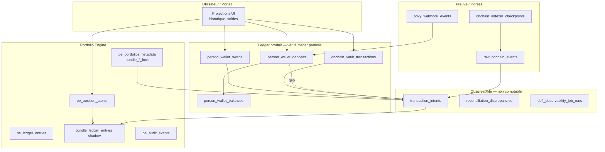
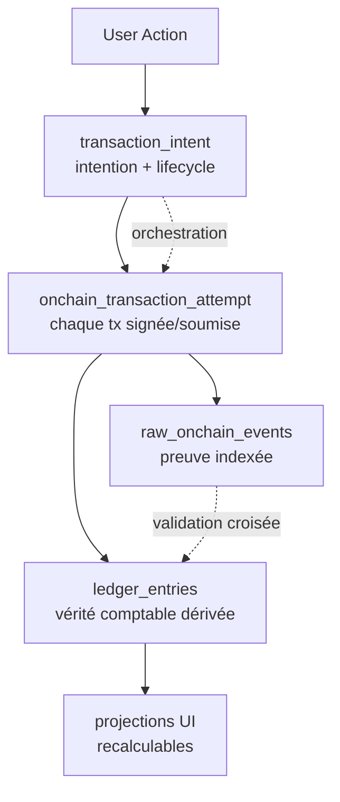

# Architecture transactionnelle reconstructible — Vancelian / Arquantix

**Statut** : proposition d’architecture (audit + cible) — **aucune migration appliquée**  
**Date** : 2026-05-30  
**Périmètre** : portail Vancelian (`app.vancelian.finance`), API Python Arquantix, ledger PE, DeFi (Privy, LI.FI, Morpho, Ledgity, Lombard, bundles)

---

## Executive summary

Aujourd’hui, Vancelix dispose d’une **traçabilité partielle** répartie entre plusieurs tables métier (`person_wallet_deposits`, `person_wallet_swaps`, `onchain_vault_transactions`) et une couche d’**observabilité** (`transaction_intents`, `raw_onchain_events`). Cette architecture permet de reconstruire **une grande partie** de l’historique on-chain **si les chemins success sont complets**, mais **n’est pas encore de niveau bancaire / event-sourced** :

- Il n’existe **pas de couche universelle** enregistrant **chaque tentative blockchain** (approve, swap, deposit, borrow…) avec statut, receipt et lien intent.
- Les **intents ne couvrent pas tous les flux** (dépôts Privy, Ledgity vault, approve LI.FI/Morpho).
- Les **projections UI et soldes** restent parfois dérivées directement de tables « courantes » plutôt que recalculées depuis une chaîne d’événements immuable.
- Les **crash entre signature client et confirmation API** laissent des états `pending` / `submitted` réconciliables manuellement, mais sans replay engine unifié.

**Recommandation** : introduire `onchain_transaction_attempts` comme **vérité opérationnelle des interactions blockchain**, relier tous les flux existants, puis un **replay engine read-only** avant tout mode repair.

**Règle d’or** :

> Aucune UI, aucun solde affiché, aucun historique agrégé ne doit être source de vérité.  
> Tout doit être reconstructible depuis : intents → attempts → raw events → ledger entries → projections.

Références existantes : `docs/arquantix/TRANSACTION_INTENTS_DEFI.md`, `DEFI_OBSERVABILITY_PROD_RUNBOOK.md`, `ONCHAIN_INDEXER_BASE.md`.

---

## Current architecture

### Couches actuelles



### Tables clés (état actuel)

| Table | Rôle | Immuable / append-only | tx_hash |
|-------|------|------------------------|---------|
| `transaction_intents` | Cycle de vie intent cross-produit | Upsert (status mutable) | Optionnel |
| `person_wallet_deposits` | Crédits wallet Privy + settlement swap | Insert + idempotence chain/tx/log | **NOT NULL** |
| `person_wallet_swaps` | Session LI.FI | Update status + `audit_log` JSONB | Swap principal seulement |
| `onchain_vault_transactions` | Morpho / Ledgity / Lombard (Prisma) | Update pending→success | Par step ledger |
| `raw_onchain_events` | Index ERC-20 / preuve | Insert unique chain/tx/log | Oui |
| `privy_webhook_events` | Payload brut Privy | Insert + reprocess | Via dépôt lié |
| `pe_position_atoms` | Positions bundle / direct | Mutations contrôlées | Non |
| `pe_ledger_entries` | Journal PE | Append-only | Non |
| `bundle_ledger_entries` | Shadow journal bundle (Phase 4A) | Append-only | Non |
| `reconciliation_discrepancies` | Écarts détectés | Insert open/resolved | Référence |

### Doctrine actuelle (documentée)

Source : `TRANSACTION_INTENTS_DEFI.md`

- **Intents ≠ ledger** : les intents ne déclenchent pas de settlement et ne remplacent pas le ledger.
- **Raw events** : preuve indexée, lien best-effort via `try_link_raw_event_to_intent`.
- **Réconciliation** : détection d’écarts (`transaction_intent_reconciliation.py`), pas d’apply auto par défaut.
- **Tick ops** : `defi_observability_tick` (indexer + health + reconcile users récents).

### Fichiers pivots

| Domaine | Chemins |
|---------|---------|
| Intents | `api/services/transaction_intents/` |
| LI.FI | `api/services/lifi/lifi_execute_service.py`, `lifi_swap_settlement.py` |
| Privy | `api/services/privy_wallet/webhook_service.py` |
| Vault ledger (web) | `web/src/lib/portal/morphoVaultLedger.ts`, `lombard/lombardLedger.ts` |
| Bundle | `api/services/portfolio_engine/bundles/`, `bundle_execution/` |
| Indexer | `api/services/onchain_indexer/`, `api/scripts/run_onchain_indexer.py` |
| Replay partiel | `api/scripts/replay_onchain.py`, `reconcile_wallet.py`, `reconcile_user.py` |

---

## Gap analysis

### Matrice par flux (audit code — mai 2026)

Légende : ✅ oui · ⚠️ partiel · ❌ non · — N/A (pas de blockchain)

| Critère | Privy deposit | LI.FI swap (portal) | Bundle USDC leg | Bundle multi-leg LI.FI | Vault Morpho/Ledgity | Lombard borrow |
|---------|---------------|---------------------|-----------------|------------------------|----------------------|----------------|
| **Intent créé** | — N/A (observed external inbound ; enum `PRIVY_DEPOSIT` dormant sauf futur parcours webapp `deposit_started`) | ✅ `lifi_swap:{id}` | ✅ parent `bundle_invest` | ✅ parent + legs metadata | ⚠️ Morpho deposit/withdraw only | ✅ parent + steps |
| **Steps on-chain enregistrés** | ⚠️ 1 row dépôt | ⚠️ swap tx seulement | — | ⚠️ 1 hash/swap leg | ✅ approve+deposit rows OVT | ✅ multi rows OVT |
| **tx_hash enregistré (success)** | ✅ obligatoire | ✅ sur swap confirmé | — | ✅ par leg swap | ✅ par step confirmé | ✅ par step |
| **Approve persisté** | — | ❌ signé client, non DB | — | ❌ idem LI.FI | ✅ OVT, ❌ intent | ✅ OVT + intent step |
| **Raw receipt conservé** | ❌ (webhook payload oui) | ❌ | — | ❌ | ❌ (status via RPC verify) | ❌ |
| **Raw webhook conservé** | ✅ `payload_raw` | — | — | — | — | — |
| **Ledger métier écrit** | ✅ `person_wallet_deposits` + balance | ✅ settlement → deposits + balance | ✅ PE atoms transfer | ✅ PE atoms par leg | ✅ position vault ledger | ✅ collateral/debt (PE + OVT) |
| **Idempotency key** | ✅ chain/tx/log + webhook | ✅ swap id + intent key | ✅ batch_id lock | ✅ batch + leg + swap | ✅ group + tx_index | ✅ group_key |
| **Replay possible** | ⚠️ webhook + dépôt | ⚠️ swap + audit_log | ⚠️ PE audit + atoms | ⚠️ intent metadata + swaps | ⚠️ OVT + intents Morpho | ⚠️ OVT + Lombard intents |
| **Reconstruction complète** | ⚠️ sans intent | ❌ sans approve tx | ⚠️ sans ledger event dédié | ⚠️ partial failure complexe | ⚠️ Ledgity sans intent | ✅ relativement bon |
| **Trous principaux** | Pas d’intent (normal pour inbound externe) | Approve LI.FI | Pas de `internal_ledger_movement` typé | Intent LI.FI skipped internal | Ledgity: pas intent sync | Receipts bruts absents |
| **Risque double crédit** | Faible (unique tx/log) | Faible si settlement idempotent | Moyen (PE transfer + re-run) | Moyen (leg + atoms) | Faible (unique OVT) | Faible |
| **Risque perte trace crash** | Faible post-webhook | **Élevé** post-sign pre-submit | Moyen (lock stale) | **Élevé** mid-leg | **Élevé** post-sign pre-confirm | **Élevé** multi-step |

### Trous transverses confirmés

1. **Pas de table `onchain_transaction_attempts`** — impossible de lister uniformément « toutes les txs soumises » par personne.
2. **`PRIVY_DEPOSIT` = observed external inbound, pas intent applicatif par défaut** — enum dormant ; reconstruction via `privy_webhook_events` → `raw_onchain_events` → `person_wallet_deposits`. Intent uniquement si futur parcours webapp explicite (`deposit_started`).
3. **Approve LI.FI** — `ensureSwapTokenApproval` côté web, payload dans réponse execute, **aucun hash persisté** (`useLifiSwapExecution.ts`).
4. **Approve Morpho** — row `onchain_vault_transactions.operation=approve` oui, **intent Morpho exclut approve** (`morpho_intent_sync._map_operation`).
5. **Ledgity vault** — même table OVT, **pas de sync intent** (condition `direct_morpho` only dans `morphoVaultLedger.ts`).
6. **Bundle LI.FI internal** — `sync_lifi_swap_intent` **skip** si `is_bundle_internal_swap`.
7. **Receipts JSON** — non stockés systématiquement (vérif RPC à la volée dans confirm routes).
8. **Projections UI** — `transaction_merge.py` / agrégats PE lus directement, pas recalculés depuis une chaîne d’events versionnée.
9. **Health Phase 8** — `PRIVY_DEPOSIT`, `BUNDLE_WITHDRAW` absents de `KNOWN_PRODUCTS` dans `transaction_intent_health.py`.

### Scénarios crash / retry (état actuel)

| Scénario | Comportement actuel | Gap |
|----------|---------------------|-----|
| Crash après signature LI.FI approve, avant swap | Approve perdu | ❌ |
| Crash après swap signé, avant `submit_signed_tx` | Pas de hash en DB | ❌ |
| Double clic Confirm vault | Idempotence OVT + receipt check | ⚠️ intent peut diverger |
| Webhook Privy avant wallet lié | Erreur processing, retry webhook | ⚠️ pas d’intent pending |
| Tx confirmée on-chain, confirm API jamais appelée | OVT `pending`, intent `awaiting_signature` | ⚠️ reconcile manuel |
| Settlement LI.FI blocked | Intent `reconciliation_required` | ✅ détecté |
| Refresh navigateur mid-bundle | Lock TTL + stale reconcile | ⚠️ partiel |

---

## Target architecture

### Chaîne de vérité cible



### Principes

1. **Intents** = intention utilisateur capturée dans la webapp Vancelian + machine d’état produit (jamais solde).
2. **Dépôts Privy inbound externes** = événements observés (`privy_webhook` → deposit ledger) — pas d’intent par défaut.
3. **Attempts** = vérité opérationnelle blockchain (une row par tx, même failed/replaced).
4. **Raw events** = preuve indexée indépendante (reconciliation).
5. **Ledger** = écritures idempotentes dérivées des attempts confirmés ou mouvements internes certifiés.
5. **UI** = projection read-only, invalidable et rebuildable.

### Nouvelle table centrale : `onchain_transaction_attempts`

**Objectif** : couche commune Privy / LI.FI / Morpho / Ledgity / Lombard / bundle / futurs protocoles.

#### Schéma proposé (PostgreSQL)

```sql
-- PROPOSITION — migration future séparée, non appliquée

CREATE TABLE onchain_transaction_attempts (
    id                      UUID PRIMARY KEY DEFAULT gen_random_uuid(),

    -- Liens orchestration
    intent_id               UUID REFERENCES transaction_intents(id) ON DELETE SET NULL,
    parent_intent_id        UUID REFERENCES transaction_intents(id) ON DELETE SET NULL,
    person_id               UUID NOT NULL REFERENCES persons(id) ON DELETE CASCADE,
    person_crypto_wallet_id UUID REFERENCES person_crypto_wallets(id) ON DELETE SET NULL,

    -- Contexte chain / protocole
    chain_id                INTEGER NOT NULL,
    protocol                VARCHAR(32) NOT NULL,  -- privy | lifi | morpho | ledgity | lombard | internal_bundle | ...
    operation_type          VARCHAR(32) NOT NULL,  -- deposit | withdraw | swap | approve | borrow | ...
    step_type               VARCHAR(32) NOT NULL,  -- approve | swap | deposit | withdraw | collateral_supply | open_loan | ...
    step_index              INTEGER NOT NULL DEFAULT 0,
    group_key               VARCHAR(128),          -- idempotency group (vault group, bundle batch, swap session)
    idempotency_key         VARCHAR(255) NOT NULL,

    -- Statut attempt
    status                  VARCHAR(32) NOT NULL DEFAULT 'prepared',
    -- prepared | signed | submitted | confirmed | failed | reverted | replaced | dropped | unknown | reconciliation_required

    -- Identifiants on-chain
    tx_hash                 VARCHAR(80),           -- nullable until submitted
    nonce                   BIGINT,
    from_address            VARCHAR(80),
    to_address              VARCHAR(80),
    log_index               INTEGER,

    -- Montants (nullable selon step)
    asset_in                VARCHAR(32),
    asset_out               VARCHAR(32),
    amount_in               NUMERIC(30, 18),
    amount_out_expected     NUMERIC(30, 18),
    amount_out_actual       NUMERIC(30, 18),

    -- Block / gas
    block_number            BIGINT,
    block_timestamp         TIMESTAMPTZ,
    gas_used                BIGINT,

    -- Erreurs
    error_code              VARCHAR(64),
    error_message           TEXT,

    -- Payloads immuables (append-only updates: new JSON version ou table fille attempt_events)
    raw_request_json        JSONB,
    raw_signed_payload_json JSONB,
    raw_submission_json     JSONB,
    raw_receipt_json        JSONB,
    raw_revert_json         JSONB,

    -- Liens legacy (transition)
    linked_table            VARCHAR(64),   -- person_wallet_swaps | onchain_vault_transactions | ...
    linked_id               UUID,
    linked_reference_id     VARCHAR(80),

    created_at              TIMESTAMPTZ NOT NULL DEFAULT now(),
    updated_at              TIMESTAMPTZ NOT NULL DEFAULT now(),

    CONSTRAINT uq_attempt_idempotency UNIQUE (idempotency_key, step_type),
    CONSTRAINT uq_attempt_chain_tx UNIQUE (chain_id, tx_hash)
        DEFERRABLE INITIALLY DEFERRED  -- tx_hash NULL autorisé tant que non soumis
);

CREATE INDEX ix_attempts_person_created ON onchain_transaction_attempts (person_id, created_at DESC);
CREATE INDEX ix_attempts_intent ON onchain_transaction_attempts (intent_id);
CREATE INDEX ix_attempts_group ON onchain_transaction_attempts (group_key);
CREATE INDEX ix_attempts_status ON onchain_transaction_attempts (status);
CREATE INDEX ix_attempts_protocol ON onchain_transaction_attempts (protocol, chain_id);
CREATE INDEX ix_attempts_tx_hash ON onchain_transaction_attempts (tx_hash) WHERE tx_hash IS NOT NULL;
```

#### Table complémentaire recommandée : `internal_ledger_movements`

Pour mouvements **sans** blockchain (bundle USDC leg, réservations cash, releases) :

```sql
-- PROPOSITION
CREATE TABLE internal_ledger_movements (
    id                  UUID PRIMARY KEY,
    intent_id           UUID REFERENCES transaction_intents(id),
    person_id           UUID NOT NULL,
    movement_type       VARCHAR(64) NOT NULL,  -- bundle_cash_fund | bundle_cash_release | ...
    source_scope        VARCHAR(64) NOT NULL,  -- trading_wallet | bundle_cash_leg | ...
    destination_scope   VARCHAR(64) NOT NULL,
    asset               VARCHAR(32) NOT NULL,
    amount              NUMERIC(30, 18) NOT NULL,
    idempotency_key     VARCHAR(255) NOT NULL UNIQUE,
    pe_ledger_entry_id  UUID,
    bundle_ledger_entry_id UUID,
    metadata_json       JSONB NOT NULL DEFAULT '{}',
    created_at          TIMESTAMPTZ NOT NULL DEFAULT now()
);
```

#### Table complémentaire : `attempt_status_events` (audit append-only)

Pour interdire l’écrasement destructif des transitions :

```sql
-- PROPOSITION
CREATE TABLE attempt_status_events (
    id          UUID PRIMARY KEY,
    attempt_id  UUID NOT NULL REFERENCES onchain_transaction_attempts(id),
    from_status VARCHAR(32),
    to_status   VARCHAR(32) NOT NULL,
    actor       VARCHAR(64),  -- api | client | indexer | replay_engine | webhook
    metadata_json JSONB,
    created_at  TIMESTAMPTZ NOT NULL DEFAULT now()
);
```

### Relational mapping (legacy → cible)

| Legacy | Rôle transition | Lien attempt |
|--------|-----------------|--------------|
| `person_wallet_swaps` | Session LI.FI | 1 intent + N attempts (approve + swap) |
| `onchain_vault_transactions` | Step vault/Lombard | 1 attempt / row OVT |
| `person_wallet_deposits` | Crédit ledger Privy | 1 attempt `detected_from_webhook` ou dérivé raw event |
| `privy_webhook_events` | Ingress | `raw_submission_json` source |
| `raw_onchain_events` | Preuve | FK optionnelle `raw_onchain_event_id` sur attempt |

---

## State machines

### Intent status (cible unifiée)

| Status | Signification |
|--------|---------------|
| `created` | Intent enregistré, pas encore prêt à signer |
| `awaiting_signature` | Payload prêt, attente wallet |
| `signed` | Au moins une tx signée côté client (optional aggregate) |
| `submitted` | Au moins une tx soumée on-chain |
| `partially_confirmed` | Multi-step : certains steps OK, pas tous |
| `confirmed` | Tous steps requis confirmés + ledger posté |
| `failed` | Échec terminal sans recovery auto |
| `expired` | TTL dépassé (quote, lock) |
| `cancelled` | Annulé utilisateur / système |
| `reconciliation_required` | Incohérence détectée, intervention humaine |

**Mapping legacy** : conserver compatibilité avec `IntentStatus` actuel (`api/services/transaction_intents/enums.py`) + alias migration.

### Attempt status

| Status | Signification |
|--------|---------------|
| `prepared` | Calldata / route connue, pas encore signée |
| `signed` | Signature obtenue, pas encore broadcast |
| `submitted` | tx_hash connu, pending chain |
| `confirmed` | Receipt success |
| `failed` | Erreur pré-chain ou rejet |
| `reverted` | Receipt status reverted |
| `replaced` | RBF / speed-up / nouvelle attempt liée |
| `dropped` | Tx jamais incluse, abandonnée |
| `unknown` | Timeout indexer |
| `reconciliation_required` | Confirmé on-chain mais ledger manquant |

### Ledger entry status (cible normalisée)

| Status | Signification |
|--------|---------------|
| `pending` | Réservation / hold |
| `posted` | Écriture définitive |
| `reversed` | Contre-passation explicite |
| `reconciled` | Validé vs raw event |
| `orphaned` | Ledger sans attempt / event (anomalie) |

---

## Flow-by-flow reconstruction logic

### 1. Dépôt Privy (webhook — inbound externe)

**Doctrine**

- Dépôt Privy externe (Binance, MetaMask, autre wallet) = **événement observé**, pas une intention portail.
- Pas de `transaction_intent` automatique depuis le webhook.
- Chaîne de vérité : `privy_webhook_events.payload_raw` → `raw_onchain_events` → `person_wallet_deposits` → balance.

**Classification metadata (deposit)**

```
observed_external_deposit: true
event_source: privy_webhook
initiated_by: external
transaction_intent_policy: none_by_default
```

**Intent futur (webapp only)**

```
PRIVY_DEPOSIT intent — uniquement si deposit_started depuis la webapp
  → attempt(detected_from_webhook | submitted)
  → raw_onchain_events (ERC20 Transfer match)
  → person_wallet_deposits (posted)
  → person_wallet_balances (projection)
```

**Replay**

1. Lire `privy_webhook_events` par `person_id` / plage dates.
2. Rejouer idempotence `(chain_id, tx_hash, log_index)`.
3. Vérifier `raw_onchain_events` correspondant.
4. Recalculer balance depuis deposits confirmés.

---

### 2. Trade LI.FI (portal self-trading)

**Cible**

```
SWAP intent
  → attempt(approve) optional
  → attempt(swap)
  → raw events (debit token A, credit token B)
  → ledger debit A + credit B (+ fees)
```

**Aujourd’hui** : intent + swap row + hash swap. **Manque** : attempt approve.

**Replay**

1. Intent `lifi_swap:{swap_id}`.
2. Reconstituer steps depuis `audit_log` + futurs attempts.
3. Si `tx_hash` swap confirmé : fetch receipt (archive ou RPC) → settlement deposits.
4. Détecter `settlement_blocked` / `partial_confirmed`.

---

### 3. Bundle — leg USDC (transfert interne PE)

**Cible**

```
BUNDLE_INVEST intent (parent)
  → internal_ledger_movement(trading → bundle_cash_leg)
  → pe_position_atoms update
  → bundle_ledger_entries (shadow)
  → pe_audit_events
```

**Aujourd’hui** : PE transfer + audit + intent parent metadata. **Pas de tx_hash** (normal).

**Replay**

1. Lock `bundle_invest_lock` par `batch_id`.
2. Idempotence `bundle.fund_cash_leg` audit + atoms delta.
3. Pas d’attempt on-chain ; movement interne obligatoire en cible.

---

### 4. Bundle — multi-invest (legs LI.FI)

**Cible**

```
BUNDLE_INVEST parent intent
  → child step / leg intent per allocation
  → approve attempt? + swap attempt per asset
  → PE atoms per leg
  → parent intent recompute (partial / confirmed)
```

**Aujourd’hui** : legs dans `metadata_json`, swaps internes sans intent LI.FI.

**Replay**

1. Parent intent + liste legs.
2. Pour chaque `swap_id` : recharger swap + attempts futurs.
3. Vérifier `bundle_pe_atoms_applied` audit event.
4. Recompute batch status depuis legs.

---

### 5. Vault USDC (Morpho / Ledgity)

**Cible**

```
VAULT_DEPOSIT intent (morpho_earn | ledgity_vault)
  → attempt(approve)
  → attempt(deposit)
  → raw vault events (Transfer + Deposit)
  → ledger trading USDC ↓ + vault_position ↑
```

**Aujourd’hui** : OVT rows + intent Morpho (deposit/withdraw only). Ledgity : OVT sans intent.

**Replay**

1. Group by `idempotency_key` / `group_key`.
2. Rejouer confirm receipts → OVT status.
3. Sync position vault depuis ledger success rows.

---

### 6. Lombard — collateral + borrow (multi-step)

**Cible**

```
BORROW intent parent
  → attempt(approve collateral)
  → attempt(authorize?) 
  → attempt(open_loan / supply / borrow)
  → ledger collateral + liability + USDC credit
```

**Aujourd’hui** : meilleure couverture (OVT + Lombard intent steps). **Manque** : receipts bruts, attempts unifiés.

**Replay**

1. Parent intent `lombard_borrow:{group_key}`.
2. Steps metadata ↔ OVT rows par `tx_index`.
3. Vérifier séquence approve → deposit on-chain.

---

## Replay engine design

### Module proposé : `services/transaction_replay/`

```
transaction_replay/
  __init__.py
  engine.py              # orchestrateur
  scopes.py              # person | wallet | tx_hash | intent | date_range
  rebuild_history.py
  rebuild_balances.py
  reconcile_layers.py    # intent vs attempt vs ledger vs raw
  detectors.py             # anomalies
  repair.py                # repair mode (feature-flag, explicit)
  projections.py           # UI-ready views (read-only)
```

### API CLI (read-only par défaut)

```bash
# Audit global
python3 -m scripts.transaction_replay audit --dry-run

# Par personne
python3 -m scripts.transaction_replay rebuild-history --person-id UUID --dry-run
python3 -m scripts.transaction_replay rebuild-balances --person-id UUID --dry-run

# Par tx
python3 -m scripts.transaction_replay trace-tx --tx-hash 0x... --chain-id 8453

# Réconciliation couches
python3 -m scripts.transaction_replay reconcile \
  --person-id UUID \
  --detect missing_ledger_entries,confirmed_tx_without_raw_event,approval_without_business_tx

# Repair (explicit, prod gated)
python3 -m scripts.transaction_replay repair --person-id UUID --apply --ticket INC-123
```

### Détecteurs obligatoires

| Detector | Description |
|----------|-------------|
| `missing_ledger_entries` | Attempt `confirmed` sans écriture ledger posted |
| `confirmed_tx_without_raw_event` | tx_hash confirmé absent indexer (TTL) |
| `raw_event_without_ledger` | Event indexé non consommé |
| `intent_submitted_without_tx_hash` | Intent avancé sans attempt |
| `approval_without_business_tx` | Approve confirmé, swap/deposit absent |
| `duplicate_credits` | Même tx_hash → plusieurs credits ledger |
| `stuck_pending_attempts` | `submitted` > TTL |
| `orphan_webhook` | Webhook processed sans dépôt |
| `bundle_leg_failed_with_atoms` | Leg failed mais PE atoms appliqués |
| `vault_pending_after_receipt` | OVT pending mais receipt success on-chain |

### Modes d’exécution

| Mode | Effet |
|------|-------|
| `dry_run` (default) | Rapport + discrepancies, zéro mutation |
| `projections_only` | Écrit tables de projection rebuildables (si introduites) |
| `repair` | Crée ledger manquants / lie raw events — **ticket + approbation** |

Intégration avec existant : étendre `defi_observability_tick` pour appeler replay detectors en read-only.

---

## Reconciliation jobs

### Jobs existants à conserver / étendre

| Job | Action future |
|-----|---------------|
| `defi_observability_tick` | + scan attempts stale |
| `transaction_intent_health` | + protocoles manquants (Privy, Ledgity, bundle_withdraw) |
| `transaction_intent_reconciliation.scan_intent_gaps_for_person` | + gaps attempt layer |
| `reconcile_wallet.py` | + compare attempts vs raw vs deposits |
| `bundle_ledger/reconciliation.py` | + lien `internal_ledger_movements` |
| Morpho/Ledgity/Lombard reconciliation (web scripts) | Alimenter attempts ou disparition progressive |

### Nouveaux jobs proposés

| Job | Fréquence | Mode |
|-----|-----------|------|
| `replay_audit_recent_users` | Daily | dry-run, users actifs 7j |
| `attempt_stale_sweep` | Hourly | mark `reconciliation_required` |
| `raw_event_backfill` | Continuous | indexer → link attempts |
| `projection_rebuild_nightly` | Nightly | balances + history views |

---

## Idempotency doctrine

1. **Un événement on-chain** (`chain_id`, `tx_hash`, `log_index` si applicable) → **au plus une** écriture ledger `posted` par sens métier.
2. **Une intent** identifiée par `(person_id, product_type, operation_type, idempotency_key)` → upsert contrôlé, jamais dupliquée.
3. **Une attempt** identifiée par `(idempotency_key, step_type)` → insert ou no-op.
4. **Mouvement interne** → `internal_ledger_movements.idempotency_key` unique global.
5. **Retry utilisateur** (double clic, refresh) → même idempotency_key → même attempt / pas de double ledger.
6. **Webhook Privy** → `svix_id` / `idempotency_key` + `(chain_id, tx_hash, log_index)`.
7. **Bundle batch** → `batch_id` UUID propagé lock + intent + legs + swaps audit.
8. **Aucun overwrite destructif** de `raw_receipt_json` — nouvelle version via `attempt_status_events`.

---

## Crash recovery scenarios

| # | Scénario | Recovery cible |
|---|----------|----------------|
| 1 | Signé approve LI.FI, crash avant swap | Attempt approve `submitted`; intent `awaiting_signature`; replay détecte swap manquant |
| 2 | Swap signé, crash avant POST submit | Attempt `signed` sans tx_hash; reconcile → resubmit or fail |
| 3 | POST confirm vault OK, réponse perdue | OVT `success` idempotent; client retry confirm → no-op |
| 4 | Webhook Privy reçu 2× | Dépôt unique chain/tx/log |
| 5 | Bundle leg swap confirmé, PE atoms crash | Audit `bundle_pe_atoms_applied`; replay atoms from swap |
| 6 | Indexer retard 30 min | Attempt `submitted` → `confirmed` async; UI projection stale flag |
| 7 | Settlement LI.FI blocked | Intent `reconciliation_required`; ops runbook |
| 8 | Lock bundle stale | `expire_stale_invest_lock_if_safe` + intent failed |

---

## Migration plan (séparé — non exécuté)

### Phase 0 — Documentation & gouvernance (cette PR)

- [x] Audit + doc cible
- [ ] Revue architecture avec équipe
- [ ] Validation produit / compliance

### Phase 1 — Read-only hardening (sans nouvelle table)

- Classifier dépôts Privy externes (`observed_external_deposit`) — **sans** intent automatique depuis webhook.
- Persister hash approve LI.FI dans `audit_log` + intent metadata (quick win).
- Brancher Ledgity intent sync (copie Morpho).
- Étendre `KNOWN_PRODUCTS` health (hors `PRIVY_DEPOSIT` dormant).
- Rapport dry-run gaps : dépôts Privy sans tx_hash / sans webhook / sans raw_event après TTL / double crédit potentiel.

**Risque** : faible · **Durée** : 1–2 sprints

### Phase 2 — Schéma `onchain_transaction_attempts` + dual-write (en cours)

**Statut** : code livré, **migration 171 non appliquée** sans validation explicite.

**Inclus** :
- LI.FI portal swaps + approvals
- Bundle internal LI.FI swaps (`protocol=internal_bundle`)
- Morpho / Ledgity vault steps (approve, deposit, withdraw)
- Lombard borrow steps (approve, authorize, open_loan)

**Exclus** :
- Privy inbound deposits externes → **pas d'intent** ; attempts Privy **optionnels** (non requis Phase 2)
- Pas de changement UI / source of truth legacy

**Livrables** :
- Migration `171_onchain_transaction_attempts.py` (proposée)
- Package `services/transaction_attempts/` (models, repository, service, dual_write, reconciliation)
- Dual-write branché : `lifi_execute_service`, morpho/ledgity/lombard intent sync
- Scripts : `backfill_onchain_transaction_attempts --dry-run`, `transaction_attempt_gap_report --dry-run`
- Tests : `tests/test_phase2_transaction_attempts.py`

**Validation** :
```bash
cd services/arquantix/api
# Après alembic upgrade head (171) :
python3 -m pytest tests/test_phase2_transaction_attempts.py -q
python3 -m scripts.backfill_onchain_transaction_attempts --dry-run
python3 -m scripts.transaction_attempt_gap_report --dry-run
```

**Risque** : moyen · **Validation infra explicite requise avant migration**

### Phase 3 — `internal_ledger_movements` + bundle funding

- Modéliser legs USDC internes.
- Dual-write depuis `bundle_funding.py`.

### Phase 4 — Replay engine dry-run en prod

- CLI + admin UI rapport.
- Intégration tick observability.

### Phase 5 — Projections rebuildables

- Tables/vues `person_transaction_projection`, `person_balance_projection`.
- UI bascule lecture projection avec fallback legacy.

### Phase 6 — Repair mode (optionnel, gated)

- Feature flag + ticket obligatoire.
- Jamais auto-apply en prod sans validation.

### Rollback

- Dual-write permet rollback code sans perdre attempts.
- Legacy tables restent source jusqu’à Phase 5 sign-off.

---

## Tests to add

| Suite | Contenu |
|-------|---------|
| `test_attempt_idempotency.py` | double submit même clé |
| `test_lifi_approve_attempt_persisted.py` | approve + swap liés même intent |
| `test_privy_external_deposit_no_intent.py` | webhook externe → deposit, pas d'intent |
| `test_vault_multi_step_replay.py` | approve + deposit reconstruction |
| `test_bundle_internal_movement.py` | USDC leg sans tx_hash |
| `test_crash_recovery_sign_before_submit.py` | signed without tx_hash |
| `test_replay_engine_dry_run.py` | detectors sur fixtures |
| `test_no_duplicate_ledger_from_same_tx.py` | double credit guard |
| E2E portal | invest vault + swap + bundle happy path avec trace complète |

---

## Production monitoring checklist

### Dashboards

- [ ] Intent count by product / status (incl. Privy, Ledgity, bundle_withdraw)
- [ ] Attempt count by protocol / status
- [ ] % confirmed attempts with raw_event link < 24h
- [ ] Stale `submitted` attempts > 45 min
- [ ] `reconciliation_required` backlog
- [ ] Bundle partial batches count
- [ ] Webhook processing failures

### Alertes (P1)

- Confirmed attempt sans ledger > 15 min
- Duplicate credit detector > 0
- Indexer checkpoint lag > N blocs
- `defi_observability_tick` failed / skipped_locked repeated

### Runbooks

- Lier à `DEFI_OBSERVABILITY_PROD_RUNBOOK.md`
- Nouveau : `TRANSACTION_REPLAY_RUNBOOK.md` (à créer Phase 4)

### Audit prod régulier

```bash
python3 -m scripts.transaction_intent_health --dry-run
python3 -m scripts.defi_observability_tick --dry-run
# Future:
python3 -m scripts.transaction_replay audit --dry-run
```

---

## Annexes

### A. Mapping intent product types (actuel)

| `product_type` | Branché | Linked |
|----------------|---------|--------|
| `lifi_swap` | ✅ | `person_wallet_swaps` |
| `morpho_earn` | ✅ | `onchain_vault_transactions` |
| `lombard_borrow` | ✅ | group OVT |
| `bundle_invest` | ✅ | `bundle_invest_lock` / batch_id |
| `bundle_withdraw` | ✅ | withdraw lock |
| `privy_deposit` | — dormant (webapp `deposit_started` futur) | `person_wallet_deposits` si intent explicite |

### B. Références code audit (mai 2026)

- `api/services/onchain_indexer/models.py` — `TransactionIntent`, `RawOnChainEvent`
- `api/services/privy_wallet/models.py` — deposits, webhooks
- `api/services/lifi/models.py` — swaps
- `web/prisma/schema.prisma` — `OnchainVaultTransaction`
- `api/services/portfolio_engine/bundle_ledger/models.py` — shadow journal
- `api/services/transaction_intents/transaction_intent_reconciliation.py` — gap scan
- `web/src/components/portal/swap/useLifiSwapExecution.ts` — approve non persisté

### C. Décision ouverte

**Question** : `onchain_transaction_attempts` en Python API uniquement, ou aussi accessible depuis Next (Prisma) pour vault confirm routes ?

**Recommandation** : **API Python source of truth** pour attempts ; Next dual-write via route internal API pour cohérence transactionnelle DB.

---

*Document produit par audit codebase — ne pas appliquer de migration sans validation explicite (cf. charte environnement Arquantix).*
