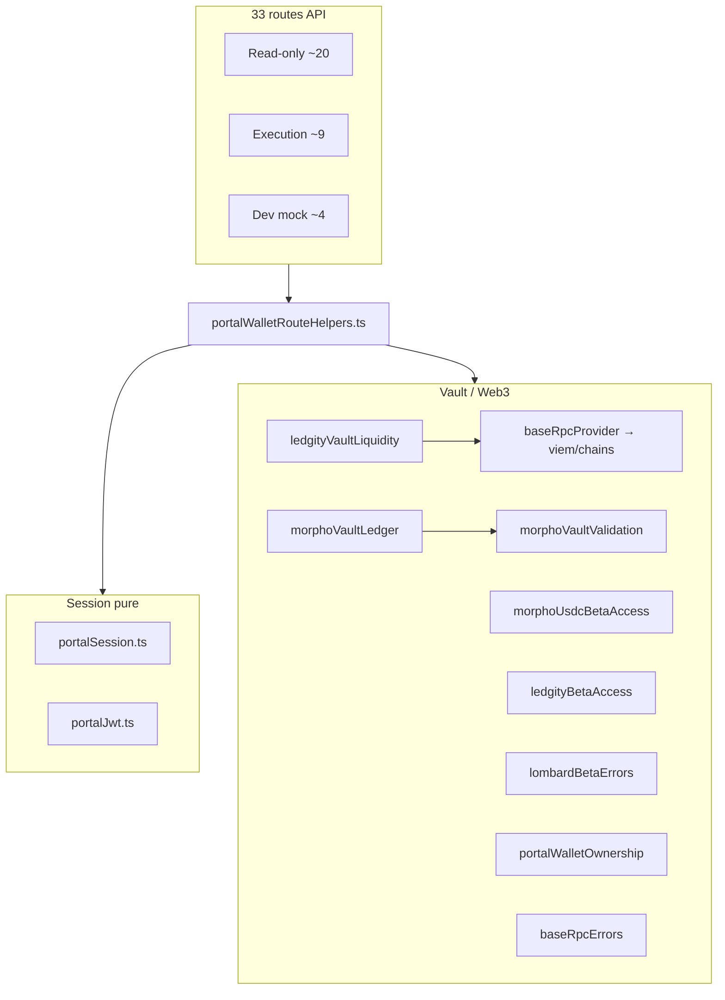

# Portail — Phase 3A API Helper Split Audit

Date : 2026-05-29  
Mode : **audit only** — aucun changement de code, package ou infra  
Prérequis client : Phase 1 `1722c881e` + guardrails Phase 2  
Références : `PORTAL_BUNDLE_ANALYSIS_PHASE0BIS.md` §6.D, `PORTAL_NAVIGATION_PERFORMANCE_AUDIT.md` §4.1

---

## 1. Executive summary

`portalWalletRouteHelpers.ts` (117 lignes, 8 exports) mélange **auth session JWT pure** et **helpers vault/Web3/RPC**. **33 importeurs** (26 routes `/api/portal/*` + 7 routes `/api/dev/*`) l’utilisent ; **~20 routes read-only** n’importent en pratique que `requirePortalPersonId`, mais webpack charge tout le graphe du module au cold start.

### Problème confirmé

Au **load du module** (pas à l’exécution des handlers), `portalWalletRouteHelpers.ts` tire :

| Import top-level | Classification | Pollution |
|----------------|----------------|-----------|
| `portalSession`, `portalJwt` | session pure | ✅ OK |
| `morphoVaultValidation` (`idempotencyKeySchema`) | parsing Morpho | ⚠️ léger |
| `morphoVaultLedger` | Morpho ledger + Prisma + receipt viem | 🔴 lourd |
| `morphoUsdcBetaAccess` | Morpho beta | ⚠️ |
| `ledgityBetaAccess` | Ledgity beta | ⚠️ |
| `ledgityLedgerMetadata` | Ledgity | ⚠️ (**import mort** dans le fichier) |
| `ledgityVaultLiquidity` | Ledgity + **viem** + `baseRpcProvider` | 🔴 **viem/chains** |
| `lombardBetaErrors` | Lombard errors | ✅ classes pures |
| `portalWalletOwnership` | auth wallet | ⚠️ |
| `baseRpcErrors` | RPC error strings | ✅ pas viem direct |

Chaîne critique viem :

```
portalWalletRouteHelpers.ts
  └─ ledgityVaultLiquidity.ts
       └─ baseRpcProvider.ts → viem + viem/chains (base)
  └─ morphoVaultLedger.ts
       └─ morphoReceiptVerification.ts → viem
```

Mesures Phase 0 bis (build prod) : chunk serveur partagé **`69096.js` ~5,1 MB brut** avec `createPublicClient` / marqueurs Privy — coût concentré dans les **shared server chunks**, pas dans les `route.js` individuels (2–18 kB).

### Conclusion

Le split est **justifié et sûr** si on procède en 2 temps :

1. **Phase 3B-1** — extraire `portalSessionRouteHelpers.ts` (pur) + `portalVaultRouteHelpers.ts` (vault/errors) ; shim deprecated.
2. **Phase 3B-2** — migrer d’abord les routes **session-only** ; laisser les routes execution sur `portalVaultRouteHelpers`.

Les routes dashboard/academy/markets/profile **ne passent pas** par ce fichier (auth inline via `readPortalAccessToken` + `readPortalPersonIdFromToken`) — bon référentiel à généraliser.

---

## 2. Graphe de dépendances actuel



### Routes non contaminées (référence)

Ces routes portail read-only **n’importent pas** `portalWalletRouteHelpers` :

| Route | Auth |
|-------|------|
| `/api/portal/dashboard`, `/dashboard/core`, `/dashboard/portfolio` | `readPortalAccessToken` + `portalJwt` |
| `/api/portal/markets`, `/markets/all-crypto` | idem |
| `/api/portal/academy` | idem |
| `/api/portal/invest` | idem |
| `/api/portal/profile`, `/profile/reference-currency` | idem |
| `/api/portal/favorites/*` | idem |
| `/api/portal/privy/person-wallets`, `/privy/link` | idem |
| `/api/portal/privy-wallet/*` | idem |
| `/api/portal/bundles/*` (invest, withdraw, product…) | idem / mix |

Objectif long terme : aligner wallet/savings/vaults listing sur le même pattern session pur.

---

## 3. Classification des exports

| Export | Lignes | Classification | Dépendances notables | Utilisé par routes |
|--------|-------:|----------------|----------------------|-------------------|
| `requirePortalSessionToken` | 26–32 | **auth/session** | `portalSession`, `portalJwt` | **Aucune route** (interne à `requirePortalPersonId`) |
| `requirePortalPersonId` | 34–45 | **auth/session** | idem | **33/33** importeurs |
| `morphoRpcErrorResponse` | 47–54 | **Web3/RPC error** | `baseRpcErrors` | Lombard quote/prepare/capacity/position ; Morpho prepare |
| `ledgityRpcErrorResponse` | 56–63 | **Web3/RPC error** | `baseRpcErrors` | Ledgity prepare |
| `morphoLedgerErrorResponse` | 65–86 | **error mapping** (Morpho + Ledgity + Lombard + auth + forbidden) | `MorphoVaultLedgerError`, `MorphoVaultBetaError`, `LedgityVaultBetaError`, `LedgityVaultLiquidityError`, `LombardBetaError`, `LombardSafetyError`, `PortalForbiddenError`, `PortalAuthError` | Morpho/Ledgity/Lombard prepare\|confirm\|history\|position ; Lombard confirm |
| `parseWalletAddress` | 88–102 | **parsing/validation** | aucune lourde | **Aucune route** (dead export) |
| `parseIdempotencyKey` | 104–116 | **parsing/validation** | `morphoVaultValidation.idempotencyKeySchema` | **Aucune route** (dead export) |

### Imports morts dans le fichier source (à nettoyer en 3B)

- `buildLedgityLedgerMetadata` — jamais utilisé
- `assertLedgityWithdrawLiquidity`, `readLedgityVaultLiquidityMetrics` — jamais utilisés (seule la **classe** `LedgityVaultLiquidityError` est requise via `instanceof`)

**Recommandation 3B** : déplacer les classes d’erreur Ledgity liquidity vers un fichier **sans viem** (ex. `ledgityVaultLiquidityErrors.ts`) pour que `morphoLedgerErrorResponse` n’ait pas à importer `ledgityVaultLiquidity.ts`.

---

## 4. Matrice des routes importatrices

Légende :

- **RO** = read-only (GET listing / hub)
- **EX** = execution (prepare / confirm / quote on-chain)
- **Needs Web3 via helper** = symboles autre que `requirePortalPersonId`
- **Proposed module** = import cible post-split

### 4.1 Routes `/api/portal/*` (26)

| Route | Méthode | Type | Symboles importés | Needs Web3 via helper | Proposed import |
|-------|---------|------|-------------------|----------------------|-----------------|
| `crypto-wallet/route.ts` | GET | RO hub | `requirePortalPersonId` | Non | `portalSessionRouteHelpers` |
| `crypto-wallet/[asset]/route.ts` | GET | RO detail | `requirePortalPersonId` | Non | `portalSessionRouteHelpers` |
| `savings-wallet/route.ts` | GET | RO hub | `requirePortalPersonId` | Non | `portalSessionRouteHelpers` |
| `savings-wallet/[vault]/route.ts` | GET | RO detail | `requirePortalPersonId` | Non | `portalSessionRouteHelpers` |
| `wallets/external/route.ts` | GET | RO list | `requirePortalPersonId` | Non | `portalSessionRouteHelpers` |
| `wallets/external/[id]/route.ts` | DELETE | RO-ish revoke | `requirePortalPersonId` | Non | `portalSessionRouteHelpers` |
| `wallets/external/nonce/route.ts` | POST | link flow | `requirePortalPersonId` | Non | `portalSessionRouteHelpers` |
| `wallets/external/verify/route.ts` | POST | link flow | `requirePortalPersonId` | Non | `portalSessionRouteHelpers` |
| `morpho/vaults/route.ts` | GET | RO catalog | `requirePortalPersonId` | Non | `portalSessionRouteHelpers` |
| `ledgity/vaults/route.ts` | GET | RO catalog | `requirePortalPersonId` | Non | `portalSessionRouteHelpers` |
| `lombard/markets/route.ts` | GET | RO markets | `requirePortalPersonId` | Non* | `portalSessionRouteHelpers` |
| `lombard/qa-context/route.ts` | GET | RO debug | `requirePortalPersonId` | Non | `portalSessionRouteHelpers` |
| `privy/send-sponsored-transaction/route.ts` | POST | Privy exec | `requirePortalPersonId` | Non | `portalSessionRouteHelpers` |
| `morpho/history/route.ts` | GET | RO ledger | `requirePortalPersonId`, `morphoLedgerErrorResponse` | Errors only | session + `portalVaultRouteHelpers` |
| `morpho/position/route.ts` | GET | RO position | `requirePortalPersonId`, `morphoLedgerErrorResponse` | Errors only | session + vault |
| `ledgity/history/route.ts` | GET | RO ledger | `requirePortalPersonId`, `morphoLedgerErrorResponse` | Errors only | session + vault |
| `ledgity/position/route.ts` | GET | RO position | `requirePortalPersonId`, `morphoLedgerErrorResponse` | Errors only | session + vault |
| `lombard/position/route.ts` | GET | RO positions | `requirePortalPersonId`, `morphoRpcErrorResponse` | Errors + RPC | session + vault |
| `morpho/prepare/route.ts` | POST | EX deposit/withdraw | `requirePortalPersonId`, `morphoRpcErrorResponse`, `morphoLedgerErrorResponse` | Oui | `portalVaultRouteHelpers` (+ session) |
| `morpho/confirm/route.ts` | POST | EX confirm | `requirePortalPersonId`, `morphoLedgerErrorResponse` | Oui | `portalVaultRouteHelpers` |
| `ledgity/prepare/route.ts` | POST | EX | `requirePortalPersonId`, `ledgityRpcErrorResponse`, `morphoLedgerErrorResponse` | Oui | `portalVaultRouteHelpers` |
| `ledgity/confirm/route.ts` | POST | EX confirm | `requirePortalPersonId`, `morphoLedgerErrorResponse` | Oui | `portalVaultRouteHelpers` |
| `lombard/prepare/route.ts` | POST | EX | `requirePortalPersonId`, `morphoRpcErrorResponse`, `morphoLedgerErrorResponse` | Oui | `portalVaultRouteHelpers` |
| `lombard/confirm/route.ts` | POST | EX | `requirePortalPersonId`, `morphoLedgerErrorResponse` | Oui | `portalVaultRouteHelpers` |
| `lombard/quote/route.ts` | GET | EX quote | `requirePortalPersonId`, `morphoRpcErrorResponse` | Oui | `portalVaultRouteHelpers` |
| `lombard/capacity/route.ts` | GET | EX capacity | `requirePortalPersonId`, `morphoRpcErrorResponse` | Oui | `portalVaultRouteHelpers` |

\* `lombard/markets` appelle `resolveLombardMarket` (RPC) **dans la route elle-même** — le helper session pur ne supprime pas viem sur cette route, mais évite le **double** chargement via `portalWalletRouteHelpers`.

### 4.2 Routes `/api/dev/*` (7) — hors prod, migrer en dernier

| Route | Symboles | Proposed |
|-------|----------|----------|
| `dev/external-wallet-mock/{link,unlink,status}` | `requirePortalPersonId` | `portalSessionRouteHelpers` |
| `dev/morpho-sandbox/{status,seed,reset,add-yield}` | `requirePortalPersonId` | `portalSessionRouteHelpers` |

### 4.3 Pollution **route-level** (hors helper — ne pas oublier en 3B)

Même après split session, ces routes read-only **importent déjà viem/RPC** directement :

| Route | Import lourd route-level |
|-------|-------------------------|
| `ledgity/vaults` | `ledgityVaultAdapter` → `baseRpcProvider` / viem |
| `morpho/vaults` | `morphoGraphql` (HTTP, pas viem direct) |
| `lombard/markets` | `resolveLombardMarket` → RPC Lombard/Morpho |
| `crypto-wallet/*` | `resolveLombardWalletOverlayForApi` (Lombard overlay) |
| `ledgity/position` | `ledgityVaultAdapter`, `morphoVaultLedger` |
| `morpho/position` | `morphoVaultLedger`, GraphQL |

**Phase 3B session split** cible surtout les routes qui n’ont **que** `requirePortalPersonId` + deps légères (`savings-wallet`, `wallets/external`, etc.). L’allègement RPC des vault listings est un **Phase 3C** optionnel (dynamic import RPC, cache, ou endpoint séparé).

---

## 5. Split cible proposé

### 5.1 `portalSessionRouteHelpers.ts` (nouveau)

**Contenu pur — zéro viem, zéro ledger, zéro liquidity :**

```typescript
// Exports proposés
export async function requirePortalSessionToken(): Promise<string | NextResponse>
export async function requirePortalPersonId(): Promise<string | NextResponse>
export function parseWalletAddress(body: unknown, searchParams?: URLSearchParams): string | null
export function parseIdempotencyKey(body: unknown): string | null  // schema extrait ou zod inline minimal
```

**Dépendances autorisées :**

- `@/lib/portal/portalSession`
- `@/lib/portal/portalJwt`
- `next/server` (`NextResponse`)
- Schéma idempotency : **extraire** `idempotencyKeySchema` vers `portalRequestValidation.ts` (zod pur, sans morphoConstants lourd) ou dupliquer 5 lignes zod

### 5.2 `portalVaultRouteHelpers.ts` (nouveau)

**Contenu vault / RPC / errors :**

```typescript
export function morphoRpcErrorResponse(error: unknown, route?: string): NextResponse | null
export function ledgityRpcErrorResponse(error: unknown, route?: string): NextResponse | null
export function morphoLedgerErrorResponse(error: unknown): NextResponse
// Optionnel Phase 3C : assertLedgityWithdrawLiquidity wrappers si réutilisés par routes
```

**Dépendances :**

- `baseRpcErrors`
- Classes d’erreur **pures** (Morpho, Ledgity beta, Lombard beta, liquidity error sans RPC)
- **Pas** d’import de `ledgityVaultLiquidity.ts` si `LedgityVaultLiquidityError` est extrait

### 5.3 `portalWalletRouteHelpers.ts` (shim deprecated)

```typescript
/** @deprecated Import from portalSessionRouteHelpers or portalVaultRouteHelpers */
export { requirePortalSessionToken, requirePortalPersonId, parseWalletAddress, parseIdempotencyKey } from './portalSessionRouteHelpers'
export { morphoRpcErrorResponse, ledgityRpcErrorResponse, morphoLedgerErrorResponse } from './portalVaultRouteHelpers'
```

Supprimer le shim après migration complète + règle CI grep.

---

## 6. Ordre de migration recommandé (Phase 3B)

### Commit 1 — Helpers purs (sans toucher les routes)

1. Créer `portalSessionRouteHelpers.ts`
2. Créer `portalVaultRouteHelpers.ts` (déplacer error/RPC helpers)
3. Extraire `LedgityVaultLiquidityError` → fichier sans viem (prérequis pour error mapper léger)
4. Extraire `idempotencyKeySchema` partagé si nécessaire
5. Convertir `portalWalletRouteHelpers.ts` en re-export shim
6. Tests unitaires session (401 sans token, personId valide)
7. **`npm run test:portal-performance-guard`** + tests morpho/ledgity/lombard existants

### Commit 2 — Routes read-only session-only (13 routes portal)

Priorité **impact / risque minimal** :

| # | Route | Raison |
|---|-------|--------|
| 1 | `wallets/external/*` (4) | Zero viem route-level ; hot path profile/navbar |
| 2 | `savings-wallet`, `savings-wallet/[vault]` | Hub read-only dashboard |
| 3 | `crypto-wallet`, `crypto-wallet/[asset]` | Hub read-only ; gros volume prefetch client |
| 4 | `morpho/vaults` | Listing invest |
| 5 | `ledgity/vaults` | Listing invest |
| 6 | `lombard/markets`, `lombard/qa-context` | Borrow read-only |
| 7 | `privy/send-sponsored-transaction` | Session gate ; Privy API séparée |

Changement par route : **une ligne d’import** `portalSessionRouteHelpers` — comportement identique.

### Commit 3 (optionnel même PR ou follow-up) — Read-only avec error helpers

| Route | Migration |
|-------|-----------|
| `morpho/history`, `morpho/position` | session + `morphoLedgerErrorResponse` from vault |
| `ledgity/history`, `ledgity/position` | idem |
| `lombard/position` | session + `morphoRpcErrorResponse` + vault |

### Commit 4 — Routes execution (9)

Migrer imports vers `portalVaultRouteHelpers` (+ session). Comportement inchangé ; graphe déjà lourd par design.

### Commit 5 — Dev routes + suppression shim

Migrer `/api/dev/*` ; grep CI interdit `@/lib/portal/portalWalletRouteHelpers` hors shim.

---

## 7. Analyse des risques

| Risque | Sévérité | Mitigation |
|--------|----------|------------|
| Régression 401/403 session | Haute | Tests `portalJwt` ; curl routes wallet sans cookie |
| `instanceof` cassé si erreurs dupliquées | Moyenne | Déplacer **classes** d’erreur, pas les copier |
| Lombard/Morpho prepare break RPC errors | Haute | Conserver signatures exactes `morphoRpcErrorResponse` / `morphoLedgerErrorResponse` |
| `parseIdempotencyKey` / `parseWalletAddress` supprimés par erreur | Basse | Dead exports aujourd’hui — documenter ou migrer vers session helper pour usage futur |
| Routes vault listing toujours lentes | Attendu | Pollution route-level viem — Phase 3C (dynamic import) |
| Bundles Li.FI / swap non concernés | Info | Routes `/api/portal/swaps/*` n’utilisent pas ce helper |
| Shim deprecated laissé trop longtemps | Moyenne | Règle grep CI + comment `@deprecated` |

### Routes à traiter avec prudence

| Route | Pourquoi |
|-------|----------|
| `lombard/prepare`, `lombard/confirm` | Ledger Morpho partagé, mock prod, intent sync |
| `ledgity/prepare` | Liquidity check + sandbox + ledger Morpho |
| `morpho/prepare` | GraphQL + ledger + beta gates |
| `privy/send-sponsored-transaction` | Privy server API + personId |
| `crypto-wallet/*` | Lombard overlay + upstream PE — tester scope navbar |

### Types à garder purs

- `PortalAuthError` (`portalJwt`) — rester hors vault helper
- Error classes (`MorphoVaultLedgerError`, `LombardBetaError`, …) — fichiers dédiés sans side-effect RPC

### Dynamic import candidats (Phase 3C, pas 3B)

- `readLedgityVaultLiquidityMetrics` / `assertLedgityWithdrawLiquidity` — uniquement dans `ledgity/prepare`
- `createBasePublicClient` — lazy dans `ledgityVaultAdapter` pour GET vaults si cache cold acceptable

---

## 8. Tests à exécuter après migration

### Automatisés

```bash
cd services/arquantix/web
npm run test:portal-performance-guard
npm run test:morpho-vault
npm run test:ledgity-vault
npm run test:lombard
# external wallet si touché
node --import tsx --test src/lib/wallet/externalWallet.test.ts
node --import tsx --test src/lib/portal/portalJwt.test.ts
```

### Ajouts recommandés (3B)

- `portalSessionRouteHelpers.test.ts` — 401, personId OK, parseWalletAddress
- Test statique (extend guard) — interdit `portalWalletRouteHelpers` dans routes session-only après migration

### Manuel / HTTP

| Check | Commande / action |
|-------|-------------------|
| Crypto hub | `curl -b cookies GET /api/portal/crypto-wallet` |
| Savings hub | `GET /api/portal/savings-wallet` |
| External wallets | `GET /api/portal/wallets/external` |
| Morpho vaults | `GET /api/portal/morpho/vaults` |
| Ledgity vaults | `GET /api/portal/ledgity/vaults` |
| Lombard markets | `GET /api/portal/lombard/markets` |
| Morpho prepare (staging) | POST smoke deposit minimal |
| Lombard quote | GET avec wallet allowlist |

### Métrique succès serveur

Re-mesurer après Commit 2 :

```bash
rm -rf .next && NODE_ENV=production npm run build
# Comparer taille / marqueurs viem dans chunk 69096.js pour route crypto-wallet server bundle
# grep -l createPublicClient .next/server/chunks/*.js | xargs ls -lh
```

Cible indicative Phase 0 bis : **−3 à −5 MB** cold chunk partagé quand ~13 routes session-only ne chargent plus le graphe vault.

---

## 9. Plan d’implémentation Phase 3B (exact)

### B.1 — Fichiers à créer

| Fichier | Action |
|---------|--------|
| `src/lib/portal/portalSessionRouteHelpers.ts` | Créer |
| `src/lib/portal/portalVaultRouteHelpers.ts` | Créer |
| `src/lib/portal/portalRequestValidation.ts` | Créer (optionnel — idempotency + wallet parse schemas) |
| `src/lib/portal/ledgity/ledgityVaultLiquidityErrors.ts` | Créer — classe erreur sans viem |
| `src/lib/portal/portalSessionRouteHelpers.test.ts` | Créer |

### B.2 — Fichiers à modifier (Commit 1)

| Fichier | Action |
|---------|--------|
| `portalWalletRouteHelpers.ts` | Shim re-export only |
| `ledgityVaultLiquidity.ts` | Importer erreur depuis fichier pur |

### B.3 — Fichiers à modifier (Commit 2 — imports uniquement)

13 routes listées §6 Commit 2 : remplacer import path.

### B.4 — Guardrail CI (extend Phase 2)

Ajouter à `portalPerformanceGuard.ts` :

- Interdit `from '@/lib/portal/portalWalletRouteHelpers'` dans routes session-only migrées (allowlist temporaire)
- Ou : interdit `portalWalletRouteHelpers` partout sauf shim + vault routes (grep)

### B.5 — Non-objectifs Phase 3B

- Pas de refactor Lombard/Morpho/Ledgity métier
- Pas de dynamic import RPC (Phase 3C)
- Pas de changement `portalUpstream` / dashboard routes
- Pas de budgets CI automatisés (Phase 4)

---

## 10. Validation checklist (sign-off avant merge 3B)

- [ ] `portalSessionRouteHelpers` n’importe ni `viem`, ni `morphoVaultLedger`, ni `ledgityVaultLiquidity`
- [ ] 13 routes session-only migrées ; curl 401/200 inchangé
- [ ] Execution routes passent tests lombard/morpho/ledgity
- [ ] Shim deprecated documenté
- [ ] Build prod : chunk serveur crypto-wallet sans `createPublicClient` **via helper** (mesure relative)
- [ ] Aucune régression swap/borrow/bundle invest (routes non touchées)
- [ ] `PORTAL_API_HELPER_SPLIT_AUDIT.md` mis à jour avec chiffres post-migration

---

## 11. Synthèse alignement roadmap

| Phase | Scope | Statut |
|-------|-------|--------|
| 1 | Client Web3 shell | ✅ |
| 2 | Guardrails client | ✅ |
| **3A** | **Audit API helpers** | ✅ **ce document** |
| **3B** | Split + routes read-only | ⬜ prêt à implémenter |
| 3C | Dynamic RPC vault listings | ⬜ optionnel |
| 4 | Budgets CI build | ⬜ |
| 5 | Invest/profile client ciblé | ⬜ |

**Recommandation validée** : ne pas coder Phase 3B avant revue de ce document ; implémenter en **2 commits** (helpers → routes read-only) comme proposé §6.
