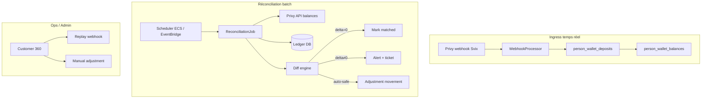

# Plan enterprise — Réconciliation Privy on-chain ↔ ledger Vancelix

**Statut :** spécification cible — à implémenter après go-live pilote infra + wallet (voir [PRIVY_PROD_GO_LIVE.md](./PRIVY_PROD_GO_LIVE.md)).

**Objectif :** garantir en permanence que les soldes crypto client (`person_wallet_balances`) reflètent la réalité on-chain du wallet Privy, avec traçabilité audit, détection d’écarts, et résolution ops sans SQL manuel.

---

## 1. Principes

| Principe | Description |
|----------|-------------|
| **Privy = source of truth on-chain** | L’état final des actifs détenus par le client est celui du wallet Privy. |
| **Ledger = source of truth produit** | L’app (patrimoine, historique, compliance) lit `person_wallet_*`, pas la chain directement. |
| **Double entrée événementielle** | Toute mutation ledger passe par un événement idempotent (webhook, swap settlement, ajustement admin). |
| **Réconciliation ≠ remplacement webhook** | Webhooks = temps réel ; reconcile = contrôle périodique + correction des écarts. |
| **États intermédiaires explicites** | Swaps LI.fi : fonds `in_transit` hors wallet, tracés jusqu’au crédit final. |

---

## 2. Modèle de données cible (extensions)

### 2.1 Tables existantes (V1 — livré)

- `person_crypto_wallets` — adresses liées
- `person_wallet_deposits` — crédits entrants (webhook)
- `person_wallet_balances` — soldes agrégés par wallet + asset
- `privy_webhook_events` — journal brut + statut traitement

### 2.2 Extensions prévues (V2 réconciliation)

| Table / colonne | Rôle |
|-----------------|------|
| `person_wallet_reconciliation_runs` | Batch id, started_at, status, summary JSON |
| `person_wallet_reconciliation_items` | Par (person, wallet, asset) : on_chain, ledger, delta, status |
| `person_wallet_balance_snapshots` | Point-in-time avant/après correction |
| `person_wallet_movements` | Ledger unifié (deposit, swap_out, swap_in, adjustment) — remplace la lecture fragmentée |
| `person_wallet_balances.in_transit` | Montant bloqué pendant swap LP |
| `person_wallet_balances.last_reconciled_at` | Horodatage dernière vérif OK |

### 2.3 Statuts de réconciliation

```
matched | ledger_ahead | chain_ahead | mismatch | in_transit_expected | unresolved
```

---

## 3. Architecture runtime



---

## 4. Phases de delivery

### Phase R0 — Fondations (prérequis go-live pilote)

**Durée cible :** 1 sprint (déjà partiellement livré)

- [x] Webhook `wallet.funds_deposited` idempotent
- [x] Admin `simulate-deposit`, `reconcile-wallets`
- [x] Endpoints readiness infra + client
- [ ] Dashboard Privy webhook prod configuré
- [ ] `PRIVY_APP_SECRET` + `PRIVY_WEBHOOK_SECRET` en ECS
- [ ] Runbook incident webhook (PRIVY_PROD_GO_LIVE.md)

**Critère de sortie :** 1 dépôt live pilote crédité end-to-end avec `ready_for_live_deposit: true`.

---

### Phase R1 — Observabilité & contrôles manuels

**Durée cible :** 2 semaines

| Livrable | Détail |
|----------|--------|
| Admin « Réconciliation » | Vue Customer 360 : on-chain (API Privy) vs ledger, par asset |
| Métriques CloudWatch | `privy_webhook_processed`, `failed`, `duplicate`, latence traitement |
| Alertes PagerDuty/Slack | Webhook failed > N/5min ; backlog `received` > 1h |
| Export audit | CSV des `privy_webhook_events` + deposits sur fenêtre glissante |
| SLO | 99.9% webhooks traités < 60s |

**Process ops quotidien (15 min) :**

1. `GET /api/admin/privy-wallet/infra-readiness`
2. Requête SQL / admin : webhooks `failed` dernières 24h
3. Échantillon 5 comptes actifs : compare balances API vs DB

**Critère de sortie :** 0 écart non expliqué > 24h sur comptes pilotes.

---

### Phase R2 — Réconciliation batch automatisée

**Durée cible :** 3–4 semaines

| Composant | Spec |
|-----------|------|
| **Job `PrivyLedgerReconciliationJob`** | Cron toutes les 15 min (configurable) |
| **Scope** | Tous `person_crypto_wallets` actifs avec `person_wallet_balances` > 0 ou mouvement < 7j |
| **Source on-chain** | Privy API (balances par wallet) — fallback : indexer public si API gap |
| **Diff engine** | `delta = chain_balance - ledger_balance` ; tolérance dust (< 0.01 USDC) |
| **Auto-heal safe** | Uniquement si : delta > 0, webhook manqué prouvé (tx hash trouvable), pas de swap in_transit |
| **Auto-heal interdit** | delta < 0 (fuite?) ; delta > seuil (ex. 1000 USD) → alerte humaine |

**API admin :**

```http
POST /api/admin/privy-wallet/reconciliation/run?scope=person|all
GET  /api/admin/privy-wallet/reconciliation/runs/{run_id}
GET  /api/admin/privy-wallet/reconciliation/items?status=mismatch
```

**Critère de sortie :** 7 jours prod pilote sans mismatch non résolu ; auto-heal documenté et auditable.

---

### Phase R3 — Movements ledger unifié + swaps LI.fi

**Durée cible :** 4–6 semaines (après R2 stable)

| Flux | Ledger |
|------|--------|
| Dépôt externe | `movement: deposit` (existant) |
| Achat euro→crypto | `movement: exchange_credit` après settlement Privy |
| Swap crypto→crypto | `swap_out` → `in_transit` → `swap_in` |
| Échec swap | `swap_failed` + rollback `in_transit` |

**Intégration LI.fi (mock puis prod) :**

1. Mock admin : simuler swap ETH→USDC avec metadata route
2. Webhook / callback LI.fi (ou polling tx status)
3. Réconciliation inclut les montants `in_transit`

**Critère de sortie :** swap mock visible dans historique client ; réconciliation ne flagge pas les swaps pending comme mismatch.

---

### Phase R4 — Enterprise hardening

**Durée cible :** continu

| Domaine | Mesure |
|---------|--------|
| **Sécurité** | Webhook IP allowlist optionnelle ; rotation secrets trimestrielle |
| **Compliance** | Piste audit immuable (append-only movements) ; export regulator-ready |
| **Multi-chain** | Registry assets/chains versionné ; tests par chain_id |
| **DR** | Replay webhooks depuis `privy_webhook_events` ; rebuild balances from movements |
| **Performance** | Partition table deposits ; index person_id + created_at |
| **Tests** | Property tests : sum(movements) = balance ; chaos webhook duplicate/delay |

---

## 5. Règles métier de réconciliation

### 5.1 Cas nominaux

| Situation | Action |
|-----------|--------|
| chain = ledger | `matched`, update `last_reconciled_at` |
| chain > ledger, tx hash connu non ingéré | Créer deposit rétroactif depuis Privy tx index |
| chain > ledger, cause inconnue | Alerte ops, pas d’auto-crédit > seuil dust |
| chain < ledger | **Alerte critique** — pas d’auto-débit ; investigation |

### 5.2 Swaps en cours (LI.fi)

Pendant un swap :

- Débiter `available_balance`, créditer `in_transit` (asset source)
- Réconciliation : `chain + in_transit` comparé au modèle attendu
- À la fin : créditer asset cible, zéro `in_transit`

### 5.3 Seuils proposés

| Paramètre | Valeur initiale |
|-----------|-----------------|
| Dust tolerance | 0.01 unité asset |
| Auto-heal max | 100 USD équivalent |
| Cron interval | 15 min |
| Webhook stale alert | 1h sans event sur compte actif déposant |

---

## 6. Gouvernance & RACI

| Rôle | Responsabilité |
|------|----------------|
| **Engineering** | Job reconcile, diff engine, APIs admin |
| **Ops / SRE** | Secrets, alertes, runbooks, deploy |
| **Compliance** | Validation piste audit, seuils auto-heal |
| **Support L2** | Tickets mismatch ; escalate si chain < ledger |

**Revues obligatoires avant R2 prod :** Compliance + Engineering lead sign-off sur règles auto-heal.

---

## 7. KPIs

| KPI | Cible R2 |
|-----|----------|
| % wallets `matched` | > 99.5% |
| Temps médian webhook → UI | < 30s |
| Mismatch non résolu > 4h | 0 |
| False positive reconcile alert | < 1/jour |
| Replay webhook success | 100% idempotent |

---

## 8. Ordre recommandé vs périmètre produit (§4)

1. **R0–R1** : avant ouverture clients (pilote interne OK)
2. **R2** : avant marketing « dépôt crypto »
3. **R3** : avant swaps / achats crypto live on-chain
4. **Périmètre produit partiel (exchanges PE, LI.fi)** : traiter **après R2 stable** — la réconciliation doit être fiable sur les seuls dépôts avant d’ajouter la complexité swap.

---

## 9. Prochaines actions immédiates (cette semaine)

1. Exécuter [PRIVY_PROD_GO_LIVE.md](./PRIVY_PROD_GO_LIVE.md) §1 (secrets + webhook + deploy).
2. Lier wallet prod Gael = même état que local (`customer-readiness`).
3. Dépôt pilote 5–10 USDC mainnet.
4. Ouvrir ticket Phase R1 (métriques + vue admin compare balances).
5. **Ne pas** démarrer LI.fi / exchange settlement avant R2 planifié.
