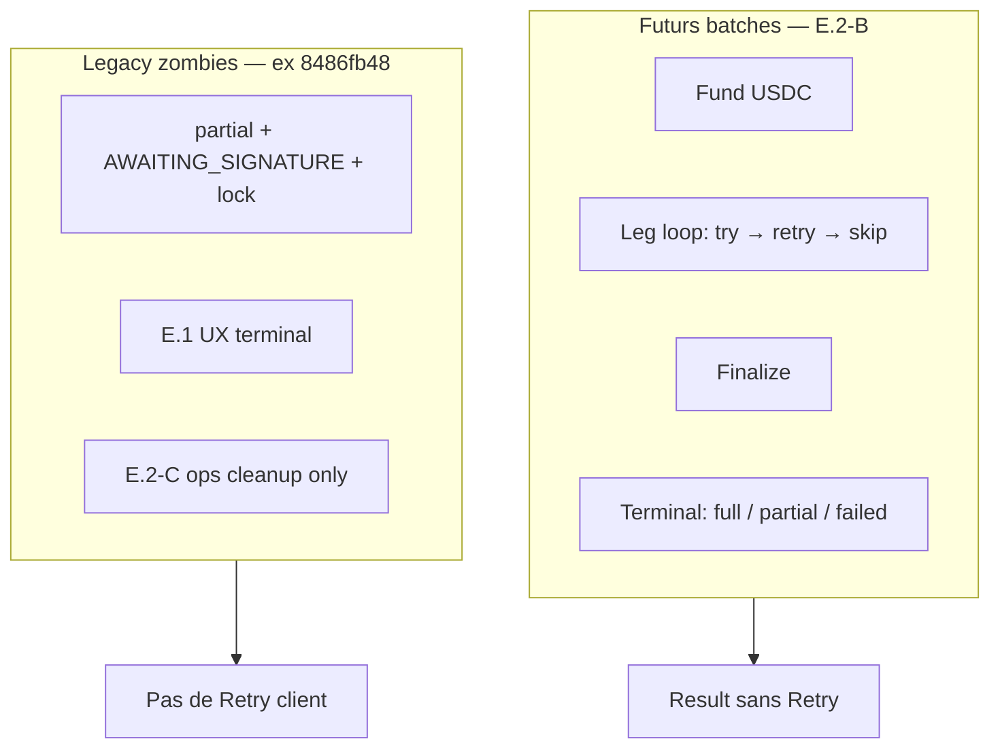
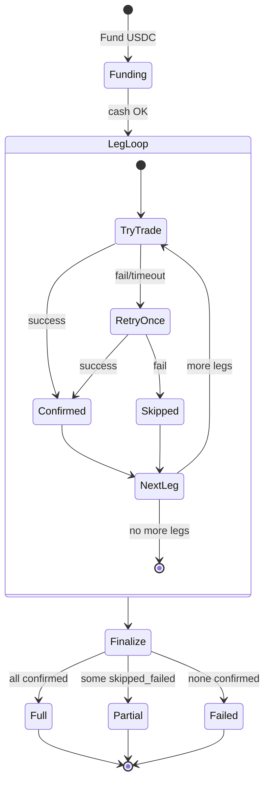

# R4.5-E.2 — Bundle invest : orchestration, terminalisation et réconciliation

**Statut :** Spec + audit read-only · doctrine corrigée (orchestrateur, pas recovery client)  
**Date :** 2026-06-03 (mise à jour doctrine orchestration)  
**Prérequis UX :** R4.5-E.1 déployé (`0633149`) — plus de processing infini côté front  
**Read model :** E.2-A implémenté (`1c89898`) — lecture seule  
**Batch legacy prod :** `8486fb48-09e6-421c-8654-8a0e5ad1b9be` (Gaël / Two Crypto Kings)

---

## 0. Séparation des sujets

| Sujet | Chantier | État |
|-------|----------|------|
| Ne plus rester bloqué en « en cours » / processing infini | **R4.5-E.1** | ✅ Prod (front) |
| Orchestrateur qui **va au bout** (retry interne, skip leg, batch terminal) | **R4.5-E.2-B** | 📋 À implémenter |
| Read model / diagnostic batch (dont legacy zombies) | **R4.5-E.2-A** | ✅ Code (`1c89898`) — sémantique à aligner (§7) |
| Cleanup ops **uniquement** batches legacy déjà zombies | **R4.5-E.2-C** | 📋 À implémenter |

**Ce que nous ne voulons pas :** un produit « recovery » avec boutons **Reprendre**, **Retry**, batch **pending** / **signature_requested** visible client après la fin de la session d’investissement.

**Ce que nous voulons :** un **orchestrateur robuste** pendant la **première** session d’investissement : fund → legs séquentielles → retry interne par leg → skip si échec → finalize → **état terminal propre**.

---

## 0.1 Doctrine cible — orchestration bundle invest

### Flow métier (session unique)

```text
1. Fund USDC → bundle cash leg
2. Pour chaque allocation cible (ordre du plan) :
     a. tenter le trade LI.FI
     b. si fail / timeout / AWAITING_SIGNATURE bloqué → retry 1 fois (même session)
     c. si retry OK → leg confirmée → leg suivante
     d. si retry KO → abandonner cette leg (skipped_failed) → leg suivante
3. Finaliser le batch (même si une ou plusieurs legs abandonnées)
4. Résultat terminal obligatoire (lock libéré, intent terminal, pas de swap live)
```

### Exemple (Two Crypto Kings, montant fictif)

| Étape | Leg | Tentative | Retry | Issue |
|-------|-----|-----------|-------|-------|
| Fund | USDC → cash bundle | OK | — | — |
| 1 | USDC → CBBTC | fail | retry → **success** | next |
| 2 | USDC → CBETH | fail | retry → **fail** | **skip CBETH**, cash residual |
| 3 | (fin plan) | — | — | **finalize** |

→ Statut terminal cible : **`completed_partial_allocation`** (pas zombie, pas bouton client).

### Règles fondamentales

1. **Une transaction bundle doit toujours terminer** dans la même session utilisateur (processing → result).
2. Le **retry est interne** à l’orchestration (pendant l’étape 2), **pas** une action postérieure.
3. Après retry épuisé sur une leg : **skip** + **continue** — ne pas bloquer le batch entier.
4. **Ne jamais** laisser `signature_requested` / `AWAITING_SIGNATURE` indéfiniment sur un batch **futur** correctement orchestré.
5. **Ne jamais** relancer une leg depuis le **front client** après terminalisation du batch.
6. **Pas de rollback** : legs confirmées conservées ; cash non investi reste en **cash leg bundle** (visible, pas vendu, pas relâché auto vers trading).
7. **`reconciliation_required`** réservé aux cas **infra ambigus** impossibles à classifier (pas le cas nominal « leg abandonnée après retry »).

### Ce qui est explicitement interdit (produit)

| Interdit | Pourquoi |
|----------|----------|
| Bouton **Reprendre** / **Retry** sur batch partiel | Recovery visible = mauvais modèle |
| `POST /invest/resume` déclenché par le client après result | Reprise post-session |
| Batch qui reste `partial` + lock actif sans finalize | Zombie |
| Vendre CBBTC pour « annuler » | Rollback économique |
| Masquer le cash residual | Transparence portefeuille |

---

## 0.2 Statuts terminaux cibles (persistés)

| Statut canon | Condition | UX Result (futur) |
|--------------|-----------|-------------------|
| **`completed_full_allocation`** | Toutes les legs cible confirmées ; finalize OK | Succès complet |
| **`completed_partial_allocation`** | ≥1 leg confirmée **ou** fund OK ; ≥1 leg `skipped_failed` ; cash residual possible | **Investissement partiellement réalisé** |
| **`failed_no_allocation`** | Aucune leg confirmée ; aucun effet métier utile (fund échoué ou 0 allocation) | Impossible / échec |
| **`reconciliation_required`** | Ambiguïté infra (timeout non classé, divergence PE/LI.FI, lock incohérent **non** résolu par l’orchestrateur) | Vérification nécessaire (E.1) — **exceptionnel** |

Mapping intent / lock (à formaliser en E.2-B) :

- Intent parent : `confirmed` (full), `partial` → renommer sémantiquement en **`completed_partial_allocation`**, `failed`, ou `reconciliation_required` (legacy/infra).
- Lock : **toujours terminal** après finalize (`completed` / `completed_partial_allocation` / `failed`) — **jamais** `signature_requested` en fin de session nominale.

Leg (metadata / allocation_details) :

- `confirmed` | `skipped_failed` | `failed` (swap terminal) — pas `pending` après fin de batch.

---

## 0.3 UX cible (futur — post E.2-B)

### Processing

- Titre : « Investissement en cours »
- Step : « Allocation du portefeuille »
- Sous-texte dynamique : « Allocation en cours : cbBTC » puis « Allocation en cours : cbETH »
- Si cbETH échoue après retry : **pas** d’erreur technique bloquante — enchaîner ou finaliser

### Result — allocation partielle (cas nominal après orchestration)

| Champ | Copy |
|-------|------|
| **Title** | Investissement partiellement réalisé |
| **Message** | Une partie de votre allocation a été réalisée. Le solde non investi reste disponible dans votre portefeuille. |
| **Buttons** | Voir mon portefeuille · Fermer |
| **Pas de** | Retry · Reprendre · Batch pending |

### Result — E.1 actuel vs futur

| Contexte | Écran |
|----------|--------|
| **Legacy zombie** (`8486fb48`) | E.1 peut encore afficher « Vérification nécessaire » — batch créé **avant** orchestrateur corrigé |
| **Futur batch** | Result **`completed_partial_allocation`** — pas « Vérification nécessaire » sauf vrai cas infra |

---

## 0.4 Distinction Legacy vs Futur



| | **A. Futurs batches** | **B. Legacy zombies** |
|--|----------------------|------------------------|
| Retry | Interne, 1× par leg, dans la session | N/A — batch déjà cassé |
| Fin batch | `finalize` systématique | Ops : `complete_with_cash_residual` |
| Client | Result terminal propre | Pas de bouton Retry ; éventuellement copy Vérification (E.1) |
| Ops | Audit read model | Cleanup **uniquement** (E.2-C) |

---

## 1. État réel du batch `8486fb48` (prod, read-only — **legacy**)

**Méthode :** `inspect_bundle_state` ECS (2026-06-03). Aucune écriture.

| Identifiant | Valeur |
|-------------|--------|
| Person | `8b0e0044-f1ef-47a5-99d4-370598a77492` |
| Portfolio | `daea3720-e58e-410f-a796-3bbd541ac608` — Two Crypto Kings |
| Batch | `8486fb48-09e6-421c-8654-8a0e5ad1b9be` |

| Dimension | État | Interprétation **legacy** |
|-----------|------|---------------------------|
| Fund USDC | OK | Cash leg **4,2 USDC** |
| CBBTC | CONFIRMED (2,8 USDC) | Leg 1 OK |
| CBETH | AWAITING_SIGNATURE (1,2 USDC) | Orchestrateur **n’a pas** skip + finalize |
| Intent | `partial` | Non terminal |
| Lock | `signature_requested`, ~541 min | **Zombie** — bug backend pré E.2-B |
| Cause racine | Pas de « skip leg + finalize » après échec CBETH | **Pas** un manque de bouton Retry client |

Ce batch illustre **pourquoi** E.2-B est prioritaire : ce n’est pas un problème de « recovery produit », c’est un orchestrateur qui n’a pas terminé la session.

---

## 2. Invariants comptables (inchangés)

1. Pas de rollback économique si spot confirmé.
2. Cash leg bundle = USDC non alloué, **visible**.
3. Invariant G respecté ; pas de trou non expliqué.
4. Append-only ledger ; idempotence ops legacy.
5. **Futur :** lock terminal cohérent avec batch terminé.
6. Cash residual : pas de release auto vers trading ; pas de vente des legs confirmées.

---

## 3. Sources de vérité (SoT)

| Priorité | Source | Rôle |
|----------|--------|------|
| 1 | `pe_position_atoms` | SoT comptable bundle |
| 2 | `person_wallet_swaps` | SoT exécution LI.FI par leg |
| 3 | `transaction_intents` | Historique / statut agrégé terminal |
| 4 | `bundle_invest_lock` | Concurrence **pendant** invest uniquement — **absent** après finalize |
| 5 | `bundle_ledger_entries` | Audit événementiel (shadow) |
| 6 | Payload API `invest` | Vue dérivée session |
| 7 | `sessionStorage` | Non SoT |

---

## 4. Réponses aux questions (doctrine corrigée)

### Q1 — État cible d’un bundle partiel ?

**Futur :** allocation partielle **terminée** = `completed_partial_allocation` + cash en bundle + spots confirmés.  
**Legacy :** comme `8486fb48` → cleanup ops (E.2-C), pas retry client.

### Q2 — Statut final persister ?

Utiliser les statuts §0.2. Abandonner comme statut nominal client-facing :

- ~~ops retry missing leg~~
- ~~reconciliation_required comme fin normale d’une leg skipped~~

`reconciliation_required` = **legacy + infra edge** seulement.

### Q3 — UX après investissement ?

Voir §0.3. **Pas** de recovery CTA.

### Q4 — Actions — qui fait quoi ?

| Acteur | Futur | Legacy (`8486fb48`) |
|--------|-------|---------------------|
| **Orchestrateur** | Retry interne, skip, finalize | — (déjà passé) |
| **Client** | Attendre fin session ; Result terminal | E.1 stoppe l’infini ; pas Retry |
| **Ops** | Rien (nominal) | `complete_with_cash_residual`, mark terminal (E.2-C) |

**Retiré de la doctrine produit :** « Retry missing CBETH leg » comme action **client** ou **UX**.

### Q5 — Interdits (rappel)

- Retry / Reprendre **après** fin de session côté client
- Lock / swap live indéfinis sur **nouveaux** batches
- Rollback, masquer cash, vente spot pour annuler

---

## 5. Diagramme — orchestration cible (futur)



---

## 6. Impact technique attendu (E.2-B — pas de code dans ce livrable)

### `useBundleLifiInvest.ts` (web)

| Aujourd’hui | Cible |
|-------------|--------|
| `executePendingLegs` : retry 1× puis `BundleInvestTerminalError` | Boucle legs : try → retry → **skip** (marquer leg) → **continue** |
| Arrêt sur erreur / poll timeout | Timeout par leg → retry → skip, pas arrêt global |
| `resumeSession` / auto-resume | **Supprimer** le parcours client post-terminal (garder lecture seule legacy via read model) |
| Result `reconciliation_required` large | Result **`completed_partial_allocation`** si skip après retry ; `reconciliation_required` si infra seulement |

### `BundleOrchestrator` / `executePendingLegs` (API)

| Composant | Changement attendu |
|-----------|-------------------|
| `orchestrator` invest LI.FI | Orchestration séquentielle avec **skip leg** explicite (swap → FAILED/EXPIRED, leg `skipped_failed`) |
| `finalize_lifi_batch` | Appelé **toujours** après la boucle legs (même partial) |
| `bundle_invest_lock` | `clear_invest_lock` / terminal lock **dans finalize**, pas laisser `signature_requested` |
| `bundle_intent_sync` | Statut parent mappé vers `completed_full` / `completed_partial` / `failed_no_allocation` |
| `resume_lifi_invest_batch` | **Pas** exposé client ; réservé ops legacy (E.2-C) si encore nécessaire |
| `pollBundleLegUntilTerminal` | Timeout → retry interne → puis **skip**, pas throw terminal global (sauf infra) |

### E.1 (front) — alignement post E.2-B

- Mapper result API → copy **« Investissement partiellement réalisé »** (§0.3).
- Garder `reconciliation_required` **uniquement** pour legacy + infra (read model `legacy_zombie: true`).

---

## 7. Read model E.2-A — sémantique à aligner (sans changer le code ici)

**Implémenté :** `GET /api/app/bundle/reconciliation-state` · `GET /api/portal/bundles/reconciliation-state`

### Ajustement doctrine documentaire

| Champ actuel | Sémantique cible |
|--------------|------------------|
| `status: reconciliation_required` | **`legacy_zombie`** si lock zombie ; futur : **`completed_partial_allocation`** en nominal |
| `available_actions: retry_missing_leg` | **Retirer côté client** — marquer `ops_only: true` + `legacy_cleanup_actions` en E.2-C |
| `lock.zombie` | Problème **legacy** ; objectif produit = **plus de zombies** après E.2-B |

**Règle read model :**

- **Futur :** endpoint utilisé pour **debug / support / audit**, pas pour proposer un Retry UI.
- **Legacy :** `available_actions` limité à `complete_with_cash_residual` (ops), **pas** `retry_missing_leg` exposé portail.

---

## 8. Plan d’implémentation (révisé)

| Phase | Id | Livrable | Notes |
|-------|-----|----------|-------|
| ✅ **E.2-A** | Read model | API lecture seule + tests | Sémantique §7 à raffiner en code ultérieur |
| **E.2-B** | **Orchestrateur** | Retry interne 1×/leg · skip · finalize obligatoire · statuts §0.2 · lock terminal | **Cœur produit** — remplace l’ancien « E.2-B ops retry » |
| **E.2-C** | **Legacy cleanup** | Ops admin : `complete_with_cash_residual`, mark `completed_partial_allocation` pour zombies existants | **Pas** retry client ; batch `8486fb48` |
| **E.2-D** | Projection panier | Cash residual visible, poids réels vs cible | Après B |
| **E.2-E** | Tests | Orchestrateur : full / partial / failed / skip leg ; pas de lock zombie en fin | CI |

**Ordre recommandé (aligné produit) :**

1. E.2-B Orchestrateur (évite nouveaux zombies)  
2. Aligner E.2-A + E.1 copy (partial vs verification)  
3. E.2-C Legacy cleanup (`8486fb48`)  
4. E.2-D Projection  
5. R4.5-F Privy Cleanup · **puis** Bundle Withdraw (après modèle métier stable)

---

## 9. Runbook legacy (NE PAS EXÉCUTER — `8486fb48` uniquement)

**Pas de branche « Retry CBETH » côté client.**

### Pré-vol (read-only)

```bash
./scripts/arquantix-ecs-run-job.sh arquantix-api arquantix-api \
  "cd /app && python3 -m scripts.inspect_bundle_state \
    --person-id 8b0e0044-f1ef-47a5-99d4-370598a77492 \
    --portfolio-id daea3720-e58e-410f-a796-3bbd541ac608 \
    --batch-id 8486fb48-09e6-421c-8654-8a0e5ad1b9be"
```

### Cleanup ops (E.2-C — feu vert explicite)

1. Marquer swap CBETH terminal (FAILED/EXPIRED) si encore `AWAITING_SIGNATURE`.
2. `finalize` avec `entry_consumed` = somme legs confirmées.
3. Lock → `completed_partial_allocation` (terminal).
4. Intent → aligné terminal (pas `partial` ouvert).
5. Ledger shadow **MATCH**.

**Interdit :** demander à l’utilisateur de « Reprendre » l’investissement sur ce batch.

---

## 10. Critères d’acceptation (révisés)

### Futurs batches (post E.2-B)

1. Session invest **toujours** se termine par un écran Result (full / partial / failed) — pas de zombie.
2. Leg en échec après 1 retry → **skip** → legs suivantes ou finalize.
3. Aucun bouton Retry / Reprendre client.
4. Cash residual visible en panier si partial.
5. Lock absent après finalize.

### Legacy

1. Read model identifie `8486fb48` comme zombie.
2. E.2-C permet cleanup ops sans retry client.
3. E.1 ne relance pas processing infini.

---

## 11. Références

| Ressource | Chemin |
|-----------|--------|
| Orchestrateur | `services/arquantix/api/.../bundles/orchestrator.py` |
| Front invest | `services/arquantix/web/.../useBundleLifiInvest.ts` |
| Terminal UX E.1 | `bundleInvestTerminalization.ts` |
| Read model E.2-A | `bundle_reconciliation_read_model.py` |
| Invest lock | `bundle_invest_lock.py` |
| Spec E.1 deploy | commit `0633149` |

---

## 12. Conclusion

- Le **retry** appartient à l’**orchestration initiale** (fund → legs → retry interne → skip → finalize), **pas** à une UX post-zombie.
- Le batch **`8486fb48`** est un **legacy** : symptôme d’un orchestrateur qui n’a pas skip+finalize, **pas** d’un besoin de bouton Retry client.
- **E.2-B** = orchestrateur robuste · **E.2-C** = cleanup legacy ops · **E.2-A** = diagnostic.
- **`reconciliation_required`** = exception infra / legacy, **pas** la fin normale d’un investissement partiel réussi.

**Prochaine étape :** déployer **E.2-B** (orchestrateur front) après validation ; décider ensuite **E.2-B2** si besoin.

---

## 13. E.2-B — implémentation front (orchestrateur anti-zombie)

### Décision backend finalize partial

`finalize_lifi_batch` (`orchestrator.py`) accepte déjà un `entry_consumed` **partiel**, crédite le cash residual et appelle **`clear_invest_lock`**. **Pas de E.2-B2 obligatoire** pour le flux nominal : le front appelle `finalizeBundleBatch` après la boucle legs même si certaines legs sont `skipped_failed`.

**Limite documentée :** un swap peut rester en `AWAITING_SIGNATURE` en base après skip ; si le lock persiste malgré un finalize HTTP 200, l’UI affiche `completed_partial_allocation` + détail technique replié « Verrou investissement encore actif côté serveur » (`backendLockPending`).

### Fichiers E.2-B

| Fichier | Rôle |
|---------|------|
| `bundleInvestOrchestration.ts` | `BundleLegOutcome`, statuts terminaux, résolution partial/full/failed |
| `useBundleLifiInvest.ts` | Boucle legs : try → retry 1× → skip → **finalize obligatoire** |
| `bundleInvestTerminalization.ts` | `BundleLegSkippableError` (poll timeout/failed) |
| `PortalBundleInvestDialog.tsx` | Result partial, pas Retry/Reprendre, pas auto-resume client |
| `bundleUiCopy.ts` | Copy « Investissement partiellement réalisé » |

### Hors scope (confirmé)

- Batch legacy `8486fb48` non modifié · pas de repair/backfill/ops · pas de push sans validation.
