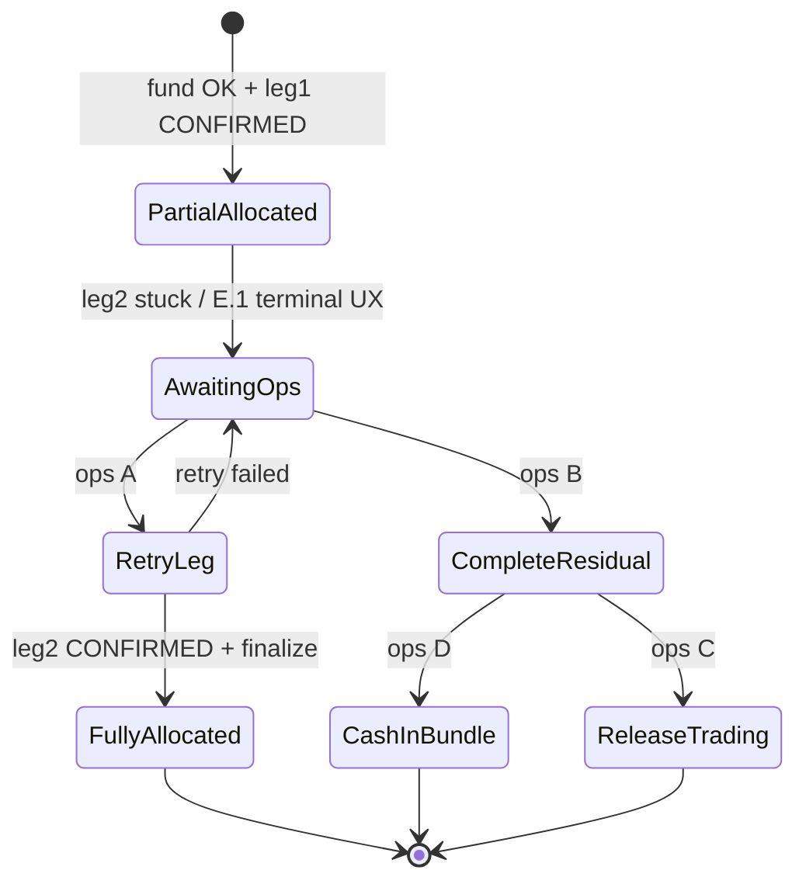

# R4.5-E.2 — Bundle partial invest reconciliation controller

**Statut :** Spec + audit read-only (pas d’implémentation, pas d’ops exécuté)  
**Date :** 2026-06-03  
**Prérequis UX :** R4.5-E.1 déployé (`0633149`) — terminalisation front `reconciliation_required`  
**Batch de référence prod :** `8486fb48-09e6-421c-8654-8a0e5ad1b9be` (Gaël / Two Crypto Kings)

---

## 0. Séparation des sujets

| Sujet | Chantier | État |
|-------|----------|------|
| Ne plus rester bloqué en « en cours » / processing infini | **R4.5-E.1** | ✅ Prod (front) |
| Que faire métier/comptable d’un bundle **partiellement exécuté** | **R4.5-E.2** | 📋 Ce document |

E.1 ne répare pas le batch ; E.2 définit le **contrôleur de réconciliation** (read model, statuts persistés, actions ops, projection utilisateur).

**Contraintes respectées pour cet audit :** aucune mutation prod, pas de repair/backfill, pas de write PE, pas de retry auto prod, pas de liquidation, pas de modification de soldes.

---

## 1. État réel du batch `8486fb48` (prod, read-only)

**Méthode :** `python3 -m scripts.inspect_bundle_state` via ECS Fargate (2026-06-03T03:53:55Z). Aucune écriture DB.

| Identifiant | Valeur |
|-------------|--------|
| Person | `8b0e0044-f1ef-47a5-99d4-370598a77492` |
| Client | `080358a8-4519-4acf-b5da-25485446c967` (`gaelitier@gmail.com`) |
| Portfolio bundle | `daea3720-e58e-410f-a796-3bbd541ac608` — *Two Crypto Kings* |
| Batch | `8486fb48-09e6-421c-8654-8a0e5ad1b9be` |

### 1.1 Funding & cash leg

| Élément | État |
|---------|------|
| Transfert USDC vers bundle (fund) | **OK** (audit historique + cash leg présente) |
| **Cash leg disponible (PE)** | **4,2 USDC** (`resolve_bundle_cash_leg_available`) |
| Interprétation | USDC non consommés par la patte CBETH + reliquat du plan d’allocation |

### 1.2 Allocations LI.FI (person_wallet_swaps)

| Swap | Asset | Statut | Montant in | tx_hash |
|------|-------|--------|------------|---------|
| `c058a359-…` | USDC → **CBBTC** | **CONFIRMED** | 2,8 USDC | `0x7375…d359` |
| `974fcc5d-…` | USDC → **CBETH** | **AWAITING_SIGNATURE** | 1,2 USDC | `null` |

→ **Succès partiel** : une leg confirmée, une leg non finalisée (pas `FAILED` en base).

### 1.3 Positions bundle (pe_position_atoms spot)

| Asset affiché | Quantité | cost_basis_eur |
|---------------|----------|----------------|
| BTC | 0,00021844 | 13,19 |
| ETH | 0,0023815258 | 4,62 |

Les symboles PE (`BTC` / `ETH`) correspondent aux legs wrapper **cbBTC** / **cbETH** côté produit — la projection portefeuille doit continuer à les mapper pour l’utilisateur.

### 1.4 Verrou invest (`pe_portfolios.metadata.bundle_invest_lock`)

| Champ | Valeur |
|-------|--------|
| Présent / actif | **oui** |
| `status` | **`signature_requested`** |
| `batch_id` | `8486fb48-…` |
| Âge | **~541 min** (> TTL 120 min) |
| `blocking` (heuristique script) | **false** (TTL dépassé, pas de blocage « frais ») |
| Swap live | **1** (CBETH `AWAITING_SIGNATURE`) |

**Écart important :** le lock reste en statut actif `signature_requested` alors que l’âge dépasse le TTL. `expire_stale_invest_lock_if_safe` ne s’applique pas tant qu’un swap reste en `AWAITING_SIGNATURE` / `SUBMITTED` (`_swap_batch_has_live_invest_work`). D’où un **lock zombie métier** : pas « blocking » pour un nouvel invest selon le script, mais batch/intent/swap toujours ouverts.

### 1.5 Transaction intent parent

| Champ | Valeur |
|-------|--------|
| `product_type` | `bundle_invest` |
| `status` | **`partial`** |
| `legs_count` | 2 |
| Créé | 2026-06-02T18:51:14Z |

Aligné avec `recompute_bundle_parent_status` (au moins une leg `confirmed`, une autre non terminale).

### 1.6 Session front (sessionStorage)

- Clé `portal:bundle-invest:{portfolioId}` — **éphémère**, pas SoT.
- Après E.1 : à l’ouverture du dialog → **écran « Vérification nécessaire »** sans relance auto du processing.

### 1.7 Projection utilisateur & historique

- **Marchés / panier :** doit refléter **positions partielles + cash USDC dans le bundle** (pas un panier « vide » ni 100 % cible).
- **Historique transaction :** intent `partial` — pas terminal `confirmed` ; risque de message ambigu si l’UI historique ne distingue pas partial vs en cours.
- **Cible bundle (Two Crypto Kings) :** poids cbBTC / cbETH non atteints ; écart structurel tant que CBETH non alloué ou cash non réalloué.

### 1.8 Bundle ledger (shadow)

- Script `reconcile_bundle_ledger_shadow` disponible (admin + ECS).
- Pour ce batch : **non re-exécuté avec verdict exploitable** dans cet audit (job ECS OK, logs non capturés ici).
- **Règle E.2 :** avant toute action ops qui touche les soldes, exiger `verdict` ledger vs PE (`docs/arquantix/BUNDLE_LEDGER_RECONCILIATION.md`).

---

## 2. Invariants comptables (doctrine)

1. **Pas de rollback économique** si au moins une allocation spot est confirmée (CBBTC acheté → ne pas vendre pour « annuler »).
2. **Cash leg bundle** = USDC (entry asset) détenus **dans le portfolio bundle**, distincts du wallet trading.
3. **Invariant G (client)** : somme atoms PE ≈ custody + pending ; le batch partiel ne doit pas créer de « trou » non expliqué.
4. **Append-only** : corrections via événements / reversals ledger, pas d’édition destructive des entrées shadow.
5. **Idempotence** : toute action ops E.2 porte `batch_id` + `action_type` + clé idempotence.
6. **Lock ↔ travail LI.FI** : un lock actif doit être **cohérent** avec swaps/intents ; sinon état `reconciliation_required` + lock terminalisé côté ops.
7. **Cash residual visible** : ne jamais masquer les 4,2 USDC (ni en UI ni en API projection).

---

## 3. Sources de vérité (SoT) — hiérarchie recommandée

| Priorité | Source | Rôle |
|----------|--------|------|
| **1 — Positions & cash** | `pe_position_atoms` (spot + cash leg instrument) | **SoT comptable** de ce que le client possède dans le bundle |
| **2 — Exécution** | `person_wallet_swaps` (audit `bundle_context`) | **SoT exécution** LI.FI par leg (CONFIRMED / AWAITING_SIGNATURE / FAILED) |
| **3 — Narratif produit** | `transaction_intents` (`bundle_invest`, legs[]) | **SoT historique utilisateur** + statut agrégé (`partial`, `confirmed`, …) |
| **4 — Concurrence / reprise** | `pe_portfolios.metadata.bundle_invest_lock` | **SoT verrou** — doit être dérivé / réconciliable avec (2) et (3) |
| **5 — Traçabilité future** | `bundle_ledger_entries` (shadow → Phase 4B) | **SoT événementiel** pour replay / audit (pas encore unique en prod) |
| **6 — Batch payload API** | Réponse `invest` / `resume` (agrégat) | **Vue dérivée** pour le front — recalculée depuis (1)(2)(3) |
| **7 — Session** | `sessionStorage` portal | **Non SoT** — cache UX uniquement |

**Batch `batch_id` :** clé de corrélation transverse (swaps, intent, lock, ledger, audit PE) — pas une table batch dédiée aujourd’hui.

---

## 4. Réponses aux questions produit / technique

### Q1 — État cible d’un bundle partiel ?

| Option | Verdict E.2 |
|--------|-------------|
| **A. Allocation partielle + cash leg USDC** | ✅ **État cible par défaut** (recommandation métier validée) |
| **B. Retenter uniquement la leg manquante** | ✅ **Action ops / phase ultérieure** (E.2-B), pas auto front post-E.1 |
| **C. Revenir 100 % cash bundle** | ⚠️ Uniquement si **aucune** spot confirmée ; **interdit** ici (CBBTC confirmé) |
| **D. Annuler économiquement** | ❌ **Interdit** si spot déjà acheté |

**État cible pour `8486fb48` :** panier = **CBBTC (spot) + 4,2 USDC cash leg** + batch marqué **réconciliation requise** jusqu’à décision ops.

### Q2 — Quel statut final persister ?

Proposition de **vocabulaire canon** (aligné `IntentStatus` + lock + API) :

| Statut | Couche | Usage |
|--------|--------|-------|
| `partial` | intent parent | Au moins 1 leg confirmée, batch non clos |
| `reconciliation_required` | intent parent **ou** champ dérivé API | Terminal métier « décision humaine / ops » |
| `partially_allocated` | projection read model (E.2-A) | UX portefeuille : « allocation partielle » |
| `completed_with_cash_residual` | lock terminal + intent terminal | Clôture ops : legs traitées ou abandonnées, cash > 0 accepté |
| `awaiting_manual_reconciliation` | lock (optionnel) | Synonyme ops de `reconciliation_required` sur le verrou |

**Recommandation :**

- **Intent :** passer de `partial` → **`reconciliation_required`** quand le front a terminalisé (E.1) **et** qu’aucun swap live ne peut progresser sans ops (CBETH bloqué > TTL).
- **Lock :** terminaliser en **`reconciliation_required`** ou **`completed_with_cash_residual`** (selon action ops), **pas** laisser `signature_requested` indéfiniment.
- **Ne pas** introduire `bundle_invest_partial` comme nouveau statut DB si `partial` + metadata suffisent — préférer enrichir metadata : `{ "reconciliation": { "reason", "failed_asset", "cash_residual_usdc" } }`.

### Q3 — UX après réconciliation ?

| Comportement | Recommandation |
|--------------|----------------|
| Afficher portefeuille | ✅ **CBBTC (+ mapping cbBTC) + cash 4,2 USDC** + écart vs cible |
| Message | « Allocation partielle — finalisation en cours » **ou** « Vérification nécessaire » (E.1) tant que ops n’a pas clôturé |
| Bouton « Finaliser l’allocation » | ❌ **Pas en auto** post-E.1 ; possible **E.2-D** seulement si backend expose une action **idempotente** et safe (sinon ops-only) |
| Retry leg | **Ops-only** (E.2-B) ou parcours dédié admin — **pas** le bouton Reprendre invest supprimé en E.1 |

### Q4 — Actions ops possibles (matrice)

| Action | Description | Quand | Risque |
|--------|-------------|-------|--------|
| **A. Retry missing CBETH leg** | `resume` + signature LI.FI sur swap `974fcc5d-…` | Swap encore `AWAITING_SIGNATURE` / `PENDING` | Signature utilisateur requise ; peut réussir ou fail |
| **B. `complete_with_residual_cash`** | `finalize` batch avec `entry_consumed` partiel + clear lock | CBBTC OK, abandon CBETH, accepter cash 4,2 | Intent → terminal ; cash reste en bundle |
| **C. Release residual → Trading** | `release` cash leg vers self-trading | Politique produit si cash doit sortir du bundle | Mouvement PE + audit ; pas liquidation spot |
| **D. Keep cash in bundle** | Aucun release ; rebalance ultérieur | Défaut après B | Client voit USDC dans panier |
| **E. Manual admin reconciliation** | Endpoint admin + runbook + audit | Tout cas ambigu | Seul canal pour toucher lock/intent |

**Pour `8486fb48` aujourd’hui :** candidats réalistes = **A** (si signature encore possible) ou **B+D** (clôture propre avec cash en bundle). **C** seulement si produit exige sortie du bundle.

### Q5 — Ce qu’il ne faut pas faire

- ❌ Relancer automatiquement une leg depuis le front après terminalisation E.1  
- ❌ Vendre CBBTC pour annuler  
- ❌ Masquer le cash residual  
- ❌ Laisser lock `signature_requested` + swap `AWAITING_SIGNATURE` indéfiniment  
- ❌ Modifier soldes / PE sans runbook et sans ledger shadow MATCH  

---

## 5. Options de réconciliation (synthèse)



---

## 6. Recommandation produit

1. **Doctrine par défaut (validée) :** bundle **partiellement alloué** + **cash residual** + statut **`reconciliation_required`** jusqu’à décision ops.
2. **Communication client :** conserver le copy E.1 (« Vérification nécessaire ») ; enrichir la **fiche panier** (pas le dialog invest) avec allocation réelle vs cible + USDC disponibles.
3. **Pas d’annulation** pour ce cas ; support/ops contact si délai > SLA (ex. 24 h).
4. **SLA interne :** traiter les batches `partial` + lock > TTL comme file ops **P2**.

---

## 7. Recommandation technique

### 7.1 « Reconciliation Controller » (backend)

Nouveau module (nom suggéré) : `services/portfolio_engine/bundles/reconciliation_controller.py`

Responsabilités :

1. **Read model** `GET /api/portal/bundles/{portfolio_id}/invest/reconciliation-state?batch_id=…`  
   Agrège : PE cash/spot, swaps du batch, intent, lock, âge, actions autorisées (sans les exécuter).
2. **Règles de transition** explicites (table statuts × actions).
3. **Terminalisation lock** : si `partial` + (TTL dépassé ET swap non signable) → lock `reconciliation_required` sans effacer le swap (ops décide).
4. **Sync intent** : `sync_bundle_parent_from_batch_status` étendu pour `reconciliation_required`.
5. **Admin routes** (E.2-B/C) : protégées `require_admin_or_ops`, audit `pe_audit_events`, idempotence.

### 7.2 Alignement avec l’existant

| Composant existant | Rôle E.2 |
|--------------------|----------|
| `inspect_bundle_state.py` | Base audit (déjà OK) |
| `reconcile_bundle_ledger_shadow` | Gate avant mutation |
| `bundle_invest_lock.reconcile_idle_invest_lock` | À ne pas confondre avec réconciliation **métier** partial |
| `orchestrator.finalize_lifi_batch` | Utilisé par **B** |
| `orchestrator.resume_lifi_invest_batch` | Utilisé par **A** |
| `bundle_intent_sync.recompute_bundle_parent_status` | Mapper `reconciliation_required` |

### 7.3 Écart détecté (à corriger en E.2)

- Lock `signature_requested` + âge > TTL + swap `AWAITING_SIGNATURE` : le système n’entre pas dans un **état terminal métier** unifié ; E.1 contourne côté UX seulement.
- `get_invest_lock` considère encore le lock comme « actif » alors que l’ops devrait voir **`reconciliation_required`**.

---

## 8. Runbook ops futur (NE PAS EXÉCUTER)

### 8.1 Pré-vol

```bash
# Depuis repo, ECS read-only (exemple)
./scripts/arquantix-ecs-run-job.sh arquantix-api arquantix-api \
  "cd /app && python3 -m scripts.inspect_bundle_state \
    --person-id 8b0e0044-f1ef-47a5-99d4-370598a77492 \
    --portfolio-id daea3720-e58e-410f-a796-3bbd541ac608 \
    --batch-id 8486fb48-09e6-421c-8654-8a0e5ad1b9be"

# Ledger shadow (obligatoire avant write)
./scripts/arquantix-ecs-run-job.sh arquantix-api arquantix-api \
  "cd /app && python3 -m scripts.reconcile_bundle_ledger_shadow \
    --person-id 8b0e0044-f1ef-47a5-99d4-370598a77492 \
    --portfolio-id daea3720-e58e-410f-a796-3bbd541ac608 \
    --batch-id 8486fb48-09e6-421c-8654-8a0e5ad1b9be"
```

**Attendu pré-vol :** cash 4,2 USDC ; CBBTC confirmé ; CBETH `AWAITING_SIGNATURE` ; intent `partial`.

### 8.2 Branche A — Retry CBETH (si signature encore viable)

1. Vérifier swap `974fcc5d-…` toujours `AWAITING_SIGNATURE`.
2. Contacter utilisateur OU exécuter `POST /api/portal/bundles/invest/resume` avec session wallet (ops assistée).
3. Si CONFIRMED → `POST .../invest/finalize` avec `entry_consumed` recalculé.
4. Vérifier intent → `confirmed`, lock cleared.

### 8.3 Branche B — Clôture avec cash résiduel (recommandée si signature impossible)

1. Confirmer abandon leg CBETH (swap → `FAILED` ou `EXPIRED` via process LI.FI / ops).
2. `finalize` batch avec `entry_consumed` = somme legs confirmées (2,8 USDC côté CBBTC).
3. `release_invest_lock(..., terminal_status="completed_with_cash_residual")` *(statut à formaliser en E.2)*.
4. Intent → `reconciliation_required` ou `confirmed` + metadata `cash_residual_usdc: 4.2`.
5. Re-run inspect + ledger shadow → **MATCH**.

### 8.4 Branche C — Release cash vers Trading (option produit)

1. Uniquement après B et accord produit.
2. Appeler le flux `release` cash leg documenté (withdraw interne / release) — **hors scope E.1/E.2 spec**.

### 8.5 Post-vol

- Capture JSON inspect + ledger dans ticket ops.
- Pas de `docker compose down -v`, pas de backfill ledger sans playbook 4B.

---

## 9. Plan d’implémentation E.2 (phases)

| Phase | Id | Livrable | Touche prod ? |
|-------|-----|----------|---------------|
| **E.2-A** | Read model | API + type TS `BundleReconciliationState` ; agrégation PE/swaps/intent/lock ; tests unitaires | Non (lecture seule) |
| **E.2-B** | Ops retry leg | Admin `POST .../reconciliation/retry-leg` → wrap `resume_lifi_invest_batch` + garde-fous | Oui (ops) |
| **E.2-C** | Ops complete residual | Admin `POST .../reconciliation/complete-with-cash` → finalize + terminal lock/intent | Oui (ops) |
| **E.2-D** | User projection | Panier : partial weights, cash leg badge, pas de CTA retry invest | Non si read-only |
| **E.2-E** | Tests | pytest controller + tests web mapper ; fixtures batch partial | CI |

**Ordre suggéré :** A → E (tests) → B/C (admin) → D.

**Hors scope E.2 initial :** release auto vers trading, rebalance auto, job cron Phase 3 PRD.

---

## 10. Critères d’acceptation E.2 (future)

1. Un batch comme `8486fb48` expose un **read model** unique avec actions ops listées et interdictions explicites.
2. Après action ops B, lock **non actif**, intent **terminal**, cash leg **toujours visible**.
3. Ledger shadow **MATCH** (ou INCOMPLETE documenté) post-action.
4. Front panier aligné sur PE (spot + cash), pas de processing infini (E.1 reste).
5. Aucune vente spot automatique pour « annuler » un partial.

---

## 11. Références code & docs

| Ressource | Chemin |
|-----------|--------|
| Inspect read-only | `services/arquantix/api/scripts/inspect_bundle_state.py` |
| Ledger shadow | `services/arquantix/api/scripts/reconcile_bundle_ledger_shadow.py` |
| Invest lock | `services/arquantix/api/services/portfolio_engine/bundles/bundle_invest_lock.py` |
| Intent sync | `services/arquantix/api/services/transaction_intents/bundle_intent_sync.py` |
| Finalize / resume | `services/arquantix/api/services/portfolio_engine/bundles/orchestrator.py` |
| UX terminal front | `services/arquantix/web/src/lib/portal/bundleInvestTerminalization.ts` |
| Recovery hints | `services/arquantix/web/src/lib/portal/bundleStateFormat.ts` |
| Ledger doc | `docs/arquantix/BUNDLE_LEDGER_RECONCILIATION.md` |
| Phase 3 job (plus tard) | `docs/arquantix/portfolio_engine/BUNDLE_RECONCILIATION_PHASE3_PRD.md` |

---

## 12. Conclusion

- **État réel `8486fb48` :** invest **partiellement réussi** (CBBTC + 4,2 USDC en cash leg), CBETH **non signé**, intent **`partial`**, lock **`signature_requested`** stale.
- **E.1** a corrigé l’**UX** ; **E.2** doit corriger le **modèle métier terminal** et les **actions ops contrôlées**.
- **Recommandation par défaut :** traiter comme **allocation partielle + cash residual** ; ops choisit **retry CBETH** ou **clôture avec cash en bundle** — jamais rollback CBBTC.

**Prochaine étape suggérée :** valider cette spec, puis implémenter **E.2-A** (read model) sans mutation prod ; ops manuel sur `8486fb48` via runbook §8 uniquement après feu vert explicite.
