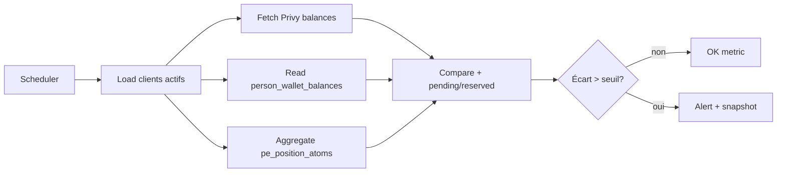

# PRD Phase 3 — Reconciliation Job + Invariant G Alerts

**Statut :** À planifier (après pilote Portal Phase 2 validé)  
**Prérequis :** `BUNDLE_EXECUTION_PROVIDER=lifi_base` en prod pilote · Portal invest/finalize OK · Invariant G dry-run observé

---

## 1. Objectif

Comparer régulièrement les soldes **Privy / on-chain**, **`person_wallet_balances`**, **`pe_position_atoms`** (direct + bundle + futurs vaults/RWA) et les montants **reserved / pending**, puis **alerter** en cas d’écart — **sans bloquer** les clients en phase initiale.

Compléter l’Invariant G (dry-run ponctuel) par un **job de réconciliation** et un **dashboard admin**.

---

## 2. Non-objectifs (Phase 3)

- Bloquer invest / swap / withdraw client sur écart mineur.
- Reserved balances policy complète (Phase 4).
- Rebalance bundle automatisé Portal.
- Flutter mobile bundle execution.

---

## 3. Sources de vérité à comparer

| Couche | Source | Granularité |
|--------|--------|-------------|
| On-chain / custody | Privy wallet balances, tx confirmées | `person_id`, `chain`, `asset` |
| Wallet ledger | `person_wallet_balances` | Même clés + `pending` si modélisé |
| PE comptabilité | `pe_position_atoms` | `client_id`, `portfolio_id`, `instrument_id`, `position_type` |
| Exécution en vol | `person_wallet_swaps` (pending), batch bundle metadata | `swap_id`, `batch_id` |
| Réservé (Phase 4+) | Ordres / legs non soldés | `reserved` flags |

**Règle :** `crypto_positions` reste l’agrégat client — la réconciliation WM se fait sur **atoms** + overlay, pas en scindant `crypto_positions`.

---

## 4. Invariant G étendu

### 4.1 Définition opérationnelle

Pour chaque `client_id` (et optionnellement par `portfolio_id` bundle) :

```text
Σ pe_position_atoms.quantity (hors vaults exclus)
  ≈
soldes Privy agrégés (assets whitelist pilote : USDC, EURC, ETH, cbBTC)
  ± pending_swaps
  ± reserved (Phase 4)
```

Tolérance : configurable (`INVARIANT_G_TOLERANCE_BPS` ou montant absolu par asset).

### 4.2 Modes

| Mode | Comportement |
|------|----------------|
| `dry_run` | Log + métrique + ticket — **défaut Phase 3** |
| `alert` | Notification admin (email / Slack / dashboard) |
| `enforce` | **Hors scope Phase 3** — réservé phase ultérieure |

---

## 5. Reconciliation Job

### 5.1 Déclenchement

- **Cron** : toutes les 15 min (pilote) → 1 h (prod).
- **Hooks** : après `bundle/batch/finalize`, après swap `CONFIRMED` (optionnel, async).
- **Manuel** : endpoint admin `POST /admin/reconciliation/run?scope=client|global`.

### 5.2 Pipeline



### 5.3 Sortie

- Table `reconciliation_snapshots` (ou audit PE existant) : `client_id`, `asset`, `privy`, `wallet_balance`, `atoms_sum`, `delta`, `severity`, `run_id`.
- Idempotence : `run_id` UUID par exécution.

---

## 6. Alertes

| Sévérité | Condition exemple | Action |
|----------|-------------------|--------|
| `info` | delta < seuil mineur | log only |
| `warning` | delta > seuil 5 min | dashboard + email ops |
| `critical` | delta > seuil large ou atoms sans swap confirmé | page on-call · **pas de blocage client** |

Champs alerte : `client_id`, `person_id`, assets concernés, dernier `batch_id` / `swap_id`, lien admin.

---

## 7. Dashboard admin

**Route :** `/admin/portfolio-engine/reconciliation` (ou section existante WM).

**Widgets :**

- Dernier run (OK / warnings / critical count)
- Top écarts par asset
- Drill-down client : Privy vs wallet vs atoms (table)
- Historique 7 jours (sparkline delta USDC)
- Filtre : bundle only / direct only

**API admin (BFF ou FastAPI admin router) :**

- `GET /admin/invariant-g/summary`
- `GET /admin/invariant-g/clients/{client_id}`
- `POST /admin/reconciliation/run`

---

## 8. Architecture technique

| Composant | Emplacement suggéré |
|-----------|---------------------|
| `ReconciliationService` | `services/portfolio_engine/reconciliation/` |
| Extension `invariant_g.py` | Réutiliser compare logic, extraire pure functions |
| Worker | Celery / ARQ / cron K8s (aligné stack Arquantix existante) |
| Métriques | Prometheus `invariant_g_delta_usdc` gauge |

**Pas d’appel LI.FI** depuis le job — lecture soldes uniquement.

---

## 9. Sécurité & performance

- Rate-limit appels Privy (batch par person).
- Cache court (60 s) des soldes Privy pour dashboard.
- Pas de PII dans les logs d’alerte (ids UUID seulement).

---

## 10. Plan de livraison suggéré

| Sprint | Livrable |
|--------|----------|
| 3.1 | Refactor `check_invariant_g` → lib compare + tests unitaires |
| 3.2 | Job cron dry-run + snapshots DB |
| 3.3 | Alertes warning + dashboard liste |
| 3.4 | Drill-down client + hook post-finalize |

---

## 11. Critères d’acceptation

1. Job tourne en staging sans erreur sur 100 clients test.
2. Écart injecté en mock → alerte `warning` en < 20 min.
3. Aucun blocage API invest/swap sur alerte.
4. Dashboard affiche delta cohérent avec log finalize Portal.
5. Documentation runbook ops (que faire si critical).

---

## 12. Dépendances

- Pilote Portal Phase 2 **validé** (mock puis réel Base).
- Image API à jour avec `bundle_execution` + invariant G finalize.
- Python **≥ 3.10** en CI pour pytest bundle sans erreur collection.

---

## 13. Risques

| Risque | Mitigation |
|--------|------------|
| Faux positifs cbBTC / BTC mapping | Whitelist + normalize `CBBTC` |
| Latence indexation Privy | Tolérance + retry |
| Charge DB agrégations | Index `(client_id, instrument_id)` + vues matérialisées si besoin |

---

## Conclusion

**Valider d’abord le pilote Portal en mock LI.FI** (rebuild API + checklist Phase 2 Portal Report), puis démarrer Phase 3 par l’extraction de la logique Invariant G et le job de réconciliation en **dry-run + alertes non bloquantes**.
