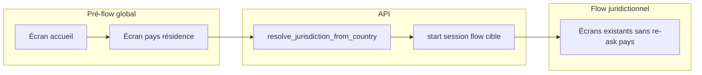

# Refactor registration — routage juridiction par pays de résidence

**Document :** audit d’architecture et proposition cible  
**Périmètre :** API registration runtime, admin web, app Flutter, `address_step`, policies pays  
**Date :** 2026-04-01  

---

## Executive summary

Aujourd’hui, la **juridiction du parcours d’inscription** est choisie **avant** toute collecte utilisateur : le client passe un code juridiction à `POST /api/registration/sessions/start`, et l’écran de test Flutter lit même un **réglage global** (`RegistrationRuntimeSetting.current_jurisdiction_code` via `GET /api/registration/runtime/current-jurisdiction`). Les **politiques pays** (`jurisdiction_country_policies`) sont déjà **par juridiction** et alimentent `country_picker`, `phone_input`, `address_step` via `enrich_registration_component_props` — mais le **lien produit** « pays de résidence → juridiction » n’existe pas encore en données ni dans le runtime.

L’objectif est d’introduire un **pré-flow global** (écrans communs : accueil + pays de résidence), puis une **résolution serveur** `country_iso2 → jurisdiction_code`, un **démarrage de session** sur le flow **actif** de cette juridiction, avec le pays **déjà stocké** dans la session pour éviter de le redemander. Le composant **`address_step`** peut alors **retirer le sélecteur pays** et s’appuyer sur la valeur session + contraintes `allowed_countries` enrichies comme aujourd’hui.

Les chantiers principaux sont : **modèle de données** (table de routage pays → juridiction), **contrat API** (start session enrichi ou endpoint dédié), **admin** (flows « globaux » vs juridictionnels, édition du mapping), **Flutter** (navigation en deux temps), et **migration** des flows existants qui dupliquent `country_of_residence`.

---

## Current architecture

### Choix de la juridiction côté client

- **`RegistrationFlowScreen`** reçoit un paramètre obligatoire **`jurisdiction`** (`String`) et appelle `startSession(jurisdiction: widget.jurisdiction)` au montage (`registration_flow_screen.dart`).
- **`RegistrationTestLauncherScreen`** appelle `getCurrentJurisdiction()` puis pousse `RegistrationFlowScreen(jurisdiction: _jurisdictionCode!)`. La juridiction vient donc du **réglage runtime serveur**, pas du choix utilisateur.

### Backend : démarrage de session

- **`POST /api/registration/sessions/start`** (`runtime_router.py`) : corps `StartSessionRequest` avec **`jurisdiction`** (code texte), `entrypoint_type`, `person_id` optionnel.
- **`RegistrationSessionService.start_session`** (`service.py`) : charge le flow **actif** pour `(jurisdiction_code, entrypoint_type)`, crée une **`RegistrationSession`** avec `jurisdiction_id`, `flow_id`, `flow_version` figés, positionne le premier écran visible.

### « Current jurisdiction » (runtime)

- **`GET /api/registration/runtime/current-jurisdiction`** : lit **`RegistrationRuntimeSetting`** (ligne courante unique), retourne `jurisdiction_code` + méta du flow actif **pour cette juridiction**. Sert surtout d’**aperçu / convenience** (admin, lanceur de test), pas de routage multi-juridiction par utilisateur.

### Pays de résidence dans les policies

- Table **`jurisdiction_country_policies`** : par `jurisdiction_code` + `country_iso2`, flags `allow_residence`, `allow_phone_country_code`, `allow_nationality`, etc. (`database.py`).
- **`jurisdiction_policies.py`** : `list_allowed_residence_countries`, `is_residence_country_allowed`, etc.
- **`enrich_registration_component_props`** : pour `country_picker` (scope résidence / nationalité), `phone_input`, `address_autocomplete` / **`address_step`**, injecte `allowed_countries` à partir de la **juridiction de la session** (code résolu côté service quand l’écran est sérialisé).

### Soumission et validation

- **`jurisdiction_policy_submit.py`** : à la soumission d’écran, validation téléphone / résidence / nationalité selon `policy_scope` et la juridiction de la session.

### Où `country_of_residence` apparaît aujourd’hui

- Composants **`country_picker`** (binding souvent `country_of_residence` ou slug custom via `binding_slugs`).
- **`address_step`** et **`address_autocomplete`** : bindings incluent `country_of_residence` ; le step affiche un **AppCountryPicker** en tête (refactor UX récent).
- Les réponses d’écran incluent `collectedData` / answers déjà connus selon l’implémentation du service (projection session → client).

---

## Target architecture

### Vue d’ensemble

1. **Pré-flow global** : un flow publié sous une convention explicite (voir Admin) — contenu minimal : message d’accueil + **un seul** écran de collecte `country_of_residence` (union des pays autorisés côté config).
2. **Résolution** : appel serveur avec `country_iso2` → **une** juridiction cible (+ règles si ambiguïté / indisponibilité).
3. **Handoff** : création d’une **nouvelle** session (recommandé) rattachée à la juridiction résolue, avec **pré-remplissage** des données déjà collectées (`country_of_residence` au minimum), ou **continuation** d’une session bootstrap étendue (plus complexe à versionner).
4. **Flow juridictionnel** : même moteur qu’aujourd’hui (`submit`, `next`, policies) ; les écrans **ne contiennent plus** de `country_picker` résidence redondant si la session porte déjà la valeur.
5. **`address_step`** : pays lu depuis **session / formData** uniquement ; barre de recherche directement si `search_enabled` et pays valide ; pas de duplicate picker en haut.

### Décision de conception recommandée : deux sessions vs session unique

| Approche | Avantages | Inconvénients |
|----------|-----------|----------------|
| **A. Deux sessions** (bootstrap courte puis `start` juridictionnel avec prefill) | Modèle mental clair, pas de « changement de flow » sur une session verrouillée | Deux `session_id` côté client à enchaîner ; lien person/event à tracer |
| **B. Une session « élargie »** (même `session_id`, swap `jurisdiction_id` + `flow_id`) | Un seul ID | Risque d’**incompatibilité** avec `flow_version` figée, historique d’événements, garde-fous métier lourds |

**Recommandation :** privilégier **A** ou un endpoint **`POST /sessions/start-for-residence`** qui crée **directement** la session juridictionnelle après résolution, avec **seed** `RegistrationSessionData` pour `country_of_residence` **avant** le premier `GET .../screen` — équivalent produit à une session unique du point de vue UX.

---

## Admin model changes

### Flow global de pré-inscription

- Représentation possible (à trancher en implémentation) :
  - **Option 1** : juridiction technique **`GLOBAL`** (ou `PREREG`) avec `entrypoint_type` dédié ex. `preregistration`, flow publié séparément.
  - **Option 2** : champ sur **`registration_flows`** : `scope` = `global_prelude` | `jurisdiction` (nullable `jurisdiction_id` pour le global).
- L’admin doit permettre de **publier** ce flow sans le confondre avec les flows EU/UAE/MX.
- **Prévisualisation** : le preview actuel par juridiction doit supporter l’entrée « global ».

### Flows juridictionnels séparés

- Inchangé en principe : un flow actif par `(jurisdiction, entrypoint_type)` pour `individual`.
- Migration contenu : retirer progressivement les écrans redondants « pays de résidence ».

### Pays autorisés par juridiction

- Déjà modélisé par **`jurisdiction_country_policies`** + **`allow_residence`**.
- **Nouveau besoin** : endpoint ou vue admin « **union des pays résidence** » pour toutes les juridictions **actives** avec au moins un flow **actif** — alimentation du **country_picker** du pré-flow (côté API de composition d’écran ou props statiques générées).

### Table de routage pays → juridiction

- Nouvelle table du type **`registration_country_jurisdiction_routes`** (nom indicatif) :
  - `country_iso2` (FK `country_directory`)
  - `jurisdiction_code` (FK logique vers `registration_jurisdictions.code`)
  - `priority` (entier, pour résoudre les collisions)
  - `is_active`
  - optionnel : `valid_from` / `valid_to` pour évolutions réglementaires
- **Contrainte métier** : pour un `country_iso2` donné, au plus une ligne « gagnante » à `priority` max parmi les actives — ou règle explicite multi-match → erreur contrôlée.

---

## Backend routing changes

### `resolve_jurisdiction_from_country(country_iso2)`

- Entrée : ISO2 normalisé (uppercase).
- Étapes :
  1. Vérifier que le pays existe et est **actif** dans `country_directory`.
  2. Charger les routes actives pour ce pays ; si **0** → erreur métier (ex. code `no_jurisdiction_for_residence`).
  3. Si **> 1** même priorité max ou règle ambiguë → erreur `ambiguous_jurisdiction_for_residence` (ou résolution déterministe **documentée** + audit log).
  4. Vérifier que la juridiction cible est **`is_active`** et possède un flow **`status=active`** pour `entrypoint_type` attendu (ex. `individual`) ; sinon `target_jurisdiction_unavailable`.

### Route / mécanisme de session

- **Option recommandée** :  
  `POST /api/registration/sessions/start-for-residence`  
  Body : `{ "country_iso2": "FR", "entrypoint_type": "individual" }`  
  Comportement : résolution → `start_session` interne avec `jurisdiction_code` résolu + **upsert** initial dans `registration_session_data` pour le slug canonique `country_of_residence` (ou slug issu des field definitions globales).
- Conserver **`POST /sessions/start`** existant pour les intégrations legacy / back-office (avec avertissement dépréciation éventuel).

### Garde-fous

- **Aucun pays ne matche** : 422 avec code stable côté client pour message UX.
- **Plusieurs juridictions** : 409 ou 422 selon politique produit ; **jamais** choix silencieux sans audit.
- **Juridiction / flow inactive** : 404 ou 503 avec code dédié ; pas d’exposition de stack.

### Policies après handoff

- Les écrans du flow cible continuent d’appeler **`enrich_registration_component_props(db, jurisdiction_code=session.jurisdiction.code, ...)`** — cohérent tant que `country_of_residence` est **déjà** dans les answers / session data pour pré-remplissage client.
- Validation submit : **`is_residence_country_allowed`** doit rester vraie pour le pays choisi (sinon incohérence config admin : pays dans l’union globale mais pas autorisé dans la juridiction cible — à **interdire** par construction : l’union devrait être **intersection** ou sous-ensemble contrôlé).

**Point d’attention produit :** définir si l’union des pays du pré-flow est :
- **Union large** puis erreur à la résolution si pas de route, ou
- **Union des pays pour lesquels une route active existe** (recommandé pour éviter les impasses).

---

## Flutter flow changes

### Navigation cible

1. **Écran 1** : « Let’s get started » — peut être **hors moteur** (Flutter statique) ou première slide du pré-flow global.
2. **Écran 2** : sélection **pays de résidence** — liste depuis **`GET .../residence-countries/union`** (ou équivalent) plutôt que hardcodé.
3. **Next** : appel **`start-for-residence`** (ou enchaînement bootstrap + start) ; réception `session_id` + premier écran du **flow juridictionnel**.
4. Remplacer la pile : **`RegistrationFlowScreen`** ne prend plus `jurisdiction` en argument obligatoire **côté route publique** ; il consomme le **résultat du start** (session + écran), ou reçoit `sessionId` + baseUrl uniquement après création.

### État local

- Après handoff, initialiser **`_formData`** avec `country_of_residence` renvoyé dans le payload de session / `collectedData` (selon contrat API à figer dans l’implémentation).

### Dépréciation `getCurrentJurisdiction` pour le parcours prod

- Le lanceur de test peut continuer à l’utiliser ; le parcours **production** ne doit pas dépendre du singleton `current_jurisdiction_code` pour choisir le flow utilisateur final.

---

## Impact on `address_step`

### Comportement cible

- **Ne plus afficher** `_buildCountrySection` (AppCountryPicker du haut) lorsque la session fournit déjà une valeur **fiable** pour le slug `country_of_residence` (via `formData` / `collectedData` dès le premier rendu).
- **Conserver** la logique Places : recherche filtrée par **`_parsedResidenceIso2`** issu du **formData** (alimenté par la session).
- **Conserver** `allowed_countries` enrichis par le backend pour l’adresse (déjà branchés sur la juridiction de la session).
- **Surface / CTA** : ajuster la machine d’état si `need_country` disparaît pour ce composant (ex. passer directement à `search_only` / `editing` selon `search_enabled`).

### Props / contrat

- Ajouter un booléen explicite **`hide_country_of_residence_picker`** (ou **`country_source`: `session`**) dans `props_json` du composant, **ou** inférence : « si `formData` contient déjà une valeur non vide pour le slug résidence au mount, ne pas montrer le picker » (moins explicite pour l’admin).

### Cas limite

- Si le flow juridictionnel **force** encore un `country_picker` résidence, risque de **double source de vérité** — à éliminer par migration de contenu.

---

## Migration strategy

### Identifier les écrans redondants

- Audit **JSON des flows** (admin + DB) : écrans dont les composants ont `component_type == 'country_picker'` et `policy_scope` résidence (ou heuristique slug `country_of_residence`).
- Marquer en **draft** les versions qui retirent cet écran ; publier par juridiction après QA.

### Stratégie de dépréciation

1. **Phase 0** : introduire résolution + endpoint + admin mapping **sans** changer les flows existants (feature flag).
2. **Phase 1** : activer pré-flow global en prod pour **nouvelles** sessions seulement.
3. **Phase 2** : migrer les flows juridictionnels pour retirer le picker résidence dupliqué ; activer **`hide_country_picker`** sur `address_step`.
4. **Phase 3** : documenter dépréciation de `start` avec `jurisdiction` passée par le client pour les apps grand public (garder pour outils internes si besoin).

### Impacts transverses

- **Session / `RegistrationSessionData`** : garantir que le pays est écrit **avant** le premier écran métier.
- **Personne** : `ensure_session_person` utilise `session.jurisdiction.code` pour `Person.jurisdiction` — cohérent après résolution.
- **Analytics / execution events** : ajouter événements `jurisdiction_resolved_from_residence` (pays, juridiction, règle appliquée).

---

## Risks / edge cases

| Risque | Mitigation |
|--------|------------|
| Pays dans l’union globale mais **interdit** en résidence dans la juridiction résolue | Union = pays ayant une **route valide** ; tests d’intégration sur la chaîne complète |
| **Multi-tickets** juridictionnels (ex. même pays, produits différents) | `priority` + documentation ; éviter les doublons actifs |
| **Changement de pays** avant handoff (utilisateur revient en arrière) | Réinitialiser l’état client ; ne pas créer de session juridictionnelle tant que le pays n’est pas validé |
| **Session figée** `flow_version` vs nouveau publish pendant le pré-flow | Pré-flow versionné indépendamment ; handoff crée une **nouvelle** session avec sa propre version |
| **address_step** sans pays en session (bug config) | Fallback : afficher le picker OU erreur bloquante explicite en debug |
| **current_jurisdiction** utilisé ailleurs (CMS, autres apps) | Cartographie des appels ; ne pas casser les previews admin sans migration |

---

## Recommended implementation plan

1. **Données** : migration Alembic — table `registration_country_jurisdiction_routes` + seeds FR→EU, AE→UAE, MX→MX (exemples).
2. **Backend** : `resolve_jurisdiction_from_country` (module dédié + tests unitaires) ; endpoint `start-for-residence` ; optionnel `GET residence-countries-for-prereg` (union contrôlée).
3. **Admin web** : écran « Routage pays → juridiction » ; distinction visuelle flow global vs juridictionnel dans la liste des flows.
4. **Flutter** : nouvelle séquence d’entrée (ou refonte `RegistrationTestLauncherScreen` en modèle prod) ; adaptation `RegistrationFlowScreen` pour consommer la réponse du nouveau start.
5. **`address_step`** : prop + masquage picker ; tests widget mis à jour.
6. **Migration contenu** : scripts ou checklist admin pour retirer les `country_picker` résidence redondants par flow.
7. **Documentation** : OpenAPI / `docs/arquantix` — contrat erreurs et codes.

---

## Annexe — Prompt d’implémentation détaillé (phase code)

À coller dans une session d’implémentation dédiée une fois le produit validé sur ce document.

### Contexte

Refondre le démarrage de l’inscription Arquantix : pré-flow global (accueil + pays de résidence), résolution backend `ISO2 → jurisdiction_code`, session sur le flow actif de cette juridiction avec `country_of_residence` pré-rempli, puis parcours existant. Simplifier `address_step` pour masquer le country picker quand le pays est déjà en session.

### Backend (FastAPI / SQLAlchemy)

1. Créer la table `registration_country_jurisdiction_routes` (colonnes : `id`, `country_iso2` FK `country_directory`, `jurisdiction_code` texte FK logique vers `registration_jurisdictions.code`, `priority` int, `is_active` bool, timestamps). Index unique partiel ou contrainte d’unicité à définir selon règle « un gagnant par pays ».
2. Implémenter `resolve_jurisdiction_from_country(db, country_iso2: str) -> str` dans `services/registration/` avec exceptions typées ou codes d’erreur HTTP 422/409 documentés.
3. Ajouter `POST /api/registration/sessions/start-for-residence` avec body Pydantic `{ country_iso2: str, entrypoint_type?: str }` : valider pays, résoudre juridiction, appeler la logique existante de `start_session`, puis insérer une ligne `RegistrationSessionData` pour `country_of_residence` (valeur ISO2) avant commit ; retourner le **même shape** que `start_session` aujourd’hui (`session_id`, écran courant, `collectedData` enrichi si applicable).
4. Ajouter `GET /api/registration/runtime/prereg-residence-countries` (nom à ajuster) : retourner la liste d’objets `{ iso2, label_en, label_fr }` pour l’union des pays ayant une route active vers une juridiction active avec flow actif — **spec exacte à aligner avec le produit** (union vs intersection).
5. Tests pytest : résolution OK, 0 match, 2 matches même priorité, juridiction inactive, flow absent.

### Admin (Next.js)

1. Page ou section « Country → Jurisdiction routing » : CRUD sur la table, validation ISO2, affichage juridiction liée.
2. Dans la liste des flows, badge ou filtre `Global prelude` vs `Jurisdiction` selon le modèle retenu (juridiction `GLOBAL` vs champ `scope`).
3. Documenter dans l’UI que le pré-flow doit contenir un seul écran critique `country_of_residence` avant handoff.

### Flutter

1. Introduire un **wizard d’entrée** (2 écrans) ou intégrer les deux premiers écrans du pré-flow via API : charger la liste des pays depuis `prereg-residence-countries`.
2. Au submit pays : appeler `start-for-residence` ; en cas d’erreur structurée, afficher messages UX par `code`.
3. Sur succès : naviguer vers `RegistrationFlowScreen` en passant `sessionId` + `baseUrl` (refactor du constructeur pour ne **plus** exiger `jurisdiction` si la session porte tout) **ou** passer `initialSessionPayload` déjà parsé.
4. Retirer l’usage de `getCurrentJurisdiction` pour le chemin production (garder pour debug si besoin).
5. **`RegistrationAddressStep`** : si `props['hide_country_of_residence_picker'] == true` **ou** si `formData[countrySlug]` est non vide au premier build : ne pas construire `_buildCountrySection` ; ajuster `_syncSurface` / `need_country` pour ce mode ; conserver recherche + champs comme spécifié.

### Migration données

1. Script SQL ou admin : insérer les routes FR→EU, AE→UAE, MX→MX (exemples produit).
2. Pour chaque flow publié : liste des écrans avec `country_picker` résidence ; créer nouvelle version de flow sans cet écran une fois le pré-flow actif.

### Critères de done

- Parcours E2E : accueil → pays → session créée sur bonne juridiction → premier écran métier sans redemander le pays → `address_step` sans picker pays en tête, recherche fonctionnelle.
- Aucune régression sur `start` legacy utilisé par les tests existants.
- Documentation OpenAPI / changelog interne à jour.

---

## Références code (ancrage)

| Sujet | Fichiers indicatifs |
|-------|---------------------|
| Start session | `api/services/registration/runtime_router.py`, `service.py` |
| Current jurisdiction | `api/services/registration/runtime_router.py` (`get_current_jurisdiction`) |
| Policies pays | `api/services/registration/jurisdiction_policies.py`, `jurisdiction_policy_submit.py` |
| Modèle session | `api/database.py` (`RegistrationSession`, `RegistrationSessionData`, `JurisdictionCountryPolicy`) |
| Flutter start | `mobile/lib/features/registration/screens/registration_flow_screen.dart`, `registration_api.dart` |
| Lanceur test | `mobile/lib/features/registration/screens/registration_test_launcher_screen.dart` |
| Address step | `mobile/lib/features/registration/widgets/registration_address_step.dart` |
| Admin flows | `web/src/app/admin/registration/page.tsx` et sous-routes `flows/` |
